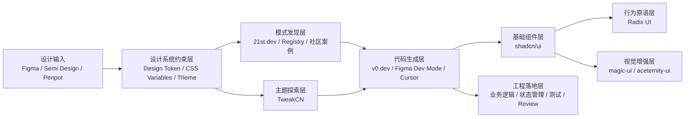

# Design to Code 与 shadcn 生态总图

> 用一张图串起第 2 课、第 4 课、第 5 课，帮助讲师和学员建立完整的 AI-Native UI 工作流认知。

---

## 一句话总结

**`shadcn/ui` 解决“组件怎么组织和落地”，`Design to Code` 解决“设计怎么更快变成代码”，而 `21st.dev`、`TweakCN`、`magic-ui`、`aceternity-ui`、`v0.dev` 这些工具，负责把这条链路补全成一个可复用的生态。**

---

## 一、总图



---

## 二、课程之间怎么串

| 课程 | 讲什么 | 在总链路里的位置 | 讲师应该强调什么 |
|------|------|------|------|
| **第 2 课：shadcn/ui** | Open Code、Copy-Paste、Registry、生态工具 | 组件与生态中枢 | 为什么源码可见对 AI 友好 |
| **第 3 课：Radix UI** | Headless、Composition、可访问性原语 | 行为和交互底层 | 为什么样式和行为分离后更适合 AI 修改 |
| **第 4 课：Design to Code（上）** | Figma、Semi Design、Design Token、设计工具对比 | 设计输入与约束层 | 设计系统和 Token 决定 D2C 上限 |
| **第 5 课：Design to Code（下）** | v0.dev、截图转代码、图标库、生态组合 | 代码生成与页面落地 | AI 负责初稿，开发者负责审查与集成 |

---

## 三、生态分层

### 1. 基础层：`shadcn/ui`

负责：

- 基础组件源码
- 组件可修改性
- 团队级组件分发基础

适合讲的核心句子：

**不是装一个组件库，而是在搭自己的组件资产。**

### 2. 行为层：`Radix UI`

负责：

- 无障碍行为
- 键盘交互
- 焦点管理
- Composition 模式

适合讲的核心句子：

**把行为交给原语，把样式交给 Tailwind，把控制权交给开发者。**

### 3. 发现层：`21st.dev` / `Registry`

负责：

- 找现成模式
- 找灵感
- 找成熟交互结构

适合讲的核心句子：

**不要每次都从空白 Prompt 开始，先找模式，再让 AI 按你的项目语境重建。**

### 4. 主题层：`TweakCN`

负责：

- 快速探索主题变量
- 生成 `CSS Variables`
- 帮团队找到品牌基线

适合讲的核心句子：

**它不是替代设计系统，而是让主题探索从“手调变量”变成“可视化闭环”。**

### 5. 生成层：`v0.dev` / Figma Dev Mode / Cursor

负责：

- 根据 Prompt 或设计稿生成 React + Tailwind + shadcn/ui 代码
- 做初稿、迭代和重构

适合讲的核心句子：

**AI 生成的价值，不是最终代码，而是高质量初稿。**

### 6. 视觉增强层：`magic-ui` / `aceternity-ui`

负责：

- 动效增强
- Hero 区表现力
- 营销页视觉冲击

适合讲的核心句子：

**基础结构先稳，再用增强组件做局部高光。**

---

## 四、Design Token 为什么是中轴

在这套链路里，`Design Token` 是最关键的中轴层。

没有 Token：

- AI 只能复制设计结果
- 代码容易出现硬编码颜色、阴影、圆角
- 亮色/暗色/品牌切换难以统一

有 Token：

- AI 更容易引用语义而不是复制像素
- 组件和页面能共享设计规则
- `TweakCN`、`Figma`、`shadcn/ui`、`v0.dev` 才能串起来

建议课堂里始终强调这个公式：

```text
Design to Code 质量
= 设计稿质量 × 设计系统成熟度 × Token 完整度 × AI 工具能力
```

---

## 五、推荐工作流

### 场景 A：企业中后台

推荐链路：

```text
Figma / Semi Design
→ Design Token
→ shadcn/ui + Radix UI
→ v0.dev / Cursor
→ 开发者接业务逻辑
```

关键词：

- 稳定
- 可维护
- 一致性
- 可扩展

适合补充：

- `Lucide`
- `Tabler Icons`
- 少量 `21st.dev` 模式参考

### 场景 B：营销页 / 落地页

推荐链路：

```text
Figma / 文案方向
→ TweakCN 定主题
→ v0.dev 生成页面骨架
→ magic-ui / aceternity-ui 局部增强
→ 人工调动效与内容层次
```

关键词：

- 视觉表现力
- 转化导向
- 快速迭代

### 场景 C：课程演示 / 快速原型

推荐链路：

```text
21st.dev 找模式
→ TweakCN 定主题
→ v0.dev / Cursor 快速生成
→ 演示逻辑和交互
```

关键词：

- 快速出效果
- 适合课堂
- 便于对比传统流程

---

## 六、讲师讲法建议

### 不要分散讲工具，要按“角色”讲

错误讲法：

- 先讲 `shadcn/ui`
- 再讲 `21st.dev`
- 再讲 `TweakCN`
- 再讲 `magic-ui`

这样学员容易觉得是一堆零散网站。

更好的讲法：

1. **谁负责骨架**：`shadcn/ui`
2. **谁负责行为**：`Radix UI`
3. **谁负责主题**：`TweakCN` + `Design Token`
4. **谁负责生成**：`v0.dev` / Figma Dev Mode / Cursor
5. **谁负责增强**：`magic-ui` / `aceternity-ui`
6. **谁负责找参考**：`21st.dev`

### 每次都回到一个判断标准

讲师可以反复让学员记住这个判断问题：

**这个工具是在解决“结构问题”“主题问题”“生成问题”，还是“表现力问题”？**

一旦这个分类建立起来，学员就不会再把所有生态工具混成一类。

---

## 七、可直接复用的 Prompt 模板

### 模板 1：让 AI 按项目主题生成页面

```text
Create this page using shadcn/ui components, lucide-react icons,
and the project's existing design tokens for color, spacing, radius, and shadow.
Match the current theme system and avoid hard-coded hex colors unless necessary.
```

### 模板 2：先找模式再生成

```text
Create a dashboard card section following modern shadcn-style patterns:
clear hierarchy, compact spacing, strong data contrast,
and reusable card composition for analytics use cases.
```

### 模板 3：营销页增强

```text
Generate the landing page structure with shadcn/ui first.
Then enhance only the hero and feature showcase areas with tasteful motion
and premium visual treatment. Keep the rest maintainable and production-friendly.
```

---

## 八、最终要让学员带走什么

不是记住更多工具名，而是建立下面这个认知：

```text
AI-Native UI 开发
不是“找一个最强工具”
而是“搭一条稳定的工具链”
```

这条链路里：

- `Design Token` 是设计和代码之间的协议
- `shadcn/ui` 是组件资产中心
- `v0.dev` 是生成加速器
- `TweakCN` 是主题探索器
- `21st.dev` 是模式入口
- `magic-ui / aceternity-ui` 是表现力增强层

---

## 九、建议放在哪些使用场景

- 讲师备课时，用它快速串联第 2、4、5 课
- 给学员做课程导读时，用它建立整体地图
- 做最终复盘时，用它回看每个工具在链路中的职责
- 后续如果要扩展课程 wiki，也可以直接把这份文档作为总入口
