# 认知重构：AI 友好性是新的选型维度

> **课程时长**: 2 小时 | **难度**: 入门 | **风格**: 故事驱动 + 技术深度 + 实践指南

---

## 📋 本课概览

```
┌─────────────────────────────────────────────────────────────────┐
│  🎯 核心观点：技术选型需要增加"AI友好性"这个新维度              │
├─────────────────────────────────────────────────────────────────┤
│  📚 你将学到：                                                   │
│    • 理解为什么 AI 友好性成为技术选型的关键因素                  │
│    • 掌握 LLM 理解代码的底层机制（Token化、上下文窗口）          │
│    • 识别 AI 友好代码的四大特征                                  │
│    • 了解完整的 AI-Native 技术栈全景图                          │
└─────────────────────────────────────────────────────────────────┘
```

---

## 🎬 Opening：两个团队的故事

### 场景设定

> 去年11月，两个前端团队接到相同需求：开发企业级数据看板系统

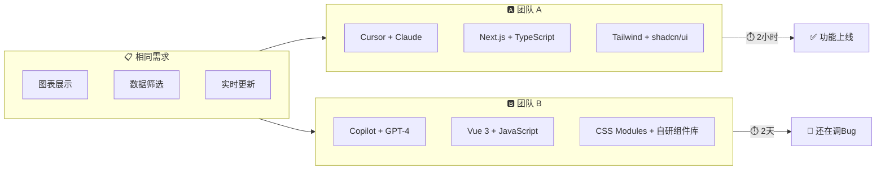

### 结果对比

| 维度 | 团队 A | 团队 B |
|------|--------|--------|
| **技术栈** | Next.js + Tailwind + shadcn/ui | Vue 3 + CSS Modules + 自研组件 |
| **AI工具** | Cursor + Claude | Copilot + GPT-4 |
| **完成时间** | 2 小时 | 2 天+ |
| **AI生成代码可用率** | ~85% | ~45% |
| **人工修正次数** | 平均 0.8 次 | 平均 3.2 次 |

### 关键洞察

> 💡 **不是 AI 工具的问题，是技术栈的问题**

团队 B 负责人的反馈：
> "AI 生成的代码总是出错，CSS 类名对不上，组件 props 也不对，改来改去还不如自己写。"

团队 A 负责人的反馈：
> "AI 生成的代码基本不用改，直接能用。我们现在的开发效率是以前的 3-4 倍。"

---

## 📖 Section 1：技术选型的游戏规则变了

### 1.1 传统的三大选型维度

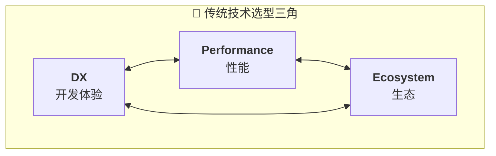

| 维度 | 关注点 | 典型决策示例 |
|------|--------|-------------|
| **DX (开发体验)** | API简洁、文档完善、调试方便、学习曲线 | React的DX好 → 选React |
| **Performance (性能)** | 运行时性能、构建速度、包体积、首屏加载 | Vite更快 → 从Webpack迁移 |
| **Ecosystem (生态)** | 社区活跃度、第三方库、招聘难度、长期维护 | TS生态成熟 → 从JS迁移 |

> ⚠️ **这三个维度在过去10年覆盖了90%的选型决策，但2023年之后，游戏规则变了。**

### 1.2 第四个维度：AI 友好性

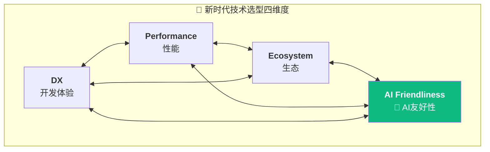

#### 为什么需要这个新维度？

> 🤖 **AI 成为了你的"第二个开发者"**

| AI 的优势 | AI 的局限 |
|-----------|-----------|
| ✅ 不会累 | ❌ 可能"看不懂代码" |
| ✅ 不会抱怨 | ❌ 受上下文窗口限制 |
| ✅ 24/7 在线 | ❌ 依赖代码的可理解性 |
| ✅ 快速生成 | ❌ 跨文件推理能力有限 |

### 1.3 效率对比数据

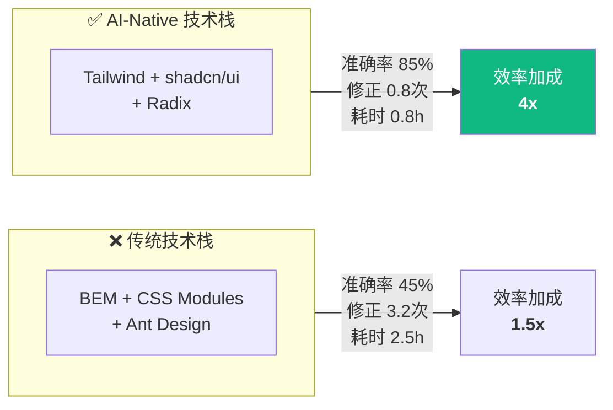

| 技术栈 | AI 生成代码准确率 | 人工修正次数 | 总耗时 | AI 效率加成 |
|--------|------------------|--------------|--------|------------|
| **传统栈** (BEM + CSS Modules + Ant Design) | 45% | 平均 3.2 次 | 2.5 小时 | 1.5x |
| **AI-Native 栈** (Tailwind + shadcn/ui + Radix) | 85% | 平均 0.8 次 | 0.8 小时 | **4x** |

> 📊 **3倍的效率差距，这不是AI工具的问题，是技术栈的问题。**

---

## 📖 Section 2：LLM 如何理解你的代码

### 2.1 Token 化机制：AI 的"眼睛"

> 📌 **核心概念**：LLM 处理代码的第一步是将代码切分成 Token（词元）

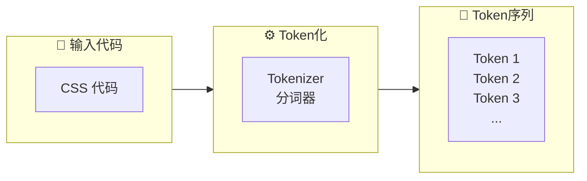

#### BEM 代码的 Token 化示例

**输入代码：**
```css
.user-card__avatar--large {
  width: 64px;
  height: 64px;
}
```

**Token 化结果：**
```
[".user", "-", "card", "__", "avatar", "--", "large", " {", "\n",
 "  width", ":", " ", "64", "px", ";", "\n",
 "  height", ":", " ", "64", "px", ";", "\n", "}"]
```
> 📊 **共 23 个 Token**

#### Tailwind 代码的 Token 化示例

**输入代码：**
```html

```

**Token 化结果：**
```
[""]
```
> 📊 **共 11 个 Token**

#### Token 效率对比

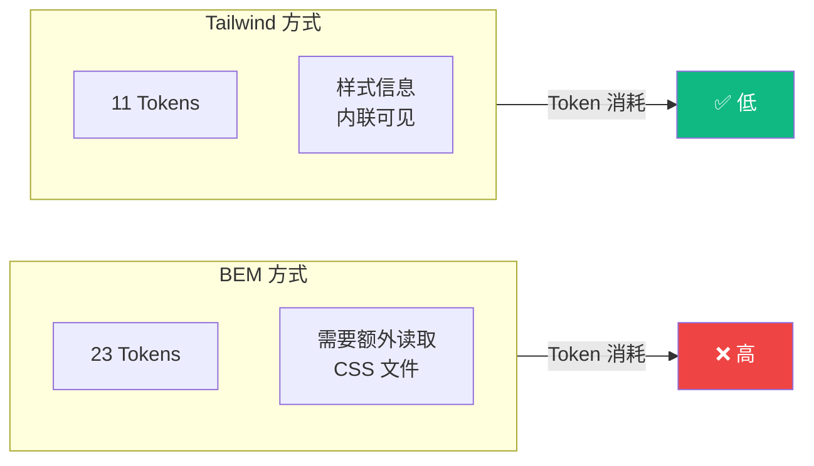

> 💡 **同样功能，Tailwind 的 Token 数只有 BEM 的一半**

### 2.2 上下文窗口：AI 的"记忆力"

> 📌 **核心概念**：上下文窗口是 LLM 一次能"看到"的最大 Token 数量

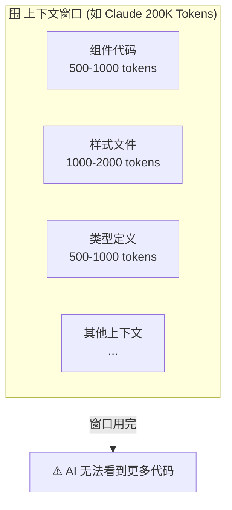

#### 传统技术栈 vs AI-Native 技术栈

| 理解一个组件需要 | 传统技术栈 | AI-Native 技术栈 |
|-----------------|-----------|-----------------|
| 文件数量 | 3-4 个文件 | 1 个文件 |
| Token 消耗 | 5000+ tokens | 2000 tokens |
| AI 理解效率 | 需要跨文件关联 | 一次性理解 |

**传统技术栈（BEM + CSS Modules）:**
```
组件文件（JSX）     → 1500 tokens
样式文件（CSS）     → 2000 tokens  
类型定义（TS）      → 1000 tokens
工具函数            → 500 tokens
─────────────────────────────────
总计                → 5000+ tokens
```

**AI-Native 技术栈（Tailwind + shadcn/ui）:**
```
组件文件（JSX + 内联样式 + 类型）→ 2000 tokens
─────────────────────────────────────────────
总计                             → 2000 tokens
```

### 2.3 AI 眼中的好代码 vs 人眼中的好代码

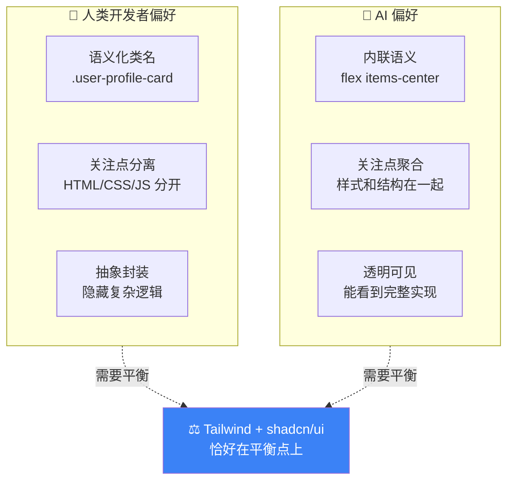

#### 代码对比示例

**❌ 人类觉得"好"的代码（但AI理解困难）：**

```jsx
// UserCard.jsx
import styles from './UserCard.module.css'

export function UserCard({ user }) {
  return (
    <div className={styles.card}>
      <Avatar user={user} />        {/* AI需要读 Avatar.jsx */}
      <UserInfo user={user} />      {/* AI需要读 UserInfo.jsx */}
    </div>                          {/* AI需要读 UserCard.module.css */}
  )
}
```
> ⚠️ **AI 需要读 4 个文件才能理解这个组件**

**✅ AI 友好的代码：**

```jsx
import { Avatar } from '@/components/ui/avatar'

export function UserCard({ user }) {
  return (
    <div className="flex items-center gap-4 p-4 bg-white rounded-lg shadow-sm">
      <Avatar src={user.avatar} alt={user.name} className="w-12 h-12" />
      <div className="flex-1">
        <h3 className="font-semibold text-lg">{user.name}</h3>
        <p className="text-sm text-gray-600">{user.email}</p>
      </div>
    </div>
  )
}
```
> ✅ **AI 只需要读 1 个文件，就能理解整个组件的结构和样式**

---

## 📖 Section 3：AI 友好代码的四大特征

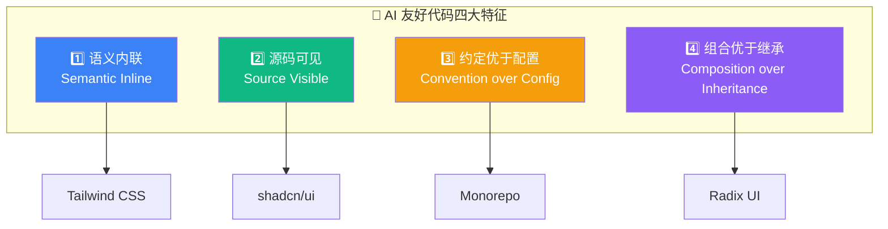

### 3.1 特征一：语义内联 (Semantic Inline)

> 📌 **定义**：把语义信息直接写在代码中，而不是通过外部引用

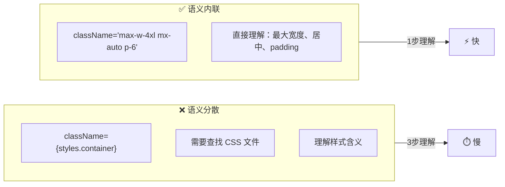

**代码对比：**

| ❌ 不够 AI 友好 | ✅ AI 友好 |
|----------------|-----------|
| `<div className={styles.container}>` | `<div className="max-w-4xl mx-auto p-6">` |
| `<h1 className={styles.title}>` | `<h1 className="text-3xl font-bold text-gray-900">` |

**为什么重要：**
- ✅ AI 不需要跨文件推理
- ✅ 修改样式时，AI 能直接看到影响范围
- ✅ 生成代码时，AI 能精确控制样式

---

### 3.2 特征二：源码可见 (Source Visible)

> 📌 **定义**：代码在项目中可见可修改，而不是隐藏在 node_modules 里

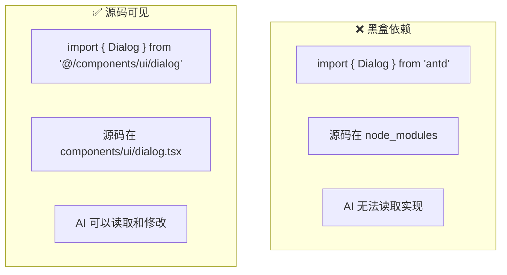

**代码对比：**

**❌ 不够 AI 友好（黑盒依赖）：**
```jsx
import { Dialog } from 'antd'

<Dialog title="提示" visible={open}>
  内容
</Dialog>
```
> AI 看不到 Dialog 的实现，不知道如何定制

**✅ AI 友好（源码可见）：**
```jsx
import { Dialog, DialogContent, DialogHeader, DialogTitle } from '@/components/ui/dialog'

<Dialog open={open}>
  <DialogContent>
    <DialogHeader>
      <DialogTitle>提示</DialogTitle>
    </DialogHeader>
    内容
  </DialogContent>
</Dialog>
```
> Dialog 的源码在 `components/ui/dialog.tsx`，AI 可以直接读取和修改

---

### 3.3 特征三：约定优于配置 (Convention over Configuration)

> 📌 **定义**：通过文件结构和命名约定传达信息，减少配置文件

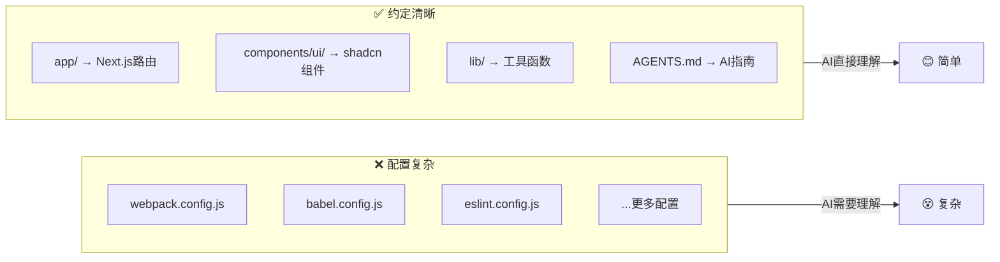

**目录结构对比：**

| ❌ 配置驱动 | ✅ 约定驱动 |
|------------|-----------|
| `src/components/` | `src/app/` → Next.js App Router |
| `src/utils/` | `src/components/ui/` → shadcn/ui 组件 |
| `config/webpack.config.js` | `src/components/features/` → 业务组件 |
| `config/babel.config.js` | `src/lib/` → 工具函数 |
| `config/eslint.config.js` | `AGENTS.md` → AI 项目指南 |

---

### 3.4 特征四：组合优于继承 (Composition over Inheritance)

> 📌 **定义**：通过组合原语构建复杂组件，而不是通过继承

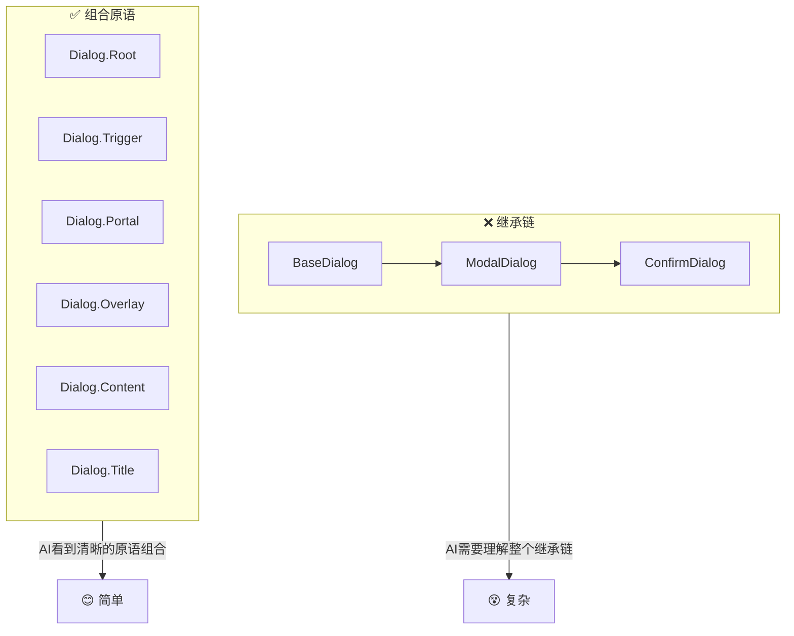

**代码对比：**

**❌ 继承方式：**
```jsx
class BaseDialog extends Component { }
class ModalDialog extends BaseDialog { }
class ConfirmDialog extends ModalDialog { }
// AI 需要理解整个继承链
```

**✅ 组合方式：**
```jsx
<Dialog.Root>
  <Dialog.Trigger />
  <Dialog.Portal>
    <Dialog.Overlay />
    <Dialog.Content>
      <Dialog.Title />
      <Dialog.Description />
    </Dialog.Content>
  </Dialog.Portal>
</Dialog.Root>
// AI 能清楚看到每个原语的作用
```

---

### 📊 四大特征总结

| 特征 | 传统做法 | AI-Native 做法 | 代表技术 |
|------|---------|---------------|---------|
| **语义内联** | CSS 文件分离 | Utility classes 内联 | Tailwind CSS |
| **源码可见** | npm 黑盒依赖 | Copy-paste 到项目 | shadcn/ui |
| **约定优于配置** | 复杂配置文件 | 文件结构约定 | Monorepo |
| **组合优于继承** | 继承链 | 组合原语 | Radix UI |

---

## 📖 Section 4：AI-Native 技术栈全景图

### 4.1 完整技术栈架构

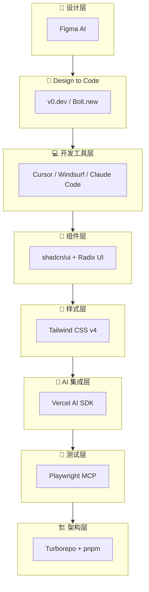

### 4.2 各层详解

| 层级 | 技术选型 | AI 友好的原因 | 课程安排 |
|------|---------|--------------|---------|
| **样式层** | Tailwind CSS v4 | Utility-first，语义内联 | 第 1 课 |
| **组件层** | shadcn/ui + Radix UI | 源码可见 + 组合原语 | 第 2-3 课 |
| **设计工具层** | Figma AI, v0.dev, Bolt.new | 设计到代码分钟级 | 第 4-5 课 |
| **架构层** | Turborepo + pnpm Monorepo | 约定优于配置 | 第 6 课 |
| **测试层** | Playwright MCP | AI 直接操作浏览器 | 第 7 课 |
| **开发工具层** | Cursor, Windsurf, Claude Code | 原生 AI 开发体验 | 第 8 课 |
| **AI 集成层** | Vercel AI SDK | 前端集成 AI 能力 | 第 9 课 |

### 4.3 技术栈工作流

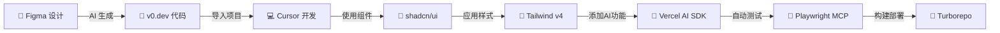

---

## 📖 Closing：认知重构的三个层次

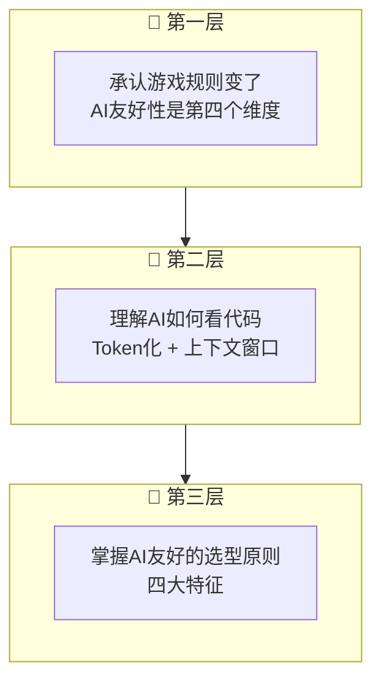

### ✅ 行动建议清单

#### 1. 评估现有技术栈
- [ ] 用 AI 工具（Cursor/Copilot）测试你的代码
- [ ] 记录 AI 生成代码的准确率
- [ ] 找出 AI 经常出错的地方

#### 2. 渐进式迁移
- [ ] 不要一次性重写整个项目
- [ ] 从新功能开始用 AI-Native 技术栈
- [ ] 逐步迁移老代码

#### 3. 建立团队共识
- [ ] 分享本课内容给团队
- [ ] 做小范围实验验证效果
- [ ] 制定迁移计划

---

## 📋 知识点速查表

| 概念 | 定义 | 关键点 |
|------|------|--------|
| **AI 友好性** | 代码易被 AI 理解和生成的程度 | 第四个选型维度 |
| **Token 化** | LLM 将代码切分成词元的过程 | Token 越少越高效 |
| **上下文窗口** | LLM 一次能"看到"的最大 Token 数 | 决定 AI 的"视野" |
| **语义内联** | 样式信息直接写在代码中 | Tailwind 的核心理念 |
| **源码可见** | 组件代码在项目中可见可改 | shadcn/ui 的 copy-paste 模式 |
| **约定优于配置** | 用目录结构传达信息 | 减少配置文件 |
| **组合优于继承** | 用原语组合构建组件 | Radix UI 的设计理念 |

---

## 📚 下节课预告

> **第 1 课：Tailwind CSS v4 - 样式方案革命**

- CSS-first 配置
- Oxide 引擎的性能革命
- 为什么 utility-first 是 AI 最佳拍档
- 如何从传统 CSS 迁移到 Tailwind

---

**课程时间分配：**
| 部分 | 时长 |
|------|------|
| Opening: 两个团队的故事 | 10 min |
| Section 1: 游戏规则变了 | 20 min |
| Section 2: LLM 如何理解代码 | 30 min |
| Section 3: 四大特征 | 25 min |
| Section 4: 技术栈全景图 | 20 min |
| Closing + Q&A | 15 min |
| **总计** | **2 小时** |
