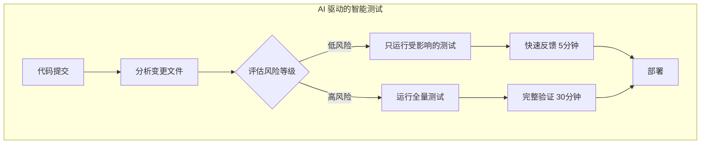
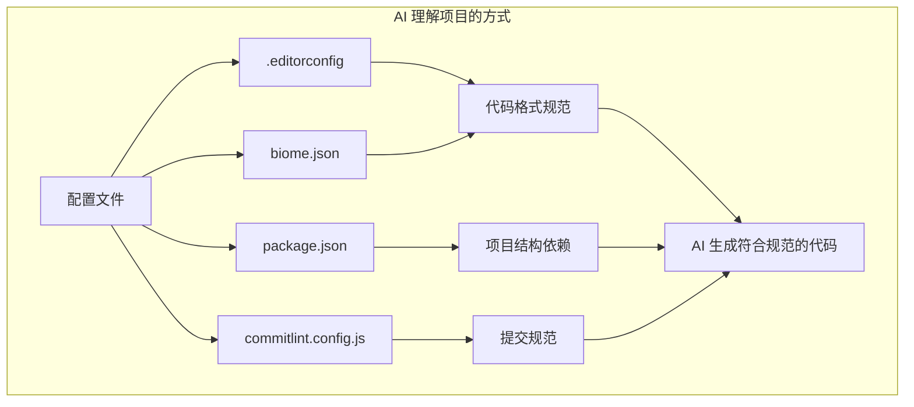
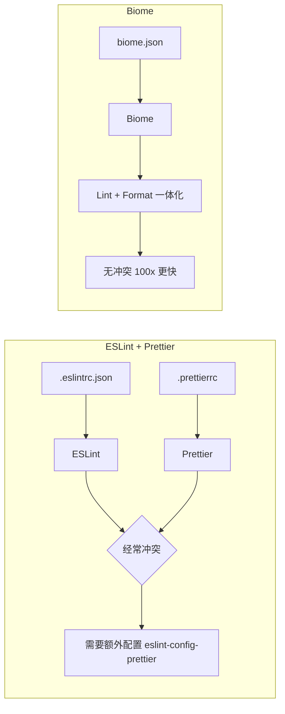
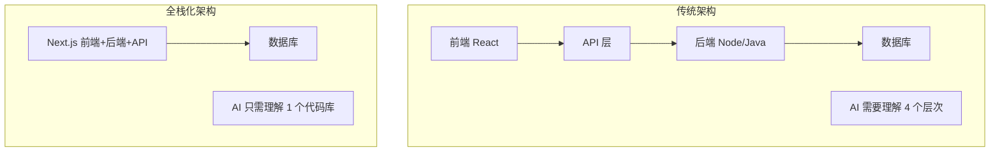
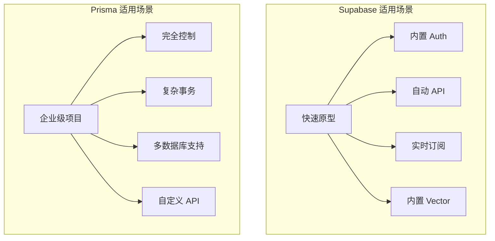
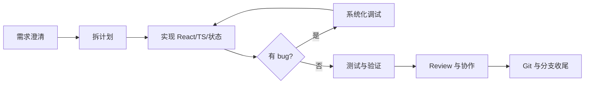
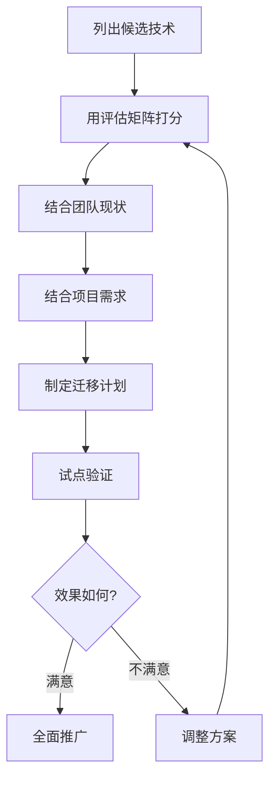
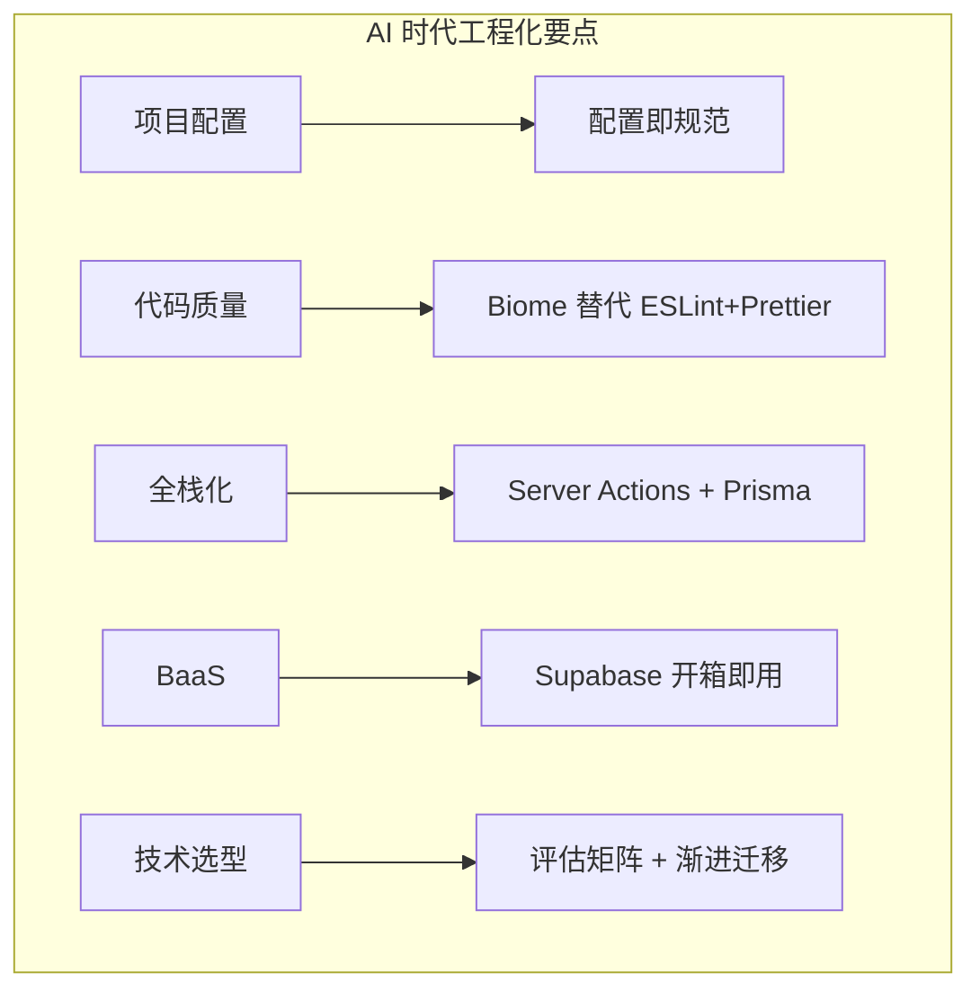

# 工程化与全栈化
## 最终版演讲稿（融合版）

**演讲时长**: 2.5 小时
**风格**: 故事开场 + 技术深度 + 实践建议

**课程大纲**:
- Opening Hook: 10 min
- Section 1: AI 驱动的 CI/CD: 20 min
- Section 2: 项目配置与规范化: 25 min ⭐ 新增
- Section 3: 代码质量工具 (Biome): 30 min
- Section 4: 前端全栈化趋势: 40 min
- Section 5: 常用 Skills + MCP tools: 20 min
- Section 6: 技术选型决策框架: 20 min
- Closing: 15 min

---

## Opening Hook（10 min）

大家好，欢迎来到第 10 课。

今天我想先问大家一个问题：你们有没有发现，当你用 AI 写代码的时候，如果项目配置了 ESLint + Prettier，AI 生成的代码经常会有格式问题？然后你还得手动修复，或者再让 AI 修一遍？

这个问题我遇到太多次了。直到我换成了 Biome，这个问题基本消失了。

为什么？因为 Biome 的设计理念就是"AI 友好"——配置更简单，错误信息更清晰，而且速度快了 **100 倍**。

这就是我们今天要讨论的核心主题：**AI 时代的工程化**。

另外，我还要讲一个更大的趋势：**前端全栈化**。Next.js Server Actions 让前端工程师可以直接写后端逻辑，tRPC 让前后端类型安全贯通，Prisma 让数据库操作变得 AI 友好，Supabase 更是把整个后端变成了 AI 可以直接理解和操作的服务。

这些加在一起，意味着：**AI 可以在一个代码库里理解你的完整数据流**。

---

## Section 1：AI 驱动的 CI/CD（20 min）

### 传统 CI/CD 的问题

传统的 CI/CD 流水线：
1. 代码提交
2. 运行所有测试（可能 30 分钟）
3. 构建（可能 10 分钟）
4. 部署

**问题**：每次都运行所有测试，太慢了。

### 智能测试选择



AI 可以分析你的代码变更，只运行受影响的测试：

```yaml
# .github/workflows/ci.yml
- name: Smart Test Selection
  run: |
    # 分析变更文件
    CHANGED_FILES=$(git diff --name-only HEAD~1)
    # AI 分析影响范围，只运行相关测试
    turbo run test --filter=...[HEAD~1]
```

Turborepo 的 `--filter` 就是这个思路：只构建和测试变更的包。

### AI Code Review 集成

```yaml
# 在 PR 中自动运行 AI Code Review
- name: AI Code Review
  uses: coderabbitai/ai-pr-reviewer@latest
  with:
    model: claude-sonnet-4-20250514
```

AI 自动审查代码，发现潜在问题，提出改进建议。

但这只是一个简单的片段。我们来看一个完整的、AI 驱动的 CI/CD 流水线到底长什么样。

### 完整的 AI 驱动 CI/CD 流水线

```yaml
# .github/workflows/ai-ci.yml
name: AI-Driven CI/CD Pipeline

on:
  pull_request:
    branches: [main, develop]
  push:
    branches: [main]

# 同一个 PR 只保留最新的运行，取消之前的
concurrency:
  group: ${{ github.workflow }}-${{ github.ref }}
  cancel-in-progress: true

jobs:
  # ============================================
  # 第一步：智能变更分析
  # ============================================
  analyze-changes:
    runs-on: ubuntu-latest
    outputs:
      affected-packages: ${{ steps.affected.outputs.packages }}
      has-frontend-changes: ${{ steps.affected.outputs.frontend }}
      has-backend-changes: ${{ steps.affected.outputs.backend }}
      risk-level: ${{ steps.risk.outputs.level }}
    steps:
      - uses: actions/checkout@v4
        with:
          fetch-depth: 0  # 需要完整历史来分析变更

      - name: Analyze affected packages
        id: affected
        run: |
          # 用 Turborepo 分析受影响的包
          AFFECTED=$(npx turbo run build --dry-run=json \
            --filter='...[origin/main...HEAD]' | \
            jq -r '.packages | join(",")')
          echo "packages=$AFFECTED" >> $GITHUB_OUTPUT

          # 判断前端/后端是否有变更
          if echo "$AFFECTED" | grep -q "web\|ui"; then
            echo "frontend=true" >> $GITHUB_OUTPUT
          fi
          if echo "$AFFECTED" | grep -q "api\|server"; then
            echo "backend=true" >> $GITHUB_OUTPUT
          fi

      - name: Assess risk level
        id: risk
        run: |
          # 根据变更范围评估风险等级
          CHANGED_FILES=$(git diff --name-only origin/main...HEAD)
          FILE_COUNT=$(echo "$CHANGED_FILES" | wc -l)

          if echo "$CHANGED_FILES" | grep -qE "schema\.prisma|migration"; then
            echo "level=high" >> $GITHUB_OUTPUT
          elif [ "$FILE_COUNT" -gt 20 ]; then
            echo "level=high" >> $GITHUB_OUTPUT
          elif [ "$FILE_COUNT" -gt 5 ]; then
            echo "level=medium" >> $GITHUB_OUTPUT
          else
            echo "level=low" >> $GITHUB_OUTPUT
          fi

  # ============================================
  # 第二步：AI 代码审查（并行）
  # ============================================
  ai-review:
    runs-on: ubuntu-latest
    if: github.event_name == 'pull_request'
    permissions:
      pull-requests: write
      contents: read
    steps:
      - uses: actions/checkout@v4

      - name: AI Code Review
        uses: coderabbitai/ai-pr-reviewer@latest
        with:
          model: claude-sonnet-4-20250514
          review_comment_lgtm: false
          path_filters: |
            !dist/**
            !node_modules/**
            !*.lock
          extra_prompt: |
            重点关注以下方面：
            1. 类型安全：是否有 any 类型或类型断言
            2. 错误处理：async 函数是否有 try-catch
            3. 性能：是否有不必要的重渲染
            4. 安全：是否有 XSS 或注入风险
            5. 可访问性：交互元素是否有 aria 标签

  # ============================================
  # 第三步：智能测试（只测受影响的包）
  # ============================================
  smart-test:
    needs: analyze-changes
    runs-on: ubuntu-latest
    steps:
      - uses: actions/checkout@v4
        with:
          fetch-depth: 0

      - uses: actions/setup-node@v4
        with:
          node-version: 20
          cache: 'pnpm'

      - run: pnpm install --frozen-lockfile

      - name: Run affected tests only
        run: |
          echo "受影响的包: ${{ needs.analyze-changes.outputs.affected-packages }}"
          echo "风险等级: ${{ needs.analyze-changes.outputs.risk-level }}"

          # 低风险：只跑受影响的包的测试
          # 高风险：跑全量测试
          if [ "${{ needs.analyze-changes.outputs.risk-level }}" = "high" ]; then
            echo "高风险变更，运行全量测试..."
            pnpm turbo run test
          else
            echo "运行受影响包的测试..."
            pnpm turbo run test --filter='...[origin/main...HEAD]'
          fi

      - name: Run E2E tests (only if frontend changed)
        if: needs.analyze-changes.outputs.has-frontend-changes == 'true'
        run: pnpm turbo run test:e2e --filter=web

  # ============================================
  # 第四步：构建和部署
  # ============================================
  deploy:
    needs: [analyze-changes, smart-test]
    if: github.ref == 'refs/heads/main'
    runs-on: ubuntu-latest
    steps:
      - uses: actions/checkout@v4
      - uses: actions/setup-node@v4
        with:
          node-version: 20
          cache: 'pnpm'

      - run: pnpm install --frozen-lockfile
      - run: pnpm turbo run build

      - name: Deploy to Vercel
        uses: amondnet/vercel-action@v25
        with:
          vercel-token: ${{ secrets.VERCEL_TOKEN }}
          vercel-org-id: ${{ secrets.VERCEL_ORG_ID }}
          vercel-project-id: ${{ secrets.VERCEL_PROJECT_ID }}
          vercel-args: '--prod'
```

大家注意看这个流水线的设计思路：

第一，**智能分析**。不是上来就跑所有东西，而是先分析这次 PR 改了什么，影响了哪些包，风险等级是什么。

第二，**并行执行**。AI 代码审查和测试是并行跑的，不互相等待。

第三，**按需测试**。低风险的改动只跑受影响的测试，高风险的才跑全量。这一个优化就能把 CI 时间从 30 分钟降到 5 分钟。

### AI Code Review 的深度配置

刚才我们看到了 CodeRabbit 的基本配置，但实际项目中你可能需要更精细的控制。

```yaml
# .coderabbit.yaml（放在项目根目录）
language: "zh-CN"
tone_instructions: "用中文回复，语气专业但友好"
early_access: true

reviews:
  # 自动审查设置
  auto_review:
    enabled: true
    # 忽略这些文件的审查
    ignore_title_keywords:
      - "WIP"
      - "DO NOT MERGE"
    drafts: false

  # 审查重点
  path_instructions:
    - path: "src/components/**"
      instructions: |
        审查 React 组件时重点关注：
        - 是否使用了 memo/useMemo/useCallback 优化性能
        - Props 类型是否完整定义
        - 是否有可访问性问题（aria 标签、键盘导航）
        - 是否正确处理了 loading/error 状态

    - path: "src/server/**"
      instructions: |
        审查服务端代码时重点关注：
        - 输入验证是否使用了 zod
        - 是否有 SQL 注入风险
        - 错误处理是否完善
        - 是否有敏感信息泄露

    - path: "prisma/**"
      instructions: |
        审查数据库变更时重点关注：
        - 迁移是否可逆
        - 是否需要数据回填
        - 索引是否合理
        - 是否有破坏性变更
```

这个配置文件的好处是：你可以针对不同目录设置不同的审查重点。组件目录关注性能和可访问性，服务端目录关注安全和验证，数据库目录关注迁移安全。

AI 不是万能的，但它能帮你抓住那些人眼容易漏掉的问题——特别是在 Friday afternoon 的时候。

### 智能测试选择的实战示例

我们再深入看一下智能测试选择。假设你有一个 Monorepo，结构是这样的：

```
apps/
  web/          # 前端应用
  admin/        # 管理后台
packages/
  ui/           # 共享 UI 组件库
  utils/        # 工具函数库
  database/     # Prisma 数据库层
```

当你只改了 `packages/ui/Button.tsx`，传统 CI 会跑所有测试。但智能测试选择会这样做：

```bash
# Turborepo 分析依赖图
$ pnpm turbo run test --filter='...[HEAD~1]' --dry-run

# 输出：
# - packages/ui        (直接变更)
# - apps/web           (依赖 ui)
# - apps/admin         (依赖 ui)
# - packages/utils     (不受影响，跳过 ✓)
# - packages/database  (不受影响，跳过 ✓)
```

只有 3 个包需要测试，而不是 5 个。在大型 Monorepo 里，这个差距会更明显——我见过有的团队从 50 分钟降到 8 分钟。

你还可以结合 Vitest 的 `--changed` 参数做更细粒度的控制：

```json
// turbo.json
{
  "tasks": {
    "test": {
      "dependsOn": ["^build"],
      "inputs": ["src/**/*.ts", "src/**/*.tsx", "tests/**"],
      "outputs": ["coverage/**"],
      "cache": true
    },
    "test:affected": {
      "dependsOn": ["^build"],
      "cache": false
    }
  }
}
```

```bash
# 在 CI 中使用
pnpm turbo run test --filter='...[origin/main...HEAD]' --cache-dir=.turbo

# Turborepo 会：
# 1. 分析 origin/main 到 HEAD 之间的变更
# 2. 根据依赖图找出受影响的包
# 3. 检查缓存，跳过没有变化的测试
# 4. 只运行真正需要运行的测试
```

这就是 AI 时代的 CI/CD 思路：**不是跑得更快，而是跑得更少**。

---

## Section 2：项目配置与规范化（25 min）

在讲代码质量工具之前，我想先和大家聊聊一个经常被忽视的话题：**项目配置文件**。

很多同学写代码的时候，只关注业务逻辑，觉得配置文件是"杂活"。但在 AI 时代，这些配置文件的重要性被大大提升了。为什么？因为 **AI 需要通过这些配置文件来理解你的项目规范**。

### 为什么配置文件对 AI 很重要



传统开发中，团队规范靠的是口口相传、文档、Code Review。但 AI 不会读你的飞书文档，它只能读代码和配置文件。

一个配置完善的项目，AI 能做到：
- 生成符合团队规范的代码（通过 `.editorconfig`、`biome.json`）
- 自动遵循提交规范（通过 `commitlint.config.js`）
- 理解项目结构和依赖关系（通过 `package.json`、`.npmrc`）
- 知道哪些文件该忽略（通过 `.gitignore`、`.prettierignore`）

### 必备的项目配置文件清单

我给大家列一个现代前端项目的配置文件清单。这些文件看起来多，但每个都有明确的作用：

#### 1. 包管理配置

**`.npmrc`** - npm/pnpm 配置

```ini
# 使用 pnpm 作为包管理器
package-manager=pnpm

# 严格的 peer dependencies 检查
strict-peer-dependencies=false
auto-install-peers=true

# 保存精确版本号（避免版本漂移）
save-exact=true

# 提升幽灵依赖
shamefully-hoist=false

# 公共提升模式（某些工具需要）
public-hoist-pattern[]=*eslint*
public-hoist-pattern[]=*prettier*
```

**为什么重要**：AI 生成 `package.json` 时会参考这个配置，确保依赖安装行为一致。

**`.nvmrc`** - Node.js 版本锁定

```
20.18.0
```

一行代码，但能避免"在我机器上能跑"的问题。团队所有人、CI/CD、AI 都用同一个 Node 版本。

#### 2. 编辑器配置

**`.editorconfig`** - 跨编辑器的统一配置

```ini
root = true

[*]
end_of_line = lf
insert_final_newline = true
charset = utf-8
trim_trailing_whitespace = true

[*.{js,jsx,ts,tsx,json,css,md}]
indent_style = space
indent_size = 2

[*.md]
trim_trailing_whitespace = false
```

**为什么重要**：AI 生成的代码会自动遵循这些格式规则。不同编辑器（VS Code、Cursor、Windsurf）都能识别。

**`.vscode/settings.json`** - VS Code 工作区配置

```json
{
  "editor.formatOnSave": true,
  "editor.defaultFormatter": "biomejs.biome",
  "editor.codeActionsOnSave": {
    "quickfix.biome": "explicit",
    "source.organizeImports.biome": "explicit"
  },
  "files.eol": "\n",
  "files.insertFinalNewline": true,
  "tailwindCSS.experimental.classRegex": [
    ["cva\\(([^)]*)\\)", "[\"'`]([^\"'`]*).*?[\"'`]"],
    ["cn\\(([^)]*)\\)", "(?:'|\"|`)([^']*)(?:'|\"|`)"]
  ]
}
```

**为什么重要**：保存时自动格式化、自动排序 import，AI 和人类都能享受一致的开发体验。

**`.vscode/extensions.json`** - 推荐扩展

```json
{
  "recommendations": [
    "biomejs.biome",
    "bradlc.vscode-tailwindcss",
    "usernamehw.errorlens",
    "christian-kohler.path-intellisense"
  ]
}
```

新成员打开项目，VS Code 会提示安装这些扩展。

#### 3. Git 配置

**`.gitattributes`** - Git 文件属性

```
* text=auto

*.js text eol=lf
*.ts text eol=lf
*.json text eol=lf

*.png binary
*.jpg binary
```

**为什么重要**：确保 Windows、Mac、Linux 上的换行符一致，避免无意义的 diff。

**`.gitignore`** - 忽略文件

```
node_modules
.next
out
dist
*.log
.env
.env.local
.DS_Store
*.tsbuildinfo
```

这个大家都熟悉，但要注意：AI 生成代码时也会参考这个文件，不会把 `node_modules` 的内容当作项目代码。

#### 4. 提交规范

**`commitlint.config.js`** - 提交信息规范

```js
module.exports = {
  extends: ['@commitlint/config-conventional'],
  rules: {
    'type-enum': [
      2,
      'always',
      [
        'feat',     // 新功能
        'fix',      // 修复 bug
        'docs',     // 文档变更
        'style',    // 代码格式
        'refactor', // 重构
        'perf',     // 性能优化
        'test',     // 测试
        'chore',    // 构建/工具变动
      ],
    ],
    'subject-empty': [2, 'never'],
    'header-max-length': [2, 'always', 100],
  },
}
```

**`.husky/commit-msg`** - Git Hook

```bash
#!/usr/bin/env sh
. "$(dirname -- "$0")/_/husky.sh"

npx --no -- commitlint --edit ${1}
```

**为什么重要**：强制团队遵循提交规范，生成的 CHANGELOG 才有意义。AI 也会学习这个规范来生成提交信息。

#### 5. 文档文件

**`README.md`** - 项目说明

```markdown
# 项目名称

> 简短描述

## 快速开始

\`\`\`bash
pnpm install
pnpm dev
\`\`\`

## 技术栈

- Next.js 15
- Tailwind CSS v4
- shadcn/ui
- ...

## 项目结构

\`\`\`
src/
├── app/
├── components/
└── lib/
\`\`\`
```

**`CHANGELOG.md`** - 变更日志

```markdown
# Changelog

## [Unreleased]

### Added
- 初始化项目

## [0.1.0] - 2026-03-27

### Added
- 项目初始化
```

**`CONTRIBUTING.md`** - 贡献指南

告诉团队成员和 AI 如何参与项目开发。

**为什么重要**：AI 会读这些文档来理解项目背景、技术栈、开发流程。一个好的 README 能让 AI 生成更符合项目风格的代码。

#### 6. GitHub 模板

**`.github/ISSUE_TEMPLATE/bug_report.md`** - Bug 报告模板

```markdown
---
name: Bug 报告
title: '[BUG] '
labels: bug
---

## Bug 描述
<!-- 清晰简洁地描述这个 bug -->

## 复现步骤
1. 访问 '...'
2. 点击 '...'

## 期望行为
<!-- 描述你期望发生什么 -->

## 环境信息
- 浏览器: [例如 Chrome 120]
- Node.js 版本: [例如 20.18.0]
```

**`.github/PULL_REQUEST_TEMPLATE.md`** - PR 模板

```markdown
## 摘要
<!-- 简要描述这个 PR 做了什么 -->

## 变更类型
- [ ] 🎉 新功能
- [ ] 🐛 Bug 修复
- [ ] 📝 文档更新

## 测试计划
- [ ] 本地测试通过
- [ ] Lint 检查通过
```

**为什么重要**：规范化 Issue 和 PR，AI Code Review 工具能更好地理解变更内容。

### 配置文件的 AI 友好性设计原则

好，文件列完了。现在我想讲讲设计这些配置文件时的原则：

**原则一：单一真相源（Single Source of Truth）**

不要在多个地方重复配置。比如 Node 版本，只在 `.nvmrc` 和 `package.json` 的 `engines` 字段里定义，不要在 README 里再写一遍。AI 会困惑。

**原则二：显式优于隐式**

```json
// ❌ 不好：依赖默认行为
{
  "scripts": {
    "build": "next build"
  }
}

// ✅ 好：显式声明环境
{
  "scripts": {
    "build": "NODE_ENV=production next build"
  },
  "engines": {
    "node": ">=20.18.0",
    "pnpm": ">=9.0.0"
  }
}
```

**原则三：注释要写清楚"为什么"**

```js
// ❌ 不好
{
  "shamefully-hoist": false
}

// ✅ 好
{
  // 不提升幽灵依赖，避免隐式依赖问题
  "shamefully-hoist": false
}
```

AI 能读懂注释，会根据注释理解配置的意图。

### 快速初始化项目配置

最后，我给大家一个快速初始化这些配置的方法。不需要手动创建每个文件：

```bash
# 1. 初始化 package.json
pnpm init

# 2. 安装开发依赖
pnpm add -D @biomejs/biome husky @commitlint/cli @commitlint/config-conventional

# 3. 初始化 Biome
pnpm biome init

# 4. 初始化 Git Hooks
pnpm exec husky init

# 5. 创建配置文件（可以用 AI 生成）
# 在 Cursor 里输入：
# "帮我创建一套完整的项目配置文件，包括 .editorconfig、.npmrc、
#  commitlint.config.js、README.md、CHANGELOG.md"
```

AI 会根据你的项目类型（Next.js、React、Vue）生成对应的配置文件。

### 配置文件的维护

配置文件不是一次性的，需要持续维护：

1. **定期审查**：每个季度检查一次，删除过时的配置
2. **版本更新**：依赖升级时，同步更新配置（比如 Biome 的 schema 版本）
3. **团队同步**：配置变更要通知团队，最好在 CHANGELOG 里记录
4. **AI 辅助**：让 AI 帮你检查配置是否有冲突或过时的部分

好，项目配置讲完了。接下来我们进入代码质量工具的部分。

---

## Section 3：代码质量工具（30 min）

### Biome vs ESLint + Prettier



这是今天的重头戏。

**ESLint + Prettier 的问题**：

```json
// .eslintrc.json - 配置复杂
{
  "extends": [
    "eslint:recommended",
    "plugin:react/recommended",
    "plugin:@typescript-eslint/recommended",
    "prettier"
  ],
  "plugins": ["react", "@typescript-eslint", "import"],
  "rules": {
    "react/react-in-jsx-scope": "off",
    "import/order": ["error", { "groups": [...] }]
  }
}
```

```json
// .prettierrc - 又一个配置文件
{
  "semi": false,
  "singleQuote": true,
  "trailingComma": "es5"
}
```

两个工具，两个配置文件，还经常冲突。AI 生成的代码经常不符合这些规则。

**Biome 的方案**：

```json
// biome.json - 一个文件搞定
{
  "$schema": "https://biomejs.dev/schemas/1.9.0/schema.json",
  "organizeImports": { "enabled": true },
  "linter": {
    "enabled": true,
    "rules": { "recommended": true }
  },
  "formatter": {
    "enabled": true,
    "indentStyle": "space",
    "indentWidth": 2
  }
}
```

**对比**：

| 特性 | ESLint + Prettier | Biome |
|------|------------------|-------|
| 速度 | 基准 | **100x 更快** |
| 配置文件 | 2-3 个 | 1 个 |
| 冲突问题 | 经常冲突 | 不存在 |
| AI 友好度 | ⭐⭐⭐ | ⭐⭐⭐⭐⭐ |
| 错误信息 | 一般 | 清晰详细 |
| 语言 | JavaScript | Rust |

**为什么 Biome 更 AI 友好**：
1. 配置简单，AI 容易理解
2. 错误信息清晰，AI 容易修复
3. 速度快，不影响开发体验

### Biome 完整配置详解

刚才那个是最简配置。实际项目中，你可能需要更精细的控制。我给大家看一个生产级的 Biome 配置：

```json
// biome.json - 生产级完整配置
{
  "$schema": "https://biomejs.dev/schemas/2.0.0/schema.json",
  "vcs": {
    "enabled": true,
    "clientKind": "git",
    "useIgnoreFile": true,
    "defaultBranch": "main"
  },
  "organizeImports": {
    "enabled": true
  },
  "formatter": {
    "enabled": true,
    "indentStyle": "space",
    "indentWidth": 2,
    "lineWidth": 100,
    "lineEnding": "lf",
    "attributePosition": "auto"
  },
  "javascript": {
    "formatter": {
      "quoteStyle": "single",
      "trailingCommas": "all",
      "semicolons": "asNeeded",
      "arrowParentheses": "always",
      "bracketSpacing": true,
      "jsxQuoteStyle": "double"
    }
  },
  "linter": {
    "enabled": true,
    "rules": {
      "recommended": true,
      "complexity": {
        "noExcessiveCognitiveComplexity": {
          "level": "warn",
          "options": { "maxAllowedComplexity": 15 }
        },
        "noForEach": "warn",
        "useFlatMap": "error"
      },
      "correctness": {
        "noUnusedVariables": "error",
        "noUnusedImports": "error",
        "useExhaustiveDependencies": "warn",
        "noUndeclaredVariables": "error"
      },
      "style": {
        "noNonNullAssertion": "warn",
        "useConst": "error",
        "useTemplate": "error",
        "noParameterAssign": "error"
      },
      "suspicious": {
        "noExplicitAny": "warn",
        "noConsoleLog": "warn",
        "noDebugger": "error"
      },
      "performance": {
        "noAccumulatingSpread": "warn",
        "noDelete": "warn"
      },
      "a11y": {
        "useButtonType": "error",
        "useAltText": "error",
        "noBlankTarget": "error"
      }
    }
  },
  "overrides": [
    {
      "include": ["**/*.test.ts", "**/*.test.tsx", "**/*.spec.ts"],
      "linter": {
        "rules": {
          "suspicious": {
            "noExplicitAny": "off",
            "noConsoleLog": "off"
          }
        }
      }
    },
    {
      "include": ["**/*.config.ts", "**/*.config.js"],
      "linter": {
        "rules": {
          "style": {
            "noDefaultExport": "off"
          }
        }
      }
    }
  ]
}
```

我来解释几个关键配置：

**`vcs` 部分**：告诉 Biome 使用 `.gitignore`，这样 `node_modules` 和 `dist` 自动被忽略，不需要再配一遍。

**`complexity.noExcessiveCognitiveComplexity`**：这个规则限制函数的认知复杂度。为什么设 15？因为超过 15 的函数，不光人读不懂，AI 也理解不了。

**`overrides` 部分**：测试文件允许用 `any` 和 `console.log`，配置文件允许 `default export`。这是实际项目中必须要做的差异化配置。

**`a11y` 部分**：可访问性规则。`useButtonType` 要求每个 button 都有 type 属性，`useAltText` 要求图片都有 alt 文本。这些规则能帮你在开发阶段就发现可访问性问题。

### 从 ESLint + Prettier 迁移到 Biome

好，配置看完了，接下来是大家最关心的问题：**怎么迁移**？

我给大家一个经过验证的迁移步骤：

**第一步：安装 Biome**

```bash
# 安装 Biome
pnpm add -D @biomejs/biome

# 初始化配置文件
pnpm biome init
```

**第二步：用 Biome 的迁移工具自动转换配置**

```bash
# 从 ESLint 配置自动迁移
pnpm biome migrate eslint --write

# 从 Prettier 配置自动迁移
pnpm biome migrate prettier --write
```

这个命令会读取你现有的 `.eslintrc` 和 `.prettierrc`，自动生成对应的 `biome.json` 配置。不是 100% 完美，但能覆盖 80% 的规则。

**第三步：更新 package.json 的 scripts**

```json
{
  "scripts": {
    // 旧的（删掉）
    // "lint": "eslint . --ext .ts,.tsx",
    // "format": "prettier --write .",

    // 新的
    "lint": "biome lint .",
    "format": "biome format --write .",
    "check": "biome check --write .",
    "ci": "biome ci ."
  }
}
```

注意 `check` 命令——它同时做 lint + format + import 排序，一个命令搞定。`ci` 命令是给 CI 用的，不会自动修复，只报错。

**第四步：更新 IDE 配置**

```json
// .vscode/settings.json
{
  // 禁用旧的
  "eslint.enable": false,
  "prettier.enable": false,

  // 启用 Biome
  "editor.defaultFormatter": "biomejs.biome",
  "editor.formatOnSave": true,
  "editor.codeActionsOnSave": {
    "quickfix.biome": "explicit",
    "source.organizeImports.biome": "explicit"
  },
  "[javascript]": {
    "editor.defaultFormatter": "biomejs.biome"
  },
  "[typescript]": {
    "editor.defaultFormatter": "biomejs.biome"
  },
  "[typescriptreact]": {
    "editor.defaultFormatter": "biomejs.biome"
  }
}
```

**第五步：清理旧依赖**

```bash
# 删除 ESLint 和 Prettier 相关依赖
pnpm remove eslint prettier \
  @typescript-eslint/eslint-plugin \
  @typescript-eslint/parser \
  eslint-config-prettier \
  eslint-plugin-react \
  eslint-plugin-import \
  eslint-plugin-react-hooks

# 删除旧配置文件
rm .eslintrc.json .prettierrc .eslintignore .prettierignore
```

**第六步：全量格式化一次**

```bash
# 用 Biome 格式化整个项目
pnpm biome check --write .

# 提交这次格式化变更
git add -A
git commit -m "chore: migrate from ESLint+Prettier to Biome"
```

这一步会产生一个很大的 diff，但不用怕——它只是格式变化，不影响逻辑。建议单独一个 commit，方便以后 git blame 的时候跳过。

**迁移注意事项**：

有几个 ESLint 插件的规则 Biome 还没有完全覆盖：
- `eslint-plugin-react-hooks` 的 `exhaustive-deps` → Biome 有 `useExhaustiveDependencies`，基本等价
- `eslint-plugin-import` 的 `no-cycle` → Biome 暂不支持，可以用 `madge` 替代
- 自定义 ESLint 规则 → 需要等 Biome 插件系统成熟

但对于 95% 的项目来说，Biome 的内置规则已经够用了。

### TypeScript 严格模式

刚才那个 tsconfig 太简单了，我给大家看一个完整的、AI 时代推荐的 TypeScript 配置：

```json
// tsconfig.json - AI 时代的完整配置
{
  "compilerOptions": {
    // ========== 严格模式（全部开启）==========
    "strict": true,
    "noUncheckedIndexedAccess": true,
    "noImplicitReturns": true,
    "noFallthroughCasesInSwitch": true,
    "noImplicitOverride": true,
    "noPropertyAccessFromIndexSignature": true,
    "exactOptionalPropertyTypes": true,
    "forceConsistentCasingInFileNames": true,

    // ========== 模块系统 ==========
    "target": "ES2022",
    "module": "ESNext",
    "moduleResolution": "bundler",
    "resolveJsonModule": true,
    "isolatedModules": true,
    "verbatimModuleSyntax": true,

    // ========== 路径别名 ==========
    "baseUrl": ".",
    "paths": {
      "@/*": ["./src/*"],
      "@/components/*": ["./src/components/*"],
      "@/lib/*": ["./src/lib/*"],
      "@/types/*": ["./src/types/*"]
    },

    // ========== 输出 ==========
    "declaration": true,
    "declarationMap": true,
    "sourceMap": true,
    "outDir": "./dist",
    "skipLibCheck": true,

    // ========== JSX ==========
    "jsx": "react-jsx",
    "lib": ["DOM", "DOM.Iterable", "ES2022"]
  },
  "include": ["src/**/*.ts", "src/**/*.tsx"],
  "exclude": ["node_modules", "dist", "**/*.test.ts"]
}
```

我重点讲几个对 AI 特别有用的选项：

**`noUncheckedIndexedAccess`**：这个选项让数组和对象的索引访问返回 `T | undefined` 而不是 `T`。听起来很烦，但它能防止 AI 生成忘记做空值检查的代码。

```typescript
const arr = [1, 2, 3]

// 没开这个选项：arr[5] 的类型是 number（但实际是 undefined！）
// 开了这个选项：arr[5] 的类型是 number | undefined（必须检查）

const value = arr[5]
if (value !== undefined) {
  console.log(value * 2) // 安全
}
```

**`exactOptionalPropertyTypes`**：区分"属性不存在"和"属性值为 undefined"。

```typescript
interface Config {
  theme?: 'light' | 'dark'
}

// 没开：可以写 { theme: undefined }（语义不清）
// 开了：只能写 { theme: 'light' } 或 { theme: 'dark' } 或 {}
```

**`verbatimModuleSyntax`**：强制使用 `import type` 语法导入类型。这让 AI 一眼就能区分哪些是类型导入、哪些是值导入。

```typescript
// 好的写法（开启后强制要求）
import type { User } from './types'
import { createUser } from './actions'

// 不好的写法（开启后会报错）
import { User, createUser } from './types'
```

**为什么严格模式对 AI 友好**：
- 类型信息越完整，AI 生成的代码越准确
- 严格模式强制你写出类型完整的代码
- AI 可以利用类型信息推理代码意图
- `import type` 让 AI 清楚区分类型和值的边界

### Biome 与 AI 工具配合的实战

最后我们来看一个实际场景：Biome 怎么和 AI 编码工具配合。

**场景一：AI 生成代码后自动修复**

假设你让 AI 生成了一个组件，但格式不太对：

```tsx
// AI 生成的代码（有一些格式问题）
import {useState,useEffect} from 'react'
import {User} from './types'

export default function UserList(){
  const [users,setUsers] = useState<User[]>([])
  var loading = true

  useEffect(()=>{
    fetch('/api/users').then(res=>res.json()).then(data=>{
      setUsers(data)
      loading = false
    })
  },[])

  return <div>
    {users.map(u=><div key={u.id}>{u.name}</div>)}
  </div>
}
```

运行 `biome check --write`，Biome 会自动修复格式问题，并报告需要手动修复的逻辑问题：

```tsx
// Biome 自动修复后
import { useState, useEffect } from 'react'

import type { User } from './types'

export default function UserList() {
  const [users, setUsers] = useState<User[]>([])
  // ⚠️ Biome 报错：使用 const 替代 var
  // ⚠️ Biome 报错：useExhaustiveDependencies - loading 不在依赖数组中
  const loading = true

  useEffect(() => {
    fetch('/api/users')
      .then((res) => res.json())
      .then((data) => {
        setUsers(data)
      })
  }, [])

  return (
    <div>
      {users.map((u) => (
        <div key={u.id}>{u.name}</div>
      ))}
    </div>
  )
}
```

Biome 做了什么？
1. 自动格式化了代码缩进和空格
2. 把 `import {User}` 改成了 `import type { User }`
3. 自动排序了 import 语句
4. 报告了 `var` 应该用 `const` 的问题
5. 报告了 `useEffect` 依赖数组的问题

**场景二：在 CI 中配合 AI Code Review**

```yaml
# .github/workflows/quality.yml
name: Code Quality

on: [pull_request]

jobs:
  biome-check:
    runs-on: ubuntu-latest
    steps:
      - uses: actions/checkout@v4
      - uses: actions/setup-node@v4
        with:
          node-version: 20

      - run: pnpm install --frozen-lockfile

      # 先用 Biome 检查，快速反馈（< 1秒）
      - name: Biome Check
        run: pnpm biome ci .

      # Biome 通过后，再用 AI 做深度审查
      - name: AI Review
        if: success()
        uses: coderabbitai/ai-pr-reviewer@latest
        with:
          model: claude-sonnet-4-20250514
```

这个流程的好处是：Biome 检查只需要不到 1 秒，如果格式或基本规则有问题，立刻失败，不需要等 AI 审查。AI 审查只在 Biome 通过后才运行，节省 API 调用成本。

**场景三：在 AI IDE 中实时配合**

如果你用 Cursor 或 Windsurf 这样的 AI IDE，Biome 的 LSP 会实时给 AI 提供诊断信息。当 AI 看到 Biome 的错误提示时，它能更准确地生成符合规范的代码。

这就是为什么我说 Biome 是 AI 时代的代码质量工具——它不只是给人用的，也是给 AI 用的。

---

## Section 4：前端全栈化趋势（40 min）

### 为什么全栈化是趋势



传统前端开发：
```
前端（React）→ API 层（REST/GraphQL）→ 后端（Node/Java）→ 数据库
```

AI 需要理解 4 个层次，跨越多个代码库。

全栈化之后：
```
Next.js（前端 + 后端 + API）→ 数据库
```

AI 只需要理解 1 个代码库，效率大幅提升。

### Next.js Server Actions


```tsx
// app/actions.ts
'use server'

import { prisma } from '@/lib/prisma'
import { z } from 'zod'

const createUserSchema = z.object({
  name: z.string().min(2),
  email: z.string().email(),
})

export async function createUser(formData: FormData) {
  const data = createUserSchema.parse({
    name: formData.get('name'),
    email: formData.get('email'),
  })

  const user = await prisma.user.create({ data })
  return user
}
```

```tsx
// app/page.tsx
import { createUser } from './actions'
import { Button } from '@/components/ui/button'
import { Input } from '@/components/ui/input'

export default function Page() {
  return (
    <form action={createUser} className="space-y-4 max-w-md mx-auto p-8">
      <Input name="name" placeholder="姓名" />
      <Input name="email" type="email" placeholder="邮箱" />
      <Button type="submit">创建用户</Button>
    </form>
  )
}
```

**前端直接调用后端逻辑，不需要写 API Route。**

AI 可以在一个文件里看到完整的数据流：用户输入 → 验证 → 数据库操作。

### Server Actions 完整 CRUD 实战

刚才只展示了 Create，我们来看一个完整的 CRUD 操作。这是你在实际项目中会写的代码：

```tsx
// app/actions/user.ts
'use server'

import { prisma } from '@/lib/prisma'
import { revalidatePath } from 'next/cache'
import { redirect } from 'next/navigation'
import { z } from 'zod'

// ========== Schema 定义 ==========
const userSchema = z.object({
  name: z.string().min(2, '姓名至少 2 个字符'),
  email: z.string().email('请输入有效的邮箱地址'),
  role: z.enum(['admin', 'user', 'editor']).default('user'),
})

// 统一的返回类型
type ActionResult<T = void> =
  | { success: true; data: T }
  | { success: false; error: string }

// ========== Create ==========
export async function createUser(
  formData: FormData
): Promise<ActionResult<{ id: string }>> {
  try {
    const parsed = userSchema.safeParse({
      name: formData.get('name'),
      email: formData.get('email'),
      role: formData.get('role'),
    })

    if (!parsed.success) {
      return {
        success: false,
        error: parsed.error.issues[0].message,
      }
    }

    const user = await prisma.user.create({
      data: parsed.data,
    })

    revalidatePath('/users')
    return { success: true, data: { id: user.id } }
  } catch (error) {
    if (error instanceof Error && error.message.includes('Unique')) {
      return { success: false, error: '该邮箱已被注册' }
    }
    return { success: false, error: '创建用户失败' }
  }
}

// ========== Read ==========
export async function getUsers(params?: {
  page?: number
  pageSize?: number
  search?: string
}) {
  const page = params?.page ?? 1
  const pageSize = params?.pageSize ?? 10
  const search = params?.search ?? ''

  const where = search
    ? {
        OR: [
          { name: { contains: search, mode: 'insensitive' as const } },
          { email: { contains: search, mode: 'insensitive' as const } },
        ],
      }
    : {}

  const [users, total] = await Promise.all([
    prisma.user.findMany({
      where,
      skip: (page - 1) * pageSize,
      take: pageSize,
      orderBy: { createdAt: 'desc' },
      select: {
        id: true,
        name: true,
        email: true,
        role: true,
        createdAt: true,
        _count: { select: { posts: true } },
      },
    }),
    prisma.user.count({ where }),
  ])

  return { users, total, totalPages: Math.ceil(total / pageSize) }
}

// ========== Update ==========
export async function updateUser(
  id: string,
  formData: FormData
): Promise<ActionResult> {
  try {
    const parsed = userSchema.partial().safeParse({
      name: formData.get('name') || undefined,
      email: formData.get('email') || undefined,
      role: formData.get('role') || undefined,
    })

    if (!parsed.success) {
      return { success: false, error: parsed.error.issues[0].message }
    }

    await prisma.user.update({
      where: { id },
      data: parsed.data,
    })

    revalidatePath('/users')
    return { success: true, data: undefined }
  } catch {
    return { success: false, error: '更新用户失败' }
  }
}

// ========== Delete ==========
export async function deleteUser(id: string): Promise<ActionResult> {
  try {
    await prisma.user.delete({ where: { id } })
    revalidatePath('/users')
    return { success: true, data: undefined }
  } catch {
    return { success: false, error: '删除用户失败' }
  }
}
```

然后前端页面这样用：

```tsx
// app/users/page.tsx
import { getUsers, deleteUser } from '@/app/actions/user'
import { UserTable } from './user-table'

export default async function UsersPage({
  searchParams,
}: {
  searchParams: Promise<{ page?: string; search?: string }>
}) {
  const params = await searchParams
  const page = Number(params.page) || 1
  const { users, total, totalPages } = await getUsers({
    page,
    search: params.search,
  })

  return (
    <div className="container mx-auto py-8">
      <h1 className="text-2xl font-bold mb-6">用户管理</h1>
      <UserTable
        users={users}
        total={total}
        totalPages={totalPages}
        currentPage={page}
        deleteAction={deleteUser}
      />
    </div>
  )
}
```

大家注意看这个设计：

1. **统一的 `ActionResult` 类型**：每个 action 都返回 `{ success, data/error }`，前端处理起来很一致。
2. **`safeParse` 而不是 `parse`**：不会抛异常，而是返回错误信息，更适合表单场景。
3. **`revalidatePath`**：操作完成后自动刷新页面数据，不需要手动管理状态。
4. **错误处理**：每个 action 都有 try-catch，不会让错误泄露到前端。

这就是 Server Actions 的魅力——前端工程师可以用写组件的思维来写后端逻辑。

```typescript
// server/routers/user.ts
import { router, publicProcedure } from '../trpc'
import { z } from 'zod'

export const userRouter = router({
  getById: publicProcedure
    .input(z.object({ id: z.string() }))
    .query(async ({ input }) => {
      return await prisma.user.findUnique({ where: { id: input.id } })
    }),

  create: publicProcedure
    .input(z.object({
      name: z.string(),
      email: z.string().email(),
    }))
    .mutation(async ({ input }) => {
      return await prisma.user.create({ data: input })
    }),
})
```

```tsx
// 前端调用，完全类型安全
const user = trpc.user.getById.useQuery({ id: '123' })
// user 的类型自动推导，不需要手动定义
```

**为什么 tRPC 对 AI 友好**：
- 类型从后端自动传递到前端
- AI 可以理解完整的数据流
- 不需要手写 API 文档

### tRPC 完整配置：从 Server 到 Client

tRPC 的配置看起来有点多，但一旦搭好，后面写 API 就非常爽。我带大家从头到尾走一遍。

**第一步：初始化 tRPC**

```typescript
// server/trpc.ts
import { initTRPC, TRPCError } from '@trpc/server'
import superjson from 'superjson'
import { ZodError } from 'zod'

import type { Session } from 'next-auth'
import { prisma } from '@/lib/prisma'

// 上下文类型：每个请求都能访问到 prisma 和 session
interface CreateContextOptions {
  session: Session | null
}

export const createTRPCContext = (opts: CreateContextOptions) => {
  return {
    prisma,
    session: opts.session,
  }
}

const t = initTRPC.context<typeof createTRPCContext>().create({
  transformer: superjson,
  errorFormatter({ shape, error }) {
    return {
      ...shape,
      data: {
        ...shape.data,
        // 把 Zod 验证错误格式化成友好的消息
        zodError:
          error.cause instanceof ZodError
            ? error.cause.flatten()
            : null,
      },
    }
  },
})

export const router = t.router
export const publicProcedure = t.procedure

// 需要登录的 procedure
export const protectedProcedure = t.procedure.use(({ ctx, next }) => {
  if (!ctx.session?.user) {
    throw new TRPCError({ code: 'UNAUTHORIZED' })
  }
  return next({
    ctx: {
      session: { ...ctx.session, user: ctx.session.user },
    },
  })
})
```

**第二步：定义 Router**

```typescript
// server/routers/user.ts
import { router, publicProcedure, protectedProcedure } from '../trpc'
import { z } from 'zod'
import { TRPCError } from '@trpc/server'

export const userRouter = router({
  // 公开接口：获取用户列表
  list: publicProcedure
    .input(
      z.object({
        page: z.number().min(1).default(1),
        pageSize: z.number().min(1).max(100).default(10),
        search: z.string().optional(),
      })
    )
    .query(async ({ ctx, input }) => {
      const where = input.search
        ? {
            OR: [
              { name: { contains: input.search } },
              { email: { contains: input.search } },
            ],
          }
        : {}

      const [users, total] = await Promise.all([
        ctx.prisma.user.findMany({
          where,
          skip: (input.page - 1) * input.pageSize,
          take: input.pageSize,
          orderBy: { createdAt: 'desc' },
        }),
        ctx.prisma.user.count({ where }),
      ])

      return { users, total, totalPages: Math.ceil(total / input.pageSize) }
    }),

  // 公开接口：获取单个用户
  getById: publicProcedure
    .input(z.object({ id: z.string() }))
    .query(async ({ ctx, input }) => {
      const user = await ctx.prisma.user.findUnique({
        where: { id: input.id },
        include: { posts: { orderBy: { createdAt: 'desc' }, take: 5 } },
      })

      if (!user) {
        throw new TRPCError({ code: 'NOT_FOUND', message: '用户不存在' })
      }

      return user
    }),

  // 需要登录：创建用户
  create: protectedProcedure
    .input(
      z.object({
        name: z.string().min(2),
        email: z.string().email(),
        role: z.enum(['admin', 'user', 'editor']).default('user'),
      })
    )
    .mutation(async ({ ctx, input }) => {
      return await ctx.prisma.user.create({ data: input })
    }),

  // 需要登录：更新用户
  update: protectedProcedure
    .input(
      z.object({
        id: z.string(),
        data: z.object({
          name: z.string().min(2).optional(),
          email: z.string().email().optional(),
          role: z.enum(['admin', 'user', 'editor']).optional(),
        }),
      })
    )
    .mutation(async ({ ctx, input }) => {
      return await ctx.prisma.user.update({
        where: { id: input.id },
        data: input.data,
      })
    }),

  // 需要登录：删除用户
  delete: protectedProcedure
    .input(z.object({ id: z.string() }))
    .mutation(async ({ ctx, input }) => {
      return await ctx.prisma.user.delete({ where: { id: input.id } })
    }),
})
```

**第三步：合并 Router**

```typescript
// server/routers/_app.ts
import { router } from '../trpc'
import { userRouter } from './user'
import { postRouter } from './post'

export const appRouter = router({
  user: userRouter,
  post: postRouter,
})

// 导出类型给前端用
export type AppRouter = typeof appRouter
```

**第四步：前端配置**

```typescript
// lib/trpc.ts
import { createTRPCReact } from '@trpc/react-query'
import type { AppRouter } from '@/server/routers/_app'

export const trpc = createTRPCReact<AppRouter>()
```

```tsx
// app/providers.tsx
'use client'

import { QueryClient, QueryClientProvider } from '@tanstack/react-query'
import { httpBatchLink } from '@trpc/client'
import { useState } from 'react'
import superjson from 'superjson'

import { trpc } from '@/lib/trpc'

export function TRPCProvider({ children }: { children: React.ReactNode }) {
  const [queryClient] = useState(() => new QueryClient())
  const [trpcClient] = useState(() =>
    trpc.createClient({
      links: [
        httpBatchLink({
          url: '/api/trpc',
          transformer: superjson,
        }),
      ],
    })
  )

  return (
    <trpc.Provider client={trpcClient} queryClient={queryClient}>
      <QueryClientProvider client={queryClient}>
        {children}
      </QueryClientProvider>
    </trpc.Provider>
  )
}
```

**第五步：前端使用**

```tsx
// app/users/user-list.tsx
'use client'

import { trpc } from '@/lib/trpc'

export function UserList() {
  // 查询 - 完全类型安全，input 和 output 都有类型提示
  const { data, isLoading, error } = trpc.user.list.useQuery({
    page: 1,
    pageSize: 10,
  })

  // 创建 - mutation 也是类型安全的
  const createUser = trpc.user.create.useMutation({
    onSuccess: () => {
      // 创建成功后自动刷新列表
      utils.user.list.invalidate()
    },
  })

  const utils = trpc.useUtils()

  if (isLoading) return <div>加载中...</div>
  if (error) return <div>错误: {error.message}</div>

  return (
    <div>
      <button
        onClick={() =>
          createUser.mutate({
            name: '张三',
            email: 'zhangsan@example.com',
          })
        }
      >
        添加用户
      </button>

      {data?.users.map((user) => (
        <div key={user.id}>
          {user.name} - {user.email}
        </div>
      ))}
    </div>
  )
}
```

看到了吗？从 server 到 client，类型是一路贯通的。你在 server 端改了返回字段，前端立刻会报类型错误。AI 也能利用这个类型链来理解你的完整数据流。

```prisma
// prisma/schema.prisma
model User {
  id        String   @id @default(cuid())
  name      String
  email     String   @unique
  posts     Post[]
  createdAt DateTime @default(now())
}

model Post {
  id        String   @id @default(cuid())
  title     String
  content   String
  author    User     @relation(fields: [authorId], references: [id])
  authorId  String
}
```

**为什么 Prisma 对 AI 友好**：
- Schema 即文档，AI 一眼看懂数据结构
- 类型自动生成
- 查询 API 直观

### Prisma 完整实战

刚才的 schema 太简单了。我们来看一个更接近真实项目的 schema：

```prisma
// prisma/schema.prisma
generator client {
  provider = "prisma-client-js"
}

datasource db {
  provider = "postgresql"
  url      = env("DATABASE_URL")
}

// ========== 用户系统 ==========
model User {
  id        String   @id @default(cuid())
  name      String
  email     String   @unique
  avatar    String?
  role      Role     @default(USER)
  posts     Post[]
  comments  Comment[]
  profile   Profile?
  createdAt DateTime @default(now())
  updatedAt DateTime @updatedAt

  @@index([email])
  @@index([role])
}

model Profile {
  id     String  @id @default(cuid())
  bio    String?
  github String?
  user   User    @relation(fields: [userId], references: [id], onDelete: Cascade)
  userId String  @unique
}

enum Role {
  USER
  EDITOR
  ADMIN
}

// ========== 内容系统 ==========
model Post {
  id          String    @id @default(cuid())
  title       String
  slug        String    @unique
  content     String
  excerpt     String?
  published   Boolean   @default(false)
  publishedAt DateTime?
  author      User      @relation(fields: [authorId], references: [id])
  authorId    String
  category    Category  @relation(fields: [categoryId], references: [id])
  categoryId  String
  tags        Tag[]
  comments    Comment[]
  viewCount   Int       @default(0)
  createdAt   DateTime  @default(now())
  updatedAt   DateTime  @updatedAt

  @@index([authorId])
  @@index([categoryId])
  @@index([published, publishedAt])
  @@index([slug])
}

model Category {
  id    String @id @default(cuid())
  name  String @unique
  slug  String @unique
  posts Post[]
}

model Tag {
  id    String @id @default(cuid())
  name  String @unique
  posts Post[]
}

model Comment {
  id        String   @id @default(cuid())
  content   String
  author    User     @relation(fields: [authorId], references: [id])
  authorId  String
  post      Post     @relation(fields: [postId], references: [id], onDelete: Cascade)
  postId    String
  createdAt DateTime @default(now())

  @@index([postId])
  @@index([authorId])
}
```

注意几个设计要点：

1. **`@@index`**：给常用查询字段加索引，这是性能的关键。
2. **`onDelete: Cascade`**：删除用户时自动删除 Profile，删除文章时自动删除评论。
3. **`@updatedAt`**：自动维护更新时间。
4. **`slug`**：用于 URL 友好的标识符，加了 `@unique`。

然后是查询示例。Prisma 的查询 API 非常直观，AI 特别容易理解和生成：

```typescript
// lib/queries/post.ts
import { prisma } from '@/lib/prisma'

// 获取文章列表（带分页、筛选、关联查询）
export async function getPosts(params: {
  page?: number
  pageSize?: number
  categorySlug?: string
  tag?: string
  authorId?: string
  published?: boolean
}) {
  const {
    page = 1,
    pageSize = 10,
    categorySlug,
    tag,
    authorId,
    published = true,
  } = params

  const where = {
    published,
    ...(categorySlug && {
      category: { slug: categorySlug },
    }),
    ...(tag && {
      tags: { some: { name: tag } },
    }),
    ...(authorId && { authorId }),
  }

  const [posts, total] = await Promise.all([
    prisma.post.findMany({
      where,
      skip: (page - 1) * pageSize,
      take: pageSize,
      orderBy: { publishedAt: 'desc' },
      include: {
        author: {
          select: { id: true, name: true, avatar: true },
        },
        category: {
          select: { name: true, slug: true },
        },
        tags: {
          select: { name: true },
        },
        _count: {
          select: { comments: true },
        },
      },
    }),
    prisma.post.count({ where }),
  ])

  return { posts, total, totalPages: Math.ceil(total / pageSize) }
}

// 获取单篇文章（同时增加浏览量）
export async function getPostBySlug(slug: string) {
  const post = await prisma.post.update({
    where: { slug },
    data: { viewCount: { increment: 1 } },
    include: {
      author: {
        select: { id: true, name: true, avatar: true },
      },
      category: true,
      tags: true,
      comments: {
        include: {
          author: {
            select: { id: true, name: true, avatar: true },
          },
        },
        orderBy: { createdAt: 'desc' },
      },
    },
  })

  return post
}

// 事务操作：创建文章并关联标签
export async function createPost(data: {
  title: string
  content: string
  authorId: string
  categoryId: string
  tags: string[]
}) {
  const slug = data.title
    .toLowerCase()
    .replace(/[^a-z0-9]+/g, '-')
    .replace(/(^-|-$)/g, '')

  return await prisma.$transaction(async (tx) => {
    // 确保标签存在（不存在则创建）
    const tagRecords = await Promise.all(
      data.tags.map((name) =>
        tx.tag.upsert({
          where: { name },
          create: { name },
          update: {},
        })
      )
    )

    // 创建文章并关联标签
    return await tx.post.create({
      data: {
        title: data.title,
        slug,
        content: data.content,
        authorId: data.authorId,
        categoryId: data.categoryId,
        tags: {
          connect: tagRecords.map((tag) => ({ id: tag.id })),
        },
      },
      include: {
        tags: true,
        author: { select: { name: true } },
      },
    })
  })
}
```

大家看这些查询代码，是不是很像在写 JSON？这就是 Prisma 的设计哲学：**声明式查询**。你告诉它你要什么数据，它帮你生成 SQL。

AI 特别擅长生成这种声明式的代码——因为它只需要理解数据结构和关系，不需要理解 SQL 语法。

### Supabase：AI 友好的 BaaS

好，讲完 Prisma，我们来看一个更"激进"的方案——**Supabase**。

Supabase 是什么？一句话：**开源的 Firebase 替代**。但它比 Firebase 强在一个关键点——它用的是 **PostgreSQL**，不是 NoSQL。目前 GitHub 上已经有 **99K+ Stars**，社区非常活跃。

为什么我要在 Prisma 之后讲它？因为 Prisma 是一个 ORM——它帮你操作数据库，但你还是需要自己搭建 API、认证、实时通信这些东西。而 Supabase 是一个 **BaaS（Backend as a Service）**——它把整个后端都给你包了。

#### Supabase 的核心能力

我们来看看 Supabase 到底提供了什么：

1. **PostgreSQL 数据库**：注意，这是一个完整的关系型数据库，不是 Firebase 那种 NoSQL。你可以用 SQL、用 JOIN、用事务，该有的都有。

2. **自动生成 RESTful API**：你在数据库里建了一张表，Supabase 自动帮你生成 CRUD API。不需要手写一行后端代码。

3. **内置认证（Auth + Row Level Security）**：用户注册、登录、OAuth、邮箱验证，全都内置。而且它有 Row Level Security（RLS），可以在数据库层面控制"谁能看什么数据"。

4. **实时数据（Realtime subscriptions）**：数据库里的数据变了，前端自动收到通知。做聊天、协同编辑、实时仪表盘，开箱即用。

5. **文件存储（Storage）**：上传图片、文件，支持权限控制，支持 CDN 分发。

6. **Edge Functions（无服务器函数）**：需要自定义逻辑？用 Deno 写一个 Edge Function，部署到全球边缘节点。

7. **Vector Embeddings（pgvector）**：这个是 AI 时代的杀手级功能。Supabase 内置了 pgvector 扩展，可以直接做 **AI 语义搜索**。不需要额外部署向量数据库。

8. **MCP Server**：Supabase 提供了 MCP Server，AI 可以直接连接你的数据库，理解表结构，生成查询，甚至帮你写 migration。

#### 为什么 Supabase 对 AI 特别友好

这才是我想重点讲的。Supabase 的 AI 友好度，在我看来是目前所有 BaaS 里最高的：

**第一，自动生成 API，AI 可以直接调用。** 你不需要告诉 AI 你的 API 端点是什么、参数是什么。AI 看到你的表结构，就知道怎么调用 API。

**第二，Schema 透明。** Supabase 的数据库 schema 是完全可见的。AI 可以通过 MCP Server 读取你的表结构、字段类型、外键关系，然后生成精准的查询代码。

**第三，内置 Vector，AI 语义搜索开箱即用。** 以前你要做语义搜索，需要部署 Pinecone、Weaviate 这些向量数据库。现在 Supabase 内置了 pgvector，一条 SQL 就能做向量检索。

**第四，MCP Server 让 AI 可以直接操作数据库。** 你在 Cursor 里跟 AI 说"帮我建一张用户表"，AI 通过 MCP Server 直接帮你执行 SQL。不需要你复制粘贴。

**第五，与 Next.js 深度集成。** Supabase 官方提供了 Next.js 的 SDK 和模板，Server Components、Server Actions 都有对应的最佳实践。

#### Supabase vs Prisma 对比



这时候大家可能会问：那我到底选 Supabase 还是 Prisma？这两个东西其实不是一个层面的，我们来对比一下：

| 特性 | Supabase | Prisma |
|------|----------|--------|
| 定位 | BaaS（完整后端服务） | ORM（数据库抽象层） |
| 数据库 | 托管 PostgreSQL | 连接任意数据库 |
| API | 自动生成 | 需要手写 |
| 认证 | 内置 | 需要自己实现 |
| 实时 | 内置 Realtime | 不支持 |
| Vector | 内置 pgvector | 需要自己集成 |
| AI 友好度 | ⭐⭐⭐⭐⭐ | ⭐⭐⭐⭐ |

你看到了吗？Supabase 在"开箱即用"这个维度上碾压 Prisma。但 Prisma 的优势是**灵活性**——你可以连接任意数据库（PostgreSQL、MySQL、MongoDB），你有完全的控制权。

#### 代码示例：Next.js + Supabase

光说不练假把式，我们来看实际代码。你会发现 Supabase 的代码量比 Prisma 少很多：

```ts
import { createClient } from '@supabase/supabase-js'

const supabase = createClient(
  process.env.NEXT_PUBLIC_SUPABASE_URL!,
  process.env.NEXT_PUBLIC_SUPABASE_ANON_KEY!
)

// 查询数据
const { data: users } = await supabase
  .from('users')
  .select('*')
  .order('created_at', { ascending: false })

// 插入数据
const { data } = await supabase
  .from('users')
  .insert({ name: '张三', email: 'zhang@example.com' })
  .select()

// 实时订阅
supabase
  .channel('users')
  .on('postgres_changes', { event: '*', schema: 'public', table: 'users' }, (payload) => {
    console.log('Change received!', payload)
  })
  .subscribe()

// Vector 语义搜索
const { data: results } = await supabase.rpc('match_documents', {
  query_embedding: embedding,
  match_threshold: 0.78,
  match_count: 10,
})
```

大家注意看这段代码：查询、插入、实时订阅、向量搜索——四个核心功能，代码加起来不到 30 行。而且全部是链式调用，非常直观。AI 生成这种代码简直是信手拈来。

特别是那个 Vector 语义搜索——你只需要在 PostgreSQL 里创建一个存储向量的函数，然后通过 `supabase.rpc()` 调用就行了。不需要额外的向量数据库，不需要额外的 SDK。

#### 全栈技术栈选择指南

那到底什么时候用 Supabase，什么时候用 Prisma？我给大家一个简单的选择指南：

- **快速原型 / 个人项目** → **Supabase**。开箱即用，不需要自己搭后端，一个周末就能上线一个完整应用。

- **企业级 / 复杂业务逻辑** → **Prisma + 自建后端**。你需要完全控制数据库、自定义 API 逻辑、复杂的事务处理。

- **需要 AI 功能** → **Supabase**。Vector 内置、MCP Server 支持，AI 语义搜索不需要额外集成。

- **需要完全控制** → **Prisma**。你可以选择任意数据库，自己管理 migration，自己定义 API。

当然，这两个也不是完全互斥的。有些团队会用 Supabase 托管 PostgreSQL 数据库，但用 Prisma 作为 ORM 来操作它——两全其美。

### 为什么全栈化对 AI 友好：深度分析

好，我们已经看了 Server Actions、tRPC、Prisma、Supabase 四个工具。现在我想从更高的层面来分析：**为什么全栈化对 AI 特别友好**。

**第一，上下文完整性。**

传统的前后端分离架构：

```
前端代码库：
  src/api/user.ts      → fetch('/api/users')  → ???
  src/types/user.ts    → 手动定义 User 类型   → 可能和后端不一致

后端代码库：
  routes/user.ts       → 处理 /api/users      → ???
  models/user.ts       → 数据库模型            → 前端看不到
```

AI 在前端代码库里工作时，它不知道后端 API 返回什么结构。它只能猜，或者依赖你手写的类型定义——而这些定义可能已经过时了。

全栈化之后：

```
同一个代码库：
  prisma/schema.prisma → 数据结构（唯一真相源）
  server/routers/*.ts  → API 逻辑（类型自动推导）
  app/**/*.tsx         → 前端页面（类型自动传递）
```

AI 可以从 Prisma schema 出发，理解整个数据流。它知道 User 有哪些字段，知道 API 返回什么，知道前端需要什么。

**第二，修改的原子性。**

假设产品经理说："给用户加一个手机号字段"。

传统架构下，你需要改：
1. 后端数据库 migration
2. 后端 model
3. 后端 API controller
4. API 文档
5. 前端类型定义
6. 前端表单
7. 前端展示

7 个地方，可能分布在 2-3 个代码库里。AI 很难一次性改对。

全栈化之后：
1. `prisma/schema.prisma` — 加字段
2. `server/routers/user.ts` — 更新验证
3. `app/users/page.tsx` — 更新表单和展示

3 个文件，同一个代码库。AI 可以一次性完成，而且类型系统会确保没有遗漏。

**第三，错误的可追溯性。**

```
全栈化的错误链：
  TypeScript 编译错误
    → "Property 'phone' does not exist on type 'User'"
    → 直接定位到 prisma schema 缺少字段
    → AI 自动修复

传统架构的错误：
  运行时错误
    → "Cannot read property 'phone' of undefined"
    → 是前端的问题？后端的问题？API 文档的问题？
    → AI 无法判断
```

全栈化把运行时错误变成了编译时错误，AI 可以在你运行代码之前就发现问题。

这就是为什么我说：**全栈化不只是技术趋势，它是 AI 时代的基础设施**。

```
Next.js 15 (App Router)
  → Server Actions (后端逻辑)
  → Prisma (数据库 ORM) / Supabase (BaaS)
  → shadcn/ui + Tailwind (前端 UI)
  → Vercel AI SDK (AI 功能)
  → Biome (代码质量)
  → Turborepo (Monorepo)
```

**AI 可以在一个代码库里理解你的完整应用。**

---

## Section 5：常用 Skills + MCP tools（20 min）

前面几节我们讲的是工程化、代码质量和全栈架构。这一节我想补一块很多人容易搞混的东西：**Skills** 和 **MCP**。

先把角色说死：**Skill 决定「怎么做」**——是工作流模板，管的是澄清、拆解、编码习惯、排错、测试、Review、收尾这一套**做事顺序**；**MCP 决定「能连什么」**——是接 GitHub、工单、监控、文档站、网页的外部插头。日常前端里，时间大头在需求、写组件、查 bug、跑一遍、给人看、合并上线，所以 **Skills 往往比 MCP 更高频**；MCP 是在「真要动外部系统」时上场。**别因为能装一堆 MCP，就觉得连接器比工作流更重要。**

### 前端开发最常用的 Skills

我不按「名词分类」来讲，按你们**一天里会碰到的桥段**快速过一遍。下面这些英文多是 Agent 里常见的 skill id，**你真正要记的是能力类型**。

- **需求还在晃**：先用 `brainstorming` 把问题问透，再用 `writing-plans` 把实现步骤和风险拆出来。
- **开始写页面**：`react-best-practices` 管组件结构，`typescript-react-patterns` 管类型边界，`state-management` 管服务端状态和 UI 状态别混。
- **开始出问题**：`systematic-debugging` 按证据链排障，不靠感觉瞎改。
- **准备交付前**：`test-driven-development`、`testing-best-practices`、`verification-before-completion` 组成质量闭环，重点是没验证就别说完成。
- **准备合并时**：`code-review`、`requesting-code-review`、`receiving-code-review` 负责协作把关；`git-workflow`、`finishing-a-development-branch` 负责把分支干净收尾。任务特别大时，再加 `dispatching-parallel-agents`、`subagent-driven-development` 提速。

**课堂速查表**（投屏时看这张就够了）：

| Skill（能力标签） | 什么时候用、解决什么 |
|------------------|----------------------|
| `brainstorming`（需求澄清 / 方案探索） | 需求含糊、边界不清，先把问题问透、选项摊开 |
| `writing-plans`（任务拆解 / 实施规划） | 定方向后拆步骤、列风险，再交给实现 |
| `react-best-practices`（React 组件与工程实践） | 写页面、拆组件、性能与结构别走偏 |
| `typescript-react-patterns`（类型安全 / 组件类型） | Props、事件、泛型组件——让 AI 跟你的类型系统对齐 |
| `state-management`（请求缓存 / 客户端状态） | TanStack Query、Zustand 一类：服务端状态 vs UI 状态别搅在一起 |
| `systematic-debugging`（系统化排障） | 报错、偶现、环境差异——按证据链查，而不是瞎改 |
| `test-driven-development`（测试驱动实现） | 先红后绿：用测试钉住行为，再写实现 |
| `testing-best-practices`（测试设计与质量） | 测什么、怎么分层、怎么维护测试本身 |
| `verification-before-completion`（完成前验证） | **别说「好了」**：跑命令、对验收标准，再给结论 |
| `code-review`（风险审查 / 提交前把关） | 合并前让 AI 按清单扫一遍风险点 |
| `requesting-code-review`（主动发起评审） | 把上下文、风险、测了什么写清楚再请人看 |
| `receiving-code-review`（处理 review 反馈） | 评论要先理解再改，别机械照抄 |
| `git-workflow`（提交与分支规范） | commit 粒度、分支策略、和 CI 对齐 |
| `finishing-a-development-branch`（分支收尾 / 集成选择） | 功能做完：合并、打标签、还是开 PR——选一条干净收尾 |
| `dispatching-parallel-agents`（并行提效） | 多件互不依赖的事，拆开并行推进 |
| `subagent-driven-development`（多 agent 执行计划） | 有计划的大改动，让子任务各干一段再汇总 |

**一条从需求到交付的主线**，课堂上不用念一长串英文，直接讲中文就行：  
先**澄清需求**，再**拆计划**；接着进入 **React/TypeScript/状态管理** 的实现阶段；卡住了就走**系统化调试**；准备交付前做**测试与验证**；最后进入 **Review、提交和分支收尾**。如果是大需求或重构，再把可并行的部分拆给多个 agent 一起推进。



### MCP：代表场景在干什么

**MCP 不替代 Skills**：它扩展的是 AI 的**行动边界**——当 AI 真的要操作 GitHub、读工单、查线上错误、拉官方文档或抓网页内容时，才需要对应的 MCP。

| 代表场景 | 典型用途（口语化） |
|----------|-------------------|
| **GitHub** | 看 diff、开 PR、对 Issue/评论——让 AI 真的在仓库里「动手」 |
| **Linear** | 对齐任务状态、需求描述——别总在聊天里丢工单号 |
| **Sentry** | 把线上异常栈、Release 上下文拉进对话——排障有据可查 |
| **Context7** | 查库的最新文档片段——减少「模型瞎编 API」 |
| **Firecrawl** | 把网页抓成干净文本/Markdown——调研、对比方案时用 |

收个口：**Skill 解决流程问题，MCP 解决工具接入问题**；工程化、Biome、全栈化是「代码与架构」，这一节是「AI 怎么稳定地把活干完」——两边拼在一起，才是完整的 AI-Native 工作流。

---

## Section 6：技术选型决策框架（20 min）

### AI 友好性评估矩阵

| 评估维度 | 权重 | 评估标准 |
|----------|------|----------|
| 代码可读性 | 高 | AI 能否一眼理解代码意图 |
| 源码可见性 | 高 | AI 能否直接访问和修改源码 |
| 语义内联度 | 中 | 样式/逻辑是否与结构内联 |
| 组合性 | 中 | 是否支持灵活组合 |
| 生态 AI 工具 | 中 | 是否有配套的 AI 工具 |
| 文档质量 | 低 | AI 训练数据中的覆盖度 |

### 决策流程



1. 列出候选技术
2. 用评估矩阵打分
3. 结合团队现状和项目需求
4. 制定迁移计划

光说流程太抽象了，我们用一个真实场景来演示。

### 评估矩阵实战：CSS 方案选型

假设你的团队要启动一个新的中后台项目，需要选择 CSS 方案。候选技术有三个：

- **方案 A**：CSS Modules
- **方案 B**：Tailwind CSS
- **方案 C**：styled-components

我们用评估矩阵来打分。每个维度 1-5 分，乘以权重系数。

**评分标准说明**：
- 权重"高"= 系数 3，"中"= 系数 2，"低"= 系数 1
- 5 分 = 非常好，4 分 = 好，3 分 = 一般，2 分 = 差，1 分 = 很差

| 评估维度 | 权重 | CSS Modules | Tailwind CSS | styled-components |
|----------|------|-------------|--------------|-------------------|
| 代码可读性 | 高(×3) | 3 (类名分离，需跳转) | 4 (内联直观，但长) | 3 (模板字符串，较冗长) |
| 源码可见性 | 高(×3) | 4 (纯 CSS，易读) | 5 (类名即样式) | 3 (运行时生成，不透明) |
| 语义内联度 | 中(×2) | 2 (样式与结构分离) | 5 (样式内联在 JSX 中) | 4 (组件级内联) |
| 组合性 | 中(×2) | 3 (composes 有限) | 5 (任意组合类名) | 4 (props 驱动) |
| 生态 AI 工具 | 中(×2) | 3 (通用支持) | 5 (v0/Bolt 原生支持) | 3 (通用支持) |
| 文档质量 | 低(×1) | 3 (MDN + 框架文档) | 5 (文档优秀) | 4 (文档不错) |

**加权计算**：

```
CSS Modules:
  (3×3) + (4×3) + (2×2) + (3×2) + (3×2) + (3×1)
  = 9 + 12 + 4 + 6 + 6 + 3 = 40 分

Tailwind CSS:
  (4×3) + (5×3) + (5×2) + (5×2) + (5×2) + (5×1)
  = 12 + 15 + 10 + 10 + 10 + 5 = 62 分

styled-components:
  (3×3) + (3×3) + (4×2) + (4×2) + (3×2) + (4×1)
  = 9 + 9 + 8 + 8 + 6 + 4 = 44 分
```

**结果**：Tailwind CSS（62 分）> styled-components（44 分）> CSS Modules（40 分）

但是！打分只是第一步。你还需要考虑团队因素：

**团队现状评估**：
- 团队有 5 个前端，其中 3 个熟悉 CSS Modules，1 个用过 Tailwind，1 个用过 styled-components
- 项目是中后台管理系统，UI 复杂度中等
- 计划使用 AI 辅助开发，希望 AI 能高效生成 UI 代码

**最终决策**：选择 Tailwind CSS。

理由：
1. AI 友好性评分最高，符合 AI 辅助开发的目标
2. 虽然团队大部分人不熟悉，但 Tailwind 学习曲线不陡——有 CSS 基础的人 1-2 周就能上手
3. 中后台项目适合用 Tailwind + shadcn/ui 的组合，开发效率高
4. v0、Bolt 等 AI 工具原生支持 Tailwind，能直接生成可用的 UI 代码

这就是评估矩阵的用法：**先用数据说话，再用判断力做决策**。数据帮你排除明显不合适的选项，判断力帮你在剩下的选项中做取舍。

### 团队迁移计划模板

选好了技术，怎么迁移？不能一刀切，得有计划。我给大家一个经过实践验证的迁移模板：

**阶段一：准备期（第 1-2 周）**

```markdown
目标：团队对齐，环境准备

□ 技术调研报告（用评估矩阵的结果）
□ 团队内部分享会（30 分钟，讲清楚为什么要迁移）
□ 搭建 Demo 项目（用新技术栈实现一个小功能）
□ 编写团队编码规范（新技术的 do's and don'ts）
□ 配置开发环境
  - IDE 插件安装指南
  - biome.json / tsconfig.json 配置
  - CI/CD 流水线更新
□ 确定试点项目（选一个低风险的新功能或新页面）
```

**阶段二：试点期（第 3-4 周）**

```markdown
目标：小范围验证，积累经验

□ 在试点项目中使用新技术栈
□ 安排 1-2 个有经验的人先行，其他人 pair programming
□ 每天 15 分钟站会，分享遇到的问题和解决方案
□ 收集反馈：
  - 开发效率对比（新 vs 旧）
  - AI 辅助效果对比
  - 遇到的坑和解决方案
□ 输出试点报告：
  - 实际开发效率数据
  - 团队满意度
  - 需要调整的配置或规范
```

**阶段三：推广期（第 5-8 周）**

```markdown
目标：全面推广，新项目全部使用新技术栈

□ 根据试点反馈调整编码规范
□ 全团队培训（基于试点期积累的经验）
□ 新功能/新页面全部使用新技术栈
□ 旧代码按需迁移（不强制，遇到修改时顺便迁移）
□ 建立代码模板库（常用模式的代码片段）
□ 更新 AI 工具的 Rules/Instructions
  - 告诉 AI 使用新技术栈
  - 提供项目的编码规范作为上下文
```

**阶段四：收尾期（第 9-12 周）**

```markdown
目标：清理旧代码，沉淀最佳实践

□ 制定旧代码迁移优先级（高频修改的文件优先）
□ 利用 AI 辅助批量迁移旧代码
□ 删除旧依赖和配置文件
□ 更新项目文档
□ 输出迁移总结：
  - 总耗时和人力成本
  - 迁移前后的效率对比数据
  - 最佳实践和踩坑记录
  - 给其他团队的建议
```

**关键原则**：

1. **渐进式迁移**：不要试图一次性迁移所有代码。新代码用新技术，旧代码遇到修改时再迁移。
2. **数据驱动**：用实际数据证明迁移的价值，而不是靠感觉。
3. **团队优先**：技术再好，团队不接受也没用。花时间做培训和分享。
4. **AI 辅助**：迁移过程中大量使用 AI 工具，既提高效率，也让团队熟悉 AI 工作流。

---

## Closing（15 min）

### 今天的核心要点



1. **项目配置是 AI 的"说明书"**：完善的配置文件让 AI 理解项目规范
2. **必备配置清单**：`.npmrc`、`.editorconfig`、`commitlint.config.js`、`.gitattributes` 等
3. **Biome > ESLint + Prettier**：更快、更简单、更 AI 友好
4. **TypeScript 严格模式**：帮助 AI 理解类型
5. **前端全栈化是趋势**：Server Actions + tRPC + Prisma + Supabase
6. **全栈化对 AI 友好**：一个代码库，完整数据流
7. **Supabase 是 AI 友好的 BaaS**：自动 API + 内置 Vector + MCP Server

### 行动建议

1. **立即行动**：
   - 为现有项目补充缺失的配置文件（`.editorconfig`、`.npmrc`、`CHANGELOG.md`）
   - 设置 Git Hooks 强制提交规范
   - 创建 GitHub Issue/PR 模板

2. **本周尝试**：
   - 把项目的 ESLint + Prettier 迁移到 Biome
   - 开启 TypeScript 严格模式
   - 更新 README 和 CONTRIBUTING 文档

3. **下个项目**：
   - 使用完整的配置文件模板初始化项目
   - 尝试 Server Actions 或 Supabase
   - 用评估矩阵做技术选型

### 下节课预告

下节课是我们的最后一课：**全链路整合与未来展望**。我会把所有知识串联起来，展示完整的 AI-Native 工作流。

### Q&A

现在我们有 15 分钟的 Q&A 时间。

---

**演讲稿完成！**

**总时长**: 约 2.5 小时
- Opening: 10 min
- Section 1 (AI 驱动的 CI/CD): 20 min
- Section 2 (项目配置与规范化): 25 min ⭐ 新增
- Section 3 (代码质量工具): 30 min
- Section 4 (前端全栈化趋势): 40 min
- Section 5 (常用 Skills + MCP tools): 20 min
- Section 6 (技术选型决策框架): 20 min
- Closing: 15 min
