# 全链路整合与未来展望

> **课程时长**: 2.5 小时 | **难度**: 进阶 | **风格**: 融合版（故事开场 + 技术深度 + 实践建议）

---

## 📋 本课概览

```
┌─────────────────────────────────────────────────────────────────┐
│  🎯 核心观点：AI-Native 工作流是从设计到部署的完整链路整合      │
├─────────────────────────────────────────────────────────────────┤
│  📚 你将学到：                                                   │
│    • 掌握从设计到部署的完整 AI-Native 开发链路                   │
│    • 通过项目实战体验全链路 AI 加持的高效工作流                   │
│    • 理解 AI 时代前端工程师的核心竞争力与角色转变                │
│    • 展望 AI-Native 框架与 Agent 化开发的未来趋势               │
└─────────────────────────────────────────────────────────────────┘
```

---

## 🎬 Opening Hook（10 min）：从设计到部署的完整 AI-Native 工作流

大家好，欢迎来到我们 AI-Native 前端训练营的第 11 课，也是我们整个课程体系的收官之课。

在正式开始之前，我想先给大家讲一个真实的故事。

上个月，我的一个朋友——一位有 5 年经验的前端工程师，接到了一个紧急需求：公司要在三天内上线一个全新的客户反馈管理平台。三天，一个完整的平台，从设计到部署。按照传统的开发流程，这几乎是不可能完成的任务。

但他做到了。

第一天上午，他用 Figma AI 生成了整套 UI 设计稿，然后通过 v0.dev 把设计稿直接转成了 React 组件代码。第一天下午，他在 Cursor 里用 AI 辅助完成了核心业务逻辑的开发，shadcn/ui 和 Tailwind CSS 帮他搞定了所有的样式系统。第二天，他用 Vercel AI SDK 接入了智能分析功能，让平台能自动对用户反馈进行情感分析和分类。第二天晚上，Playwright MCP 帮他自动生成并运行了端到端测试。第三天上午，CI/CD 流水线自动完成了构建和部署。

三天，一个人，一个完整的平台。

大家可能会想，这听起来像是在吹牛。但我想说的是，这就是 AI-Native 工作流的力量。这不是未来，这是现在。

回想一下我们过去十节课学到的内容：我们学了 Cursor 智能编辑器，学了 Tailwind CSS 和 shadcn/ui 组件库，学了 Vercel AI SDK，学了 Playwright MCP 自动化测试，学了 CI/CD 流水线。每一个工具、每一项技术，都是这条全链路上的一个关键节点。

但是，我发现很多同学在学完之后，还是把这些工具当作独立的个体在使用。今天这节课，我要做的事情就是——把所有这些点，串成一条线，再织成一张网。

今天的课程分为四个核心部分：

第一部分，我们会从全局视角梳理整条 AI-Native 开发链路，让大家看到每个工具在链路中的位置和价值。

第二部分，是今天的重头戏——我会带大家做一个完整的项目实战，从 Figma 设计稿开始，一路走到线上部署，全程 AI 加持。同时我们会做一个效率对比，看看 AI-Native 工作流到底能快多少。

第三部分，我们聊聊职业发展。AI 时代，前端工程师的核心竞争力到底是什么？我们的角色正在发生怎样的转变？

第四部分，我们展望未来。AI-Native 框架的崛起、设计与开发边界的模糊化，这些趋势会如何重塑我们的行业？

最后，我会做一个完整的课程总结，给大家一些具体的行动建议。

好，准备好了吗？让我们开始这趟全链路之旅。

---

## Section 1（30 min）：全链路工作流串联

### 1.1 全链路总览：AI-Native 开发的九个关键节点

好，我们先来看一张全景图。

一个完整的 AI-Native 前端开发工作流，从头到尾包含九个关键节点。我把它画出来，大家看一下：

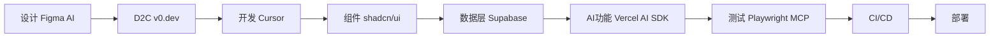

```
设计（Figma AI）
  → D2C（v0.dev）
    → 开发（Cursor + .cursorrules）
      → 组件（shadcn/ui + Radix + Tailwind v4）
        → 数据层（Supabase：数据库 + Auth + 实时 + Vector）
          → AI 功能（Vercel AI SDK + Supabase Vector）
            → 测试（Playwright MCP）
              → CI/CD → 部署
```

注意看，这里和大家之前认知里的链路相比，多了一个关键节点——数据层。我们加入了 Supabase。为什么？因为一个真正能上线的应用，光有前端 UI 是不够的，你需要数据库、需要用户认证、需要实时更新、需要文件存储。Supabase 把这些能力全部打包在一起，开箱即用，而且和我们的 AI 工作流完美契合——它内置的 Vector 支持可以直接配合 Vercel AI SDK 做语义搜索。后面我会详细展开讲。

这九个节点，覆盖了前端开发的完整生命周期。传统工作流里，每个节点之间都有大量的人工衔接成本。而在 AI-Native 工作流里，这些衔接成本被大幅压缩，甚至接近于零。

让我逐一给大家拆解。

### 1.2 节点一：设计——Figma AI

第一个节点是设计。

过去，设计师出设计稿，前端工程师拿到设计稿再开始开发。这中间有大量的沟通成本：这个间距是多少？这个颜色值是什么？这个交互效果怎么实现？

现在，Figma AI 改变了这个游戏规则。

Figma AI 能做什么？它可以根据文字描述自动生成 UI 设计稿，可以智能调整布局和配色，可以自动生成设计规范文档。更重要的是，它生成的设计稿是结构化的——每个图层都有清晰的命名和层级关系，这为后续的自动转码打下了基础。

举个例子，你在 Figma 里输入一段描述：

```
"设计一个现代风格的用户反馈管理仪表盘，包含：
- 顶部导航栏，带搜索框和用户头像
- 左侧边栏，包含反馈分类菜单
- 主内容区，展示反馈列表，每条反馈包含用户头像、内容摘要、情感标签、时间
- 右侧面板，展示选中反馈的详细信息和 AI 分析结果
- 底部状态栏，显示统计数据"
```

Figma AI 会在几秒钟内生成一个完整的设计稿。当然，它生成的不一定完美，你可能需要微调。但关键是——它把你从零到一的时间从几个小时压缩到了几分钟。

这里有一个重要的认知转变：作为前端工程师，你不再只是设计稿的"消费者"，你也可以成为设计稿的"生产者"。这意味着什么？意味着你可以更快地验证想法，更快地做原型，更快地和产品经理、设计师对齐需求。

### 1.3 节点二：设计转代码——v0.dev

第二个节点是设计转代码，也就是 D2C（Design to Code）。

v0.dev 是 Vercel 推出的 AI 驱动的 UI 生成工具。它的核心能力是：你给它一段描述或者一张设计图，它直接给你生成可用的 React 组件代码。

注意，我说的是"可用的"，不是"玩具级的"。v0.dev 生成的代码直接基于 shadcn/ui 和 Tailwind CSS，代码质量相当高，可以直接集成到你的项目中。

来看一个实际的例子。我给 v0.dev 这样一段提示：

```
"创建一个反馈列表组件，每条反馈包含：
- 用户头像（圆形）
- 用户名和提交时间
- 反馈内容摘要（最多显示两行）
- 情感分析标签（正面/中性/负面，用不同颜色区分）
- 操作按钮（查看详情、标记已处理）
列表支持虚拟滚动，每页显示 20 条"
```

v0.dev 会生成类似这样的代码：

```tsx
// FeedbackList.tsx — 由 v0.dev 生成，基于 shadcn/ui + Tailwind
import { Avatar, AvatarFallback, AvatarImage } from "@/components/ui/avatar"
import { Badge } from "@/components/ui/badge"
import { Button } from "@/components/ui/button"
import { Card, CardContent } from "@/components/ui/card"
import { formatDistanceToNow } from "date-fns"
import { zhCN } from "date-fns/locale"

interface Feedback {
  id: string
  user: {
    name: string
    avatar: string
  }
  content: string
  sentiment: "positive" | "neutral" | "negative"
  createdAt: Date
  isProcessed: boolean
}

const sentimentConfig = {
  positive: { label: "正面", className: "bg-green-100 text-green-800" },
  neutral: { label: "中性", className: "bg-gray-100 text-gray-800" },
  negative: { label: "负面", className: "bg-red-100 text-red-800" },
}

interface FeedbackListProps {
  feedbacks: Feedback[]
  onViewDetail: (id: string) => void
  onMarkProcessed: (id: string) => void
}

export function FeedbackList({
  feedbacks,
  onViewDetail,
  onMarkProcessed,
}: FeedbackListProps) {
  return (
    <div className="space-y-3">
      {feedbacks.map((feedback) => (
        <Card key={feedback.id} className="hover:shadow-md transition-shadow">
          <CardContent className="p-4">
            <div className="flex items-start gap-3">
              <Avatar className="h-10 w-10">
                <AvatarImage src={feedback.user.avatar} />
                <AvatarFallback>
                  {feedback.user.name.slice(0, 2)}
                </AvatarFallback>
              </Avatar>
              <div className="flex-1 min-w-0">
                <div className="flex items-center justify-between">
                  <span className="font-medium text-sm">
                    {feedback.user.name}
                  </span>
                  <span className="text-xs text-muted-foreground">
                    {formatDistanceToNow(feedback.createdAt, {
                      addSuffix: true,
                      locale: zhCN,
                    })}
                  </span>
                </div>
                <p className="text-sm text-muted-foreground mt-1 line-clamp-2">
                  {feedback.content}
                </p>
                <div className="flex items-center justify-between mt-2">
                  <Badge
                    variant="secondary"
                    className={
                      sentimentConfig[feedback.sentiment].className
                    }
                  >
                    {sentimentConfig[feedback.sentiment].label}
                  </Badge>
                  <div className="flex gap-2">
                    <Button
                      variant="ghost"
                      size="sm"
                      onClick={() => onViewDetail(feedback.id)}
                    >
                      查看详情
                    </Button>
                    {!feedback.isProcessed && (
                      <Button
                        variant="outline"
                        size="sm"
                        onClick={() => onMarkProcessed(feedback.id)}
                      >
                        标记已处理
                      </Button>
                    )}
                  </div>
                </div>
              </div>
            </div>
          </CardContent>
        </Card>
      ))}
    </div>
  )
}
```

大家看，这段代码的质量是不是相当不错？类型定义完整，组件结构清晰，样式用的是 Tailwind，UI 组件用的是 shadcn/ui。你拿到这段代码，几乎不需要做太多修改就能直接用。

这就是 D2C 的威力。它不是要取代你，而是帮你跳过那些重复性的 UI 搭建工作，让你把精力集中在真正需要思考的业务逻辑上。

### 1.4 节点三：智能开发——Cursor AI

第三个节点是开发环节，我们的主力工具是 Cursor。

Cursor 在我们之前的课程里已经深入讲过了，这里我重点强调它在全链路中的角色。

Cursor 不只是一个代码编辑器，它是整个开发环节的 AI 中枢。你从 v0.dev 拿到的组件代码，导入到 Cursor 项目中之后，Cursor 能帮你做什么？

第一，智能补全和重构。当你把 v0.dev 生成的组件集成到项目中时，Cursor 会根据你项目的上下文，自动调整 import 路径、适配你的状态管理方案、补充缺失的错误处理逻辑。

第二，业务逻辑生成。你可以用自然语言描述业务需求，Cursor 帮你生成对应的代码。比如：

```
// 在 Cursor 中使用 Cmd+K 输入：
// "实现反馈列表的筛选逻辑：支持按情感类型、时间范围、处理状态筛选，
//  使用 URL search params 持久化筛选条件"
```

Cursor 会生成完整的筛选逻辑，包括自定义 Hook、URL 参数解析、筛选函数等。

第三，代码审查。你写完代码后，可以让 Cursor 帮你审查，它会指出潜在的性能问题、安全隐患、可访问性缺陷。

这里我想强调一个关键理念：Cursor 的价值不在于它能写多少代码，而在于它能让你保持在"心流"状态中。传统开发中，你经常需要中断思路去查文档、去 Stack Overflow 搜答案、去翻以前的代码找参考。Cursor 把这些中断都消除了，你只需要专注于"我要实现什么"，而不是"我该怎么写"。

### 1.5 节点四：组件系统——shadcn/ui + Tailwind CSS

第四个节点是组件系统。

shadcn/ui 加 Tailwind CSS，这个组合我们在之前的课程里也详细讲过。在全链路中，它们扮演的角色是"标准化层"。

什么意思？当你的代码来源多样化——有些来自 v0.dev 生成，有些来自 Cursor AI 辅助编写，有些是你手写的——你需要一个统一的组件系统来保证一致性。shadcn/ui 就是这个统一层。

而且 shadcn/ui 有一个非常重要的特性：它不是一个传统的 npm 包，而是把组件代码直接复制到你的项目中。这意味着你对每个组件都有完全的控制权，可以根据项目需求自由定制。

Tailwind CSS 则提供了原子化的样式系统，确保所有组件的样式风格一致。更重要的是，Tailwind 的类名是"自描述的"——`text-sm text-muted-foreground mt-1 line-clamp-2`，你一看就知道这个元素的样式是什么。这对 AI 生成代码来说非常友好，因为 AI 可以精确地理解和生成 Tailwind 类名。

### 1.6 节点五：AI 功能集成——Vercel AI SDK

第五个节点是 AI 功能集成。

现在越来越多的应用需要内置 AI 能力——智能搜索、内容生成、数据分析、对话交互。Vercel AI SDK 让这些能力的集成变得非常简单。

在我们的反馈管理平台中，我们需要一个 AI 功能：自动分析用户反馈的情感倾向，并生成处理建议。来看看用 Vercel AI SDK 怎么实现：

```typescript
// app/api/analyze-feedback/route.ts
import { openai } from "@ai-sdk/openai"
import { streamText } from "ai"

export async function POST(req: Request) {
  const { feedback } = await req.json()

  const result = streamText({
    model: openai("gpt-4o"),
    system: `你是一个专业的客户反馈分析师。请分析以下用户反馈，给出：
1. 情感倾向（正面/中性/负面）及置信度
2. 关键问题提取
3. 建议的处理优先级（高/中/低）
4. 推荐的回复策略
请用 JSON 格式返回结果。`,
    prompt: feedback,
  })

  return result.toDataStreamResponse()
}
```

客户端调用也很简洁：

```tsx
// hooks/useAnalyzeFeedback.ts
import { useCompletion } from "ai/react"

export function useAnalyzeFeedback() {
  const { complete, completion, isLoading } = useCompletion({
    api: "/api/analyze-feedback",
  })

  const analyze = async (feedback: string) => {
    const result = await complete(feedback)
    try {
      return JSON.parse(result || "{}")
    } catch {
      return null
    }
  }

  return { analyze, isLoading, rawResult: completion }
}
```

大家注意看，整个 AI 功能的集成，核心代码不超过 30 行。这就是 Vercel AI SDK 的价值——它把复杂的 AI 接口调用、流式响应处理、错误重试等底层细节都封装好了，你只需要关注业务逻辑。

### 1.7 节点六：自动化测试——Playwright MCP

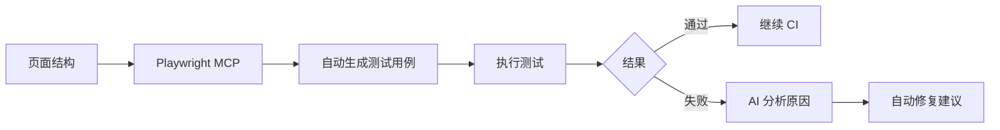

第六个节点是测试。

传统的前端测试是一个痛点。写测试用例耗时，维护测试用例更耗时。很多团队的测试覆盖率长期在 30% 以下徘徊，不是不想写，是真的没时间写。

Playwright MCP 改变了这个局面。MCP（Model Context Protocol）让 AI 能够直接与 Playwright 交互，自动生成和执行测试用例。

来看一个例子：

```typescript
// tests/feedback-list.spec.ts
// 这个测试文件可以通过 Playwright MCP 自动生成
import { test, expect } from "@playwright/test"

test.describe("反馈列表功能", () => {
  test.beforeEach(async ({ page }) => {
    await page.goto("/dashboard/feedbacks")
  })

  test("应该正确展示反馈列表", async ({ page }) => {
    // 等待列表加载完成
    await expect(page.getByRole("list")).toBeVisible()

    // 验证列表项包含必要元素
    const firstItem = page.getByRole("listitem").first()
    await expect(firstItem.getByRole("img")).toBeVisible() // 头像
    await expect(firstItem.getByText(/正面|中性|负面/)).toBeVisible() // 情感标签
  })

  test("应该支持按情感类型筛选", async ({ page }) => {
    // 点击筛选按钮
    await page.getByRole("button", { name: "筛选" }).click()

    // 选择"负面"筛选条件
    await page.getByLabel("情感类型").selectOption("negative")
    await page.getByRole("button", { name: "应用" }).click()

    // 验证所有列表项都是负面标签
    const badges = page.locator('[data-testid="sentiment-badge"]')
    const count = await badges.count()
    for (let i = 0; i < count; i++) {
      await expect(badges.nth(i)).toHaveText("负面")
    }
  })

  test("应该能查看反馈详情并触发 AI 分析", async ({ page }) => {
    // 点击第一条反馈的"查看详情"
    await page.getByRole("button", { name: "查看详情" }).first().click()

    // 验证详情面板打开
    await expect(page.getByRole("complementary")).toBeVisible()

    // 点击 AI 分析按钮
    await page.getByRole("button", { name: "AI 分析" }).click()

    // 等待分析结果
    await expect(
      page.getByText("情感倾向", { exact: false })
    ).toBeVisible({ timeout: 10000 })
  })
})
```

关键点在于：这些测试用例不是你手写的，而是 Playwright MCP 根据你的页面结构和业务逻辑自动生成的。你需要做的只是审查和微调。

这就是 AI 在测试环节的价值：不是取代测试，而是大幅降低编写测试的成本，让"高测试覆盖率"从一个理想变成现实。

### 1.8 节点七和八：CI/CD 与部署

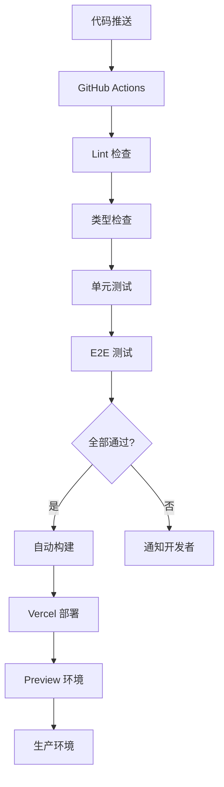

最后两个节点是 CI/CD 和部署。

GitHub Actions 负责自动化流水线：代码推送后自动运行 lint、类型检查、单元测试、E2E 测试，全部通过后自动构建和部署。

```yaml
# .github/workflows/ci.yml
name: CI/CD Pipeline

on:
  push:
    branches: [main]
  pull_request:
    branches: [main]

jobs:
  quality:
    runs-on: ubuntu-latest
    steps:
      - uses: actions/checkout@v4
      - uses: pnpm/action-setup@v4
      - uses: actions/setup-node@v4
        with:
          node-version: 20
          cache: "pnpm"
      - run: pnpm install --frozen-lockfile
      - run: pnpm lint
      - run: pnpm type-check
      - run: pnpm test -- --run

  e2e:
    runs-on: ubuntu-latest
    needs: quality
    steps:
      - uses: actions/checkout@v4
      - uses: pnpm/action-setup@v4
      - uses: actions/setup-node@v4
        with:
          node-version: 20
          cache: "pnpm"
      - run: pnpm install --frozen-lockfile
      - run: pnpm exec playwright install --with-deps
      - run: pnpm build
      - run: pnpm exec playwright test

  deploy:
    runs-on: ubuntu-latest
    needs: [quality, e2e]
    if: github.ref == 'refs/heads/main'
    steps:
      - uses: actions/checkout@v4
      - uses: amondnet/vercel-action@v25
        with:
          vercel-token: ${{ secrets.VERCEL_TOKEN }}
          vercel-org-id: ${{ secrets.VERCEL_ORG_ID }}
          vercel-project-id: ${{ secrets.VERCEL_PROJECT_ID }}
          vercel-args: "--prod"
```

Vercel Platform 负责部署和托管。它提供了开箱即用的 Preview Deployment——每个 PR 都会自动生成一个预览环境，方便团队成员审查。

### 1.9 全链路的核心价值

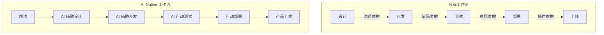

好，九个节点我们都过了一遍。现在我想让大家思考一个问题：这条全链路的核心价值到底是什么？

不是速度快。速度快只是表象。

核心价值是：降低了从想法到产品的摩擦力。

传统工作流中，每个环节之间都有巨大的摩擦力——设计和开发之间的沟通摩擦、手动编码的认知摩擦、写测试的意愿摩擦、部署的操作摩擦。AI-Native 工作流把这些摩擦力逐一消除，让你能够以接近"思考速度"的效率把想法变成产品。

这才是真正的范式转变。

好，理论部分讲完了。在进入项目实战之前，我要先展开讲讲数据层的选型——也就是为什么我们选择 Supabase。

### 1.10 数据层选型：为什么是 Supabase？

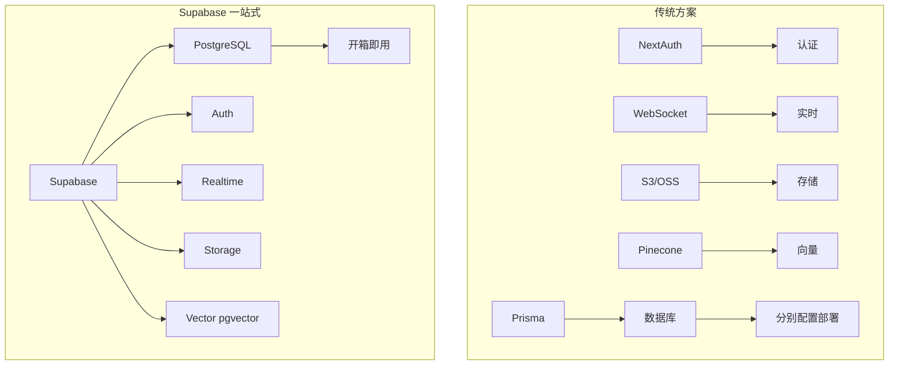

很多同学在做全栈项目的时候，第一反应可能是用 Prisma + SQLite，或者 Prisma + PostgreSQL，再配一个 NextAuth 做认证。这套方案没有问题，但你仔细想想，你需要做多少事情？

你要配置 Prisma schema，要写 migration，要部署数据库实例，要配置 NextAuth 的各种 provider，要自己实现实时更新的 WebSocket 层，要找一个文件存储方案……每一项都是额外的工作量，每一项都可能出问题。

而 Supabase 呢？它把这些全部打包好了，一个平台搞定。

我来给大家列一下，为什么在 AI-Native 全链路中，Supabase 是更优的选择：

**第一，开箱即用。** Auth、数据库、实时订阅、Storage，全部内置。你不需要自己搭后端服务，不需要自己管理基础设施。创建一个 Supabase 项目，两分钟之内你就有了一个完整的后端。

**第二，不需要部署后端服务。** 这一点对前端工程师来说太重要了。Supabase 提供的是 BaaS（Backend as a Service），你的 Next.js 应用直接通过客户端 SDK 和 Supabase 通信，不需要额外的 Express 或 Fastify 服务器。

**第三，内置 Vector 支持。** 这是 Supabase 和其他 BaaS 方案的关键区别。Supabase 基于 PostgreSQL，通过 pgvector 扩展原生支持向量存储和检索。这意味着你可以直接用 Supabase 做 AI 语义搜索，不需要额外接入 Pinecone 或 Weaviate。配合 Vercel AI SDK，几行代码就能实现 RAG（检索增强生成）。

**第四，免费额度够用。** Supabase 的免费套餐给了你 500MB 数据库空间、1GB 文件存储、50000 月活用户的 Auth 额度。对于课程项目、个人项目、甚至小型创业项目来说，绰绰有余。

#### Supabase 在全链路中的角色

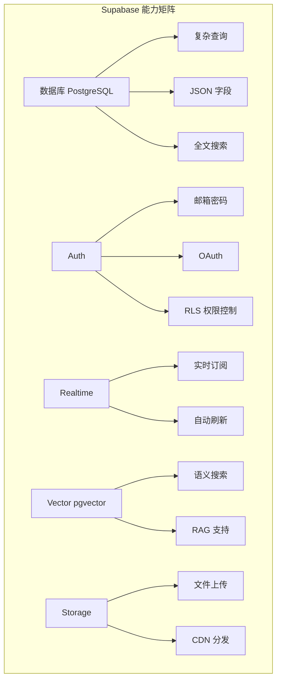

让我具体拆解一下 Supabase 在我们全链路中承担的角色：

- **数据库**：存储所有业务数据——用户反馈、分析结果、配置信息。基于 PostgreSQL，支持复杂查询、JSON 字段、全文搜索。
- **Auth**：用户认证和授权。支持邮箱密码、OAuth（GitHub、Google）、Magic Link。配合 Row Level Security（RLS），可以在数据库层面控制数据访问权限。
- **Realtime**：实时数据更新。当有新的反馈提交时，所有在线用户的界面自动刷新，不需要轮询。底层基于 PostgreSQL 的 LISTEN/NOTIFY 机制。
- **Vector**：AI 语义搜索的基础。把用户反馈转成向量存储在 Supabase 中，然后就能做\"找到和这条反馈类似的所有反馈\"这样的语义搜索。
- **Storage**：文件上传和管理。用户上传的截图、附件，直接存到 Supabase Storage，自动生成 CDN 链接。
- **Edge Functions**：自定义后端逻辑。需要做一些敏感操作（比如调用 AI API、发送邮件）？写一个 Edge Function 就行，Deno 运行时，TypeScript 友好。

#### 代码实战：接入 Supabase

接入 Supabase 非常简单。首先是初始化客户端：

```ts
// lib/supabase.ts
import { createClient } from '@supabase/supabase-js'

export const supabase = createClient(
  process.env.NEXT_PUBLIC_SUPABASE_URL!,
  process.env.NEXT_PUBLIC_SUPABASE_ANON_KEY!
)
```

就这么几行代码，你就拿到了一个可以操作数据库、认证、存储的客户端。然后在你的组件里直接用就行了——查询数据、插入数据、订阅实时变更，全部通过这个客户端完成。

大家注意，Supabase 的接入成本几乎为零。它的 SDK 设计得非常符合前端工程师的直觉，如果你用过 Firebase，会觉得非常熟悉，但 Supabase 比 Firebase 更好的地方在于——它是基于 PostgreSQL 的，是真正的关系型数据库，而不是 NoSQL。这意味着你的数据建模更灵活，查询能力更强大。

好，数据层讲完了。接下来，我们进入今天的重头戏——完整项目实战。

---

## Section 2（50 min）：项目实战 - 从设计到部署

### 2.1 项目规划与设计

好，现在我们来做一个完整的项目实战。我们要构建的是一个**客户反馈管理平台**——就是我在开头故事里提到的那个项目。

先看需求：

```
产品需求：客户反馈管理平台
- 用户可以提交反馈（文字 + 截图）
- 管理员可以查看反馈列表，按情感分类筛选
- AI 自动分析反馈的情感倾向和关键问题
- 实时更新：新反馈提交后，管理后台自动刷新
- 支持语义搜索：找到"类似的反馈"
```

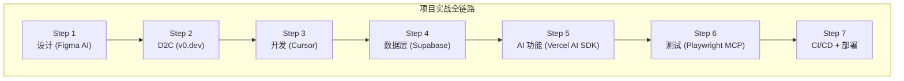

传统工作流下，这个项目需要多久？

| 环节 | 传统工作流 | AI-Native 工作流 |
|------|-----------|-----------------|
| UI 设计 | 2-3 天 | 2 小时 |
| 设计转代码 | 3-5 天 | 1 小时 |
| 核心功能开发 | 5-7 天 | 1 天 |
| AI 功能集成 | 3-5 天 | 半天 |
| E2E 测试 | 2-3 天 | 2 小时 |
| CI/CD + 部署 | 1 天 | 30 分钟 |
| **总计** | **16-24 天** | **3 天** |

效率提升 5-8 倍。这不是夸张，这是实实在在的数据。下面我们逐步演示。

#### Step 1：用 Figma AI 生成设计稿

打开 Figma，输入这段描述：

```
设计一个现代风格的客户反馈管理仪表盘：
- 顶部导航栏：Logo、搜索框、通知图标、用户头像
- 左侧边栏：反馈分类菜单（全部、正面、中性、负面、未处理）
- 主内容区：反馈卡片列表，每张卡片包含用户头像、内容摘要、
  情感标签（绿/灰/红）、时间戳
- 右侧面板：选中反馈的详情 + AI 分析结果
- 配色：使用 shadcn/ui 默认主题
```

Figma AI 几秒钟就能生成一个基础的设计稿。你可能需要微调一些间距和配色，但核心布局已经有了。

关键点：**确保 Figma 的图层命名规范**。好的命名直接影响后续 D2C 的质量。

### 2.2 Design to Code：v0.dev

拿到设计稿后，我们用 v0.dev 把它转成代码。

把设计稿截图上传到 v0.dev，或者直接用文字描述。v0.dev 生成的代码默认使用 shadcn/ui + Tailwind CSS，和我们的技术栈完美匹配。

```tsx
// v0.dev 生成的 FeedbackDashboard 骨架
import { Input } from "@/components/ui/input"
import { Badge } from "@/components/ui/badge"
import { Card, CardContent, CardHeader } from "@/components/ui/card"
import { Avatar, AvatarFallback, AvatarImage } from "@/components/ui/avatar"
import { ScrollArea } from "@/components/ui/scroll-area"
import { Button } from "@/components/ui/button"
import { Search, Bell, MessageSquare, TrendingUp } from "lucide-react"

const categories = [
  { label: "全部反馈", count: 128, icon: MessageSquare },
  { label: "正面", count: 64, icon: TrendingUp },
  { label: "中性", count: 38, icon: MessageSquare },
  { label: "负面", count: 26, icon: MessageSquare },
]

export function FeedbackDashboard() {
  return (
    <div className="flex h-screen">
      {/* 左侧边栏 */}
      <aside className="w-64 border-r bg-muted/30 p-4">
        <h2 className="text-lg font-semibold mb-4">反馈分类</h2>
        <nav className="space-y-1">
          {categories.map((cat) => (
            <Button
              key={cat.label}
              variant="ghost"
              className="w-full justify-between"
            >
              <span className="flex items-center gap-2">
                <cat.icon className="h-4 w-4" />
                {cat.label}
              </span>
              <Badge variant="secondary">{cat.count}</Badge>
            </Button>
          ))}
        </nav>
      </aside>

      {/* 主内容区 */}
      <main className="flex-1 flex flex-col">
        {/* 顶部导航 */}
        <header className="border-b p-4 flex items-center justify-between">
          <div className="relative w-96">
            <Search className="absolute left-3 top-1/2 -translate-y-1/2 h-4 w-4 text-muted-foreground" />
            <Input placeholder="搜索反馈..." className="pl-9" />
          </div>
          <div className="flex items-center gap-4">
            <Button variant="ghost" size="icon">
              <Bell className="h-5 w-5" />
            </Button>
            <Avatar className="h-8 w-8">
              <AvatarFallback>管</AvatarFallback>
            </Avatar>
          </div>
        </header>

        {/* 反馈列表 */}
        <ScrollArea className="flex-1 p-4">
          <div className="space-y-3">
            {/* 反馈卡片会在这里渲染 */}
          </div>
        </ScrollArea>
      </main>
    </div>
  )
}
```

大家看，v0.dev 生成的代码质量相当不错——TypeScript 类型完整、shadcn/ui 组件正确使用、Tailwind 类名规范。拿过来几乎不用改就能跑。

**代码审查要点**：v0.dev 生成的代码需要检查这几点：
1. 组件是否正确导入（路径是否匹配你的项目结构）
2. 是否有硬编码的数据（需要替换成真实数据源）
3. 响应式布局是否完善
4. 是否缺少必要的交互逻辑

### 2.3 核心功能开发：Cursor + Supabase

现在我们进入 Cursor，开始开发核心功能。

首先，确保你的项目有 `.cursorrules`：

```
You are an expert in TypeScript, React, Next.js App Router, Tailwind CSS, and shadcn/ui.

Project: Customer feedback management platform
Database: Supabase (PostgreSQL + pgvector)
Auth: Supabase Auth
AI: Vercel AI SDK

Key conventions:
- Use Server Components by default, 'use client' only when needed
- Use Tailwind CSS for all styling
- Use shadcn/ui components
- Use Supabase for all data operations
- Use Zod for validation
- Named exports only
```

然后在 Cursor 中用自然语言描述需求：

> "创建反馈列表组件，支持按情感类型筛选。数据从 Supabase 获取，使用实时订阅实现自动刷新。"

Cursor 会生成类似这样的代码：

```tsx
// app/dashboard/page.tsx
import { createClient } from "@/lib/supabase/server"
import { FeedbackList } from "./feedback-list"

export default async function DashboardPage() {
  const supabase = await createClient()

  const { data: feedbacks } = await supabase
    .from("feedbacks")
    .select("*, profiles(name, avatar_url)")
    .order("created_at", { ascending: false })

  return (
    <div className="flex-1 p-6">
      <h1 className="text-2xl font-bold mb-6">反馈管理</h1>
      <FeedbackList initialData={feedbacks ?? []} />
    </div>
  )
}
```

```tsx
// app/dashboard/feedback-list.tsx
"use client"

import { useEffect, useState } from "react"
import { createClient } from "@/lib/supabase/client"
import { Card, CardContent } from "@/components/ui/card"
import { Badge } from "@/components/ui/badge"
import { Avatar, AvatarFallback, AvatarImage } from "@/components/ui/avatar"
import { Button } from "@/components/ui/button"
import { Tabs, TabsList, TabsTrigger } from "@/components/ui/tabs"
import { formatDistanceToNow } from "date-fns"
import { zhCN } from "date-fns/locale"

type Feedback = {
  id: string
  content: string
  sentiment: "positive" | "neutral" | "negative"
  created_at: string
  is_processed: boolean
  profiles: { name: string; avatar_url: string }
}

const sentimentConfig = {
  positive: { label: "正面", class: "bg-green-100 text-green-800" },
  neutral: { label: "中性", class: "bg-gray-100 text-gray-800" },
  negative: { label: "负面", class: "bg-red-100 text-red-800" },
}

export function FeedbackList({ initialData }: { initialData: Feedback[] }) {
  const [feedbacks, setFeedbacks] = useState(initialData)
  const [filter, setFilter] = useState<string>("all")
  const supabase = createClient()

  // 实时订阅：新反馈自动出现
  useEffect(() => {
    const channel = supabase
      .channel("feedbacks")
      .on(
        "postgres_changes",
        { event: "INSERT", schema: "public", table: "feedbacks" },
        (payload) => {
          setFeedbacks((prev) => [payload.new as Feedback, ...prev])
        }
      )
      .subscribe()

    return () => { supabase.removeChannel(channel) }
  }, [supabase])

  const filtered = filter === "all"
    ? feedbacks
    : feedbacks.filter((f) => f.sentiment === filter)

  return (
    <div className="space-y-4">
      <Tabs value={filter} onValueChange={setFilter}>
        <TabsList>
          <TabsTrigger value="all">全部 ({feedbacks.length})</TabsTrigger>
          <TabsTrigger value="positive">正面</TabsTrigger>
          <TabsTrigger value="neutral">中性</TabsTrigger>
          <TabsTrigger value="negative">负面</TabsTrigger>
        </TabsList>
      </Tabs>

      <div className="space-y-3">
        {filtered.map((feedback) => (
          <Card key={feedback.id} className="hover:shadow-md transition-shadow">
            <CardContent className="p-4">
              <div className="flex items-start gap-3">
                <Avatar className="h-10 w-10">
                  <AvatarImage src={feedback.profiles.avatar_url} />
                  <AvatarFallback>
                    {feedback.profiles.name.slice(0, 2)}
                  </AvatarFallback>
                </Avatar>
                <div className="flex-1 min-w-0">
                  <div className="flex items-center justify-between">
                    <span className="font-medium text-sm">
                      {feedback.profiles.name}
                    </span>
                    <span className="text-xs text-muted-foreground">
                      {formatDistanceToNow(new Date(feedback.created_at), {
                        addSuffix: true, locale: zhCN,
                      })}
                    </span>
                  </div>
                  <p className="text-sm text-muted-foreground mt-1 line-clamp-2">
                    {feedback.content}
                  </p>
                  <div className="flex items-center justify-between mt-2">
                    <Badge className={sentimentConfig[feedback.sentiment].class}>
                      {sentimentConfig[feedback.sentiment].label}
                    </Badge>
                    <Button variant="ghost" size="sm">查看详情</Button>
                  </div>
                </div>
              </div>
            </CardContent>
          </Card>
        ))}
      </div>
    </div>
  )
}
```

注意看这段代码的亮点：

1. **Server Component + Client Component 分离**：页面层用 Server Component 做初始数据获取，列表组件是 Client Component 负责交互
2. **Supabase 实时订阅**：新反馈提交后，所有在线用户的列表自动更新
3. **shadcn/ui 组件**：Tabs、Card、Badge、Avatar 全部来自 shadcn/ui
4. **Tailwind CSS**：所有样式都是原子化的，AI 可以精确理解

### 2.4 AI 功能集成：情感分析 + 语义搜索

现在我们来加入 AI 功能。用 Vercel AI SDK 实现两个能力：

**能力一：反馈情感分析**

```typescript
// app/api/analyze/route.ts
import { streamText } from "ai"
import { openai } from "@ai-sdk/openai"

export async function POST(req: Request) {
  const { feedback } = await req.json()

  const result = streamText({
    model: openai("gpt-4o"),
    system: `你是一个专业的客户反馈分析师。分析以下反馈，返回 JSON：
{
  "sentiment": "positive" | "neutral" | "negative",
  "confidence": 0-1,
  "keyIssues": ["问题1", "问题2"],
  "priority": "high" | "medium" | "low",
  "suggestedReply": "建议回复内容"
}`,
    prompt: feedback,
  })

  return result.toDataStreamResponse()
}
```

**能力二：语义搜索（基于 Supabase pgvector）**

```typescript
// app/api/search/route.ts
import { openai } from "@ai-sdk/openai"
import { embed } from "ai"
import { createClient } from "@/lib/supabase/server"

export async function POST(req: Request) {
  const { query } = await req.json()
  const supabase = await createClient()

  // 1. 把搜索词转成向量
  const { embedding } = await embed({
    model: openai.embedding("text-embedding-3-small"),
    value: query,
  })

  // 2. 在 Supabase 中做语义搜索
  const { data: results } = await supabase.rpc("match_feedbacks", {
    query_embedding: embedding,
    match_threshold: 0.7,
    match_count: 10,
  })

  return Response.json({ results })
}
```

用户在搜索框输入"物流太慢了"，AI 不只匹配包含"物流"的反馈，还会找到"快递三天了还没到"、"发货速度需要改进"这样语义相关的内容。

**这就是语义搜索和关键词搜索的本质区别。**

### 2.5 测试与部署

**自动化测试：Playwright MCP**

打开 Claude Desktop，启用 Playwright MCP，然后说：

```
帮我为客户反馈管理平台生成 E2E 测试：
1. 登录后能看到反馈列表
2. 点击筛选按钮能正确过滤
3. 点击"查看详情"能打开详情面板
4. AI 分析按钮能返回分析结果
```

Playwright MCP 会自动打开浏览器，操作页面，然后生成完整的测试代码。你只需要审查和微调。

**CI/CD + 部署**

推送代码到 GitHub，GitHub Actions 自动运行：

```yaml
# .github/workflows/ci.yml
name: CI/CD
on:
  push:
    branches: [main]
  pull_request:
    branches: [main]

jobs:
  quality:
    runs-on: ubuntu-latest
    steps:
      - uses: actions/checkout@v4
      - uses: pnpm/action-setup@v4
      - uses: actions/setup-node@v4
        with: { node-version: 20, cache: pnpm }
      - run: pnpm install --frozen-lockfile
      - run: pnpm lint
      - run: pnpm type-check
      - run: pnpm test -- --run

  e2e:
    runs-on: ubuntu-latest
    needs: quality
    steps:
      - uses: actions/checkout@v4
      - uses: pnpm/action-setup@v4
      - uses: actions/setup-node@v4
        with: { node-version: 20, cache: pnpm }
      - run: pnpm install --frozen-lockfile
      - run: pnpm exec playwright install --with-deps
      - run: pnpm build
      - run: pnpm exec playwright test

  deploy:
    runs-on: ubuntu-latest
    needs: [quality, e2e]
    if: github.ref == 'refs/heads/main'
    steps:
      - uses: actions/checkout@v4
      - uses: amondnet/vercel-action@v25
        with:
          vercel-token: ${{ secrets.VERCEL_TOKEN }}
          vercel-org-id: ${{ secrets.VERCEL_ORG_ID }}
          vercel-project-id: ${{ secrets.VERCEL_PROJECT_ID }}
          vercel-args: "--prod"
```

Lint → 类型检查 → 单元测试 → E2E 测试 → 构建 → 部署。全自动，零人工干预。

### 2.6 效率对比总结

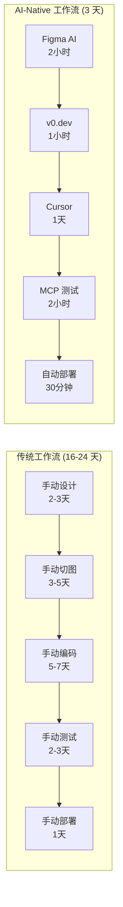

| 维度 | 传统工作流 | AI-Native 工作流 | 提升倍数 |
|------|-----------|-----------------|---------|
| 设计到代码 | 5-8 天 | 3 小时 | **15-20x** |
| 核心开发 | 5-7 天 | 1 天 | **5-7x** |
| 测试编写 | 2-3 天 | 2 小时 | **8-12x** |
| 部署上线 | 1 天 | 30 分钟 | **16x** |
| **端到端** | **16-24 天** | **3 天** | **5-8x** |

但请注意，效率提升不是终极目标。终极目标是：**让你有更多时间思考产品和用户体验，而不是把时间花在重复性的编码上。**

---

## Section 3（25 min）：AI 时代的前端工程师

### 3.1 角色转变：从"代码工人"到"AI 指挥官"

好，项目实战做完了。现在我们来聊一个更深层的话题：**AI 时代，前端工程师的角色正在发生怎样的转变？**

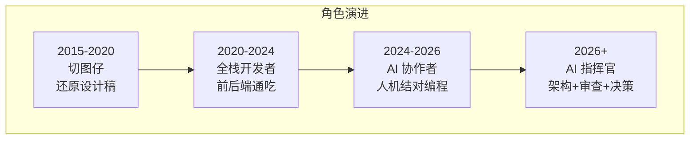

我们经历了几个阶段：

**第一阶段（2015-2020）**：切图仔。拿到设计稿，一像素一像素地还原。技能要求：CSS 精通、像素眼。

**第二阶段（2020-2024）**：全栈开发者。前后端通吃，Node.js + React，技能要求更广。

**第三阶段（2024-2026）**：AI 协作者。和 AI 结对编程，用 Cursor、Copilot 加速开发。技能要求：Prompt 工程、上下文管理。

**第四阶段（2026+）**：AI 指挥官。你不再写大部分代码，你的工作是架构设计、代码审查、技术决策。AI 是你的团队，你是指挥官。

**这个转变的核心是：从"怎么写代码"到"写什么代码"再到"为什么写代码"。**

AI 越来越能解决"怎么写"的问题。但"写什么"和"为什么写"——这需要对业务的理解、对用户的洞察、对系统的全局思考。这些是 AI 短期内无法替代的。

### 3.2 五大核心竞争力

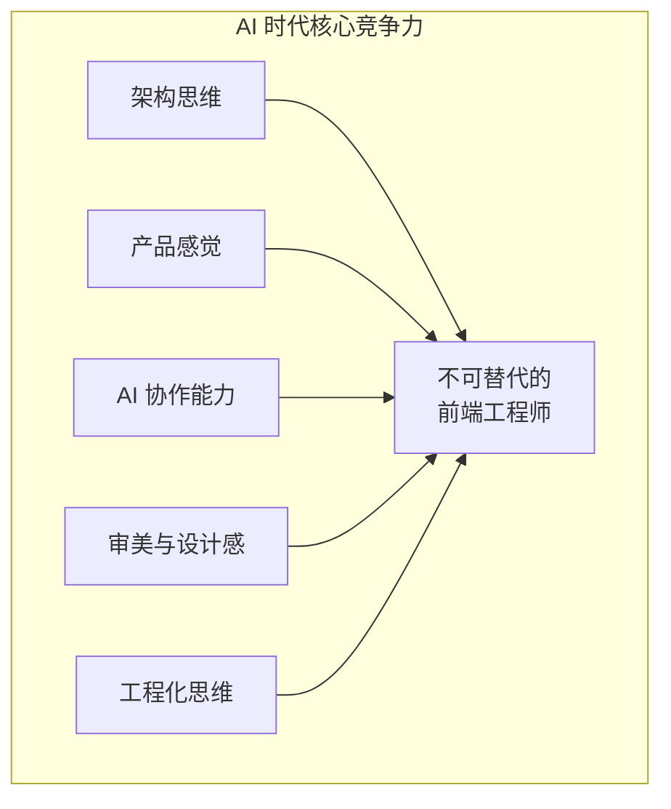

在 AI 时代，前端工程师需要五大核心竞争力：

**1. 架构思维**

AI 可以写代码，但不能设计系统。

当你面对一个复杂项目时，你需要回答这些问题：
- 用 Monorepo 还是多仓库？
- Server Components 和 Client Components 怎么划分？
- 状态管理用什么方案？
- 数据层怎么设计？
- 如何保证系统的可扩展性？

这些决策需要经验、判断力和全局视角。AI 可以给你建议，但最终的决策权在你手里。

**2. 产品感觉**

技术是为产品服务的。一个优秀的前端工程师，不只是能写出好代码，还能理解用户需求，提出产品改进建议。

比如，当产品经理说"在这里加一个按钮"，你不只是加上去，而是会思考：
- 这个按钮的目标用户是谁？
- 用户在什么场景下会点击它？
- 有没有更好的交互方式？

**3. AI 协作能力**

这是新时代独有的技能。如何高效地和 AI 协作：
- 写出好的 Prompt（结构化、有上下文、有约束）
- 管理好 AI 的上下文（.cursorrules、AGENTS.md、Memory）
- 审查 AI 生成的代码（安全性、性能、可维护性）
- 知道什么时候该让 AI 做，什么时候该自己做

**4. 审美与设计感**

AI 可以生成 UI 代码，但你需要判断生成的结果好不好。

- 间距是否协调？
- 配色是否和谐？
- 交互是否流畅？
- 信息层级是否清晰？

这些判断需要审美训练和设计直觉，不是 AI 能代劳的。

**5. 工程化思维**

代码只是冰山一角。一个真正的工程师还需要关心：
- CI/CD 流水线是否高效？
- 测试覆盖率是否足够？
- 监控和告警是否完善？
- 代码是否可维护、可扩展？

这些"看不见的工作"才是区分初级和高级工程师的关键。

### 3.3 学习路线图

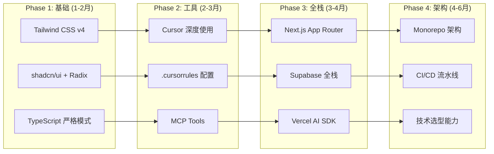

我给大家一个具体的学习路线：

**Phase 1（第 1-2 月）：夯实基础**
- 精通 Tailwind CSS v4（CSS-first 配置、Oxide 引擎）
- 熟练使用 shadcn/ui + Radix UI
- 开启 TypeScript 严格模式，养成类型安全的习惯

**Phase 2（第 2-3 月）：掌握工具**
- 深度使用 Cursor（Composer、Agent 模式）
- 为每个项目配置 .cursorrules 和 AGENTS.md
- 配置和使用 MCP Tools（Playwright MCP 优先）

**Phase 3（第 3-4 月）：全栈能力**
- 精通 Next.js App Router（Server Components、Server Actions）
- 使用 Supabase 做全栈项目（Auth + DB + Realtime + Vector）
- 用 Vercel AI SDK 集成 AI 功能

**Phase 4（第 4-6 月）：架构思维**
- 搭建 Monorepo 项目（Turborepo + pnpm）
- 设计 CI/CD 流水线（GitHub Actions + Vercel）
- 培养技术选型能力（评估矩阵方法）

**注意：这不是从零开始的路线。** 你们已经有前端基础，这个路线是帮你们在 AI 时代升级技能栈。

---

## Section 4（20 min）：未来展望

### 4.1 AI-Native 框架的崛起

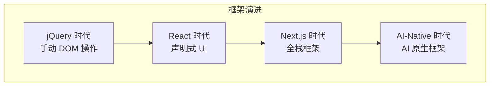

我们正处在一个框架范式转换的临界点。

过去 10 年，前端框架的演进路线是：jQuery → React → Next.js。每一次演进都在解决上一代框架的痛点。

下一代框架会是什么样？我认为会有这几个特征：

**特征一：AI 生成是第一等公民**

现在的框架把 AI 当作外部工具——你用 AI 生成代码，然后手动集成到框架里。未来的框架会把 AI 生成内置到开发流程中——你描述需求，框架自动生成组件、路由、API。

**特征二：自适应 UI**

组件会根据用户行为和上下文自动调整。不需要你写响应式规则，AI 会分析用户的使用模式，自动优化布局和交互。

**特征三：零配置智能优化**

框架会自动分析你的代码，做性能优化——代码拆分、懒加载、缓存策略，全部自动处理。你不需要手动配置 webpack 或 turbopack。

### 4.2 设计与开发的边界模糊

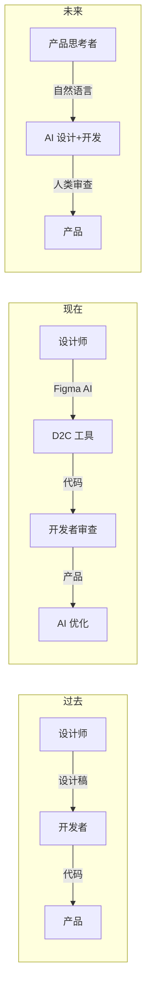

设计师和开发者的边界正在变得模糊：

- **设计师在学代码**：Figma 的 Dev Mode 让设计师能直接看到代码实现
- **开发者在做设计**：v0.dev、Pencil.dev 让开发者能直接生成 UI
- **AI 在两边穿梭**：AI 既能生成设计稿，也能生成代码

未来可能不再有"设计师"和"前端开发者"的严格区分。取而代之的是"产品体验工程师"——一个既懂设计又懂技术的复合角色。

### 4.3 Agent 化开发

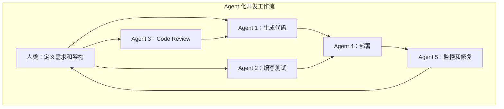

另一个重要趋势是 **Agent 化开发**。

现在的 AI 工具是"工具"——你告诉它做什么，它执行。未来的 AI 会变成"Agent"——你给它一个目标，它自己规划和执行。

想象这样一个场景：

你说："给我们的电商平台加一个'猜你喜欢'的推荐功能。"

然后一组 AI Agent 自动开工：
1. **需求 Agent**：分析已有的用户行为数据，确定推荐算法
2. **开发 Agent**：编写推荐组件和 API，集成到项目中
3. **测试 Agent**：生成并运行测试用例
4. **审查 Agent**：检查代码质量、安全性、性能
5. **部署 Agent**：通过 CI/CD 流水线部署到生产环境
6. **监控 Agent**：上线后监控推荐效果，发现问题自动修复

你的角色？**架构师 + 审查者 + 决策者。**

这不是科幻。Claude Code 已经能自主规划和执行多步任务了。Multi-Agent 系统在 2026 年已经开始落地。

### 4.4 前端的未来形态

给大家画一张未来 2-3 年的前端技术趋势图：

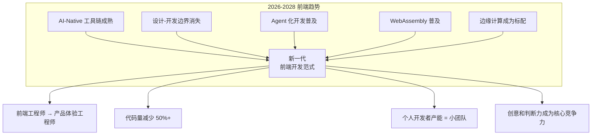

**趋势一：AI-Native 工具链成熟。** Cursor、v0.dev、MCP 这些工具会更加智能。AI 生成代码的质量会从现在的 70-80 分提升到 90+ 分。

**趋势二：设计-开发边界消失。** 你不再需要等设计师出稿。你可以用自然语言描述需求，AI 同时生成设计稿和代码。

**趋势三：Agent 化开发普及。** 单个开发者配合 AI Agent，产能相当于现在的一个小团队（3-5 人）。

**趋势四：代码量大幅减少。** 很多业务逻辑会通过配置而非编码来实现。你写的代码会更少，但每一行都更关键。

**趋势五：创意和判断力成为核心竞争力。** AI 能写代码，但不能替你思考"用户真正需要什么"。

**最终，前端工程师会从"代码生产者"转变为"体验设计者"。你的核心价值不是写代码，而是创造卓越的用户体验。**

---

## 🎯 Closing（25 min）

### 课程总结：12 课知识体系全景图

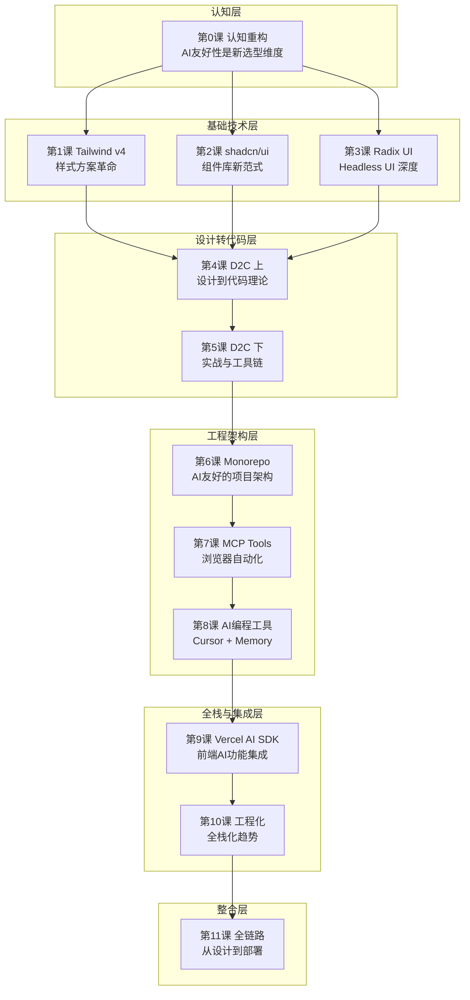

回顾我们整个 12 课的体系：

| 课程 | 核心主题 | 一句话总结 |
|------|---------|-----------|
| 第 0 课 | 认知重构 | AI 友好性是技术选型的第四个维度 |
| 第 1 课 | Tailwind CSS v4 | Utility-first 是 AI 最佳拍档 |
| 第 2 课 | shadcn/ui | Copy-paste 比 npm 更 AI 友好 |
| 第 3 课 | Radix UI | Headless UI 让 AI 精确控制行为 |
| 第 4 课 | D2C（上） | 设计与开发的摩擦力正在消失 |
| 第 5 课 | D2C（下） | 从"代码编写者"到"代码审查者" |
| 第 6 课 | Monorepo | 项目架构决定 AI 的效率上限 |
| 第 7 课 | MCP Tools | AI 拥有了"手"，可以操作浏览器 |
| 第 8 课 | AI 编程工具 | Memory 管理让 AI 越用越懂你 |
| 第 9 课 | Vercel AI SDK | 前端工程师可以直接集成 AI 能力 |
| 第 10 课 | 工程化 | Biome + 全栈化 = AI 友好的基础设施 |
| 第 11 课 | 全链路整合 | 把所有点串成线，织成网 |

这 12 课构成了一个完整的 AI-Native 前端知识体系。从认知到技术，从工具到架构，从开发到部署，全链路覆盖。

### 🎯 行动建议

**立即行动（本周）：**

- [ ] 为你当前的项目创建 .cursorrules 和 AGENTS.md
- [ ] 安装并配置 Playwright MCP，用 AI 生成第一个 E2E 测试
- [ ] 用 v0.dev 生成一个组件，集成到你的项目中

**短期目标（本月）：**

- [ ] 把一个现有项目迁移到 Tailwind CSS v4 + shadcn/ui
- [ ] 搭建一个 Turborepo + pnpm 的 Monorepo 项目骨架
- [ ] 用 Vercel AI SDK + Supabase 实现一个 AI 功能（聊天或搜索）
- [ ] 配置完整的 CI/CD 流水线（lint + test + build + deploy）

**长期目标（本季度）：**

- [ ] 完成一个从设计到部署的完整 AI-Native 项目
- [ ] 建立团队的 AI 开发规范（.cursorrules、AGENTS.md 模板）
- [ ] 培养至少一个 AI 协作的"肌肉记忆"——让 AI 辅助开发成为你的日常习惯
- [ ] 向团队分享你的 AI-Native 工作流经验

---

## 📋 知识点速查表

| 概念 | 定义 | 关键点 |
|------|------|--------|
| **全链路** | 从设计到部署的完整 AI-Native 开发流程 | 9 个关键节点 |
| **Figma AI** | AI 驱动的设计工具 | 自然语言生成设计稿 |
| **v0.dev** | AI 驱动的 UI 代码生成 | 基于 shadcn/ui + Tailwind |
| **Supabase** | 开源 BaaS 平台 | PostgreSQL + Auth + Realtime + Vector |
| **RAG** | 检索增强生成 | 基于私有数据的 AI 问答 |
| **pgvector** | PostgreSQL 向量搜索扩展 | 语义搜索的基础设施 |
| **AI 指挥官** | AI 时代前端工程师的新角色 | 架构设计 + 审查 + 决策 |
| **Agent 化开发** | 多 AI Agent 协作的开发模式 | 人类监督，Agent 执行 |

---

## 📚 结语

好，12 节课全部讲完了。

回想这一路走来，我们从"认知重构"出发，重新审视了技术选型的维度；我们深入了 Tailwind、shadcn/ui、Radix 这些基础技术；我们探索了设计到代码的全新工作流；我们学会了用 Monorepo 组织 AI 友好的项目架构；我们掌握了 MCP、Cursor、Vercel AI SDK 这些强大的工具；最后，我们把所有这些串联成了一条完整的链路。

AI 正在改变前端开发的方方面面。但有一点不会改变：**技术是为人服务的。**

无论工具多么强大，最终决定产品好坏的，是你对用户需求的理解、对技术方案的判断、对产品体验的追求。

AI 让我们有能力做到更多。而"做什么"——这永远是你的决定。

祝大家在 AI-Native 的道路上越走越远。我们后会有期。

谢谢大家！

### 💬 Q&A

现在我们有 25 分钟的 Q&A 时间。大家有什么问题都可以提出来。

---

**课程时间分配：**
| 部分 | 时长 |
|------|------|
| Opening: 从设计到部署的完整 AI-Native 工作流 | 10 min |
| Section 1: 全链路工作流串联 | 30 min |
| Section 2: 项目实战 - 从设计到部署 | 50 min |
| Section 3: AI 时代的前端工程师 | 25 min |
| Section 4: 未来展望 | 20 min |
| Closing + Q&A | 25 min |
| **总计** | **2.5 小时** |
