# 样式方案革命：Tailwind CSS v4

> **课程时长**: 2.5 小时 | **难度**: 初中级 | **风格**: 对比驱动 + 技术深度 + 实战演示

---

## 📋 本课概览

```
┌─────────────────────────────────────────────────────────────────┐
│  🎯 核心观点：Tailwind CSS 是 AI 最佳拍档                        │
├─────────────────────────────────────────────────────────────────┤
│  📚 你将学到：                                                   │
│    • 理解传统 CSS 方案在 AI 时代的局限性                         │
│    • 掌握 Utility-first 的核心理念和优势                         │
│    • 学习 Tailwind v4 的重大变化（CSS-first、Oxide引擎）         │
│    • 实践从传统 CSS 迁移到 Tailwind 的策略                       │
│    • 掌握 AI 辅助 Tailwind 开发的技巧                            │
└─────────────────────────────────────────────────────────────────┘
```

---

## 🎬 Opening：现场实验对比

### 实验设计

> 用三种 CSS 方案实现同一个组件：用户资料卡片

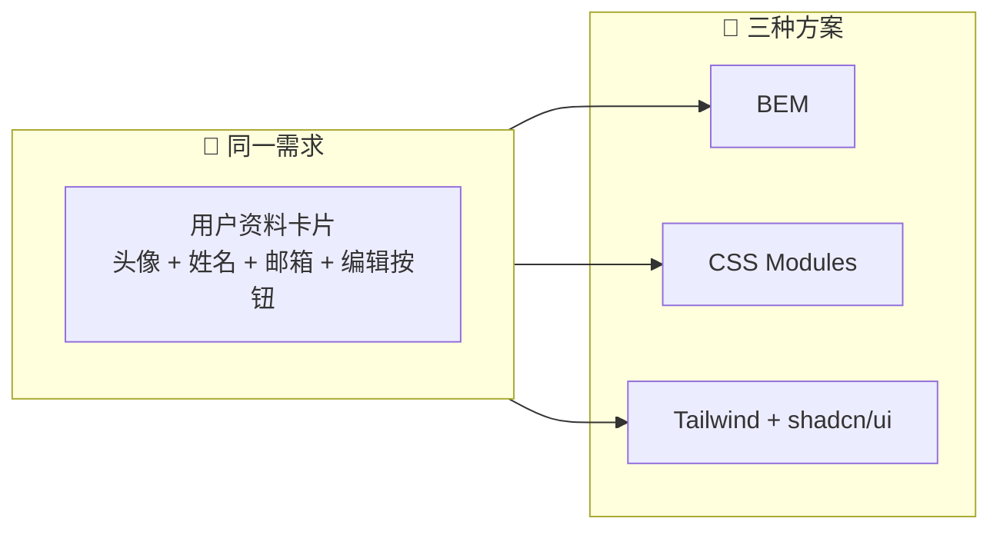

### 方案一：BEM

**生成的文件结构：**
```
UserCard/
├── UserCard.jsx    (JSX文件)
└── UserCard.css    (CSS文件)
```

**UserCard.jsx：**
```jsx
import './UserCard.css'

export function UserCard({ user, onEdit }) {
  return (
    <div className="user-card">
      
      <div className="user-card__info">
        <h3 className="user-card__name">{user.name}</h3>
        <p className="user-card__email">{user.email}</p>
      </div>
      <button className="user-card__edit-btn" onClick={onEdit}>编辑</button>
    </div>
  )
}
```

**UserCard.css：**
```css
.user-card {
  display: flex;
  align-items: center;
  gap: 16px;
  padding: 16px;
  background: white;
  border-radius: 8px;
  box-shadow: 0 1px 3px rgba(0,0,0,0.1);
}
.user-card__avatar { width: 48px; height: 48px; border-radius: 50%; }
.user-card__info { flex: 1; }
.user-card__name { font-weight: 600; font-size: 18px; }
.user-card__email { font-size: 14px; color: #666; }
.user-card__edit-btn {
  padding: 8px 16px;
  border: 1px solid #ddd;
  border-radius: 4px;
  background: transparent;
  cursor: pointer;
}
```

> 📊 **结果：2 个文件，40+ 行代码**

---

### 方案二：CSS Modules

**生成的文件结构：**
```
UserCard/
├── UserCard.jsx         (JSX文件)
└── UserCard.module.css  (CSS Module文件)
```

```jsx
import styles from './UserCard.module.css'

export function UserCard({ user, onEdit }) {
  return (
    <div className={styles.card}>
      
      <div className={styles.info}>
        <h3 className={styles.name}>{user.name}</h3>
        <p className={styles.email}>{user.email}</p>
      </div>
      <button className={styles.editBtn} onClick={onEdit}>编辑</button>
    </div>
  )
}
```

> 📊 **结果：2 个文件，40+ 行代码，类名可能对不上**

---

### 方案三：Tailwind + shadcn/ui

**生成的文件结构：**
```
UserCard/
└── UserCard.jsx  (单文件)
```

```jsx
import { Button } from '@/components/ui/button'
import { Avatar, AvatarImage } from '@/components/ui/avatar'

export function UserCard({ user, onEdit }) {
  return (
    <div className="flex items-center gap-4 p-4 bg-white rounded-lg shadow-sm">
      <Avatar>
        <AvatarImage src={user.avatar} alt={user.name} />
      </Avatar>
      <div className="flex-1">
        <h3 className="font-semibold text-lg">{user.name}</h3>
        <p className="text-sm text-gray-600">{user.email}</p>
      </div>
      <Button variant="outline" size="sm" onClick={onEdit}>
        编辑
      </Button>
    </div>
  )
}
```

> ✅ **结果：1 个文件，18 行代码，一次生成，不用改**

---

### 📊 三种方案对比总结

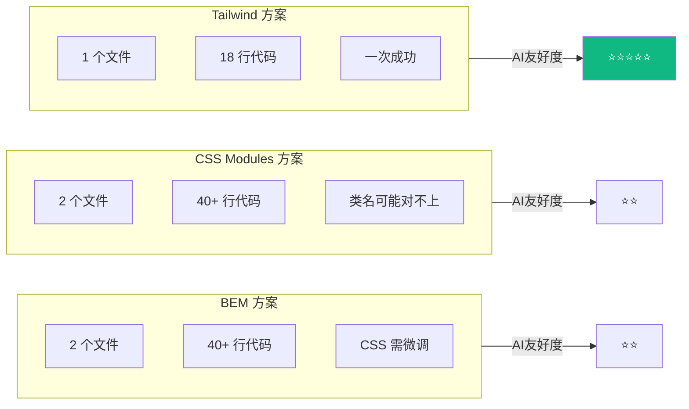

| 方案 | 文件数 | 代码行数 | AI 生成质量 | 需要修改 |
|------|--------|----------|------------|---------|
| BEM | 2 | 40+ | 中 | CSS 需微调 |
| CSS Modules | 2 | 40+ | 中 | 类名可能对不上 |
| **Tailwind + shadcn/ui** | **1** | **18** | **高** | **不需要** |

> 💡 **这就是为什么 Tailwind 是 AI 最佳拍档**

---

## 📖 Section 1：传统 CSS 方案的 AI 盲区

### 1.1 CSS 方案演进时间线

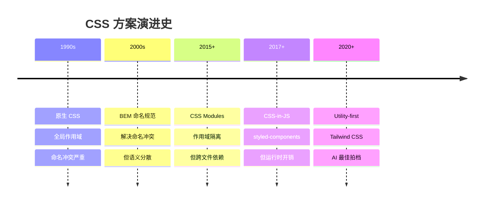

### 1.2 BEM 的问题

> 📌 **BEM (Block Element Modifier)** 是一个优秀的命名规范，但在 AI 时代有致命问题

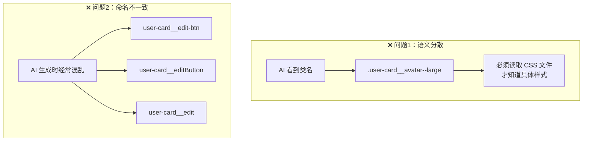

**问题详解：**

| 问题 | 表现 | 对 AI 的影响 |
|------|------|-------------|
| **语义分散** | 类名和样式在不同文件 | AI 需要跨文件推理 |
| **命名不一致** | 同一概念多种写法 | AI 生成代码不统一 |
| **上下文消耗** | 需要同时读 JSX 和 CSS | Token 消耗翻倍 |

---

### 1.3 CSS Modules 的问题

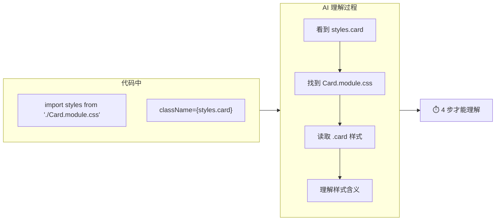

**问题详解：**

| 问题 | 原因 | 影响 |
|------|------|------|
| **作用域隔离** | `styles.card` 指向外部文件 | AI 看不到实际样式 |
| **上下文消耗** | 必须同时读取 CSS 文件 | Token 效率低 |
| **类名映射** | 编译后类名变化 | 调试困难 |

---

### 1.4 styled-components 的问题

```jsx
const Card = styled.div`
  display: flex;
  padding: 16px;
  background: ${props => props.theme.colors.white};
  border-radius: ${props => props.theme.radii.lg};
`
```

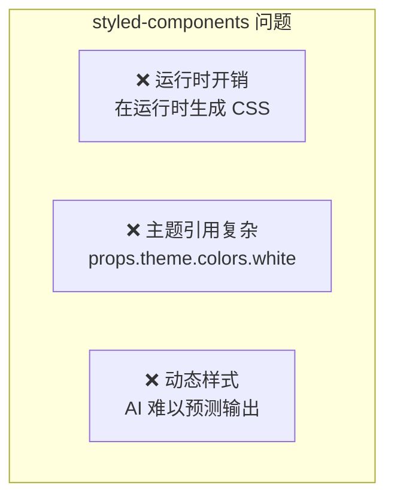

---

### 1.5 CSS 方案 AI 友好度对比

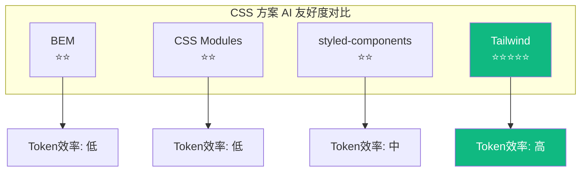

| CSS 方案 | AI 友好度 | Token 效率 | 跨文件依赖 | AI 生成准确率 |
|----------|----------|-----------|-----------|-------------|
| BEM | ⭐⭐ | 低 | 是 | ~50% |
| CSS Modules | ⭐⭐ | 低 | 是 | ~55% |
| styled-components | ⭐⭐ | 中 | 否 | ~60% |
| **Tailwind** | **⭐⭐⭐⭐⭐** | **高** | **否** | **~90%** |

---

## 📖 Section 2：Utility-first 的底层逻辑

### 2.1 什么是 Utility-first

> 📌 **核心思想**：用小的、单一用途的 CSS 类来构建界面

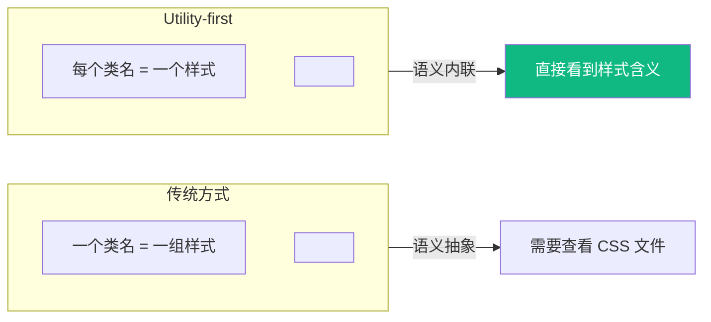

### 2.2 Utility-first vs 内联样式

> ⚠️ **常见误解**："Tailwind 不就是内联样式吗？"

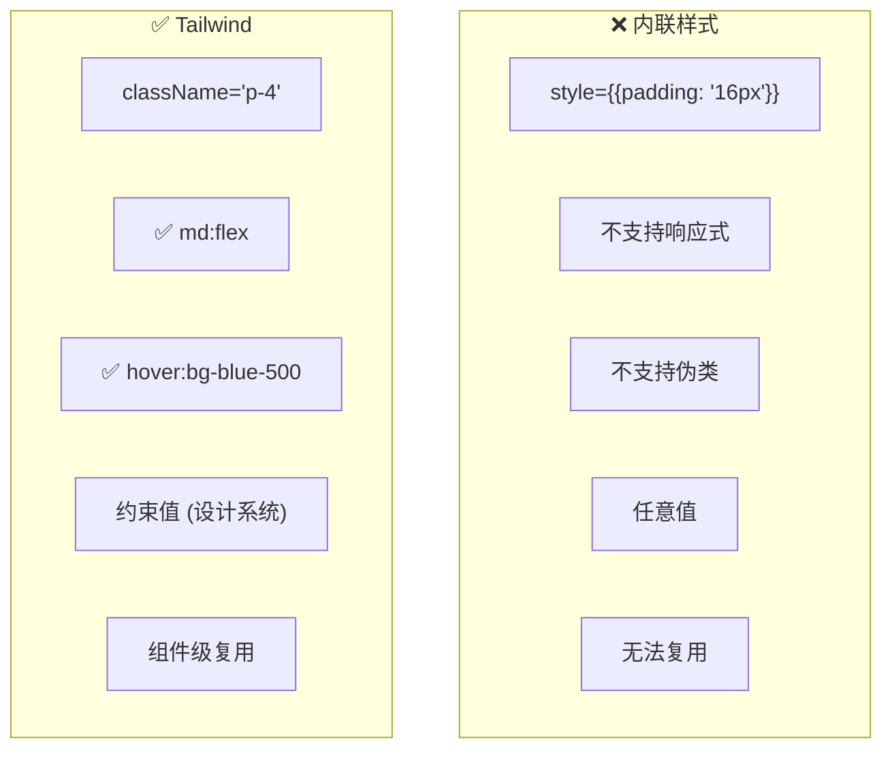

**详细对比：**

| 特性 | 内联样式 | Tailwind |
|------|---------|----------|
| **响应式** | ❌ 不支持 | ✅ `md:flex` |
| **伪类** | ❌ 不支持 | ✅ `hover:bg-blue-500` |
| **设计系统** | ❌ 任意值 | ✅ 约束值（`p-4` = 16px） |
| **复用** | ❌ 无法复用 | ✅ 组件级复用 |
| **性能** | ❌ 每个元素独立 | ✅ 原子化 CSS，极小 bundle |

---

### 2.3 为什么语义内联对 AI 友好

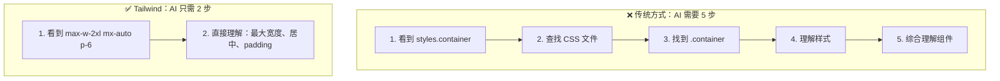

**代码对比：**

**传统方式（AI 需要读两个文件）：**
```jsx
// 文件 1: Card.jsx
<div className={styles.container}>
  <h2 className={styles.title}>标题</h2>
</div>
```
```css
/* 文件 2: Card.module.css */
.container { max-width: 640px; margin: 0 auto; padding: 24px; }
.title { font-size: 24px; font-weight: 700; color: #111; }
```

**Tailwind 方式（AI 只需读一个文件）：**
```jsx
<div className="max-w-2xl mx-auto p-6">
  <h2 className="text-2xl font-bold text-gray-900">标题</h2>
</div>
```

> 📊 **从 5 步减少到 2 步，效率提升 60%**

---

### 2.4 Token 效率对比

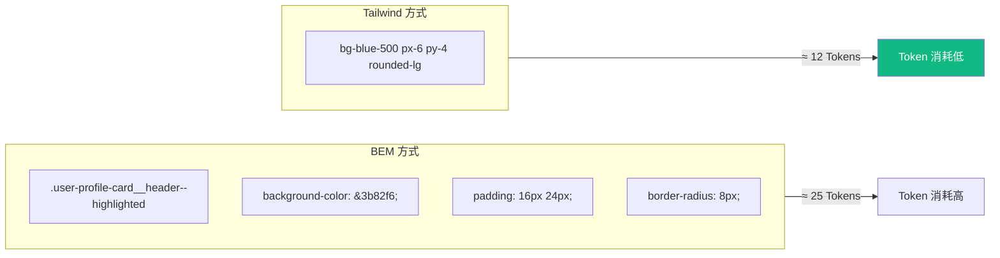

**具体计算：**

| 方式 | 代码 | Token 数 |
|------|------|----------|
| **BEM** | `.user-profile-card__header--highlighted { background-color: #3b82f6; padding: 16px 24px; border-radius: 8px; }` | ~25 |
| **Tailwind** | `className="bg-blue-500 px-6 py-4 rounded-lg"` | ~12 |

> 💡 **同样的样式，Tailwind 的 Token 数只有传统 CSS 的一半**

---

## 📖 Section 3：Tailwind v4 核心变化

> 🚀 **v4 是一次重大升级，从底层重写了引擎，改变了配置方式**

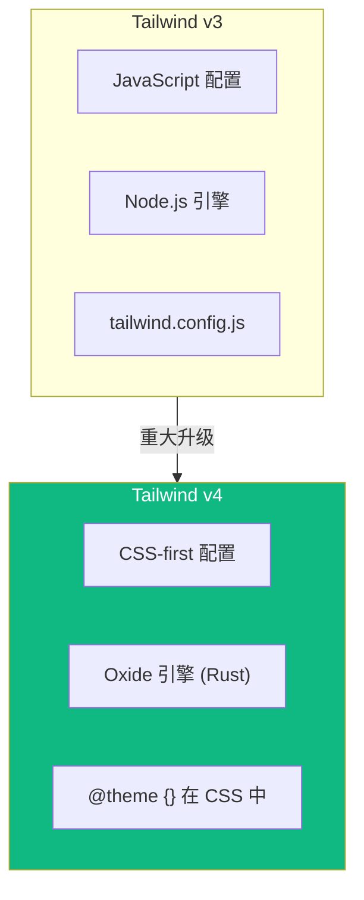

### 3.1 变化一：CSS-first 配置

> 📌 **最大的变化：配置从 JavaScript 迁移到 CSS**

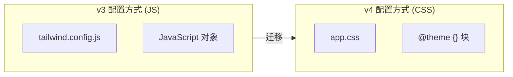

**v3 的配置方式（JavaScript）：**
```js
// tailwind.config.js
module.exports = {
  theme: {
    extend: {
      colors: {
        brand: '#3b82f6',
      },
      spacing: {
        '18': '4.5rem',
      },
    },
  },
  plugins: [require('@tailwindcss/forms')],
}
```

**v4 的配置方式（CSS）：**
```css
/* app.css */
@import "tailwindcss";

@theme {
  --color-brand: #3b82f6;
  --spacing-18: 4.5rem;
}

@plugin "@tailwindcss/forms";
```

**为什么对 AI 更友好？**

| 优势 | 说明 |
|------|------|
| ✅ 配置和样式同文件 | AI 不需要在 JS 和 CSS 之间切换 |
| ✅ 原生 CSS 语法 | AI 对 CSS 的理解比 JS 配置对象更好 |
| ✅ 更少的 Token | CSS 语法比 JS 对象更简洁 |

---

### 3.2 变化二：Oxide 引擎

> 📌 **用 Rust 重写核心引擎，性能提升 10 倍**

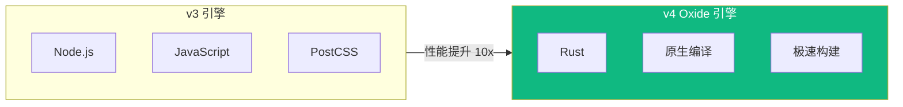

**性能对比数据：**

| 指标 | v3 | v4 (Oxide) | 提升倍数 |
|------|-----|-----------|---------|
| **全量构建** | 300ms | 30ms | **10x** |
| **增量构建** | 50ms | 5ms | **10x** |
| **内存占用** | 150MB | 30MB | **5x** |

**实际影响：**
- ✅ 开发时热更新更快
- ✅ CI/CD 构建更快
- ✅ 大型项目也不会卡

---

### 3.3 变化三：新特性

#### 新增颜色系统

```html
<!-- v4.2 新增的颜色 -->
<div className="bg-rose-500">Rose</div>
<div className="bg-fuchsia-500">Fuchsia</div>
```

#### 改进的容器查询

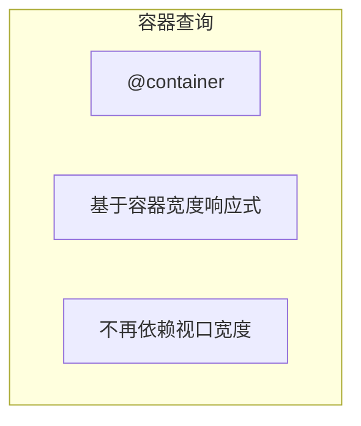

```html
<!-- 基于容器宽度的响应式 -->
<div className="@container">
  <div className="@lg:flex @lg:gap-4">
    <!-- 当容器宽度 >= lg 时，变成 flex 布局 -->
  </div>
</div>
```

#### 原生 CSS 变量支持

```html
<!-- 直接使用 CSS 变量 -->
<div className="bg-[var(--brand-color)]">
  自定义颜色
</div>
```

---

### 3.4 v3 → v4 迁移对照表

| v3 写法 | v4 写法 | 说明 |
|---------|---------|------|
| `tailwind.config.js` | `@theme {}` in CSS | 配置迁移到 CSS |
| `require('plugin')` | `@plugin "plugin"` | 插件声明方式 |
| `@apply` | 仍然支持 | 但推荐直接用 utility |
| `theme()` 函数 | CSS 变量 | 更原生 |
| `content: ['./src/**/*.{js,jsx}']` | 自动检测 | 无需手动配置 |

---

## 📖 Section 4：实战迁移策略

### 4.1 项目评估

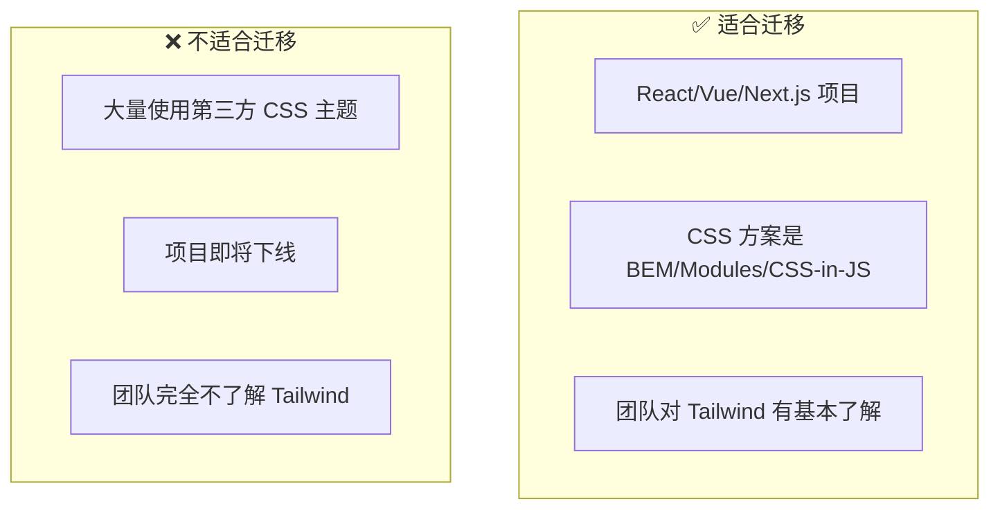

### 4.2 渐进式迁移五步法

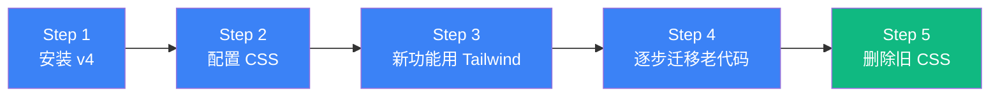

#### Step 1：安装 Tailwind v4

```bash
pnpm add tailwindcss@latest postcss autoprefixer
```

#### Step 2：配置 CSS

```css
/* app.css */
@import "tailwindcss";

@theme {
  --color-primary: #3b82f6;
  --color-secondary: #64748b;
}
```

#### Step 3：新功能用 Tailwind

```jsx
// ✅ 新组件：用 Tailwind
export function NewFeature() {
  return (
    <div className="flex items-center gap-4 p-4 bg-white rounded-lg">
      新功能
    </div>
  )
}

// ⏳ 老组件：暂时保持不变
export function OldFeature() {
  return (
    <div className={styles.container}>
      老功能
    </div>
  )
}
```

#### Step 4：逐步迁移老代码

> 每次修改老组件时，顺便迁移到 Tailwind

#### Step 5：删除旧 CSS 文件

> 当所有组件都迁移完成后，删除旧的 CSS 文件

---

### 4.3 迁移检查清单

- [ ] 安装 Tailwind v4 及相关依赖
- [ ] 创建 CSS 配置文件（`@theme {}` 块）
- [ ] 配置 PostCSS
- [ ] 在新组件中使用 Tailwind
- [ ] 逐步迁移现有组件
- [ ] 测试响应式和暗色模式
- [ ] 删除旧的 CSS 文件
- [ ] 更新代码规范文档

---

### 4.4 常见问题 FAQ

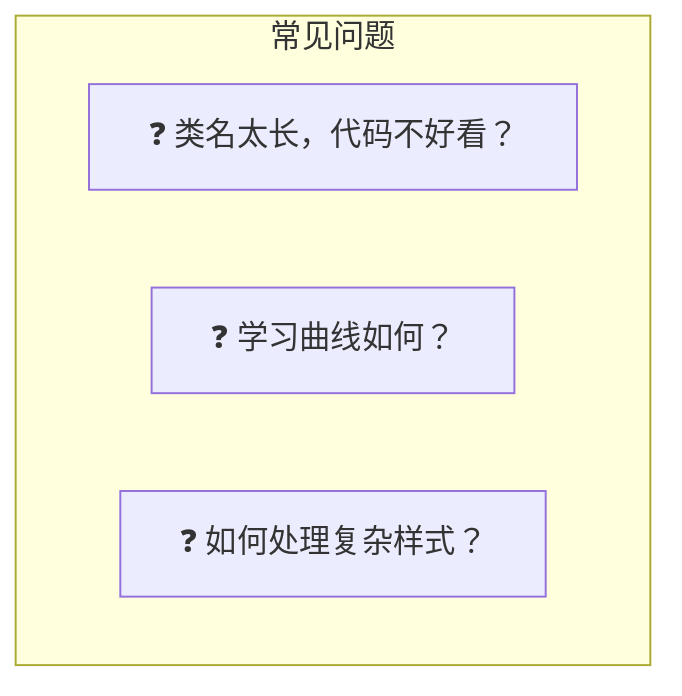

#### Q1：Tailwind 的类名太长了，代码不好看？

**回答**：要想清楚代码是给谁看的

| 受众 | 评价 |
|------|------|
| 给人看 | 确实不如 BEM 简洁 |
| 给 AI 看 | Tailwind 更好 |

**折中方案**：用 `cn()` 函数分行写

```jsx
<div className={cn(
  "flex items-center gap-4",      // 布局
  "p-4 bg-white rounded-lg",      // 容器
  "shadow-sm hover:shadow-md",    // 阴影
  "transition-shadow duration-200" // 动画
)}>
```

#### Q2：Tailwind 的学习曲线？

**回答**：对于 3-5 年的前端，1-2 天就能上手
- 核心类名就那么几十个
- 用多了自然就记住了
- 有 AI 辅助，甚至不需要记住所有类名

#### Q3：如何处理复杂样式？

**回答**：使用 `@apply` 或组件抽象

```css
/* 复杂样式可以用 @apply */
.btn-primary {
  @apply px-4 py-2 bg-blue-500 text-white rounded-lg hover:bg-blue-600;
}
```

---

## 📖 Section 5：AI 辅助开发实战

### 5.1 Prompt 技巧

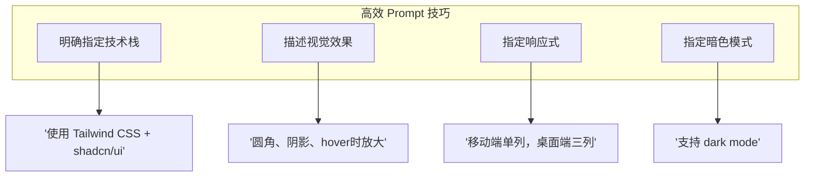

### 5.2 实战场景演示

#### 场景一：从描述生成组件

**Prompt：**
```
创建一个定价卡片组件，包含：
- 套餐名称
- 价格（月/年切换）
- 功能列表（带勾选图标）
- CTA 按钮
使用 Tailwind CSS 和 shadcn/ui
```

> ✅ AI 一次生成，代码质量很高

#### 场景二：修改现有组件

**Prompt：**
```
把这个卡片改成暗色主题，添加 hover 动画效果
```

> ✅ AI 直接修改 Tailwind 类名，不需要改 CSS 文件

### 5.3 常见错误及解决方案

| 错误 | 原因 | 解决方案 |
|------|------|---------|
| AI 生成了自定义 CSS | Prompt 不够明确 | 强调"只用 Tailwind utility classes" |
| AI 用了旧版语法 | 模型训练数据 | 指定"使用 Tailwind v4" |
| 类名组合不合理 | 缺乏最佳实践 | 用 `cn()` 函数优化 |

---

## 📖 Closing：本课核心要点

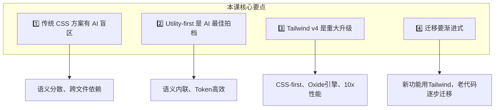

### ✅ 行动建议清单

- [ ] 在下一个新组件中，试试 Tailwind
- [ ] 安装 Tailwind v4，体验 CSS-first 配置
- [ ] 用 AI 工具生成 Tailwind 代码，感受效率差异
- [ ] 评估现有项目的迁移可行性

---

## 📋 知识点速查表

| 概念 | 定义 | 关键点 |
|------|------|--------|
| **Utility-first** | 用单一用途的类构建界面 | 语义内联、Token高效 |
| **CSS-first 配置** | 在 CSS 中配置 Tailwind | `@theme {}` 块 |
| **Oxide 引擎** | Rust 重写的核心引擎 | 10x 性能提升 |
| **@apply** | 在 CSS 中使用 Tailwind 类 | 复杂样式抽象 |
| **cn() 函数** | 合并类名的工具函数 | 分行组织长类名 |
| **容器查询** | 基于容器宽度响应式 | `@container` |

---

## 📚 下节课预告

> **第 2 课：shadcn/ui - 组件库的新范式**

- 为什么 Copy-paste 比 npm 更 AI 友好
- CLI 工作流和 Registry 系统
- shadcn/ui 生态（magic-ui、TweakCN 等）

---

**课程时间分配：**
| 部分 | 时长 |
|------|------|
| Opening: 现场实验对比 | 10 min |
| Section 1: 传统 CSS 方案的 AI 盲区 | 20 min |
| Section 2: Utility-first 的底层逻辑 | 25 min |
| Section 3: Tailwind v4 核心变化 | 30 min |
| Section 4: 实战迁移策略 | 30 min |
| Section 5: AI 辅助开发实战 | 20 min |
| Closing + Q&A | 15 min |
| **总计** | **2.5 小时** |
