# 组件库范式转移：shadcn/ui 的 Copy-Paste 哲学

> **课程时长**: 2.5 小时 | **难度**: 中级 | **风格**: 故事开场 + 技术深度 + 实践建议

---

## 📋 本课概览

```
┌─────────────────────────────────────────────────────────────────┐
│  🎯 核心观点：Copy-Paste 哲学是 AI 时代组件库的新范式           │
├─────────────────────────────────────────────────────────────────┤
│  📚 你将学到：                                                   │
│    • 理解传统组件库在 AI 时代的困境（黑盒依赖、过度封装）        │
│    • 掌握 shadcn/ui 的 Copy-Paste 哲学和 CLI 工作流             │
│    • 深入理解 Registry 系统和组件架构                            │
│    • 了解 shadcn/ui 生态工具（magic-ui、TweakCN、v0.dev）       │
│    • 学会横向对比各类组件库，做出正确的技术选型                  │
│    • 实战：初始化项目、添加组件、用 AI 定制组件                  │
│    • 掌握创建自定义 Registry 的方法                              │
└─────────────────────────────────────────────────────────────────┘
```

### 课程结构导航

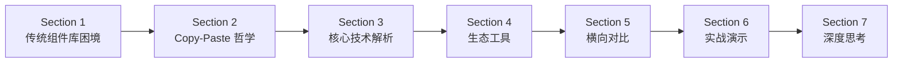

---

## 🎬 Opening：现场对比演示

### 场景设定

> **需求**：把一个 Dialog 组件的关闭按钮从右上角移到左上角，同时加一个渐变背景的遮罩层

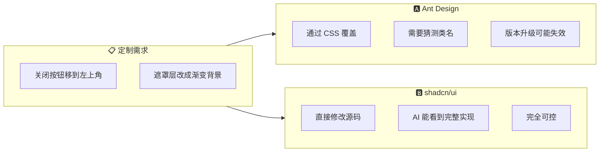

### 方案一：Ant Design（传统组件库）

```jsx
import { Modal } from 'antd';

// AI 的尝试：通过 CSS 覆盖
<Modal open={isOpen} onCancel={handleClose} title="设置" className="custom-modal">
  <p>内容区域</p>
</Modal>
```

```css
/* AI 不得不写一堆覆盖样式 */
.custom-modal .ant-modal-close {
  left: 12px;
  right: auto;
}
.custom-modal .ant-modal-mask {
  background: linear-gradient(135deg, rgba(0,0,0,0.6), rgba(0,0,0,0.3));
}
```

> ⚠️ **问题**：AI 怎么知道 `.ant-modal-close` 这个类名？靠文档或训练数据记忆，版本升级后可能失效。

### 方案二：shadcn/ui（Copy-Paste 哲学）

```jsx
// 直接修改 components/ui/dialog.tsx
const DialogOverlay = React.forwardRef(({ className, ...props }, ref) => (
  <DialogPrimitive.Overlay
    ref={ref}
    className={cn(
      "fixed inset-0 z-50 bg-gradient-to-br from-black/60 to-black/30",  // ✅ 直接改
      "data-[state=open]:animate-in data-[state=closed]:animate-out",
      className
    )}
    {...props}
  />
))

const DialogClose = React.forwardRef(({ className, ...props }, ref) => (
  <DialogPrimitive.Close
    ref={ref}
    className={cn(
      "absolute left-4 top-4 rounded-sm opacity-70",  // ✅ 直接改位置
      className
    )}
    {...props}
  >
    <X className="h-4 w-4" />
  </DialogPrimitive.Close>
))
```

> ✅ **优势**：AI 直接改源码，因为组件**就在你的项目里**，在 `components/ui/` 目录下。

---

### 📊 两种方案对比

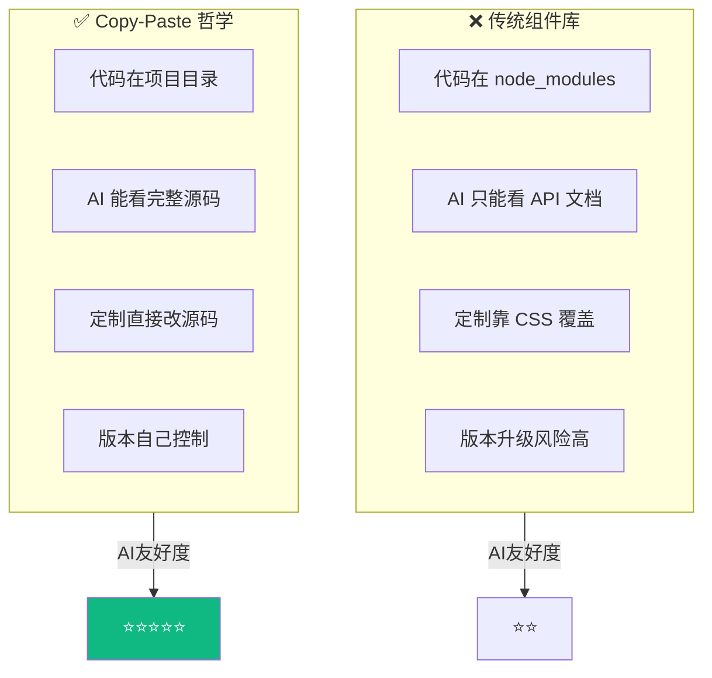

---

## 📖 Section 1：传统组件库的 AI 困境

### 1.1 npm 黑盒依赖架构

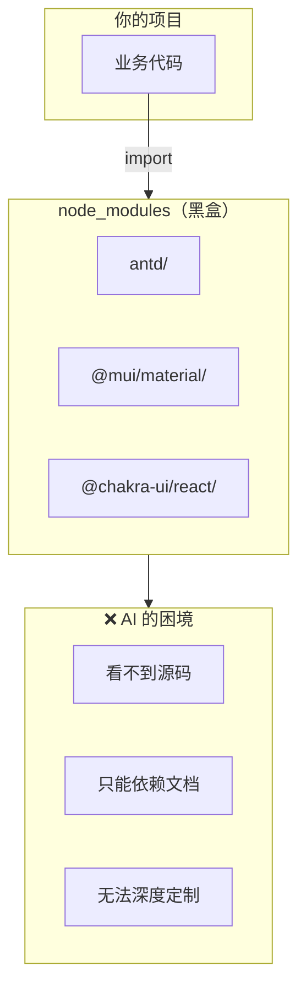

**为什么 AI 看不到源码？**

| 问题 | 原因 | 影响 |
|------|------|------|
| **Token 限制** | node_modules 太大，AI 无法全部读取 | 无法理解组件实现 |
| **编译后的代码** | 只有编译后的 JS，不是源码 | 代码可读性差 |
| **类型分离** | TypeScript 类型定义和实现分离 | 无法完整理解 API |

### 1.2 过度封装问题

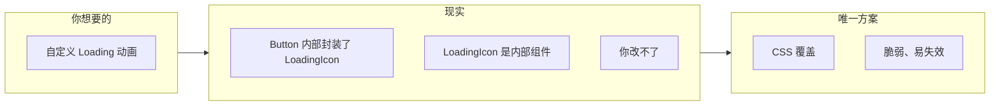

**示例：Ant Design Button 的内部实现（简化版）**

```jsx
// node_modules/antd/es/button/button.js
function Button({ loading, children, ...props }) {
  return (
    <button {...props}>
      {loading && <LoadingIcon />}  {/* 内部组件，你改不了 */}
      {children}
    </button>
  )
}
```

### 1.3 版本锁定困境

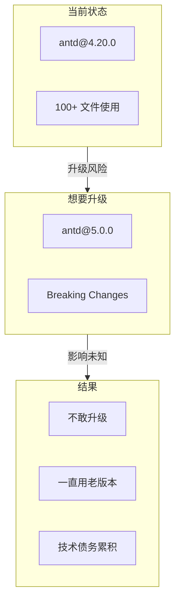

### 1.4 传统组件库问题总结表

| 维度 | 传统组件库（Ant Design / MUI） | AI 的困境 |
|------|-------------------------------|-----------|
| **代码位置** | node_modules（黑盒） | AI 看不到源码，只能靠文档 |
| **定制能力** | 通过 props + CSS 覆盖 | AI 只能写脆弱的 CSS hack |
| **版本升级** | Breaking Changes 多 | AI 难以评估影响范围 |
| **Bundle 大小** | 全量引入 | 无法按需精简 |
| **样式冲突** | 全局 CSS | AI 难以调试样式优先级 |
| **学习成本** | 需要学习组件库 API | AI 需要大量文档上下文 |

---

## 📖 Section 2：shadcn/ui 的 Copy-Paste 哲学

### 2.1 核心理念：不是 npm 包，是代码片段

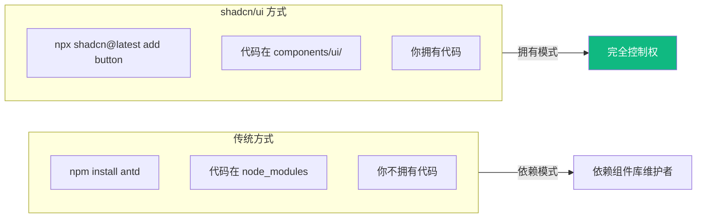

**执行 `npx shadcn@latest add button` 后的项目结构：**

```
components/
  ui/
    button.tsx  ← 完整的源码，在你的项目里，你可以随意修改
```

### 2.2 Button 组件源码解析

```tsx
import * as React from "react"
import { Slot } from "@radix-ui/react-slot"
import { cva, type VariantProps } from "class-variance-authority"
import { cn } from "@/lib/utils"

// 使用 CVA 定义样式变体
const buttonVariants = cva(
  // 基础样式
  "inline-flex items-center justify-center gap-2 whitespace-nowrap rounded-md text-sm font-medium transition-colors focus-visible:outline-none focus-visible:ring-1 focus-visible:ring-ring disabled:pointer-events-none disabled:opacity-50",
  {
    variants: {
      variant: {
        default: "bg-primary text-primary-foreground shadow hover:bg-primary/90",
        destructive: "bg-destructive text-destructive-foreground shadow-sm hover:bg-destructive/90",
        outline: "border border-input bg-background shadow-sm hover:bg-accent",
        secondary: "bg-secondary text-secondary-foreground shadow-sm hover:bg-secondary/80",
        ghost: "hover:bg-accent hover:text-accent-foreground",
        link: "text-primary underline-offset-4 hover:underline",
      },
      size: {
        default: "h-9 px-4 py-2",
        sm: "h-8 rounded-md px-3 text-xs",
        lg: "h-10 rounded-md px-8",
        icon: "h-9 w-9",
      },
    },
    defaultVariants: { variant: "default", size: "default" },
  }
)

const Button = React.forwardRef<HTMLButtonElement, ButtonProps>(
  ({ className, variant, size, asChild = false, ...props }, ref) => {
    const Comp = asChild ? Slot : "button"
    return (
      <Comp
        className={cn(buttonVariants({ variant, size, className }))}
        ref={ref}
        {...props}
      />
    )
  }
)

export { Button, buttonVariants }
```

**代码结构解析：**

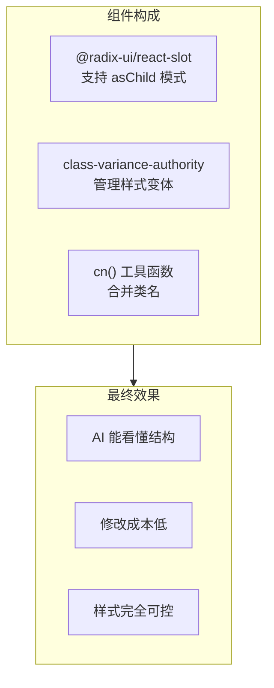

### 2.3 CLI 工作流

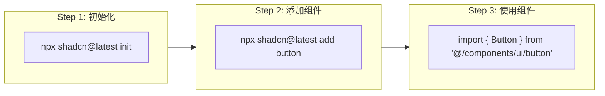

#### 初始化配置

```bash
npx shadcn@latest init
```

**交互式配置：**
```
✔ Which style would you like to use? › New York
✔ Which color would you like to use as base color? › Zinc
✔ Do you want to use CSS variables for colors? › yes
✔ Where is your global CSS file? › app/globals.css
✔ Configure the import alias for components: › @/components
```

**生成的文件结构：**
```
components/
  ui/              ← 组件目录（空的）
lib/
  utils.ts         ← cn 工具函数
components.json    ← 配置文件
```

**components.json 配置文件：**
```json
{
  "$schema": "https://ui.shadcn.com/schema.json",
  "style": "new-york",
  "rsc": true,
  "tsx": true,
  "tailwind": {
    "config": "tailwind.config.js",
    "css": "app/globals.css",
    "baseColor": "zinc",
    "cssVariables": true
  },
  "aliases": {
    "components": "@/components",
    "utils": "@/lib/utils"
  }
}
```

### 2.4 Registry 系统

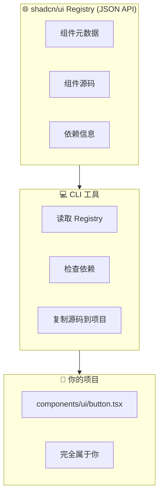

**Registry 数据示例：**
```json
{
  "name": "button",
  "type": "components:ui",
  "files": [
    {
      "name": "button.tsx",
      "content": "import * as React from \"react\"..."
    }
  ],
  "dependencies": ["@radix-ui/react-slot", "class-variance-authority"],
  "registryDependencies": []
}
```

### 2.5 为什么 AI 能读、能改、能理解

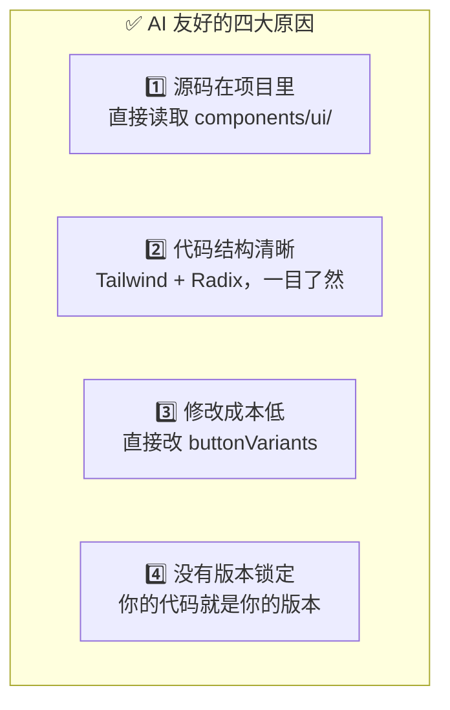

| 原因 | 说明 | AI 的优势 |
|------|------|----------|
| **源码在项目里** | 不在 node_modules | AI 可以直接读取 |
| **代码结构清晰** | Tailwind + Radix + CVA | AI 一眼看懂 |
| **修改成本低** | 直接改 buttonVariants | AI 精确定位修改点 |
| **没有版本锁定** | 代码在 Git 仓库 | AI 可帮助版本对比合并 |

---

## 📖 Section 3：核心技术深度解析

### 3.1 CVA (Class Variance Authority) 详解

> 📌 **CVA 是什么**：一个用于管理 Tailwind CSS 类名变体的工具库

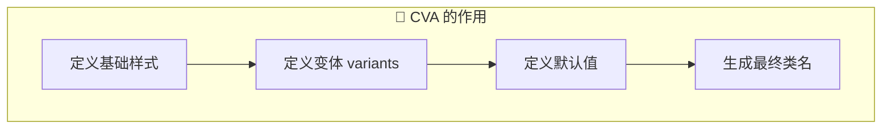

**完整示例解析：**

```tsx
import { cva, type VariantProps } from "class-variance-authority"

// 1️⃣ 创建变体配置
const buttonVariants = cva(
  // 🟢 基础样式：所有变体都会应用这些样式
  [
    "inline-flex items-center justify-center",     // 布局
    "gap-2 whitespace-nowrap",                     // 间距
    "rounded-md text-sm font-medium",              // 外观
    "transition-colors",                            // 过渡
    "focus-visible:outline-none focus-visible:ring-1", // 焦点
    "disabled:pointer-events-none disabled:opacity-50", // 禁用
  ],
  {
    // 🟡 变体定义
    variants: {
      // 样式变体
      variant: {
        default: "bg-primary text-primary-foreground shadow hover:bg-primary/90",
        destructive: "bg-destructive text-destructive-foreground shadow-sm hover:bg-destructive/90",
        outline: "border border-input bg-background shadow-sm hover:bg-accent hover:text-accent-foreground",
        secondary: "bg-secondary text-secondary-foreground shadow-sm hover:bg-secondary/80",
        ghost: "hover:bg-accent hover:text-accent-foreground",
        link: "text-primary underline-offset-4 hover:underline",
      },
      // 尺寸变体
      size: {
        default: "h-9 px-4 py-2",
        sm: "h-8 rounded-md px-3 text-xs",
        lg: "h-10 rounded-md px-8",
        icon: "h-9 w-9",
      },
    },
    // 🟣 默认值
    defaultVariants: {
      variant: "default",
      size: "default",
    },
  }
)

// 2️⃣ 类型推导
type ButtonVariants = VariantProps<typeof buttonVariants>
// 结果：{ variant?: "default" | "destructive" | ... ; size?: "default" | "sm" | ... }

// 3️⃣ 使用
buttonVariants({ variant: "destructive", size: "lg" })
// 输出："inline-flex items-center ... bg-destructive ... h-10 rounded-md px-8"
```

**CVA 的优势：**

| 优势 | 说明 |
|------|------|
| **类型安全** | 自动推导 variant 和 size 的类型 |
| **可组合** | 多个变体可以自由组合 |
| **可扩展** | 轻松添加新的变体 |
| **AI 友好** | 结构清晰，AI 容易理解和修改 |

### 3.2 cn() 工具函数详解

> 📌 **cn() 是什么**：一个用于合并 Tailwind 类名的工具函数

**实现源码：**

```tsx
// lib/utils.ts
import { clsx, type ClassValue } from "clsx"
import { twMerge } from "tailwind-merge"

export function cn(...inputs: ClassValue[]) {
  return twMerge(clsx(inputs))
}
```

**两个库的作用：**

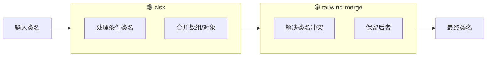

**具体示例：**

```tsx
// ✅ 处理条件类名
cn("px-4", isActive && "bg-blue-500", disabled && "opacity-50")
// 结果："px-4 bg-blue-500"(假设 isActive=true, disabled=false)

// ✅ 解决冲突：后者覆盖前者
cn("px-4 py-2", "px-6")
// 结果："py-2 px-6"(不是 "px-4 py-2 px-6")

// ✅ 处理对象形式
cn({
  "bg-red-500": hasError,
  "bg-green-500": isSuccess,
})

// ✅ 处理数组
cn(["flex", "items-center"], className)
```

**为什么需要 cn()？**

| 问题 | 没有 cn() | 有 cn() |
|------|-------------|----------|
| **类名冲突** | `"px-4 px-6"` 两个都生效 | `"px-6"` 后者生效 |
| **条件类名** | 需要手动处理 false 值 | 自动过滤 |
| **组件覆盖** | 无法优雅覆盖样式 | `className` 可覆盖默认样式 |

### 3.3 asChild 和 Slot 模式详解

> 📌 **asChild 是什么**：允许组件将其属性和行为传递给子元素，而不是渲染额外的 DOM 节点

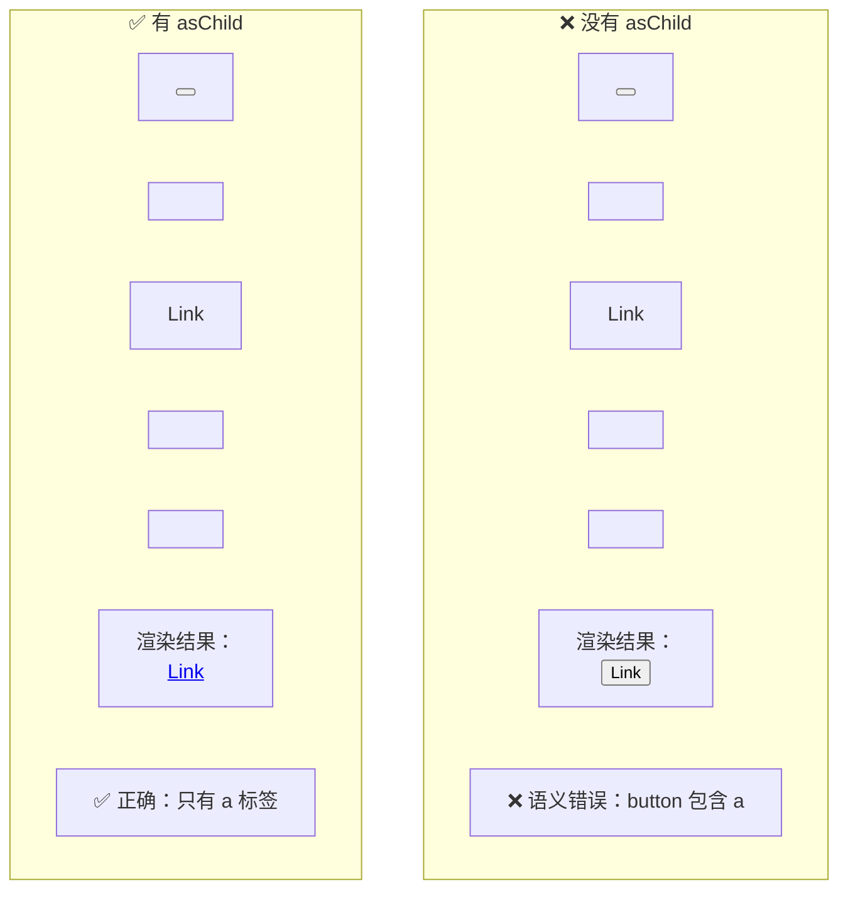

**Slot 的实现原理：**

```tsx
import { Slot } from "@radix-ui/react-slot"

// Button 组件内部
const Button = React.forwardRef<HTMLButtonElement, ButtonProps>(
  ({ asChild = false, ...props }, ref) => {
    // 根据 asChild 决定渲染什么
    const Comp = asChild ? Slot : "button"
    return <Comp ref={ref} {...props} />
  }
)

// Slot 的简化实现
function Slot({ children, ...props }) {
  if (React.isValidElement(children)) {
    return React.cloneElement(children, {
      ...props,           // 父组件的 props（如 className、onClick）
      ...children.props,  // 子组件的 props
    })
  }
  return null
}
```

**实际应用场景：**

```tsx
// 场景 1：Button 作为链接
import Link from "next/link"

<Button asChild>
  <Link href="/dashboard">进入控制台</Link>
</Button>

// 场景 2：Dialog.Trigger 自定义触发器
<Dialog.Trigger asChild>
  <Button variant="destructive">删除</Button>
</Dialog.Trigger>

// 场景 3：DropdownMenu.Item 作为链接
<DropdownMenu.Item asChild>
  <a href="/settings">设置</a>
</DropdownMenu.Item>
```

### 3.4 Dialog 组件完整源码解析

> 让我们深入看一个复杂组件的完整实现

```tsx
// components/ui/dialog.tsx
import * as React from "react"
import * as DialogPrimitive from "@radix-ui/react-dialog"
import { X } from "lucide-react"
import { cn } from "@/lib/utils"

// 🟢 直接导出 Radix 原语
const Dialog = DialogPrimitive.Root
const DialogTrigger = DialogPrimitive.Trigger
const DialogPortal = DialogPrimitive.Portal
const DialogClose = DialogPrimitive.Close

// 🟡 包装遮罩层，添加样式和动画
const DialogOverlay = React.forwardRef<
  React.ElementRef<typeof DialogPrimitive.Overlay>,
  React.ComponentPropsWithoutRef<typeof DialogPrimitive.Overlay>
>(({ className, ...props }, ref) => (
  <DialogPrimitive.Overlay
    ref={ref}
    className={cn(
      // 基础样式
      "fixed inset-0 z-50 bg-black/80",
      // 打开动画
      "data-[state=open]:animate-in data-[state=open]:fade-in-0",
      // 关闭动画
      "data-[state=closed]:animate-out data-[state=closed]:fade-out-0",
      className
    )}
    {...props}
  />
))
DialogOverlay.displayName = DialogPrimitive.Overlay.displayName

// 🟣 包装内容区域，包含 Overlay 和关闭按钮
const DialogContent = React.forwardRef<
  React.ElementRef<typeof DialogPrimitive.Content>,
  React.ComponentPropsWithoutRef<typeof DialogPrimitive.Content>
>(({ className, children, ...props }, ref) => (
  <DialogPortal>
    {/* 自动渲染遮罩层 */}
    <DialogOverlay />
    <DialogPrimitive.Content
      ref={ref}
      className={cn(
        // 定位和尺寸
        "fixed left-[50%] top-[50%] z-50 grid w-full max-w-lg",
        "translate-x-[-50%] translate-y-[-50%]",
        // 外观
        "gap-4 border bg-background p-6 shadow-lg sm:rounded-lg",
        // 动画
        "duration-200",
        "data-[state=open]:animate-in data-[state=closed]:animate-out",
        "data-[state=closed]:fade-out-0 data-[state=open]:fade-in-0",
        "data-[state=closed]:zoom-out-95 data-[state=open]:zoom-in-95",
        "data-[state=closed]:slide-out-to-left-1/2 data-[state=closed]:slide-out-to-top-[48%]",
        "data-[state=open]:slide-in-from-left-1/2 data-[state=open]:slide-in-from-top-[48%]",
        className
      )}
      {...props}
    >
      {children}
      {/* 内置关闭按钮 */}
      <DialogPrimitive.Close className="absolute right-4 top-4 rounded-sm opacity-70 ring-offset-background transition-opacity hover:opacity-100 focus:outline-none focus:ring-2 focus:ring-ring focus:ring-offset-2 disabled:pointer-events-none data-[state=open]:bg-accent data-[state=open]:text-muted-foreground">
        <X className="h-4 w-4" />
        <span className="sr-only">Close</span>
      </DialogPrimitive.Close>
    </DialogPrimitive.Content>
  </DialogPortal>
))
DialogContent.displayName = DialogPrimitive.Content.displayName

// 🟠 便利组件：Header 和 Footer
const DialogHeader = ({
  className,
  ...props
}: React.HTMLAttributes<HTMLDivElement>) => (
  <div
    className={cn(
      "flex flex-col space-y-1.5 text-center sm:text-left",
      className
    )}
    {...props}
  />
)
DialogHeader.displayName = "DialogHeader"

const DialogFooter = ({
  className,
  ...props
}: React.HTMLAttributes<HTMLDivElement>) => (
  <div
    className={cn(
      "flex flex-col-reverse sm:flex-row sm:justify-end sm:space-x-2",
      className
    )}
    {...props}
  />
)
DialogFooter.displayName = "DialogFooter"

// 🟤 包装 Title 和 Description
const DialogTitle = React.forwardRef<
  React.ElementRef<typeof DialogPrimitive.Title>,
  React.ComponentPropsWithoutRef<typeof DialogPrimitive.Title>
>(({ className, ...props }, ref) => (
  <DialogPrimitive.Title
    ref={ref}
    className={cn(
      "text-lg font-semibold leading-none tracking-tight",
      className
    )}
    {...props}
  />
))
DialogTitle.displayName = DialogPrimitive.Title.displayName

const DialogDescription = React.forwardRef<
  React.ElementRef<typeof DialogPrimitive.Description>,
  React.ComponentPropsWithoutRef<typeof DialogPrimitive.Description>
>(({ className, ...props }, ref) => (
  <DialogPrimitive.Description
    ref={ref}
    className={cn("text-sm text-muted-foreground", className)}
    {...props}
  />
))
DialogDescription.displayName = DialogPrimitive.Description.displayName

export {
  Dialog,
  DialogPortal,
  DialogOverlay,
  DialogClose,
  DialogTrigger,
  DialogContent,
  DialogHeader,
  DialogFooter,
  DialogTitle,
  DialogDescription,
}
```

**组件结构解析：**

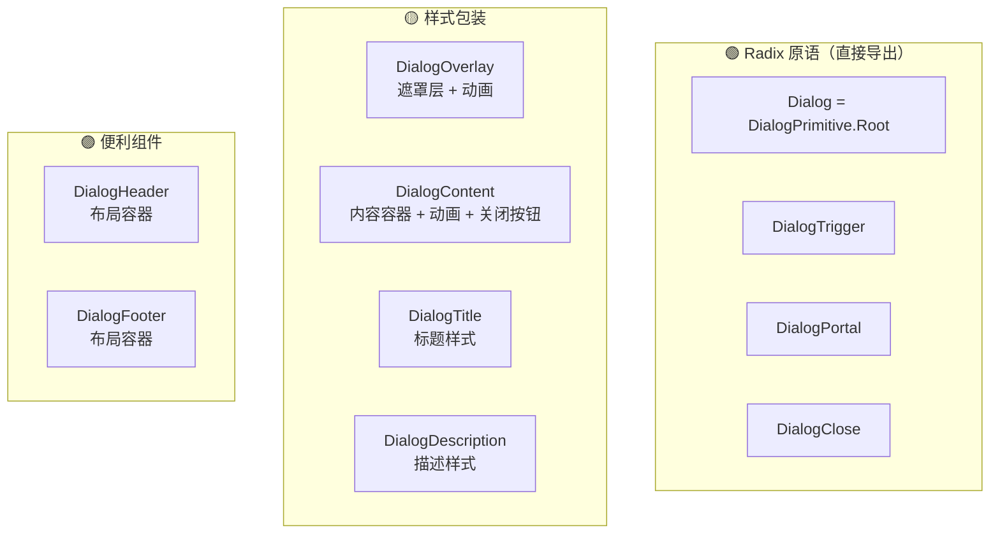

### 3.5 主题系统：CSS 变量配置

> shadcn/ui 使用 CSS 变量实现主题系统，支持亮色/暗色模式

**globals.css 配置示例：**

```css
@tailwind base;
@tailwind components;
@tailwind utilities;

@layer base {
  :root {
    /* 🌞 亮色模式 */
    --background: 0 0% 100%;           /* 白色背景 */
    --foreground: 222.2 84% 4.9%;      /* 深色文字 */
    
    --card: 0 0% 100%;
    --card-foreground: 222.2 84% 4.9%;
    
    --popover: 0 0% 100%;
    --popover-foreground: 222.2 84% 4.9%;
    
    --primary: 222.2 47.4% 11.2%;      /* 主色 */
    --primary-foreground: 210 40% 98%;
    
    --secondary: 210 40% 96.1%;
    --secondary-foreground: 222.2 47.4% 11.2%;
    
    --muted: 210 40% 96.1%;
    --muted-foreground: 215.4 16.3% 46.9%;
    
    --accent: 210 40% 96.1%;
    --accent-foreground: 222.2 47.4% 11.2%;
    
    --destructive: 0 84.2% 60.2%;      /* 危险色 */
    --destructive-foreground: 210 40% 98%;
    
    --border: 214.3 31.8% 91.4%;
    --input: 214.3 31.8% 91.4%;
    --ring: 222.2 84% 4.9%;
    
    --radius: 0.5rem;                   /* 圆角 */
  }

  .dark {
    /* 🌙 暗色模式 */
    --background: 222.2 84% 4.9%;       /* 深色背景 */
    --foreground: 210 40% 98%;          /* 浅色文字 */
    
    --card: 222.2 84% 4.9%;
    --card-foreground: 210 40% 98%;
    
    --primary: 210 40% 98%;
    --primary-foreground: 222.2 47.4% 11.2%;
    
    /* ... 其他变量 ... */
  }
}
```

**在组件中使用：**

```tsx
// 使用 CSS 变量
className="bg-primary text-primary-foreground"
// 等价于
className="bg-[hsl(var(--primary))] text-[hsl(var(--primary-foreground))]"
```

**主题切换实现：**

```tsx
import { useTheme } from "next-themes"

function ThemeToggle() {
  const { theme, setTheme } = useTheme()
  
  return (
    <Button
      variant="outline"
      onClick={() => setTheme(theme === "dark" ? "light" : "dark")}
    >
      {theme === "dark" ? "🌞" : "🌙"}
    </Button>
  )
}
```

---

## 📖 Section 4：shadcn/ui 生态工具

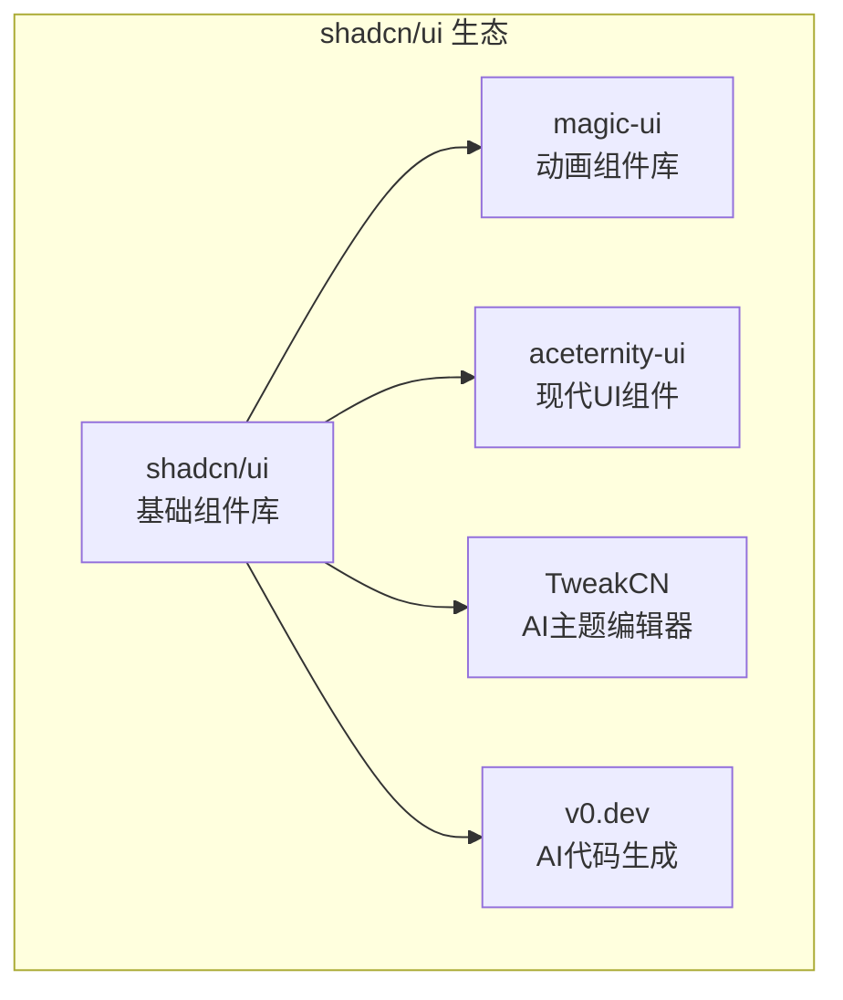

### 3.1 magic-ui：动画组件库

> 🔗 官网：https://magicui.design

**特点：** 专注于炫酷的动画效果，完全兼容 shadcn/ui 工作流

**安装方式：**
```bash
npx shadcn@latest add "https://magicui.design/r/marquee"
```

**示例组件：**

| 组件 | 效果 | 适用场景 |
|------|------|---------|
| **Marquee** | 跑马灯 | 品牌展示、合作伙伴 |
| **Animated Beam** | 连线动画 | 流程展示、架构图 |
| **Particles** | 粒子效果 | 背景装饰、氛围营造 |

```tsx
// Marquee 示例
import Marquee from "@/components/magicui/marquee"

export function MarqueeDemo() {
  return (
    <Marquee pauseOnHover className="[--duration:20s]">
      <div>Item 1</div>
      <div>Item 2</div>
      <div>Item 3</div>
    </Marquee>
  )
}
```

### 3.2 aceternity-ui：现代 UI 组件

> 🔗 官网：https://ui.aceternity.com

**特点：** 3D 效果、视觉冲击，适合营销页面、落地页

**示例组件：**

| 组件 | 效果 | 适用场景 |
|------|------|---------|
| **3D Card** | 3D 悬浮卡片 | 产品展示 |
| **Background Beams** | 光束背景 | Hero 区域 |
| **Spotlight** | 聚光灯效果 | 重点内容 |

```tsx
// 3D Card 示例
import { CardContainer, CardBody, CardItem } from "@/components/ui/3d-card"

export function ThreeDCardDemo() {
  return (
    <CardContainer className="inter-var">
      <CardBody>
        <CardItem translateZ="50">
          <h3>3D Card</h3>
        </CardItem>
        <CardItem translateZ="100">
          
        </CardItem>
      </CardBody>
    </CardContainer>
  )
}
```

### 3.3 TweakCN：AI 主题编辑器

> 🔗 GitHub：https://github.com/tweakcn/tweakcn (20K+ stars)

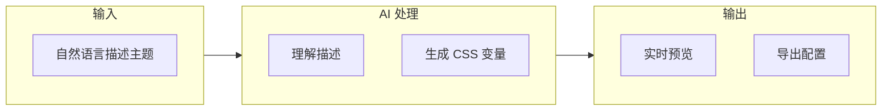

**使用示例：**

```
输入: "Create a dark theme with purple as primary color, 
      pink as accent color, and a subtle gradient background"
```

**AI 生成：**
```css
:root {
  --background: 224 71% 4%;
  --foreground: 213 31% 91%;
  --primary: 263 70% 50%;
  --primary-foreground: 210 40% 98%;
  --accent: 330 81% 60%;
  --accent-foreground: 222 47% 11%;
}
```

### 3.4 v0.dev：AI 代码生成

> 🔗 官网：https://v0.dev（Vercel 出品）

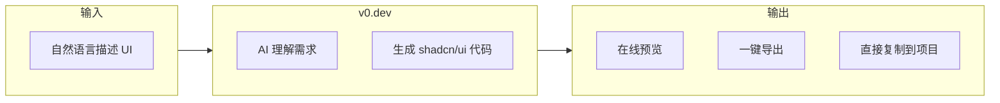

**使用示例：**

```
输入: "Create a user profile card with avatar, name, email, and edit button"
```

**v0.dev 生成：**
```tsx
import { Button } from "@/components/ui/button"
import { Card, CardContent } from "@/components/ui/card"
import { Avatar, AvatarImage, AvatarFallback } from "@/components/ui/avatar"

export function UserProfileCard() {
  return (
    <Card className="w-full max-w-md">
      <CardContent className="flex items-center gap-4 p-6">
        <Avatar className="h-16 w-16">
          <AvatarImage src="/avatar.jpg" />
          <AvatarFallback>JD</AvatarFallback>
        </Avatar>
        <div className="flex-1">
          <h3 className="font-semibold text-lg">John Doe</h3>
          <p className="text-sm text-muted-foreground">john@example.com</p>
        </div>
        <Button variant="outline" size="sm">Edit</Button>
      </CardContent>
    </Card>
  )
}
```

### 3.5 生态工具对比表

| 工具 | 定位 | 特点 | 使用场景 | GitHub Stars |
|------|------|------|----------|--------------|
| **shadcn/ui** | 基础组件库 | Copy-Paste 哲学 | 所有项目 | 80K+ |
| **magic-ui** | 动画组件库 | 炫酷动画效果 | 营销页面、落地页 | 10K+ |
| **aceternity-ui** | 现代 UI 组件 | 3D 效果、视觉冲击 | 创意项目、展示页 | 15K+ |
| **TweakCN** | AI 主题编辑器 | 自然语言生成主题 | 快速定制主题 | 20K+ |
| **v0.dev** | AI 代码生成 | 描述生成组件 | 快速原型开发 | Vercel 产品 |

> 💡 **共同点**：都基于 Copy-Paste 哲学，不是 npm 包，而是代码片段

---

## 📖 Section 5：横向对比组件库

### 5.1 对比维度

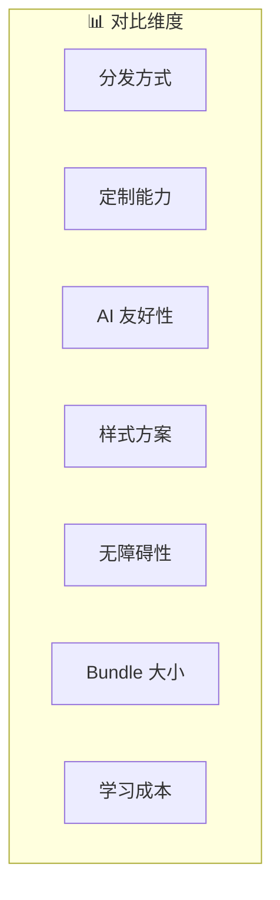

### 5.2 主流组件库对比

| 维度 | Ant Design | MUI | Chakra UI | shadcn/ui | Headless UI |
|------|-----------|-----|-----------|-----------|-------------|
| **分发方式** | npm 包 | npm 包 | npm 包 | Copy-Paste | npm 包 |
| **定制能力** | 主题配置 | 主题配置 | 主题配置 | 源码修改 | 完全自定义 |
| **AI 友好性** | ⭐⭐ | ⭐⭐ | ⭐⭐⭐ | ⭐⭐⭐⭐⭐ | ⭐⭐⭐⭐ |
| **样式方案** | Less | Emotion | Emotion | Tailwind | 无样式 |
| **无障碍性** | ⭐⭐⭐ | ⭐⭐⭐⭐ | ⭐⭐⭐⭐ | ⭐⭐⭐⭐⭐ | ⭐⭐⭐⭐⭐ |
| **Bundle 大小** | ~500KB | ~400KB | ~200KB | 按需 | ~50KB |
| **学习成本** | 中 | 高 | 中 | 低 | 低 |

### 5.3 AI 友好性详细对比

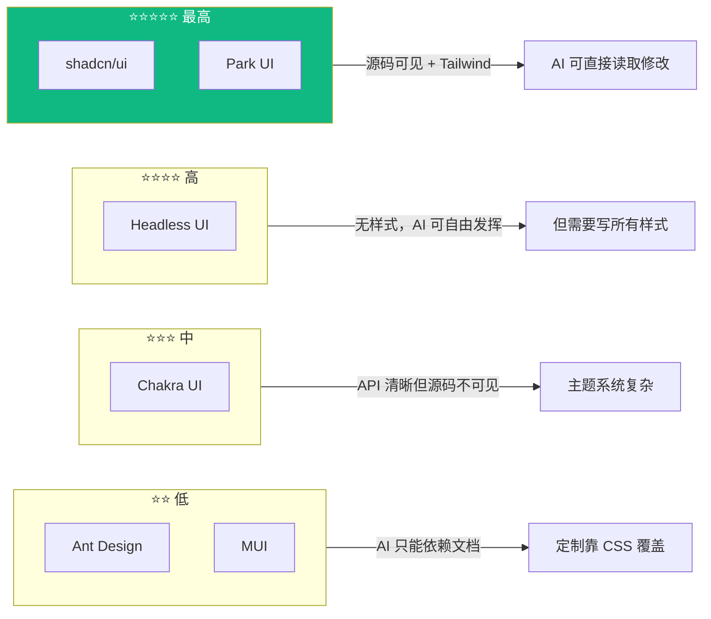

### 5.4 选型建议

| 场景 | 推荐方案 | 理由 |
|------|---------|------|
| **新项目，追求 AI 效率** | shadcn/ui + Tailwind | AI 友好性最高 |
| **传统中后台项目** | Ant Design | 组件丰富，开箱即用 |
| **需要 Material Design** | MUI | 设计规范完整 |
| **Vue + Tailwind 项目** | Headless UI | 官方支持 Vue |
| **完全自定义设计** | Radix UI + Tailwind | 最大灵活性 |

---

## 📖 Section 6：实战演示

### 6.1 从零初始化项目

```mermaid
flowchart LR
    S1["创建 Next.js 项目"] --> S2["初始化 shadcn/ui"]
    S2 --> S3["添加组件"]
    S3 --> S4["使用组件"]
    S4 --> S5["AI 定制"]
```

#### Step 1: 创建 Next.js 项目

```bash
npx create-next-app@latest my-app
cd my-app
```

**选择配置：**
```
✔ Would you like to use TypeScript? Yes
✔ Would you like to use ESLint? Yes
✔ Would you like to use Tailwind CSS? Yes
✔ Would you like to use App Router? Yes
```

#### Step 2: 初始化 shadcn/ui

```bash
npx shadcn@latest init
```

#### Step 3: 添加组件

```bash
npx shadcn@latest add button card dialog
```

**项目结构：**
```
my-app/
├── app/
│   ├── globals.css
│   ├── layout.tsx
│   └── page.tsx
├── components/
│   └── ui/
│       ├── button.tsx    ← 源码在这里
│       ├── card.tsx      ← 源码在这里
│       └── dialog.tsx    ← 源码在这里
├── lib/
│   └── utils.ts
└── components.json
```

#### Step 4: 使用组件

```tsx
// app/page.tsx
import { Button } from "@/components/ui/button"
import { Card, CardHeader, CardTitle, CardContent } from "@/components/ui/card"

export default function Home() {
  return (
    <main className="flex min-h-screen items-center justify-center p-24">
      <Card className="w-full max-w-md">
        <CardHeader>
          <CardTitle>欢迎使用 shadcn/ui</CardTitle>
        </CardHeader>
        <CardContent className="space-y-4">
          <p className="text-muted-foreground">
            这是一个基于 Copy-Paste 哲学的组件库。
          </p>
          <Button className="w-full">开始使用</Button>
        </CardContent>
      </Card>
    </main>
  )
}
```

### 6.2 用 AI 定制组件

#### 需求：给 Button 加一个渐变变体

**告诉 AI：** "帮我给 Button 组件加一个 gradient 变体，从紫色渐变到粉色。"

**AI 修改 `components/ui/button.tsx`：**

```tsx
const buttonVariants = cva(
  "inline-flex items-center justify-center ...",
  {
    variants: {
      variant: {
        default: "bg-primary text-primary-foreground shadow hover:bg-primary/90",
        destructive: "bg-destructive text-destructive-foreground ...",
        // ✅ AI 添加这一行
        gradient: "bg-gradient-to-r from-purple-500 to-pink-500 text-white shadow-lg hover:shadow-xl hover:from-purple-600 hover:to-pink-600",
      },
      // ...
    },
  }
)
```

**使用：**
```tsx
<Button variant="gradient">渐变按钮</Button>
```

> ⏱️ 整个过程不到 10 秒

### 6.3 实战技巧清单

| 技巧 | 命令 | 说明 |
|------|------|------|
| **批量添加组件** | `npx shadcn@latest add button card dialog input` | 一次添加多个 |
| **查看可用组件** | `npx shadcn@latest add` | 列出所有组件 |
| **更新组件** | `npx shadcn@latest add button --overwrite` | 覆盖更新 |
| **对比差异** | `git diff components/ui/button.tsx` | 更新前先对比 |

### 6.4 组件变体库目录建议

```
components/
  ui/              ← shadcn/ui 原始组件
  variants/        ← 自定义变体
    gradient-button.tsx
    glass-card.tsx
```

> 💡 既保留原始组件，又有自定义版本

### 6.5 创建自定义 Registry

> 如果你的团队有自己的设计系统，可以创建自己的 Registry

```mermaid
flowchart LR
    subgraph Team["团队 Registry"]
        T1["自定义组件"]
        T2["统一设计规范"]
        T3["版本管理"]
    end
    
    subgraph Projects["多个项目"]
        P1["项目 A"]
        P2["项目 B"]
        P3["项目 C"]
    end
    
    Team -->|"npx shadcn add"| Projects
```

**Step 1：创建 Registry 服务器**

```json
// https://your-registry.com/r/custom-button.json
{
  "name": "custom-button",
  "type": "components:ui",
  "files": [
    {
      "name": "custom-button.tsx",
      "content": "import * as React from \"react\"\n\nexport function CustomButton({ children, gradient = false, ...props }) {\n  return (\n    <button\n      className={cn(\n        'px-4 py-2 rounded-lg font-medium',\n        gradient && 'bg-gradient-to-r from-purple-500 to-pink-500 text-white'\n      )}\n      {...props}\n    >\n      {children}\n    </button>\n  )\n}"
    }
  ],
  "dependencies": [],
  "registryDependencies": ["button"]
}
```

**Step 2：配置 components.json**

```json
{
  "$schema": "https://ui.shadcn.com/schema.json",
  "style": "new-york",
  "rsc": true,
  "tsx": true,
  "tailwind": {
    "config": "tailwind.config.js",
    "css": "app/globals.css",
    "baseColor": "zinc",
    "cssVariables": true
  },
  "aliases": {
    "components": "@/components",
    "utils": "@/lib/utils"
  },
  "registries": {
    "my-team": {
      "url": "https://your-registry.com/r"
    }
  }
}
```

**Step 3：使用自定义组件**

```bash
# 从自定义 Registry 添加组件
npx shadcn@latest add my-team/custom-button

# 或者直接使用 URL
npx shadcn@latest add "https://your-registry.com/r/custom-button"
```

### 6.6 常见问题 FAQ

```mermaid
graph TB
    subgraph FAQ["❓ 常见问题"]
        Q1["适合所有项目吗？"]
        Q2["会导致代码难维护吗？"]
        Q3["如何在现有项目引入？"]
        Q4["性能如何？"]
        Q5["支持哪些框架？"]
        Q6["如何升级组件？"]
    end
```

#### Q1：shadcn/ui 适合所有项目吗？

| 项目类型 | 是否适合 | 说明 |
|----------|---------|------|
| **新项目** | ✅ 非常适合 | 从零开始，完全控制 |
| **中小型项目** | ✅ 适合 | 灵活定制，效率高 |
| **大型企业项目** | ✅ 适合 | 配合自定义 Registry |
| **严格 Material Design** | ⚠️ 不太适合 | MUI 更合适 |
| **已有 Ant Design 的项目** | ⚠️ 渐进式 | 可并存，逐步迁移 |

#### Q2：Copy-Paste 模式会不会导致代码难以维护？

**不会。原因：**

1. 组件在你的 Git 仓库，可以用 Git 管理版本
2. shadcn/ui 的组件都很小，单文件，易于维护
3. 代码结构清晰，标准化程度高
4. AI 可以帮助理解和修改

#### Q3：如何在现有项目中引入 shadcn/ui？

```bash
# 1. 初始化（不会影响现有代码）
npx shadcn@latest init

# 2. 逐步添加组件（按需）
npx shadcn@latest add button dialog

# 3. 在新功能中使用
import { Button } from "@/components/ui/button"
```

> 💡 **建议**：老组件和新组件可以并存，逐步迁移

#### Q4：shadcn/ui 的性能如何？

| 指标 | shadcn/ui | Ant Design | MUI |
|------|-----------|------------|-----|
| **Bundle Size** | 按需加载 | ~500KB | ~400KB |
| **运行时性能** | 极佳 | 良好 | 良好 |
| **样式计算** | 无运行时开销 | 较少 | CSS-in-JS 开销 |
| **Tree Shaking** | 完美支持 | 部分支持 | 部分支持 |

#### Q5：shadcn/ui 支持哪些框架？

| 框架 | 支持程度 | 说明 |
|------|---------|------|
| **Next.js** | ✅ 官方支持 | App Router 和 Pages Router |
| **Remix** | ✅ 官方支持 | 完整支持 |
| **Vite + React** | ✅ 官方支持 | 最简单的配置 |
| **Astro** | ✅ 官方支持 | 需要 React 集成 |
| **Laravel** | ✅ 官方支持 | Inertia.js |
| **Gatsby** | ⚠️ 社区支持 | 需要手动配置 |

#### Q6：如何升级 shadcn/ui 的组件？

```bash
# 方法 1：直接覆盖（丢失自定义修改）
npx shadcn@latest add button --overwrite

# 方法 2：先对比再决定（推荐）
git stash                                    # 保存当前修改
npx shadcn@latest add button --overwrite     # 拉取最新版本
git diff components/ui/button.tsx           # 对比差异
git stash pop                                # 恢复修改
# 手动合并差异
```

#### Q7：可以用 shadcn/ui 做移动端吗？

可以，但需要注意：

1. **响应式设计**：默认桌面端优先，需要调整
2. **触摸交互**：部分组件需要适配移动端手势
3. **底部抽屉**：可以配合 Vaul 库实现

```tsx
// 移动端底部抽屉示例
import { Drawer } from "vaul"

<Drawer.Root>
  <Drawer.Trigger asChild>
    <Button>打开菜单</Button>
  </Drawer.Trigger>
  <Drawer.Content>
    {/* 移动端友好的内容 */}
  </Drawer.Content>
</Drawer.Root>
```

---

## 📖 Section 7：深度思考

### 7.1 范式转移：从依赖到拥有

```mermaid
graph LR
    subgraph Old["传统模式：依赖"]
        O1["依赖 npm 包"]
        O2["依赖维护者"]
        O3["依赖更新节奏"]
    end
    
    subgraph New["新模式：拥有"]
        N1["代码在项目里"]
        N2["完全控制权"]
        N3["随时修改/回滚"]
    end
    
    Old -->|"范式转移"| New
    
    style New fill:#10b981,color:#fff
```

### 7.2 AI 时代组件库设计五原则

```mermaid
graph TB
    subgraph Principles["🎯 AI 时代组件库设计原则"]
        P1["1️⃣ 源码可见<br/>AI 需要看到完整实现"]
        P2["2️⃣ 结构清晰<br/>单文件，结构简单"]
        P3["3️⃣ 样式可控<br/>基于 utility-first"]
        P4["4️⃣ 依赖透明<br/>基于 Radix，关系清晰"]
        P5["5️⃣ 版本自主<br/>不强制版本锁定"]
    end
```

### 7.3 Copy-Paste 哲学的局限性

| 局限 | 说明 | 解决方案 |
|------|------|---------|
| **代码冗余** | 多项目各有一份代码 | 每个项目需求可能不同，冗余=灵活 |
| **更新成本** | 需手动同步更新 | 可选择性更新，不被强制升级 |
| **团队协作** | 各自修改可能不一致 | 创建自定义 Registry 或用 Git 管理 |
| **学习曲线** | 新手不习惯 | 理解好处后会爱上 |

---

## 📋 Closing：总结与行动建议

### 核心要点速查

```mermaid
graph TB
    subgraph Summary["📝 本课核心要点"]
        S1["1️⃣ 传统组件库的 AI 困境<br/>黑盒依赖、过度封装、版本锁定"]
        S2["2️⃣ Copy-Paste 哲学<br/>不是 npm 包，是代码片段"]
        S3["3️⃣ CLI 工作流<br/>init → add → 使用 → 定制"]
        S4["4️⃣ 生态工具<br/>magic-ui、TweakCN、v0.dev"]
        S5["5️⃣ AI 友好性最高<br/>源码可见、结构清晰、样式可控"]
    end
```

### ✅ 行动建议清单

#### 新项目
- [ ] 使用 Tailwind CSS v4 作为样式方案
- [ ] 使用 shadcn/ui 作为组件库
- [ ] 配合 v0.dev + Cursor 进行 AI 辅助开发

#### 老项目
- [ ] 渐进式迁移：先用 shadcn/ui 做新功能
- [ ] 混合使用：shadcn/ui + 老组件库并存
- [ ] 评估成本：稳定项目不一定要迁移

### 📋 知识点速查表

| 概念 | 定义 | 关键点 |
|------|------|--------|
| **Copy-Paste 哲学** | 组件源码复制到项目中 | 代码即资产，拥有即控制 |
| **CLI 工作流** | npx shadcn@latest add | 从 Registry 拉取源码 |
| **Registry** | 组件的中央仓库 | JSON API，存储元数据和源码 |
| **CVA** | Class Variance Authority | 管理 Tailwind 变体 |
| **cn()** | 类名合并工具 | clsx + tailwind-merge |
| **asChild** | Radix Slot 模式 | 避免额外 DOM 节点 |

---

## 📚 下节课预告

> **第 3 课：Radix UI - 无头组件的底层逻辑**

- Headless UI 的设计哲学
- Radix UI 的 Composition 模式
- 可访问性原语
- shadcn/ui 如何基于 Radix 构建

---

**课程时间分配：**
| 部分 | 时长 |
|------|------|
| Opening: 现场对比演示 | 10 min |
| Section 1: 传统组件库的 AI 困境 | 20 min |
| Section 2: Copy-Paste 哲学 | 30 min |
| Section 3: 生态工具 | 25 min |
| Section 4: 横向对比 | 20 min |
| Section 5: 实战演示 | 20 min |
| Section 6: 深度思考 | 15 min |
| Closing + Q&A | 10 min |
| **总计** | **2.5 小时** |
