# 无头组件的底层逻辑：Radix UI 深度剖析

> **课程时长**: 2.5-3 小时 | **难度**: 高阶 | **风格**: 故事开场 + 技术深度 + 实践指导

---

## 📋 本课概览

```
┌─────────────────────────────────────────────────────────────────┐
│  🎯 核心观点：Headless UI 是 AI 时代组件库的最佳底层架构        │
├─────────────────────────────────────────────────────────────────┤
│  📚 你将学到：                                                   │
│    • 理解 Radix 的设计愿景：可访问、无样式、开放                │
│    • 掌握 Composition 模式和 asChild 的工作原理                 │
│    • 深入可访问性原语（WAI-ARIA、焦点管理、键盘导航）           │
│    • 学习 2025 新原语（PasswordToggleField、OneTimePassword）   │
│    • 掌握 radix-ui 统一包和增量采用策略                         │
│    • 横向对比 Radix / Headless UI / React Aria / Ark UI        │
└─────────────────────────────────────────────────────────────────┘
```

> 💡 **2025 最新**: 新增 `radix-ui` 统一包、PasswordToggleField、OneTimePasswordField、Form 原语（Preview）、React 19/RSC 完整支持

---

## 🎬 Opening：一个有趣的发现

### shadcn/ui 的秘密

> 如果你仔细看过 shadcn/ui 的源码，你会发现一件有意思的事情：**它自己几乎没有实现任何组件逻辑**。

```tsx
// shadcn/ui 的 Dialog 组件核心代码
import * as DialogPrimitive from "@radix-ui/react-dialog"

const Dialog = DialogPrimitive.Root
const DialogTrigger = DialogPrimitive.Trigger
const DialogContent = DialogPrimitive.Content

export { Dialog, DialogTrigger, DialogContent }
```

> 就这样。没有状态管理，没有事件处理，没有可访问性逻辑。**所有的核心能力，全部来自 Radix UI。**

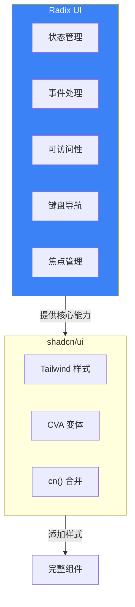

### 今天要搞清楚的三件事

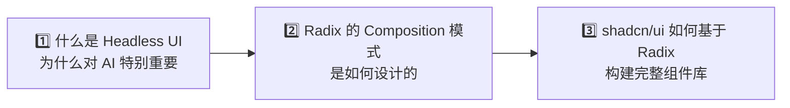

### 📍 课程结构导航

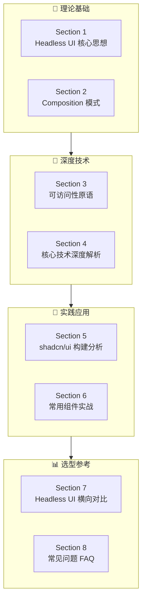

---

## 📖 Section 1：什么是 Headless UI

### 1.1 传统组件库的问题

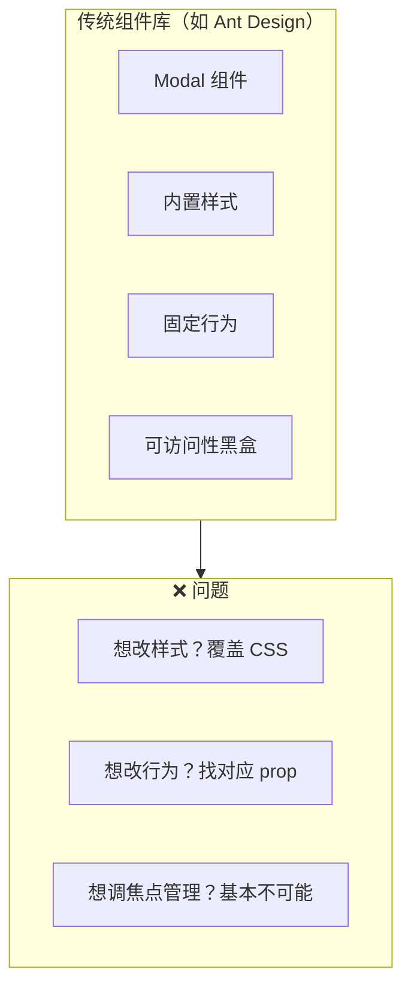

**示例：Ant Design Modal**

```tsx
import { Modal } from 'antd'

<Modal
  title="确认删除"
  open={isOpen}
  onOk={handleOk}
  onCancel={handleCancel}
>
  <p>确定要删除这条记录吗？</p>
</Modal>
```

**问题分析：**

| 问题 | 表现 | 影响 |
|------|------|------|
| **样式耦合** | 想改 Modal 样式需覆盖 Ant Design CSS | 维护困难 |
| **行为固定** | 点击外部关闭等行为需找对应 prop | 灵活性差 |
| **可访问性黑盒** | 焦点管理、键盘导航无法调整 | 无法定制 |

> ⚠️ **核心矛盾**：传统组件库给了你便利，但也限制了你的自由

### 1.2 Radix Primitives 的设计愿景（官方）

> **官方定义**：Radix Primitives is a low-level UI component library with a focus on **accessibility**, **customization** and **developer experience**.

#### Radix 六大核心特性

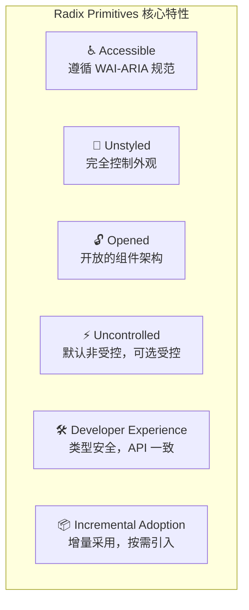

| 特性 | 官方说明 | 实际意义 |
|------|---------|---------|
| **Accessible** | 遵循 WAI-ARIA 设计模式，处理 aria/role 属性、焦点管理、键盘导航 | 开箱即可访问 |
| **Unstyled** | 不提供样式，完全控制外观 | 与任何样式方案兼容 |
| **Opened** | 开放组件架构，可访问每个部分 | 可包装、添加事件、props、refs |
| **Uncontrolled** | 默认非受控，可选受控模式 | 快速上手，无需本地状态 |
| **Developer Experience** | 完全类型化 API，一致的 API 设计，asChild 支持 | 可预测的开发体验 |
| **Incremental Adoption** | 推荐使用 `radix-ui` 统一包 | Tree-shakeable，避免版本冲突 |

### 1.3 Headless UI 的核心思想

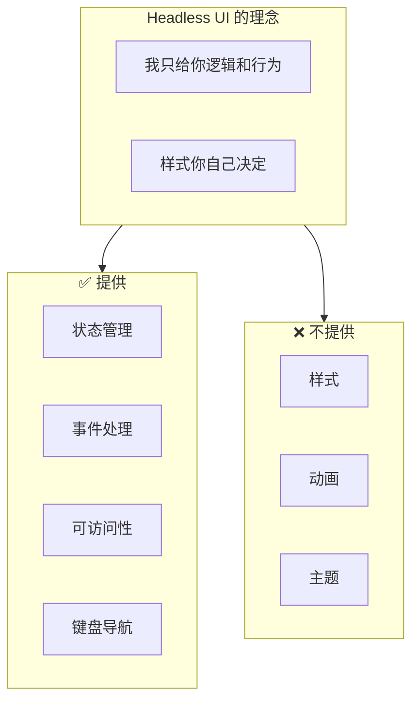

**Radix Dialog 示例：**

```tsx
import * as Dialog from '@radix-ui/react-dialog'

<Dialog.Root open={isOpen} onOpenChange={setIsOpen}>
  <Dialog.Trigger asChild>
    <button>打开对话框</button>
  </Dialog.Trigger>

  <Dialog.Portal>
    <Dialog.Overlay className="fixed inset-0 bg-black/50" />
    <Dialog.Content className="fixed top-1/2 left-1/2 ...">
      <Dialog.Title>确认删除</Dialog.Title>
      <Dialog.Description>
        确定要删除这条记录吗？
      </Dialog.Description>

      <button onClick={() => setIsOpen(false)}>取消</button>
      <button onClick={handleDelete}>确认</button>

      <Dialog.Close asChild>
        <button>×</button>
      </Dialog.Close>
    </Dialog.Content>
  </Dialog.Portal>
</Dialog.Root>
```

**Radix 做了什么 vs 没做什么：**

| ✅ Radix 做了 | ❌ Radix 没做 |
|--------------|--------------|
| 状态管理（open/onOpenChange） | 样式（className 由你控制） |
| Portal 渲染（自动到 body） | 动画（用 Framer Motion 等） |
| 焦点管理（打开聚焦，关闭恢复） | 主题（没有 primary/secondary） |
| 键盘导航（ESC 关闭） | |
| ARIA 属性（role="dialog" 等） | |

### 1.3 为什么 Headless UI 对 AI 更友好

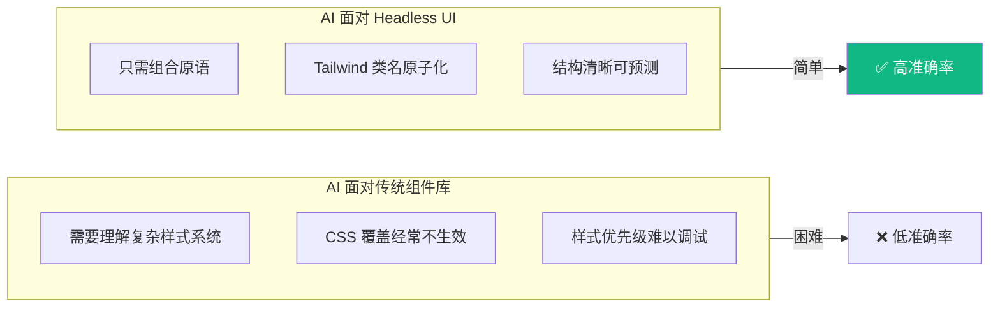

**AI 生成 Radix + Tailwind 组件的思考过程：**

```
1. Dialog.Root 管理状态
2. Dialog.Trigger 触发打开
3. Dialog.Portal 渲染到 body
4. Dialog.Overlay 作为遮罩
5. Dialog.Content 作为内容容器
6. Dialog.Title/Description 提供语义
7. Dialog.Close 关闭
```

> 💡 这个思考过程非常线性，AI 很容易生成正确的代码

---

## 📖 Section 2：Radix UI 的 Composition 模式

### 2.1 为什么拆成这么多部分？

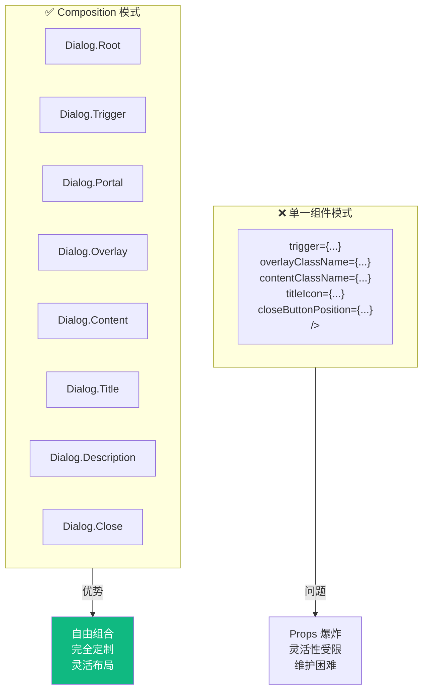

### 2.2 Composition 模式的威力

**完整示例：自定义删除确认对话框**

```tsx
import * as Dialog from '@radix-ui/react-dialog'
import { X, AlertTriangle } from 'lucide-react'

function DeleteConfirmDialog() {
  const [open, setOpen] = useState(false)

  return (
    <Dialog.Root open={open} onOpenChange={setOpen}>
      {/* 触发器：可以是任何元素 */}
      <Dialog.Trigger asChild>
        <button className="bg-red-500 text-white px-4 py-2 rounded">
          删除
        </button>
      </Dialog.Trigger>

      <Dialog.Portal>
        {/* 遮罩层：完全自定义样式 */}
        <Dialog.Overlay className="fixed inset-0 bg-black/50 backdrop-blur-sm" />

        {/* 内容区域：完全自定义布局 */}
        <Dialog.Content className="fixed top-1/2 left-1/2 -translate-x-1/2 -translate-y-1/2 bg-white rounded-lg shadow-xl p-6 w-[400px]">
          
          {/* 标题：可以加任何内容 */}
          <div className="flex items-center gap-2 mb-4">
            <AlertTriangle className="text-red-500" />
            <Dialog.Title className="text-lg font-semibold">
              确认删除
            </Dialog.Title>
          </div>

          <Dialog.Description className="text-gray-600 mb-6">
            此操作不可撤销。确定要删除这条记录吗？
          </Dialog.Description>

          {/* 自定义内容：可以加任何东西 */}
          <div className="bg-yellow-50 border border-yellow-200 rounded p-3 mb-6">
            <p className="text-sm text-yellow-800">警告：删除后将无法恢复</p>
          </div>

          {/* 按钮组 */}
          <div className="flex justify-end gap-3">
            <Dialog.Close asChild>
              <button className="px-4 py-2 border rounded">取消</button>
            </Dialog.Close>
            <button 
              className="px-4 py-2 bg-red-500 text-white rounded"
              onClick={() => { handleDelete(); setOpen(false); }}
            >
              确认删除
            </button>
          </div>

          {/* 关闭按钮：放在右上角 */}
          <Dialog.Close asChild>
            <button className="absolute top-4 right-4 text-gray-400 hover:text-gray-600">
              <X size={20} />
            </button>
          </Dialog.Close>
        </Dialog.Content>
      </Dialog.Portal>
    </Dialog.Root>
  )
}
```

**Composition 模式的优势：**

| 优势 | 说明 |
|------|------|
| **自由组合** | 在标题和描述之间加警告框 |
| **完全定制** | 每个部分的样式完全由你控制 |
| **灵活布局** | 关闭按钮可以放在任何位置 |

### 2.3 asChild 的魔法

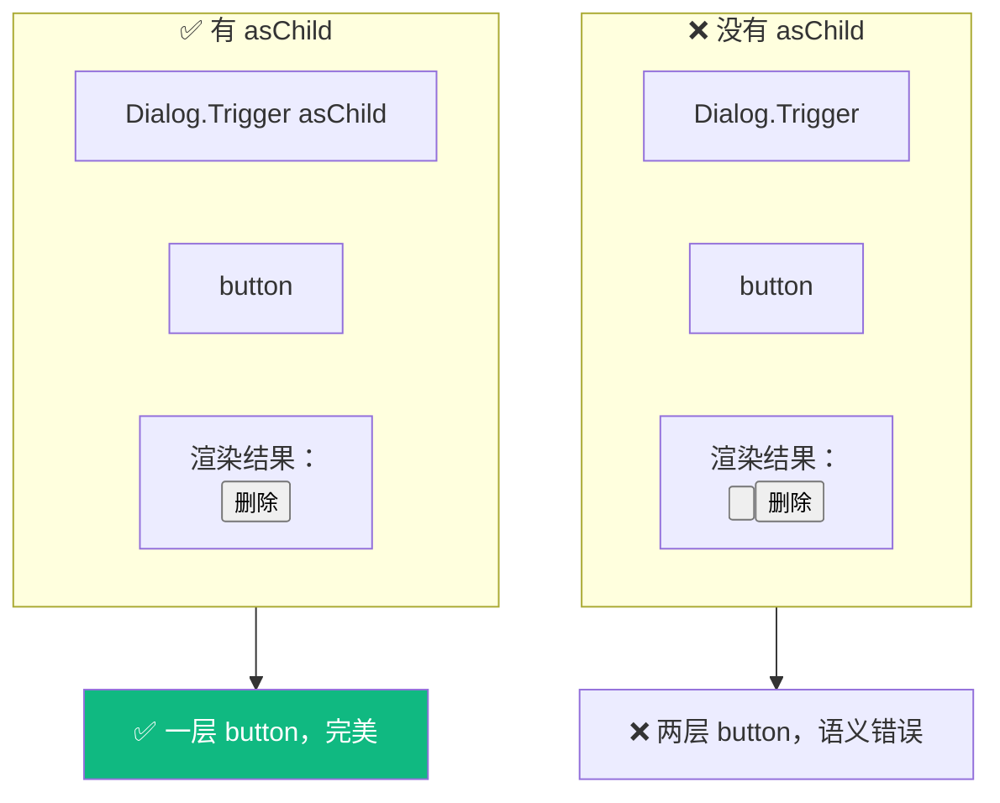

**asChild 的工作原理：**

```tsx
// 简化版的 Slot 实现
function Slot({ children, ...props }) {
  if (React.isValidElement(children)) {
    return React.cloneElement(children, {
      ...props,           // 父组件的 props
      ...children.props,  // 子组件的 props
    })
  }
  return null
}
```

> 💡 就是用 `cloneElement` 把 props 合并到子元素上，避免额外的 DOM 节点

### 2.4 AI 如何理解 Composition 模式

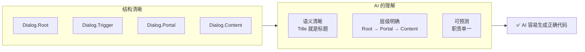

---

## 📖 Section 3：可访问性原语

### 3.1 为什么可访问性这么重要

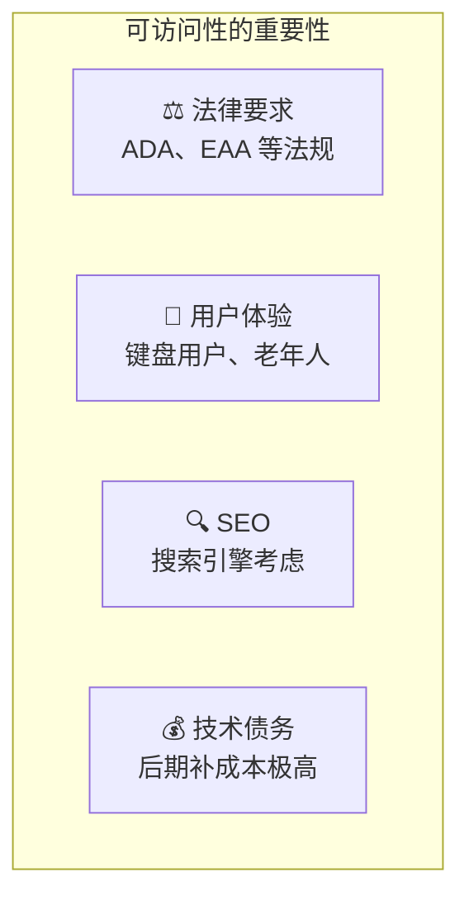

### 3.2 手写 Dialog 的可访问性陷阱

```tsx
// ❌ 一个看起来"能用"但有问题的 Dialog
function MyDialog({ open, onClose, children }) {
  if (!open) return null

  return (
    <div className="fixed inset-0 bg-black/50" onClick={onClose}>
      <div className="fixed top-1/2 left-1/2 ...">
        {children}
      </div>
    </div>
  )
}
```

**问题清单：**

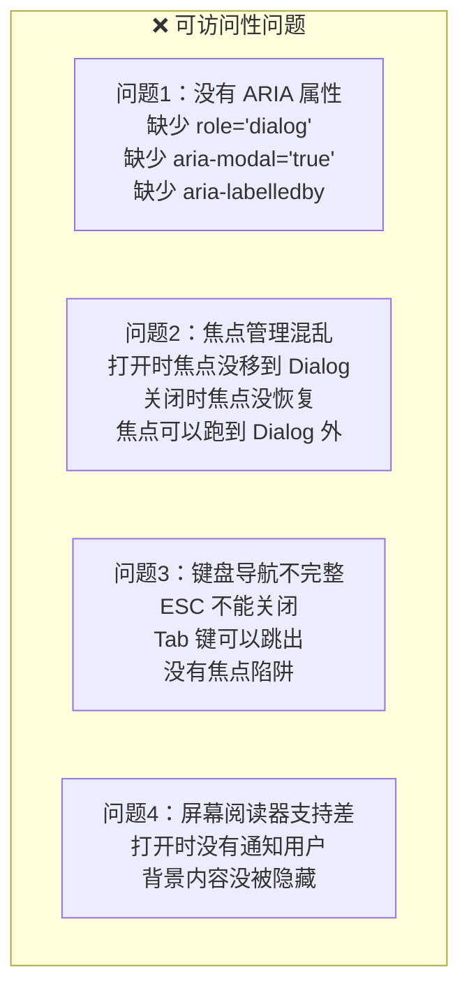

### 3.3 Radix 如何自动处理可访问性

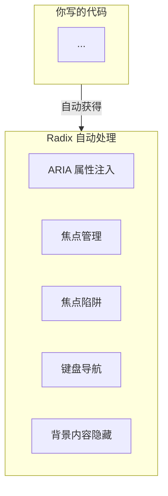

#### 1. ARIA 属性自动注入

**你写的代码：**
```tsx
<Dialog.Content>
  <Dialog.Title>标题</Dialog.Title>
  <Dialog.Description>描述</Dialog.Description>
</Dialog.Content>
```

**渲染出来的 HTML：**
```html
<div 
  role="dialog" 
  aria-modal="true"
  aria-labelledby="radix-:r1:"
  aria-describedby="radix-:r2:"
>
  <h2 id="radix-:r1:">标题</h2>
  <p id="radix-:r2:">描述</p>
</div>
```

#### 2. 焦点管理

```tsx
// Radix 内部的焦点管理逻辑（简化版）
useEffect(() => {
  if (open) {
    const previousFocus = document.activeElement  // 保存当前焦点
    contentRef.current?.focus()                   // 移动焦点到 Dialog
    
    return () => {
      previousFocus?.focus()                      // 恢复焦点
    }
  }
}, [open])
```

#### 3. 焦点陷阱 (Focus Trap)

```tsx
// 简化版的焦点陷阱逻辑
function handleKeyDown(e) {
  if (e.key === 'Tab') {
    const focusableElements = contentRef.current.querySelectorAll(
      'button, [href], input, select, textarea, [tabindex]:not([tabindex="-1"])'
    )
    
    const first = focusableElements[0]
    const last = focusableElements[focusableElements.length - 1]
    
    if (e.shiftKey && document.activeElement === first) {
      e.preventDefault()
      last.focus()  // Shift+Tab 在第一个元素时，跳到最后一个
    } else if (!e.shiftKey && document.activeElement === last) {
      e.preventDefault()
      first.focus() // Tab 在最后一个元素时，跳到第一个
    }
  }
}
```

#### 4. 键盘导航

```tsx
// ESC 关闭
function handleKeyDown(e) {
  if (e.key === 'Escape') {
    onOpenChange(false)
  }
}
```

### 3.4 可访问性测试清单

| 测试项 | 方法 | 预期结果 |
|--------|------|---------|
| **Tab 导航** | 按 Tab 键 | 焦点在 Dialog 内循环 ✓ |
| **ESC 关闭** | 按 ESC 键 | Dialog 关闭 ✓ |
| **焦点恢复** | 关闭 Dialog | 焦点回到触发按钮 ✓ |
| **屏幕阅读器** | 打开 VoiceOver/NVDA | 读出"对话框，标题，描述" ✓ |

> 💡 **Radix 的价值**：你不需要成为可访问性专家，就能做出符合标准的组件

---

## 📖 Section 4：核心技术深度解析

### 4.1 Slot/asChild 源码深度解析

> `asChild` 是 Radix 最精妙的设计之一，让我们深入看看它的实现原理。

#### Slot 的核心实现

```tsx
// @radix-ui/react-slot 简化版源码
import * as React from 'react'

interface SlotProps extends React.HTMLAttributes<HTMLElement> {
  children?: React.ReactNode
}

const Slot = React.forwardRef<HTMLElement, SlotProps>(
  (props, forwardedRef) => {
    const { children, ...slotProps } = props
    const childrenArray = React.Children.toArray(children)
    const slottable = childrenArray.find(isSlottable)

    if (slottable) {
      // 如果子元素是 Slottable，特殊处理
      const newElement = slottable.props.children as React.ReactNode
      const newChildren = childrenArray.map((child) => {
        if (child === slottable) {
          // 替换 Slottable 的内容
          if (React.Children.count(newElement) > 1) {
            return React.Children.only(null)
          }
          return React.isValidElement(newElement)
            ? (newElement.props.children as React.ReactNode)
            : null
        }
        return child
      })

      return (
        <SlotClone {...slotProps} ref={forwardedRef}>
          {React.isValidElement(newElement)
            ? React.cloneElement(newElement, undefined, newChildren)
            : null}
        </SlotClone>
      )
    }

    // 正常情况：合并 props 到子元素
    return (
      <SlotClone {...slotProps} ref={forwardedRef}>
        {children}
      </SlotClone>
    )
  }
)

// SlotClone 核心逻辑
const SlotClone = React.forwardRef<any, SlotCloneProps>(
  (props, forwardedRef) => {
    const { children, ...slotProps } = props

    if (React.isValidElement(children)) {
      // 🔑 核心：使用 cloneElement 合并 props
      return React.cloneElement(children, {
        ...mergeProps(slotProps, children.props),
        ref: forwardedRef
          ? composeRefs(forwardedRef, (children as any).ref)
          : (children as any).ref,
      })
    }

    return React.Children.count(children) > 1 
      ? React.Children.only(null) 
      : null
  }
)
```

#### Props 合并策略

```tsx
// mergeProps 的实现逻辑
function mergeProps(slotProps: AnyProps, childProps: AnyProps) {
  const overrideProps = { ...childProps }

  for (const propName in childProps) {
    const slotPropValue = slotProps[propName]
    const childPropValue = childProps[propName]

    const isHandler = /^on[A-Z]/.test(propName)
    
    if (isHandler) {
      // 🟡 事件处理器：两个都调用
      if (slotPropValue && childPropValue) {
        overrideProps[propName] = (...args: unknown[]) => {
          childPropValue(...args)
          slotPropValue(...args)
        }
      } else if (slotPropValue) {
        overrideProps[propName] = slotPropValue
      }
    } else if (propName === 'style') {
      // 🟢 style：深度合并
      overrideProps[propName] = { ...slotPropValue, ...childPropValue }
    } else if (propName === 'className') {
      // 🔵 className：拼接
      overrideProps[propName] = [slotPropValue, childPropValue]
        .filter(Boolean)
        .join(' ')
    }
  }

  return { ...slotProps, ...overrideProps }
}
```

**Props 合并规则表：**

| Props 类型 | 合并策略 | 示例 |
|-----------|---------|------|
| **事件处理器** (`on*`) | 两个都调用，子元素优先 | `onClick` 两个都触发 |
| **style** | 深度合并，子元素覆盖 | `{...parent, ...child}` |
| **className** | 拼接 | `"parent-class child-class"` |
| **其他 props** | 子元素覆盖父元素 | `aria-label` 用子元素的 |

#### Ref 组合

```tsx
// composeRefs 实现
function composeRefs<T>(...refs: React.Ref<T>[]) {
  return (node: T) => {
    refs.forEach((ref) => {
      if (typeof ref === 'function') {
        ref(node)
      } else if (ref !== null) {
        (ref as React.MutableRefObject<T>).current = node
      }
    })
  }
}

// 使用场景
<Dialog.Trigger asChild>
  <Button ref={myButtonRef}>  {/* 两个 ref 都会生效 */}
    点击我
  </Button>
</Dialog.Trigger>
```

### 4.2 Radix 状态管理机制

#### 受控与非受控模式

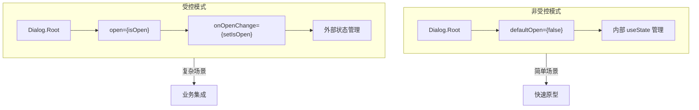

**useControllableState Hook 实现：**

```tsx
// Radix 的核心 Hook，支持受控和非受控
function useControllableState<T>({
  prop,
  defaultProp,
  onChange = () => {},
}: UseControllableStateParams<T>) {
  // 非受控状态
  const [uncontrolledProp, setUncontrolledProp] = useUncontrolledState({
    defaultProp,
    onChange,
  })
  
  // 判断是否受控
  const isControlled = prop !== undefined
  const value = isControlled ? prop : uncontrolledProp
  
  const handleChange = useCallbackRef(onChange)

  const setValue: React.Dispatch<React.SetStateAction<T | undefined>> = 
    React.useCallback(
      (nextValue) => {
        if (isControlled) {
          // 受控模式：调用 onChange
          const setter = nextValue as SetStateFn<T>
          const value = typeof nextValue === 'function' 
            ? setter(prop) 
            : nextValue
          if (value !== prop) handleChange(value as T)
        } else {
          // 非受控模式：更新内部状态
          setUncontrolledProp(nextValue)
        }
      },
      [isControlled, prop, setUncontrolledProp, handleChange]
    )

  return [value, setValue] as const
}
```

**使用示例：**

```tsx
// 非受控：内部管理状态
<Dialog.Root defaultOpen={false}>
  {/* ... */}
</Dialog.Root>

// 受控：外部管理状态
const [open, setOpen] = useState(false)
<Dialog.Root open={open} onOpenChange={setOpen}>
  {/* ... */}
</Dialog.Root>

// 混合：外部监听，内部管理
<Dialog.Root 
  defaultOpen={false} 
  onOpenChange={(open) => {
    console.log('Dialog state changed:', open)
    analytics.track('dialog_toggled', { open })
  }}
>
  {/* ... */}
</Dialog.Root>
```

### 4.3 Context 分层架构

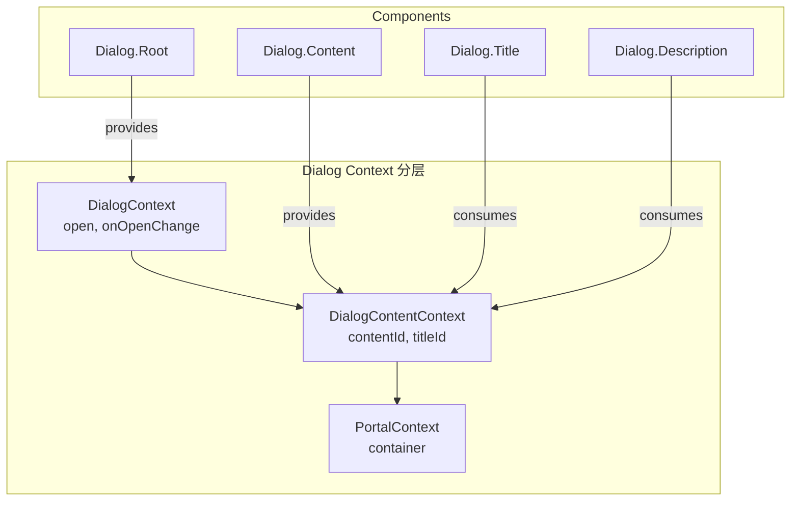

**Context 实现代码：**

```tsx
// 创建类型安全的 Context
interface DialogContextValue {
  triggerRef: React.RefObject<HTMLButtonElement>
  contentId: string
  titleId: string
  descriptionId: string
  open: boolean
  onOpenChange(open: boolean): void
  onOpenToggle(): void
  modal: boolean
}

const [DialogProvider, useDialogContext] = 
  createContext<DialogContextValue>('Dialog')

// Root 组件提供 Context
function DialogRoot({ children, open, onOpenChange, modal = true }) {
  const [_open, setOpen] = useControllableState({
    prop: open,
    defaultProp: false,
    onChange: onOpenChange,
  })
  
  return (
    <DialogProvider
      open={_open}
      onOpenChange={setOpen}
      onOpenToggle={() => setOpen(prev => !prev)}
      modal={modal}
      triggerRef={triggerRef}
      contentId={useId()}
      titleId={useId()}
      descriptionId={useId()}
    >
      {children}
    </DialogProvider>
  )
}

// Trigger 消费 Context
function DialogTrigger({ asChild, children, ...props }) {
  const context = useDialogContext('DialogTrigger')
  const Comp = asChild ? Slot : 'button'
  
  return (
    <Comp
      type="button"
      aria-haspopup="dialog"
      aria-expanded={context.open}
      aria-controls={context.contentId}
      onClick={() => context.onOpenToggle()}
      ref={context.triggerRef}
      {...props}
    >
      {children}
    </Comp>
  )
}
```

### 4.4 Portal 实现原理

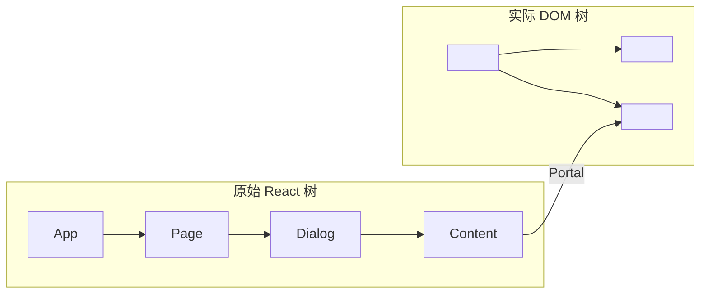

**Portal 实现：**

```tsx
import { createPortal } from 'react-dom'

interface PortalProps {
  container?: HTMLElement | null
  children: React.ReactNode
}

function Portal({ container, children }: PortalProps) {
  const [mounted, setMounted] = React.useState(false)
  
  // 确保在客户端渲染
  React.useEffect(() => {
    setMounted(true)
  }, [])
  
  // 默认渲染到 document.body
  const portalContainer = container ?? 
    (globalThis?.document?.body as HTMLElement)

  if (!mounted || !portalContainer) {
    return null
  }

  return createPortal(
    <div data-radix-portal="">
      {children}
    </div>,
    portalContainer
  )
}
```

**Portal 的作用：**

| 问题 | Portal 解决方案 |
|------|---------------|
| **z-index 层级** | 渲染到 body，避免父元素 `overflow: hidden` |
| **布局影响** | 脱离原始 DOM 位置，`position: fixed` 生效 |
| **事件冒泡** | React 事件仍然正常工作 |
| **SSR 兼容** | `mounted` 状态确保客户端渲染 |

### 4.5 事件系统设计

#### Dismiss 事件处理

```tsx
// 统一的 Dismiss 处理
function useDismiss({
  onDismiss,
  disableOutsidePointerEvents = false,
}) {
  const handleEscape = useEscapeKeydown((event) => {
    onDismiss()
  })
  
  const handleOutsideClick = useOutsideClick((event) => {
    onDismiss()
  }, disableOutsidePointerEvents)
  
  const handleFocusOutside = useFocusOutside((event) => {
    // 处理焦点离开的情况
  })
  
  return {
    onEscapeKeyDown: handleEscape,
    onPointerDownOutside: handleOutsideClick,
    onFocusOutside: handleFocusOutside,
  }
}
```

#### 事件拦截与传播

```tsx
// Dialog Content 的事件处理
function DialogContent({ 
  onEscapeKeyDown,
  onPointerDownOutside,
  onInteractOutside,
  ...props 
}) {
  return (
    <DismissableLayer
      // 允许拦截默认行为
      onEscapeKeyDown={(event) => {
        onEscapeKeyDown?.(event)
        if (!event.defaultPrevented) {
          context.onOpenChange(false)
        }
      }}
      // 点击外部关闭
      onPointerDownOutside={(event) => {
        onPointerDownOutside?.(event)
        if (!event.defaultPrevented) {
          context.onOpenChange(false)
        }
      }}
      // 统一的交互外部事件
      onInteractOutside={(event) => {
        onInteractOutside?.(event)
      }}
      {...props}
    />
  )
}

// 使用示例：阻止 ESC 关闭
<DialogContent
  onEscapeKeyDown={(e) => {
    e.preventDefault()  // 阻止默认关闭行为
    showConfirmation()  // 显示确认弹窗
  }}
>
  {/* ... */}
</DialogContent>
```

### 4.6 动画集成模式

#### 使用 data-state 属性

```tsx
// Radix 自动注入 data-state 属性
<DialogOverlay 
  data-state="open"   // 或 "closed"
  className="..."
/>

<DialogContent
  data-state="open"   // 或 "closed"
  className="..."
/>
```

**CSS 动画方案：**

```css
/* 使用 Tailwind + data-state */
.dialog-overlay {
  @apply fixed inset-0 bg-black/50;
  
  /* 进入动画 */
  &[data-state="open"] {
    @apply animate-in fade-in;
  }
  
  /* 退出动画 */
  &[data-state="closed"] {
    @apply animate-out fade-out;
  }
}

.dialog-content {
  @apply fixed top-1/2 left-1/2 -translate-x-1/2 -translate-y-1/2;
  
  &[data-state="open"] {
    @apply animate-in fade-in-0 zoom-in-95;
  }
  
  &[data-state="closed"] {
    @apply animate-out fade-out-0 zoom-out-95;
  }
}
```

**Framer Motion 集成：**

```tsx
import { motion, AnimatePresence } from 'framer-motion'

function AnimatedDialog({ open, onOpenChange }) {
  return (
    <Dialog.Root open={open} onOpenChange={onOpenChange}>
      <Dialog.Trigger asChild>
        <Button>打开</Button>
      </Dialog.Trigger>
      
      <AnimatePresence>
        {open && (
          <Dialog.Portal forceMount>
            <Dialog.Overlay asChild>
              <motion.div
                className="fixed inset-0 bg-black/50"
                initial={{ opacity: 0 }}
                animate={{ opacity: 1 }}
                exit={{ opacity: 0 }}
              />
            </Dialog.Overlay>
            
            <Dialog.Content asChild>
              <motion.div
                className="fixed top-1/2 left-1/2 ..."
                initial={{ opacity: 0, scale: 0.95, y: '-48%', x: '-50%' }}
                animate={{ opacity: 1, scale: 1, y: '-50%', x: '-50%' }}
                exit={{ opacity: 0, scale: 0.95, y: '-48%', x: '-50%' }}
                transition={{ duration: 0.2 }}
              >
                {/* Dialog content */}
              </motion.div>
            </Dialog.Content>
          </Dialog.Portal>
        )}
      </AnimatePresence>
    </Dialog.Root>
  )
}
```

---

## 📖 Section 5：shadcn/ui 如何基于 Radix 构建

### 5.1 核心公式

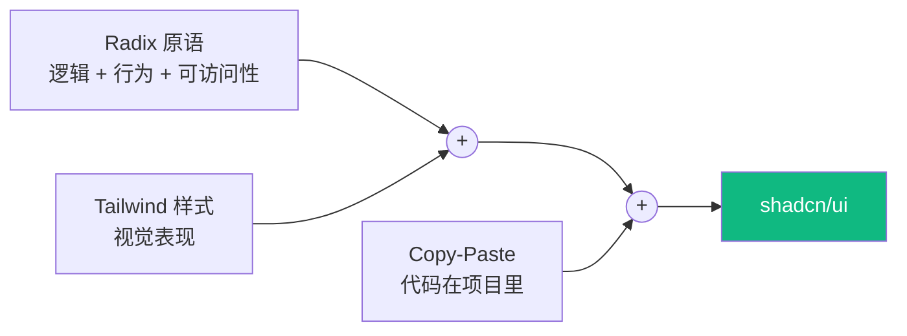

### 5.2 代码走读：Button

```tsx
import * as React from "react"
import { Slot } from "@radix-ui/react-slot"       // ← Radix 的 Slot
import { cva, type VariantProps } from "class-variance-authority"  // ← CVA 管理变体
import { cn } from "@/lib/utils"                  // ← 类名合并工具

const buttonVariants = cva(
  "inline-flex items-center justify-center ...",  // ← 基础样式
  {
    variants: {
      variant: {
        default: "bg-primary text-primary-foreground ...",
        destructive: "bg-destructive ...",
        outline: "border border-input ...",
        // ...
      },
      size: {
        default: "h-9 px-4 py-2",
        sm: "h-8 rounded-md px-3 text-xs",
        lg: "h-10 rounded-md px-8",
        icon: "h-9 w-9",
      },
    },
    defaultVariants: { variant: "default", size: "default" },
  }
)

const Button = React.forwardRef<HTMLButtonElement, ButtonProps>(
  ({ className, variant, size, asChild = false, ...props }, ref) => {
    const Comp = asChild ? Slot : "button"  // ← 支持 asChild 模式
    return (
      <Comp
        className={cn(buttonVariants({ variant, size, className }))}
        ref={ref}
        {...props}
      />
    )
  }
)

export { Button, buttonVariants }
```

**技术栈拆解：**

| 技术 | 作用 |
|------|------|
| **@radix-ui/react-slot** | 支持 asChild，避免额外 DOM |
| **class-variance-authority (CVA)** | 管理 Tailwind 变体组合 |
| **cn() = clsx + tailwind-merge** | 合并类名，解决冲突 |

### 5.3 代码走读：Dialog

```tsx
import * as DialogPrimitive from "@radix-ui/react-dialog"

// 直接导出 Radix 原语
const Dialog = DialogPrimitive.Root
const DialogTrigger = DialogPrimitive.Trigger
const DialogPortal = DialogPrimitive.Portal
const DialogClose = DialogPrimitive.Close

// 包装样式
const DialogOverlay = React.forwardRef(({ className, ...props }, ref) => (
  <DialogPrimitive.Overlay
    ref={ref}
    className={cn(
      "fixed inset-0 z-50 bg-black/80",
      "data-[state=open]:animate-in data-[state=closed]:animate-out",
      "data-[state=closed]:fade-out-0 data-[state=open]:fade-in-0",
      className
    )}
    {...props}
  />
))

const DialogContent = React.forwardRef(({ className, children, ...props }, ref) => (
  <DialogPortal>
    <DialogOverlay />
    <DialogPrimitive.Content
      ref={ref}
      className={cn(
        "fixed left-[50%] top-[50%] z-50 ...",
        "data-[state=open]:animate-in data-[state=closed]:animate-out",
        className
      )}
      {...props}
    >
      {children}
      {/* 内置关闭按钮 */}
      <DialogPrimitive.Close className="absolute right-4 top-4 ...">
        <X className="h-4 w-4" />
        <span className="sr-only">Close</span>
      </DialogPrimitive.Close>
    </DialogPrimitive.Content>
  </DialogPortal>
))

// 便利组件
const DialogHeader = ({ className, ...props }) => (
  <div className={cn("flex flex-col space-y-1.5 ...", className)} {...props} />
)

const DialogFooter = ({ className, ...props }) => (
  <div className={cn("flex flex-col-reverse sm:flex-row ...", className)} {...props} />
)

const DialogTitle = React.forwardRef(({ className, ...props }, ref) => (
  <DialogPrimitive.Title
    ref={ref}
    className={cn("text-lg font-semibold ...", className)}
    {...props}
  />
))

const DialogDescription = React.forwardRef(({ className, ...props }, ref) => (
  <DialogPrimitive.Description
    ref={ref}
    className={cn("text-sm text-muted-foreground", className)}
    {...props}
  />
))
```

**shadcn/ui 的封装策略：**

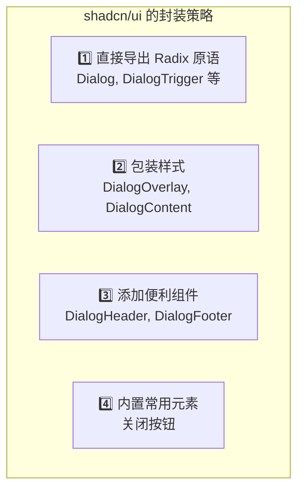

### 5.4 使用对比

**使用 shadcn/ui 的 Dialog：**

```tsx
<Dialog>
  <DialogTrigger asChild>
    <Button>打开对话框</Button>
  </DialogTrigger>
  <DialogContent>
    <DialogHeader>
      <DialogTitle>确认删除</DialogTitle>
      <DialogDescription>
        此操作不可撤销。确定要删除这条记录吗？
      </DialogDescription>
    </DialogHeader>
    <DialogFooter>
      <Button variant="outline">取消</Button>
      <Button variant="destructive">删除</Button>
    </DialogFooter>
  </DialogContent>
</Dialog>
```

> ✅ 简洁、清晰、可定制

---

## 📖 Section 6：常用 Radix 组件实战

### 6.1 Select 选择器

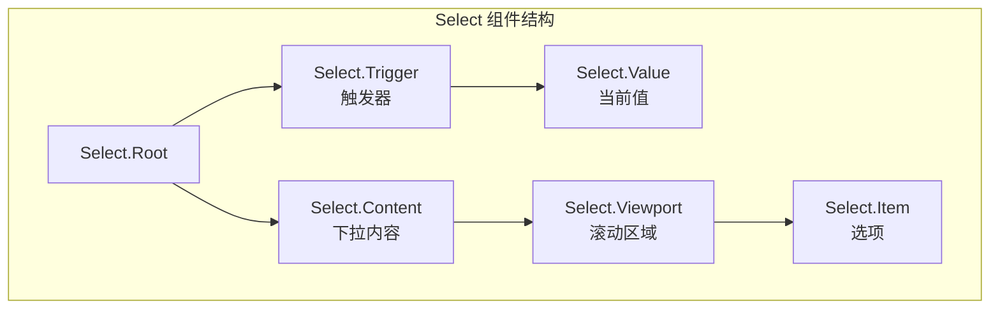

**完整示例：用户角色选择器**

```tsx
import * as Select from '@radix-ui/react-select'
import { ChevronDown, Check } from 'lucide-react'

const roles = [
  { value: 'admin', label: '管理员', description: '拥有所有权限' },
  { value: 'editor', label: '编辑者', description: '可以编辑内容' },
  { value: 'viewer', label: '查看者', description: '只能查看内容' },
]

function RoleSelect({ value, onValueChange }) {
  return (
    <Select.Root value={value} onValueChange={onValueChange}>
      <Select.Trigger
        className="inline-flex items-center justify-between
          w-[200px] px-3 py-2 text-sm
          border rounded-md bg-white
          focus:outline-none focus:ring-2 focus:ring-blue-500"
      >
        <Select.Value placeholder="选择角色..." />
        <Select.Icon>
          <ChevronDown className="w-4 h-4 text-gray-500" />
        </Select.Icon>
      </Select.Trigger>

      <Select.Portal>
        <Select.Content
          className="overflow-hidden bg-white rounded-md shadow-lg
            border animate-in fade-in-0 zoom-in-95"
          position="popper"
          sideOffset={4}
        >
          <Select.Viewport className="p-1">
            {roles.map((role) => (
              <Select.Item
                key={role.value}
                value={role.value}
                className="relative flex items-center px-8 py-2 text-sm
                  rounded cursor-pointer select-none
                  data-[highlighted]:bg-blue-50
                  data-[highlighted]:outline-none"
              >
                <Select.ItemIndicator className="absolute left-2">
                  <Check className="w-4 h-4 text-blue-500" />
                </Select.ItemIndicator>
                <div>
                  <Select.ItemText>{role.label}</Select.ItemText>
                  <p className="text-xs text-gray-500">{role.description}</p>
                </div>
              </Select.Item>
            ))}
          </Select.Viewport>
        </Select.Content>
      </Select.Portal>
    </Select.Root>
  )
}
```

**Select 组件的关键特性：**

| 特性 | 说明 | 对应 Prop |
|------|------|----------|
| **位置控制** | 下拉位置自动调整 | `position="popper"` |
| **键盘导航** | 上下键选择，Enter 确认 | 内置 |
| **搜索过滤** | 输入字母快速定位 | 内置 |
| **分组支持** | 支持 Select.Group | `Select.Label` |

### 6.2 DropdownMenu 下拉菜单

```tsx
import * as DropdownMenu from '@radix-ui/react-dropdown-menu'
import { Settings, User, LogOut, ChevronRight } from 'lucide-react'

function UserMenu() {
  return (
    <DropdownMenu.Root>
      <DropdownMenu.Trigger asChild>
        <button className="flex items-center gap-2 px-3 py-2 rounded-full
          hover:bg-gray-100 focus:outline-none focus:ring-2">
          
          <span>张三</span>
        </button>
      </DropdownMenu.Trigger>

      <DropdownMenu.Portal>
        <DropdownMenu.Content
          className="min-w-[220px] bg-white rounded-md shadow-lg border p-1
            animate-in fade-in-0 zoom-in-95"
          sideOffset={5}
        >
          {/* 普通菜单项 */}
          <DropdownMenu.Item
            className="flex items-center gap-2 px-3 py-2 text-sm rounded
              cursor-pointer outline-none
              data-[highlighted]:bg-gray-100"
          >
            <User className="w-4 h-4" />
            个人资料
          </DropdownMenu.Item>

          <DropdownMenu.Item className="flex items-center gap-2 px-3 py-2 text-sm rounded
            cursor-pointer outline-none data-[highlighted]:bg-gray-100">
            <Settings className="w-4 h-4" />
            设置
          </DropdownMenu.Item>

          {/* 分割线 */}
          <DropdownMenu.Separator className="h-px bg-gray-200 my-1" />

          {/* 子菜单 */}
          <DropdownMenu.Sub>
            <DropdownMenu.SubTrigger
              className="flex items-center justify-between px-3 py-2 text-sm
                rounded cursor-pointer outline-none
                data-[highlighted]:bg-gray-100"
            >
              主题
              <ChevronRight className="w-4 h-4" />
            </DropdownMenu.SubTrigger>
            
            <DropdownMenu.Portal>
              <DropdownMenu.SubContent
                className="min-w-[160px] bg-white rounded-md shadow-lg border p-1"
                sideOffset={2}
              >
                <DropdownMenu.RadioGroup value="system">
                  <DropdownMenu.RadioItem value="light" className="...">
                    浅色
                  </DropdownMenu.RadioItem>
                  <DropdownMenu.RadioItem value="dark" className="...">
                    深色
                  </DropdownMenu.RadioItem>
                  <DropdownMenu.RadioItem value="system" className="...">
                    跟随系统
                  </DropdownMenu.RadioItem>
                </DropdownMenu.RadioGroup>
              </DropdownMenu.SubContent>
            </DropdownMenu.Portal>
          </DropdownMenu.Sub>

          <DropdownMenu.Separator className="h-px bg-gray-200 my-1" />

          {/* 危险操作 */}
          <DropdownMenu.Item
            className="flex items-center gap-2 px-3 py-2 text-sm text-red-600
              rounded cursor-pointer outline-none
              data-[highlighted]:bg-red-50"
          >
            <LogOut className="w-4 h-4" />
            退出登录
          </DropdownMenu.Item>
        </DropdownMenu.Content>
      </DropdownMenu.Portal>
    </DropdownMenu.Root>
  )
}
```

### 6.3 Tabs 标签页

```tsx
import * as Tabs from '@radix-ui/react-tabs'

function SettingsTabs() {
  return (
    <Tabs.Root defaultValue="profile" className="w-full">
      {/* Tab 列表 */}
      <Tabs.List className="flex border-b">
        <Tabs.Trigger
          value="profile"
          className="px-4 py-2 text-sm font-medium
            border-b-2 border-transparent
            data-[state=active]:border-blue-500
            data-[state=active]:text-blue-600
            hover:text-gray-700"
        >
          个人资料
        </Tabs.Trigger>
        
        <Tabs.Trigger
          value="security"
          className="px-4 py-2 text-sm font-medium
            border-b-2 border-transparent
            data-[state=active]:border-blue-500
            data-[state=active]:text-blue-600
            hover:text-gray-700"
        >
          安全设置
        </Tabs.Trigger>
        
        <Tabs.Trigger
          value="notifications"
          className="px-4 py-2 text-sm font-medium
            border-b-2 border-transparent
            data-[state=active]:border-blue-500
            data-[state=active]:text-blue-600
            hover:text-gray-700"
        >
          通知设置
        </Tabs.Trigger>
      </Tabs.List>

      {/* Tab 内容 */}
      <Tabs.Content value="profile" className="p-4">
        <h3 className="text-lg font-medium mb-4">个人资料</h3>
        <form className="space-y-4">
          <div>
            <label className="block text-sm font-medium mb-1">用户名</label>
            <input type="text" className="w-full px-3 py-2 border rounded" />
          </div>
          <div>
            <label className="block text-sm font-medium mb-1">邮箱</label>
            <input type="email" className="w-full px-3 py-2 border rounded" />
          </div>
        </form>
      </Tabs.Content>

      <Tabs.Content value="security" className="p-4">
        <h3 className="text-lg font-medium mb-4">安全设置</h3>
        <div className="space-y-4">
          <button className="px-4 py-2 bg-blue-500 text-white rounded">
            修改密码
          </button>
          <button className="px-4 py-2 border rounded">
            启用两步验证
          </button>
        </div>
      </Tabs.Content>

      <Tabs.Content value="notifications" className="p-4">
        <h3 className="text-lg font-medium mb-4">通知设置</h3>
        {/* 内容... */}
      </Tabs.Content>
    </Tabs.Root>
  )
}
```

### 6.4 Tooltip 提示框

```tsx
import * as Tooltip from '@radix-ui/react-tooltip'

function TooltipDemo() {
  return (
    <Tooltip.Provider delayDuration={200}>
      <Tooltip.Root>
        <Tooltip.Trigger asChild>
          <button className="p-2 rounded hover:bg-gray-100">
            <HelpCircle className="w-5 h-5 text-gray-500" />
          </button>
        </Tooltip.Trigger>
        
        <Tooltip.Portal>
          <Tooltip.Content
            className="px-3 py-1.5 text-sm text-white bg-gray-900 rounded
              animate-in fade-in-0 zoom-in-95
              data-[side=top]:slide-in-from-bottom-2
              data-[side=bottom]:slide-in-from-top-2"
            sideOffset={5}
          >
            这是一个提示信息
            <Tooltip.Arrow className="fill-gray-900" />
          </Tooltip.Content>
        </Tooltip.Portal>
      </Tooltip.Root>
    </Tooltip.Provider>
  )
}
```

**Tooltip 配置选项：**

| 属性 | 说明 | 默认值 |
|------|------|--------|
| `delayDuration` | 显示延迟 | 700ms |
| `skipDelayDuration` | 快速切换时延迟 | 300ms |
| `disableHoverableContent` | 禁用悬停内容 | false |
| `sideOffset` | 与触发器的距离 | 0 |
| `side` | 显示位置 | "top" |

### 6.5 Popover 弹出框

```tsx
import * as Popover from '@radix-ui/react-popover'
import { Calendar } from 'lucide-react'

function DatePicker() {
  const [date, setDate] = useState<Date | null>(null)
  
  return (
    <Popover.Root>
      <Popover.Trigger asChild>
        <button className="flex items-center gap-2 px-3 py-2 border rounded
          hover:bg-gray-50">
          <Calendar className="w-4 h-4" />
          {date ? format(date, 'yyyy-MM-dd') : '选择日期'}
        </button>
      </Popover.Trigger>

      <Popover.Portal>
        <Popover.Content
          className="w-auto p-4 bg-white rounded-lg shadow-lg border
            animate-in fade-in-0 zoom-in-95"
          sideOffset={5}
        >
          {/* 日历组件 */}
          <CalendarComponent
            selected={date}
            onSelect={setDate}
          />
          
          <Popover.Arrow className="fill-white" />
        </Popover.Content>
      </Popover.Portal>
    </Popover.Root>
  )
}
```

### 6.6 AlertDialog 确认弹窗

> AlertDialog 与 Dialog 的区别：**AlertDialog 不能通过点击外部关闭**，必须明确操作。

```tsx
import * as AlertDialog from '@radix-ui/react-alert-dialog'

function DeleteConfirm({ onConfirm }) {
  return (
    <AlertDialog.Root>
      <AlertDialog.Trigger asChild>
        <button className="px-4 py-2 bg-red-500 text-white rounded">
          删除账户
        </button>
      </AlertDialog.Trigger>

      <AlertDialog.Portal>
        <AlertDialog.Overlay className="fixed inset-0 bg-black/50" />
        
        <AlertDialog.Content
          className="fixed top-1/2 left-1/2 -translate-x-1/2 -translate-y-1/2
            w-[400px] bg-white rounded-lg p-6 shadow-xl"
        >
          <AlertDialog.Title className="text-lg font-semibold">
            确认删除账户？
          </AlertDialog.Title>
          
          <AlertDialog.Description className="mt-2 text-gray-600">
            此操作不可撤销。删除后，您的所有数据将被永久删除。
          </AlertDialog.Description>

          <div className="flex justify-end gap-3 mt-6">
            <AlertDialog.Cancel asChild>
              <button className="px-4 py-2 border rounded hover:bg-gray-50">
                取消
              </button>
            </AlertDialog.Cancel>
            
            <AlertDialog.Action asChild>
              <button
                onClick={onConfirm}
                className="px-4 py-2 bg-red-500 text-white rounded
                  hover:bg-red-600"
              >
                确认删除
              </button>
            </AlertDialog.Action>
          </div>
        </AlertDialog.Content>
      </AlertDialog.Portal>
    </AlertDialog.Root>
  )
}
```

**Dialog vs AlertDialog：**

| 特性 | Dialog | AlertDialog |
|------|--------|-------------|
| **点击外部** | 关闭 | 不关闭 |
| **ESC 键** | 关闭 | 关闭 |
| **用途** | 一般弹窗 | 确认/危险操作 |
| **Action/Cancel** | 没有 | 有专门组件 |

### 6.7 组件组合实战：命令面板 (Command Palette)

```tsx
import * as Dialog from '@radix-ui/react-dialog'
import { Command } from 'cmdk'  // 搭配 cmdk 库使用

function CommandPalette() {
  const [open, setOpen] = useState(false)
  
  // 快捷键监听
  useEffect(() => {
    const down = (e: KeyboardEvent) => {
      if (e.key === 'k' && (e.metaKey || e.ctrlKey)) {
        e.preventDefault()
        setOpen((open) => !open)
      }
    }
    document.addEventListener('keydown', down)
    return () => document.removeEventListener('keydown', down)
  }, [])

  return (
    <Dialog.Root open={open} onOpenChange={setOpen}>
      <Dialog.Portal>
        <Dialog.Overlay className="fixed inset-0 bg-black/50 backdrop-blur-sm" />
        
        <Dialog.Content
          className="fixed top-[20%] left-1/2 -translate-x-1/2
            w-[640px] bg-white rounded-xl shadow-2xl overflow-hidden"
        >
          <Command className="[&_[cmdk-input]]:px-4 [&_[cmdk-input]]:py-3">
            <Command.Input
              placeholder="输入命令或搜索..."
              className="w-full border-b outline-none"
            />
            
            <Command.List className="max-h-[300px] overflow-auto p-2">
              <Command.Empty className="p-4 text-center text-gray-500">
                未找到结果
              </Command.Empty>
              
              <Command.Group heading="导航">
                <Command.Item className="px-3 py-2 rounded cursor-pointer
                  data-[selected=true]:bg-blue-50">
                  🏠 首页
                </Command.Item>
                <Command.Item className="px-3 py-2 rounded cursor-pointer
                  data-[selected=true]:bg-blue-50">
                  📊 仪表盘
                </Command.Item>
              </Command.Group>
              
              <Command.Group heading="操作">
                <Command.Item className="px-3 py-2 rounded cursor-pointer
                  data-[selected=true]:bg-blue-50">
                  ➕ 新建文档
                </Command.Item>
                <Command.Item className="px-3 py-2 rounded cursor-pointer
                  data-[selected=true]:bg-blue-50">
                  🔍 搜索
                </Command.Item>
              </Command.Group>
            </Command.List>
          </Command>
        </Dialog.Content>
      </Dialog.Portal>
    </Dialog.Root>
  )
}
```

### 6.8 2025 新增原语（Preview）

> 💡 **最新更新**：Radix UI 在 2025 年新增了多个实用原语，目前处于 Preview 阶段。

#### PasswordToggleField（2025 年 5 月）

```tsx
import { unstable_PasswordToggleField as PasswordToggleField } from "radix-ui"
import { EyeOpenIcon, EyeClosedIcon } from "@radix-ui/react-icons"

function PasswordField() {
  return (
    <PasswordToggleField.Root>
      <PasswordToggleField.Input 
        placeholder="输入密码"
        className="px-3 py-2 border rounded"
      />
      <PasswordToggleField.Toggle className="absolute right-2 top-1/2 -translate-y-1/2">
        <PasswordToggleField.Icon
          visible={<EyeOpenIcon />}
          hidden={<EyeClosedIcon />}
        />
      </PasswordToggleField.Toggle>
    </PasswordToggleField.Root>
  )
}
```

**PasswordToggleField 特性：**

| 特性 | 说明 |
|------|------|
| **焦点管理** | 指针切换时返回输入框焦点，键盘切换时保持焦点 |
| **自动重置** | 表单提交后自动隐藏密码，防止意外存储 |
| **无障碍标签** | 图标按钮自动提供无障碍标签 |

#### OneTimePasswordField（2025 年 4 月）

```tsx
import { unstable_OneTimePasswordField as OneTimePasswordField } from "radix-ui"

function OTPVerify() {
  return (
    <OneTimePasswordField.Root 
      onComplete={(value) => console.log('OTP:', value)}
    >
      <div className="flex gap-2">
        <OneTimePasswordField.Input className="w-12 h-12 text-center border rounded" />
        <OneTimePasswordField.Input className="w-12 h-12 text-center border rounded" />
        <OneTimePasswordField.Input className="w-12 h-12 text-center border rounded" />
        <span className="flex items-center">-</span>
        <OneTimePasswordField.Input className="w-12 h-12 text-center border rounded" />
        <OneTimePasswordField.Input className="w-12 h-12 text-center border rounded" />
        <OneTimePasswordField.Input className="w-12 h-12 text-center border rounded" />
      </div>
      <OneTimePasswordField.HiddenInput name="otp" />
    </OneTimePasswordField.Root>
  )
}
```

**OneTimePasswordField 特性：**

| 特性 | 说明 |
|------|------|
| **键盘导航** | 行为模拟单个输入框 |
| **粘贴支持** | 粘贴时自动覆盖值 |
| **密码管理器** | 支持自动填充 |
| **输入验证** | 支持数字/字母数字验证 |
| **自动提交** | 完成时自动提交 |
| **隐藏输入** | 提供单一值给表单数据 |

### 6.9 radix-ui 统一包（推荐）

> **2025 年 1 月新增**：推荐使用 `radix-ui` 统一包代替单独安装。

```bash
# 推荐：统一包（Tree-shakeable）
npm install radix-ui

# 不再推荐：单独安装
npm install @radix-ui/react-dialog @radix-ui/react-dropdown-menu
```

**使用方式对比：**

```tsx
// ✅ 推荐：从统一包导入
import { Dialog, DropdownMenu, Tooltip } from "radix-ui"

// ⚠️ 旧方式：仍然支持，但不推荐
import * as Dialog from "@radix-ui/react-dialog"
import * as DropdownMenu from "@radix-ui/react-dropdown-menu"
```

**统一包优势：**

| 优势 | 说明 |
|------|------|
| **防止版本冲突** | 所有原语版本统一 |
| **减少重复依赖** | 共享依赖只安装一次 |
| **更新方便** | 一次更新所有原语 |
| **Tree-shakeable** | 只打包使用的组件 |

---

## 📖 Section 7：Headless UI 横向对比

### 7.1 主要 Headless UI 库

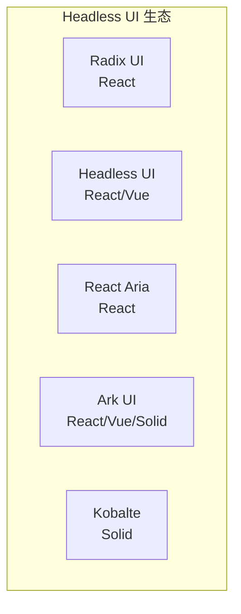

### 7.2 详细对比表

| 特性 | Radix UI | Headless UI | React Aria | Ark UI |
|------|----------|-------------|------------|--------|
| **框架支持** | React | React, Vue | React | React, Vue, Solid |
| **组件数量** | 30+ | 10+ | 40+ | 25+ |
| **Composition 模式** | ✅ 强 | ⚠️ 中 | ✅ 强 | ✅ 强 |
| **可访问性** | WCAG 2.1 AA | WCAG 2.1 AA | WCAG 2.1 AAA | WCAG 2.1 AA |
| **动画支持** | data-state + CSS | 内置 Transition | 需自行实现 | 需自行实现 |
| **文档质量** | ⭐⭐⭐⭐⭐ | ⭐⭐⭐⭐ | ⭐⭐⭐⭐⭐ | ⭐⭐⭐⭐ |
| **维护者** | WorkOS | Tailwind Labs | Adobe | Chakra UI 团队 |
| **React 19 支持** | ✅ 完整 | ✅ 完整 | ✅ 完整 | ✅ 完整 |
| **RSC 支持** | ✅ 完整 | ⚠️ 部分 | ✅ 完整 | ⚠️ 部分 |
| **统一包** | ✅ radix-ui | ❌ | ❌ | ❌ |

### 7.3 各库优劣势分析

```mermaid
graph TB
    subgraph Radix["Radix UI"]
        R1["✅ Composition 最成熟"]
        R2["✅ 组件最丰富"]
        R3["✅ shadcn/ui 生态"]
        R4["❌ 只支持 React"]
        R5["❌ 没有内置动画"]
    end
    
    subgraph HeadlessUI["Headless UI"]
        H1["✅ 支持 React + Vue"]
        H2["✅ 内置 transition"]
        H3["✅ Bundle 小"]
        H4["❌ 组件数量少"]
        H5["❌ Composition 不够灵活"]
    end
    
    subgraph ReactAria["React Aria"]
        A1["✅ 可访问性最强 (AAA)"]
        A2["✅ 组件最多 (40+)"]
        A3["✅ 文档详细"]
        A4["❌ 学习曲线陡峭"]
        A5["❌ Bundle 最大"]
    end
```

### 7.4 选型建议

| 场景 | 推荐方案 | 理由 |
|------|---------|------|
| **React + Tailwind** | Radix UI + shadcn/ui | 生态最成熟 |
| **Vue + Tailwind** | Headless UI | 官方支持 Vue |
| **可访问性要求极高** | React Aria | WCAG AAA 级别 |
| **Solid 项目** | Kobalte | Solid 最佳选择 |
| **多框架支持** | Ark UI | 支持 React/Vue/Solid |

### 7.5 实际案例

| 公司 | 使用的库 | 场景 |
|------|---------|------|
| **Vercel** | Radix UI | 高度定制化 |
| **Linear** | Radix UI | 极致交互体验 |
| **GitHub** | React Aria（部分） | 可访问性要求高 |
| **Tailwind UI** | Headless UI | 官方示例 |

---

## 📖 Section 8：常见问题 FAQ

### Q1: Radix UI 和 Headless UI 怎么选？

```mermaid
flowchart TD
    Start["项目选型"] --> Framework{"你用什么框架？"}
    
    Framework -->|React| React{"需要 Tailwind？"}
    Framework -->|Vue| Vue["Headless UI"]
    Framework -->|Solid| Solid["Kobalte"]
    
    React -->|Yes| Shadcn{"想用 shadcn/ui？"}
    React -->|No| Other["都可以"]
    
    Shadcn -->|Yes| Radix["Radix UI"]
    Shadcn -->|No| Both["都可以，看组件需求"]
```

**简单结论：**
- 用 React + Tailwind + 想用 shadcn/ui → **Radix UI**
- 用 Vue → **Headless UI**
- 可访问性要求极高 → **React Aria**

### Q2: asChild 和 forwardRef 有什么关系？

```tsx
// 常见错误：自定义组件没有 forwardRef
function MyButton({ children, ...props }) {
  return <button {...props}>{children}</button>
}

// ❗ 这样会出问题，因为 ref 不会传递
<Dialog.Trigger asChild>
  <MyButton>Open</MyButton>  {/* ref 丢失！ */}
</Dialog.Trigger>

// ✅ 正确做法：使用 forwardRef
const MyButton = React.forwardRef<HTMLButtonElement, ButtonProps>(
  ({ children, ...props }, ref) => {
    return <button ref={ref} {...props}>{children}</button>
  }
)

<Dialog.Trigger asChild>
  <MyButton>Open</MyButton>  {/* ref 正确传递 */}
</Dialog.Trigger>
```

> 💡 **记住**：任何要与 `asChild` 配合使用的自定义组件，都必须使用 `forwardRef`

### Q3: 如何在 Radix 组件中添加动画？

**方法 1：使用 CSS + data-state**

```css
/* tailwind.css */
@keyframes slideDown {
  from { opacity: 0; transform: translateY(-10px); }
  to { opacity: 1; transform: translateY(0); }
}

@keyframes slideUp {
  from { opacity: 1; transform: translateY(0); }
  to { opacity: 0; transform: translateY(-10px); }
}

.dropdown-content[data-state="open"] {
  animation: slideDown 200ms ease-out;
}

.dropdown-content[data-state="closed"] {
  animation: slideUp 200ms ease-in;
}
```

**方法 2：使用 Tailwind animate-in/out**

```tsx
<DropdownMenu.Content
  className="data-[state=open]:animate-in data-[state=closed]:animate-out
    data-[state=closed]:fade-out-0 data-[state=open]:fade-in-0
    data-[state=closed]:zoom-out-95 data-[state=open]:zoom-in-95
    data-[side=bottom]:slide-in-from-top-2
    data-[side=top]:slide-in-from-bottom-2"
/>
```

**方法 3：使用 Framer Motion**

```tsx
import { AnimatePresence, motion } from 'framer-motion'

<Dialog.Root open={open} onOpenChange={setOpen}>
  <AnimatePresence>
    {open && (
      <Dialog.Portal forceMount>
        <Dialog.Content asChild>
          <motion.div
            initial={{ opacity: 0, scale: 0.95 }}
            animate={{ opacity: 1, scale: 1 }}
            exit={{ opacity: 0, scale: 0.95 }}
          >
            {/* content */}
          </motion.div>
        </Dialog.Content>
      </Dialog.Portal>
    )}
  </AnimatePresence>
</Dialog.Root>
```

### Q4: Portal 导致样式不生效怎么办？

```tsx
// 问题：CSS 作用域限制，Portal 内容在 body 下，父组件样式不生效

// 方案 1：使用全局样式
// globals.css
[data-radix-portal] {
  /* 全局样式 */
}

// 方案 2：指定 Portal 容器
const [container, setContainer] = useState<HTMLElement | null>(null)

<div ref={setContainer}>
  <Dialog.Root>
    <Dialog.Portal container={container}>
      {/* 渲染到父容器内，样式作用域正常 */}
    </Dialog.Portal>
  </Dialog.Root>
</div>

// 方案 3：Tailwind 内联样式（推荐）
<Dialog.Content className="fixed ... bg-white rounded-lg">
  {/* Tailwind 不受作用域影响 */}
</Dialog.Content>
```

### Q5: 如何处理 Radix 组件的 TypeScript 类型？

```tsx
import * as Dialog from '@radix-ui/react-dialog'
import { ComponentPropsWithoutRef } from 'react'

// 获取组件的 Props 类型
type DialogContentProps = ComponentPropsWithoutRef<typeof Dialog.Content>

// 扩展组件
interface CustomDialogProps extends DialogContentProps {
  title: string
  description?: string
}

const CustomDialog = React.forwardRef<
  React.ElementRef<typeof Dialog.Content>,
  CustomDialogProps
>(({ title, description, children, ...props }, ref) => (
  <Dialog.Content ref={ref} {...props}>
    <Dialog.Title>{title}</Dialog.Title>
    {description && <Dialog.Description>{description}</Dialog.Description>}
    {children}
  </Dialog.Content>
))

// 使用
<CustomDialog
  title="确认删除"
  description="此操作不可撤销"
  onOpenAutoFocus={(e) => e.preventDefault()}
>
  {/* content */}
</CustomDialog>
```

### Q6: Radix 组件在 SSR/Next.js 中有问题吗？

```tsx
// Radix 完全支持 SSR，但有些注意事项：

// 1. Portal 需要客户端渲染
function ClientOnlyDialog() {
  const [mounted, setMounted] = useState(false)
  
  useEffect(() => {
    setMounted(true)
  }, [])
  
  if (!mounted) return null
  
  return (
    <Dialog.Root>
      {/* ... */}
    </Dialog.Root>
  )
}

// 2. 使用 'use client' 指令 (Next.js App Router)
'use client'

import * as Dialog from '@radix-ui/react-dialog'

export function MyDialog() {
  // 客户端组件
}

// 3. Hydration 错误处理
// 如果遇到 hydration mismatch，检查：
// - 是否使用了服务器特定的值
// - Portal 容器是否在服务器端存在
```

### Q7: 如何测试 Radix 组件？

```tsx
import { render, screen } from '@testing-library/react'
import userEvent from '@testing-library/user-event'
import * as Dialog from '@radix-ui/react-dialog'

describe('Dialog', () => {
  it('应该能打开和关闭', async () => {
    const user = userEvent.setup()
    
    render(
      <Dialog.Root>
        <Dialog.Trigger>打开</Dialog.Trigger>
        <Dialog.Portal>
          <Dialog.Content>
            <Dialog.Title>标题</Dialog.Title>
            <Dialog.Close>关闭</Dialog.Close>
          </Dialog.Content>
        </Dialog.Portal>
      </Dialog.Root>
    )
    
    // Dialog 初始关闭
    expect(screen.queryByRole('dialog')).not.toBeInTheDocument()
    
    // 点击打开
    await user.click(screen.getByText('打开'))
    expect(screen.getByRole('dialog')).toBeInTheDocument()
    
    // ESC 关闭
    await user.keyboard('{Escape}')
    expect(screen.queryByRole('dialog')).not.toBeInTheDocument()
  })
  
  it('应该正确管理焦点', async () => {
    const user = userEvent.setup()
    
    render(
      <Dialog.Root>
        <Dialog.Trigger data-testid="trigger">打开</Dialog.Trigger>
        <Dialog.Portal>
          <Dialog.Content>
            <input data-testid="input" />
            <Dialog.Close>关闭</Dialog.Close>
          </Dialog.Content>
        </Dialog.Portal>
      </Dialog.Root>
    )
    
    const trigger = screen.getByTestId('trigger')
    await user.click(trigger)
    
    // 焦点应该移到 Dialog 内
    const input = screen.getByTestId('input')
    input.focus()
    expect(document.activeElement).toBe(input)
    
    // 关闭后焦点应该回到触发器
    await user.keyboard('{Escape}')
    expect(document.activeElement).toBe(trigger)
  })
})
```

### Q8: 如何实现受控和非受控切换？

```tsx
// 创建一个支持两种模式的组件
interface ControlledDialogProps {
  // 受控 props
  open?: boolean
  onOpenChange?: (open: boolean) => void
  // 非受控 props
  defaultOpen?: boolean
  // 共同 props
  trigger: React.ReactNode
  children: React.ReactNode
}

function SmartDialog({
  open,
  onOpenChange,
  defaultOpen,
  trigger,
  children,
}: ControlledDialogProps) {
  // 判断是否受控
  const isControlled = open !== undefined
  
  return (
    <Dialog.Root
      // 受控模式
      {...(isControlled && {
        open,
        onOpenChange,
      })}
      // 非受控模式
      {...(!isControlled && {
        defaultOpen,
        onOpenChange,  // 仍然可以监听变化
      })}
    >
      <Dialog.Trigger asChild>{trigger}</Dialog.Trigger>
      <Dialog.Portal>
        <Dialog.Overlay className="fixed inset-0 bg-black/50" />
        <Dialog.Content className="fixed top-1/2 left-1/2 ...">
          {children}
        </Dialog.Content>
      </Dialog.Portal>
    </Dialog.Root>
  )
}

// 使用方式 1：非受控
<SmartDialog
  defaultOpen={false}
  trigger={<Button>打开</Button>}
>
  内容
</SmartDialog>

// 使用方式 2：受控
const [open, setOpen] = useState(false)
<SmartDialog
  open={open}
  onOpenChange={setOpen}
  trigger={<Button>打开</Button>}
>
  内容
</SmartDialog>
```

---

## 📋 Closing：总结与实践建议

### 核心要点速查

```mermaid
graph TB
    subgraph Summary["📝 本课核心要点"]
        S1["1️⃣ Headless UI 的本质<br/>分离逻辑与样式"]
        S2["2️⃣ Composition 模式<br/>原语自由组合"]
        S3["3️⃣ 可访问性原语<br/>ARIA + 焦点 + 键盘"]
        S4["4️⃣ shadcn/ui = Radix + Tailwind<br/>核心逻辑来自 Radix"]
    end
```

### ✅ 实践建议清单

#### 建议 1：从 shadcn/ui 开始

```bash
npx shadcn-ui@latest init
npx shadcn-ui@latest add button dialog select
```

> 看 shadcn/ui 如何封装 Radix，学习设计模式

#### 建议 2：理解 Composition 模式

- 不要把它当"麻烦"，而是"灵活性"
- 试着自己组合一个复杂的 Dialog

#### 建议 3：学习可访问性基础

| 概念 | 说明 |
|------|------|
| **ARIA 属性** | role、aria-label、aria-describedby |
| **焦点管理** | 打开聚焦、关闭恢复 |
| **键盘导航** | Tab、ESC、Arrow Keys |
| **屏幕阅读器** | VoiceOver、NVDA |

#### 建议 4：建立团队组件库

```
my-ui/
  components/
    button.tsx
    dialog.tsx
    select.tsx
  lib/
    utils.ts
  styles/
    globals.css
```

#### 建议 5：拥抱 AI

```
Prompt: "用 Radix Dialog 和 Tailwind 写一个确认删除对话框，
        要有警告图标、红色按钮、模糊背景"
```

> AI 生成的代码质量很高，因为 Radix 的结构清晰、可预测

### 📋 知识点速查表

| 概念 | 定义 | 关键点 |
|------|------|--------|
| **Headless UI** | 只提供逻辑，不提供样式 | 分离逻辑与样式 |
| **Composition 模式** | 拆分成原语，自由组合 | Dialog.Root/Trigger/Content |
| **asChild** | 合并 props 到子元素 | 避免额外 DOM 节点 |
| **焦点陷阱** | Tab 在组件内循环 | Focus Trap |
| **ARIA** | 可访问性富互联网应用 | role、aria-* 属性 |

---

## 📚 下节课预告

> **第 4 课：Design to Code（上）— AI 如何从设计稿生成代码**

- Figma 的设计系统：如何建立可被 AI 理解的设计
- v0.dev 的原理：Vercel 的 AI 设计工具如何工作
- 从设计到代码的完整流程

> 💡 为什么先讲 Radix + shadcn/ui？因为它们是 Design to Code 的基础。AI 生成的代码，大部分都是基于 Radix + Tailwind 的。

---

**课程时间分配：**
| 部分 | 时长 |
|------|------|
| Opening: shadcn/ui 的秘密 | 10 min |
| Section 1: 什么是 Headless UI | 15 min |
| Section 2: Composition 模式 | 20 min |
| Section 3: 可访问性原语 | 20 min |
| Section 4: 核心技术深度解析 | 25 min |
| Section 5: shadcn/ui 构建分析 | 15 min |
| Section 6: 常用组件实战 | 25 min |
| Section 7: 横向对比 | 15 min |
| Section 8: 常见问题 FAQ | 10 min |
| Closing + Q&A | 15 min |
| **总计** | **约 2.5-3 小时** |
