# 第4课：Design to Code（上）- 设计工具的 AI 革命

**受众**：具备项目与工程化经验的前端工程师
**时长**：2.5小时
**讲师**：[您的名字]

---

## Opening Hook（10分钟）

大家好!欢迎来到第4课。

在开始今天的内容之前,我想先给大家讲一个真实的故事。

去年年底,我们团队接到一个紧急需求——要在一周内完成一个营销活动页面。设计师周一给了我们Figma设计稿,按照以往的流程,我们需要:

- 周一下午:开发者打开Figma,开始测量间距、提取颜色值
- 周二:手写CSS,还原布局
- 周三:对稿,发现圆角不对、阴影不对、间距差了2px
- 周四:继续调整,设计师又改了几个细节
- 周五:再次对稿,终于通过

这是我们习以为常的工作流程。但就在那次项目中,我们的一位新同事说:"要不试试Figma的新AI功能?"

结果呢?**从设计稿到可运行的shadcn/ui代码,只用了15分钟。**

当时我们整个团队都惊呆了。这不是夸张,这是2026年正在发生的现实。

今天这节课,我们就来深入探讨:**AI是如何彻底改变设计到代码的工作流程的。**

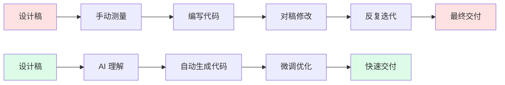

---

## Section 1：传统设计交付的痛点（20分钟）

### 1.1 传统工作流程回顾

让我们先回顾一下传统的设计到代码流程。我相信在座的各位都经历过这样的场景:

**第一步:设计师交付设计稿**
- 设计师在Figma或Sketch中完成设计
- 导出标注文档,可能是Zeplin、蓝湖或者Figma的Dev Mode
- 通知开发:"设计稿好了,可以开始开发了"

**第二步:开发者开始"翻译"工作**
- 打开设计稿,开始测量
- 这个按钮的圆角是多少?8px
- 这个卡片的阴影参数是什么?0 4px 12px rgba(0,0,0,0.1)
- 两个元素之间的间距?16px...不对,是24px
- 这个颜色的hex值?#3B82F6...等等,设计稿里用的是#3B81F6

**第三步:手写代码还原**

```tsx
// 开发者辛苦手写的代码
<div className="card">
  <div className="card-header">
    <h3 className="title">产品标题</h3>
    <span className="badge">新品</span>
  </div>
  <div className="card-body">
    <p className="description">这是产品描述...</p>
  </div>
</div>
```

```css
.card {
  border-radius: 8px;
  box-shadow: 0 4px 12px rgba(0, 0, 0, 0.1);
  padding: 24px;
  background: white;
}

.card-header {
  display: flex;
  justify-content: space-between;
  margin-bottom: 16px;
}

/* ...还有几十行CSS */
```

**第四步:对稿环节**
- 开发:"做好了,帮忙看下"
- 设计师:"这个间距好像不太对"
- 开发:"我量的就是24px啊"
- 设计师:"哦,我改了,现在是32px"
- 开发:"......"

**第五步:反复修改**
- 改间距、改颜色、改圆角、改阴影
- 每次改动都要重新编译、刷新浏览器
- 一个页面对稿3-5轮是常态

### 1.2 核心痛点分析

这个流程的问题在哪里?我总结了四个核心痛点:

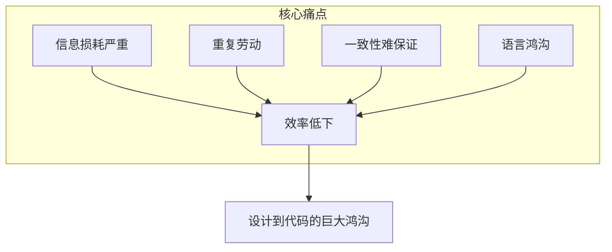

**痛点1:信息损耗严重**

设计师在Figma中使用的是可视化设计语言:
- 拖拽组件
- 调整间距
- 设置样式

但开发者接收到的是什么?是一堆数字:
- padding: 24px
- border-radius: 8px
- box-shadow: 0 4px 12px rgba(0,0,0,0.1)

这个转换过程本身就是信息的损耗。设计师的意图、组件的层级关系、交互的细节,很多都在这个过程中丢失了。

**痛点2:重复劳动**

我们来算一笔账。假设一个中等复杂度的页面:
- 10个组件
- 每个组件平均5个样式属性需要测量
- 每个属性测量+编写代码需要2分钟

总计:10 × 5 × 2 = 100分钟,接近2小时

而这2小时的工作,本质上是在做"翻译"——把视觉语言翻译成代码语言。这是纯粹的重复劳动,没有任何创造性。

**痛点3:一致性难以保证**

同一个设计系统,不同的开发者实现出来的代码可能完全不同:

开发者A的实现:
```tsx
<button className="px-6 py-3 bg-blue-500 rounded-lg">
  点击我
</button>
```

开发者B的实现:
```tsx
<button style={{
  paddingLeft: '24px',
  paddingRight: '24px',
  paddingTop: '12px',
  paddingBottom: '12px',
  backgroundColor: '#3B82F6',
  borderRadius: '8px'
}}>
  点击我
</button>
```

两种实现都"看起来"一样,但代码风格完全不同。当项目规模扩大,这种不一致会导致维护成本急剧上升。

**痛点4:设计师和开发者的语言鸿沟**

这是最根本的问题。设计师和开发者使用的是两种完全不同的语言:

| 设计师的语言 | 开发者的语言 |
|------------|------------|
| 这个卡片要有"呼吸感" | margin: 24px? |
| 阴影要"轻盈" | box-shadow的透明度是多少? |
| 这个按钮要"有分量" | font-weight: 600还是700? |
| 间距要"舒适" | 16px还是20px? |

设计师用感性的、视觉化的语言描述需求,开发者需要把这些转换成精确的数值。这个转换过程充满了误解和反复沟通。

### 1.3 问题的本质

我们退一步思考:这些痛点的本质是什么?

**本质是:设计和代码之间存在一道巨大的鸿沟。**

- 设计是视觉的、直观的、所见即所得的
- 代码是文本的、抽象的、需要编译运行才能看到效果的

传统的工作流程,需要人工在这两者之间架起桥梁。而这个桥梁,就是我们前端开发者。

但现在,AI来了。

AI可以直接理解设计稿,直接生成代码。这道鸿沟,正在被AI填平。

这就是我们今天要讨论的核心主题。

---

## Section 2：Figma AI 生态深度解析（40分钟）

好,现在让我们进入今天的核心内容:Figma的AI生态。

### 2.1 Figma AI 生态全景

在2026年,Figma已经不再只是一个设计工具,它已经演变成了一个完整的AI驱动的设计到代码平台。让我给大家展示一下Figma AI生态的全景图:

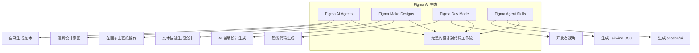

这四个部分共同构成了一个完整的设计到代码工作流。接下来我们逐一深入讲解。

### 2.2 Figma AI Agents - 在画布上的AI助手

Figma AI Agents是2026年初推出的革命性功能。它的核心理念是:**让AI直接在设计画布上工作,而不是在外部工具中。**

**核心能力:**

1. **自然语言交互**

你可以直接对AI说:
- "把这个按钮改成主色调"
- "给这个卡片添加悬停效果"
- "创建这个组件的移动端版本"

AI会直接在画布上执行这些操作。

2. **设计意图理解**

这是最强大的地方。AI不只是执行命令,它能理解设计意图。

举个例子:
```
设计师: "这个表单需要更好的视觉层次"

AI的理解:
- 增大标题字号
- 调整输入框间距
- 添加分组视觉提示
- 优化按钮对比度
```

AI会自动完成这些调整,而不需要你逐一指定。

3. **自动生成变体**

当你设计了一个按钮的默认状态,AI可以自动生成:
- hover状态
- active状态
- disabled状态
- loading状态

而且这些变体会自动遵循你的设计系统规范。

**实际应用场景:**

场景1:快速迭代设计
```
设计师: "把这个登录页面改成深色模式"
AI: 自动调整所有颜色、对比度、阴影
时间: 30秒
```

场景2:响应式设计
```
设计师: "生成这个页面的平板和手机版本"
AI: 自动调整布局、字号、间距
时间: 1分钟
```

场景3:无障碍优化
```
设计师: "检查这个设计的无障碍性"
AI: 自动标注对比度问题、缺失的alt文本、键盘导航问题
```

### 2.3 Figma Make Designs - AI辅助设计生成

Make Designs是Figma的AI设计生成功能。它的核心是:**从文本描述直接生成设计。**

**工作原理:**

1. 输入文本描述
2. AI理解需求
3. 生成设计方案
4. 设计师微调

**实际示例:**

输入:
```
创建一个现代风格的产品卡片,包含:
- 产品图片
- 产品名称和价格
- 评分星级
- 加入购物车按钮
风格: 简约、圆角、柔和阴影
```

输出:
- AI生成3-5个设计方案
- 每个方案都是完整的、可编辑的Figma组件
- 自动应用设计系统的颜色和字体

**与传统设计的对比:**

| 传统方式 | AI辅助方式 |
|---------|-----------|
| 从空白画布开始 | 从AI生成的方案开始 |
| 需要2-3小时 | 需要20-30分钟 |
| 完全手动布局 | AI自动布局,人工微调 |
| 容易遗漏细节 | AI提供完整方案 |

### 2.4 Figma Dev Mode - 开发者的视角

接下来我们聊聊Dev Mode。这个功能其实已经存在一段时间了,但在2026年它有了质的飞跃。

**Dev Mode是什么?**

简单来说,Dev Mode是Figma专门为开发者打造的视角。当你切换到Dev Mode,整个界面会变成开发者友好的模式:

- 自动显示间距标注
- 一键复制CSS/Tailwind代码
- 组件属性一目了然
- 设计Token直接映射

**2026年的Dev Mode有什么不同?**

最大的变化是:**AI驱动的智能代码生成。**

以前的Dev Mode,你选中一个元素,它给你的是这样的代码:

```css
/* 旧版Dev Mode生成的代码 */
width: 320px;
height: 180px;
padding: 24px;
background: #FFFFFF;
border-radius: 12px;
box-shadow: 0px 4px 16px rgba(0, 0, 0, 0.08);
```

这只是样式片段,你还需要自己组装成完整的组件。

现在的Dev Mode,同样选中一个元素,它给你的是:

```tsx
// 2026版Dev Mode生成的代码
import { Card, CardContent, CardHeader, CardTitle } from "@/components/ui/card"
import { Badge } from "@/components/ui/badge"

export function ProductCard({ title, price, rating, image }: ProductCardProps) {
  return (
    <Card className="w-80 overflow-hidden">
      <div className="relative h-48">
        
        <Badge className="absolute top-3 right-3" variant="secondary">
          新品
        </Badge>
      </div>
      <CardHeader>
        <CardTitle className="text-lg">{title}</CardTitle>
        <p className="text-2xl font-bold text-primary">¥{price}</p>
      </CardHeader>
      <CardContent>
        <div className="flex items-center gap-1">
          {Array.from({ length: 5 }).map((_, i) => (
            <Star
              key={i}
              className={`h-4 w-4 ${i < rating ? "fill-yellow-400 text-yellow-400" : "text-muted"}`}
            />
          ))}
        </div>
      </CardContent>
    </Card>
  )
}
```

注意看,这不是简单的CSS片段,而是:
- 完整的React组件
- 使用了shadcn/ui的组件库
- 包含了TypeScript类型定义
- 使用了Tailwind CSS
- 有合理的组件结构

这就是AI带来的质变。

**Dev Mode的三个关键改进:**

第一,**上下文感知**。AI不只是看单个元素,它会理解整个页面的上下文。比如它知道这是一个电商产品卡片,所以会自动添加价格格式化、评分组件等逻辑。

第二,**设计系统映射**。如果你的项目已经配置了设计系统,AI会自动将设计稿中的样式映射到你的设计Token。比如设计稿中的`#3B82F6`会自动映射为`text-primary`,而不是硬编码颜色值。

第三,**增量更新**。当设计师修改了设计稿,Dev Mode会智能地告诉你哪些代码需要更新,而不是重新生成所有代码。

```
设计变更检测:
✅ ProductCard
  - padding: 24px → 32px (建议: 更新className中的p-6为p-8)
  - border-radius: 12px → 16px (建议: 更新rounded-xl为rounded-2xl)
  ⚠️ 新增: 收藏按钮 (建议: 添加HeartIcon组件)
```

### 2.5 Figma Agent Skills - 生成shadcn/ui代码

现在我们来聊最让人兴奋的部分:Figma Agent Skills。

**什么是Agent Skills?**

Agent Skills是Figma在2026年推出的一个扩展框架。它允许第三方开发者为Figma AI Agent编写"技能",让AI能够生成特定框架、特定组件库的代码。

目前最受欢迎的Agent Skill就是:**shadcn/ui代码生成。**

为什么是shadcn/ui?回顾一下我们第2课学的内容:
- shadcn/ui不是传统的npm包,而是"复制到项目中"的组件
- 基于Radix UI,无障碍性好
- 使用Tailwind CSS,样式灵活
- 组件代码完全可控

这些特性让它成为AI代码生成的理想目标——因为生成的代码就是最终代码,不需要额外的抽象层。

**Agent Skills的工作原理:**

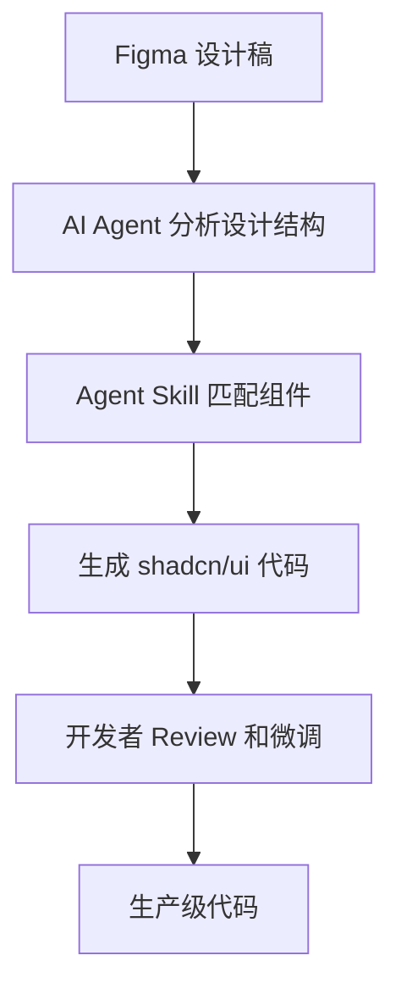

**实际示例:从设计到代码的完整流程**

假设设计师设计了一个用户设置页面,包含:
- 页面标题
- 个人信息表单
- 头像上传
- 保存按钮

AI Agent会这样处理:

第一步:分析设计结构
```
检测到的组件:
- 页面布局: 居中容器,最大宽度640px
- 标题: "账户设置", 24px, font-bold
- 表单: 4个输入字段
- 头像: 圆形,96px,带上传按钮
- 按钮: 主按钮 "保存更改"
```

第二步:匹配shadcn/ui组件
```
组件映射:
- 页面布局 → 自定义容器 (div + Tailwind)
- 标题 → <h1> + Tailwind
- 表单字段 → <Input> + <Label> from shadcn/ui
- 头像 → <Avatar> from shadcn/ui
- 按钮 → <Button> from shadcn/ui
- 整体表单 → 使用react-hook-form
```

第三步:生成代码

```tsx
"use client"

import { zodResolver } from "@hookform/resolvers/zod"
import { useForm } from "react-hook-form"
import { z } from "zod"
import { Avatar, AvatarFallback, AvatarImage } from "@/components/ui/avatar"
import { Button } from "@/components/ui/button"
import { Input } from "@/components/ui/input"
import { Label } from "@/components/ui/label"
import {
  Card,
  CardContent,
  CardDescription,
  CardHeader,
  CardTitle,
} from "@/components/ui/card"
import { Camera } from "lucide-react"

const profileSchema = z.object({
  name: z.string().min(2, "姓名至少2个字符"),
  email: z.string().email("请输入有效的邮箱地址"),
  phone: z.string().optional(),
  bio: z.string().max(200, "简介不超过200字").optional(),
})

type ProfileFormValues = z.infer<typeof profileSchema>

export function AccountSettings() {
  const form = useForm<ProfileFormValues>({
    resolver: zodResolver(profileSchema),
    defaultValues: {
      name: "",
      email: "",
      phone: "",
      bio: "",
    },
  })

  function onSubmit(data: ProfileFormValues) {
    console.log(data)
  }

  return (
    <div className="mx-auto max-w-2xl py-10">
      <h1 className="text-2xl font-bold tracking-tight mb-8">账户设置</h1>

      <Card>
        <CardHeader>
          <CardTitle>个人信息</CardTitle>
          <CardDescription>更新你的个人资料和联系方式</CardDescription>
        </CardHeader>
        <CardContent>
          <form onSubmit={form.handleSubmit(onSubmit)} className="space-y-6">
            {/* 头像上传 */}
            <div className="flex items-center gap-4">
              <Avatar className="h-24 w-24">
                <AvatarImage src="/placeholder-avatar.jpg" alt="用户头像" />
                <AvatarFallback>UN</AvatarFallback>
              </Avatar>
              <Button type="button" variant="outline" size="sm">
                <Camera className="mr-2 h-4 w-4" />
                更换头像
              </Button>
            </div>

            {/* 姓名 */}
            <div className="space-y-2">
              <Label htmlFor="name">姓名</Label>
              <Input
                id="name"
                placeholder="请输入姓名"
                {...form.register("name")}
              />
              {form.formState.errors.name && (
                <p className="text-sm text-destructive">
                  {form.formState.errors.name.message}
                </p>
              )}
            </div>

            {/* 邮箱 */}
            <div className="space-y-2">
              <Label htmlFor="email">邮箱</Label>
              <Input
                id="email"
                type="email"
                placeholder="请输入邮箱"
                {...form.register("email")}
              />
            </div>

            {/* 手机号 */}
            <div className="space-y-2">
              <Label htmlFor="phone">手机号</Label>
              <Input
                id="phone"
                type="tel"
                placeholder="请输入手机号"
                {...form.register("phone")}
              />
            </div>

            {/* 个人简介 */}
            <div className="space-y-2">
              <Label htmlFor="bio">个人简介</Label>
              <Input
                id="bio"
                placeholder="简单介绍一下自己"
                {...form.register("bio")}
              />
            </div>

            <Button type="submit" className="w-full">
              保存更改
            </Button>
          </form>
        </CardContent>
      </Card>
    </div>
  )
}
```

大家看到了吗?这段代码:
- 使用了shadcn/ui的Card、Button、Input、Avatar等组件
- 集成了react-hook-form做表单管理
- 使用了zod做表单验证
- Tailwind CSS做样式
- TypeScript类型完整
- 无障碍属性齐全(Label关联Input、alt文本等)

这就是从设计稿到生产级代码的一步到位。

### 2.6 字节案例：Semi Design 如何成为 D2C 的“约束层”

前面我们讲的是 Figma 如何生成代码。现在我要补一个非常重要、而且特别适合作为国内案例的体系：**字节的 Semi Design**。

很多人第一次看到 Semi，会把它理解成“一个 React 组件库”。这个理解太浅了。Semi 更准确的定位是：

- 一套企业级设计系统
- 一套与 Figma 对齐的设计资产
- 一套可主题化、可 Token 化的设计语言
- 一套能够连接设计师与开发者的 Design to Code 实践方法

为什么我要把 Semi 放进 Design to Code 课程里？因为它特别适合回答一个关键问题：

**AI 能生成代码，但 AI 为什么能稳定地生成“像样的代码”？**

答案是：不是因为 AI 神奇，而是因为背后有一套稳定的设计系统在约束它。Semi 就是这种“约束层”的典型案例。[Semi Design 官网](https://semi.design/zh-CN)里强调的也是“连接设计师与开发者”“让设计与代码同源”。

#### Semi 在 D2C 里的价值

如果团队只有 Figma，没有设计系统，AI 生成代码时经常会遇到几个问题：

- 同一个主色，在不同页面被写成不同的颜色值
- 间距有时 12px，有时 14px，有时 16px，没有统一节奏
- 按钮、卡片、表格这些组件的视觉规则不稳定
- 设计稿很好看，但一落到代码里就开始硬编码

这时候 Figma 只是“设计输入源”，但它不是“设计约束源”。

而 Semi 的价值在于，它把下面这些东西都系统化了：

- 组件规范
- Figma UIKit
- 设计变量
- 主题能力
- Design Token
- 代码侧的组件实现

所以在真实团队里，比较成熟的 D2C 工作流往往不是：

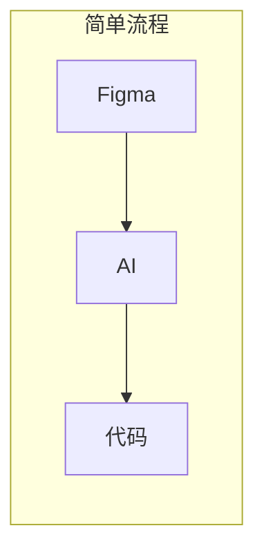

而是：

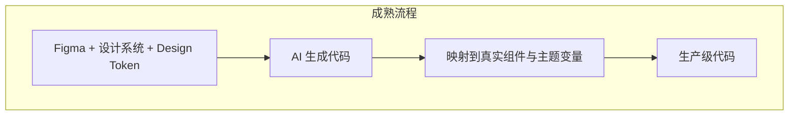

也就是说，**Semi 不是替代 Figma，而是让 Figma 这条链路更加稳定、更可维护。**

#### Design Token 一定要讲透：它到底是什么

很多团队嘴上都在说 Token，但真正落地时，经常把 Token 理解成“几个颜色变量”。这远远不够。

**Design Token 的本质，不是变量，而是“设计决策的可计算表达”。**

什么叫“设计决策”？

- 主色是什么
- 成功色、警告色、危险色是什么
- 标题字号和正文字号的层级关系是什么
- 圆角有几档
- 阴影有几档
- 间距系统按什么节奏递增
- 亮色和暗色模式如何切换

如果这些信息只存在于设计师脑子里，或者散落在几十张设计稿里，那 AI 永远只能“猜”。

但如果这些信息被抽象成 Token，AI 就不是在猜，而是在映射。

#### Token 的四层结构

为了让大家彻底理解，我建议把 Design Token 讲成四层：

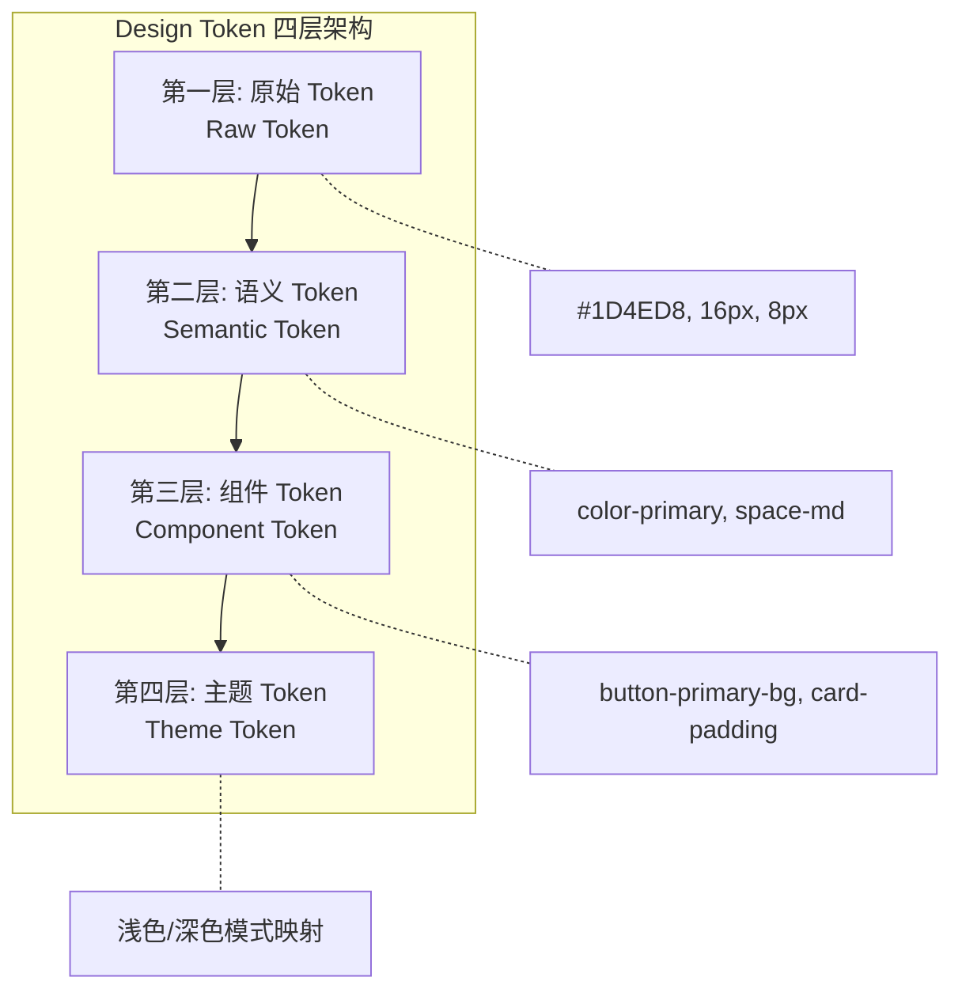

**第一层：原始 Token（Raw Token）**
- 最底层的物理值
- 例如：`#1D4ED8`、`16px`、`8px`、`0 4px 12px rgba(...)`

**第二层：语义 Token（Semantic Token）**
- 不直接表达数值，而是表达用途
- 例如：`color-primary`、`color-success`、`space-md`、`radius-lg`

**第三层：组件 Token（Component Token）**
- 绑定到具体组件场景
- 例如：`button-primary-bg`、`card-padding`、`table-header-color`

**第四层：主题 Token（Theme Token）**
- 同一语义在不同品牌、不同模式下的具体映射
- 例如：浅色模式和深色模式的 `color-bg-page` 不同，但语义名不变

这四层非常关键。因为 D2C 不是把设计稿翻译成 CSS，而是把设计稿映射到一套分层良好的 Token 体系。

#### 为什么 Token 对 AI 特别重要

因为 AI 生成代码最怕三件事：

1. 没有命名体系
2. 没有组件边界
3. 没有稳定的样式映射

Token 恰好就是解决第三件事的。

举个最简单的例子。

如果设计稿里按钮背景色写死成 `#3B82F6`，AI 往往会生成：

```tsx
<Button className="bg-[#3B82F6] hover:bg-[#2563EB]">
  保存
</Button>
```

这段代码不是不能跑，但它的可维护性很差。因为：

- 换品牌色时要全局搜索替换
- 暗色模式要重新写一套
- 不同开发者可能写出不同的蓝色

如果设计系统已经定义了 Token，AI 更理想的生成结果应该是：

```tsx
<Button className="bg-primary text-primary-foreground hover:bg-primary/90">
  保存
</Button>
```

或者在 CSS Variables 方案里：

```css
:root {
  --color-primary: 59 130 246;
  --space-md: 16px;
  --radius-lg: 12px;
}
```

```tsx
<button className="px-token-md rounded-token-lg bg-token-primary">
  保存
</button>
```

区别在哪？前者是“写死结果”，后者是“引用规则”。

**AI 一旦能够引用规则，生成结果才有规模化复用的可能。**

#### Semi 给我们的启发

Semi 最值得借鉴的地方，不只是组件多，而是它把“组件样式”背后的设计语言做成了 Token 系统和主题系统。

这意味着：

- 设计师在 Figma 中看到的，不是孤立像素，而是系统化的设计变量
- 开发者在代码里拿到的，不是随机颜色，而是可追踪的设计决策
- AI 在生成代码时，也更容易把页面元素映射到已有组件和已有 Token

换句话说，**Design Token 是 D2C 的中间层协议。**

没有这层协议，设计到代码只能停留在“截图转 JSX”；
有了这层协议，设计到代码才能升级成“设计系统到代码系统”的稳定映射。

#### 在课程里怎么把这个逻辑讲明白

我建议大家给团队讲 D2C 时，一定强调下面这个公式：

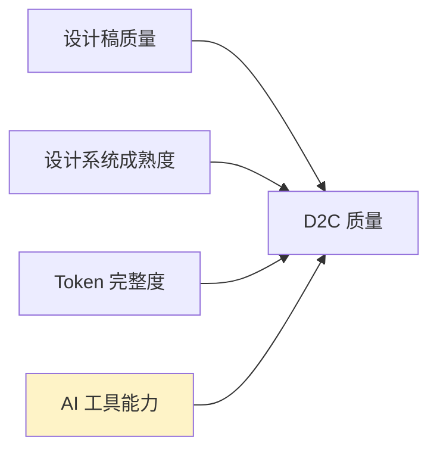

很多团队只关注最后一项"AI 工具能力"，这是不够的。

真正决定 AI 生成质量上限的，往往是前面三项：

- 设计稿是否结构清晰
- 是否有像 Semi 这样的设计系统承接
- Token 是否分层、命名是否稳定、主题是否可切换

所以如果你问我，Semi 在这门课里最大的教学价值是什么？

我的答案是：

**它让大家看到，Design to Code 从来不是单个工具的问题，而是“设计系统 + Token + AI”共同作用的结果。**

### 2.7 Figma → shadcn/ui 完整管线

现在让我们把前面讲的所有内容串起来,看看完整的管线是什么样的:

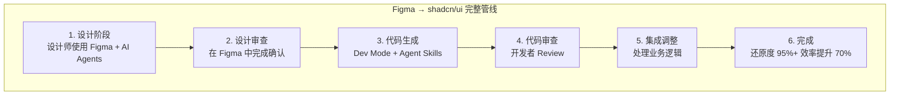

**关键配置:如何在项目中启用这个管线**

首先,你需要在Figma中配置Agent Skills:

```json
// figma-agent-config.json
{
  "agentSkills": {
    "codeGeneration": {
      "framework": "react",
      "language": "typescript",
      "styling": "tailwindcss",
      "componentLibrary": "shadcn-ui",
      "formLibrary": "react-hook-form",
      "validationLibrary": "zod"
    },
    "designTokens": {
      "source": "figma-variables",
      "mapping": "tailwind-config"
    },
    "output": {
      "fileNaming": "kebab-case",
      "componentNaming": "PascalCase",
      "directory": "src/components"
    }
  }
}
```

然后在你的项目中,确保有对应的shadcn/ui配置:

```json
// components.json (shadcn/ui配置文件)
{
  "$schema": "https://ui.shadcn.com/schema.json",
  "style": "new-york",
  "rsc": true,
  "tsx": true,
  "tailwind": {
    "config": "tailwind.config.ts",
    "css": "app/globals.css",
    "baseColor": "zinc",
    "cssVariables": true
  },
  "aliases": {
    "components": "@/components",
    "utils": "@/lib/utils",
    "ui": "@/components/ui",
    "lib": "@/lib",
    "hooks": "@/hooks"
  }
}
```

这样配置之后,Figma Agent Skills生成的代码就能直接放到你的项目中运行,不需要任何额外的调整。

**一个重要的提醒:**

AI生成的代码不是终点,而是起点。你仍然需要:
- Review代码质量
- 添加业务逻辑
- 处理边界情况
- 编写测试
- 优化性能

AI帮你跳过了"翻译"的步骤,让你可以把精力集中在真正有价值的工作上。

好,关于Figma AI生态,我们就讲到这里。大家有什么问题吗?

（停顿,等待提问）

好的,如果没有问题,我们继续。接下来我们来看看Figma之外的世界。

---

## Section 3：横向对比其他设计工具（30分钟）

Figma虽然是目前最主流的设计工具,但它不是唯一的选择。2026年的设计工具市场非常精彩,有很多值得关注的竞争者。让我们逐一来看。

### 3.1 Penpot - 开源的力量

首先是Penpot。如果你还没听说过Penpot,那你一定要关注一下。

**Penpot是什么?**

Penpot是一个完全开源的设计平台。它由西班牙的Kaleidos团队开发,2026年已经成为开源设计工具领域的绝对领导者。

**为什么前端开发者应该关注Penpot?**

三个关键词:**开源、Web标准、MCP集成。**

**第一:开源**

Penpot是MPL 2.0协议开源的。这意味着:
- 你可以自己部署,数据完全在自己手里
- 你可以查看源码,理解它的实现
- 你可以贡献代码,添加你需要的功能
- 没有供应商锁定的风险

对于企业用户来说,这一点非常重要。很多公司不允许设计数据存储在第三方服务器上,Penpot的私有化部署完美解决了这个问题。

**第二:Web标准**

这是Penpot最独特的地方。Figma的设计稿底层是私有格式,而Penpot的设计稿底层是**标准的SVG和CSS**。

这意味着什么?

```html
<!-- Penpot导出的代码就是标准的Web代码 -->
<div style="
  display: flex;
  flex-direction: column;
  gap: 16px;
  padding: 24px;
  border-radius: 12px;
  background: white;
  box-shadow: 0 4px 16px rgba(0, 0, 0, 0.08);
">
  <h3 style="font-size: 18px; font-weight: 600;">产品标题</h3>
  <p style="color: #6B7280;">产品描述文本</p>
</div>
```

因为底层就是Web标准,所以设计和代码之间的转换损耗极小。设计师在Penpot中使用的就是真实的CSS属性,开发者拿到的也是真实的CSS代码。

**第三:MCP集成**

这是2026年Penpot最重要的更新。Penpot现在支持MCP（Model Context Protocol）集成。

什么意思?就是你可以通过MCP协议,让AI工具直接访问Penpot的设计数据。

```json
// MCP配置示例
{
  "mcpServers": {
    "penpot": {
      "command": "npx",
      "args": ["-y", "@penpot/mcp-server"],
      "env": {
        "PENPOT_API_URL": "https://your-penpot-instance.com/api",
        "PENPOT_ACCESS_TOKEN": "your-token-here"
      }
    }
  }
}
```

配置好之后,你可以在Claude、Cursor等AI工具中直接说:

```
"读取Penpot中的登录页面设计,生成React组件代码"
```

AI会通过MCP协议:
1. 连接到你的Penpot实例
2. 读取指定页面的设计数据
3. 理解组件结构和样式
4. 生成对应的React代码

这个工作流的强大之处在于:**设计数据不需要离开你的基础设施。** AI通过MCP协议远程读取,但数据始终在你的服务器上。

### 3.2 Pencil.dev - IDE内的设计工具

接下来是一个非常有意思的工具:Pencil.dev。

**Pencil.dev的理念完全不同。** 它不是让你在设计工具中生成代码,而是让你在IDE中做设计。

如果我要用一句话概括它最近为什么这么火,我会说:

**Pencil不是"另一个Figma",而是"把设计器嵌进IDE,把设计和代码合并成一个工作流"。**

这句话特别重要。很多同学第一次看到Pencil,会下意识问:"它的设计能力有Figma强吗?" 这个问题本身就不完全对。因为Pencil要解决的,不是"做出更复杂的视觉稿",而是"让设计和代码不要再是两套系统"。

**核心概念:双向同步**

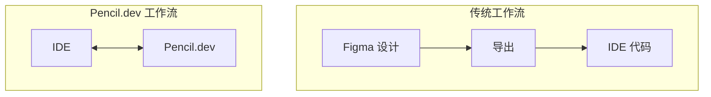

什么是双向同步?

- 你在Pencil.dev的可视化编辑器中拖拽一个按钮,IDE中的代码自动更新
- 你在IDE中修改代码,Pencil.dev的可视化编辑器自动反映变化

这不是"设计→代码"的单向转换,而是"设计=代码"的实时同步。

### 为什么Pencil这波会火

我总结四个原因:

1. **它特别符合AI编程时代的工作方式**
   - 现在很多前端工程师不是先拿完整设计稿,而是先做原型、再迭代、再打磨
   - Pencil让这个过程直接发生在IDE里,天然适合和Cursor、Claude Code一起使用

2. **它特别适合shadcn/ui + Tailwind这类AI友好技术栈**
   - 组件是源码级的
   - 样式是utility-first的
   - AI改动后,你可以同时看到视觉结果和代码diff

3. **它让Git真正接管设计变更**
   - 在传统流程里,设计稿变更很难做真正的版本审查
   - 在Pencil里,设计改动就是代码改动,可以review、回滚、追踪责任

4. **它特别适合设计资源有限的团队**
   - 很多团队没有专职设计师
   - 产品经理给个方向,前端就要自己把原型和代码一起做出来
   - 这正是Pencil最舒服的战场

**实际工作流演示:**

第一步:在VS Code中打开Pencil.dev面板
```
VS Code左侧: 代码编辑器
VS Code右侧: Pencil.dev可视化面板
```

第二步:在可视化面板中设计
- 拖拽组件到画布
- 调整间距和样式
- 设置响应式断点

第三步:代码自动生成
```tsx
// Pencil.dev自动生成的代码(实时同步到编辑器)
export function HeroSection() {
  return (
    <section className="flex flex-col items-center justify-center min-h-[60vh] px-6 py-20">
      <h1 className="text-5xl font-bold tracking-tight text-center max-w-3xl">
        构建下一代Web应用
      </h1>
      <p className="mt-6 text-xl text-muted-foreground text-center max-w-2xl">
        使用现代工具链,让开发效率提升10倍
      </p>
      <div className="mt-10 flex gap-4">
        <Button size="lg">开始使用</Button>
        <Button size="lg" variant="outline">了解更多</Button>
      </div>
    </section>
  )
}
```

第四步:在代码中修改
```tsx
// 开发者手动修改代码
<h1 className="text-5xl font-bold tracking-tight text-center max-w-3xl">
  构建下一代Web应用  {/* 修改文案 → 可视化面板实时更新 */}
</h1>
```

**Pencil.dev的优势:**

1. **零上下文切换** - 不需要在Figma和IDE之间来回切换
2. **代码即设计** - 没有"翻译"步骤,设计就是代码
3. **版本控制友好** - 设计变更就是代码变更,可以用Git管理
4. **团队协作** - 设计师和开发者可以在同一个环境中工作

**Pencil.dev的局限:**

1. 学习曲线 - 设计师需要适应IDE环境
2. 复杂设计 - 对于非常复杂的视觉设计,可视化编辑器的能力有限
3. 生态 - 相比Figma,插件和社区资源较少

### 用案例理解:Pencil最适合什么

这里我建议大家不要只抽象理解,直接看场景。Pencil最适合的,往往不是那种需要极高视觉打磨的品牌首页,而是下面这些页面:

**案例1: AI SaaS 设置页**
- 左侧导航: 通用设置、模型配置、团队权限、账单
- 右侧表单: 输入框、下拉、开关、按钮
- 这类页面的核心是结构清晰、组件复用、多状态切换
- 用Pencil做,你能一边搭布局,一边把表单结构直接变成React代码

**案例2: 数据分析看板**
- 顶部指标卡片
- 中间图表容器
- 底部表格和筛选栏
- 这类页面的关键是信息架构和响应式布局,不是极致视觉表现
- Pencil在这类任务上非常快,因为开发者可以边搭边抽组件、边改边接假数据

**案例3: Webinar报名页**
- Hero区、讲师介绍、议程、报名表单、FAQ
- 它虽然是营销页,但结构上高度模块化
- 如果团队目标是"今天做出能上线的版本",Pencil会比Figma来回切换更高效

**案例4: 新产品发布落地页**
- 产品卖点、对比区、定价、CTA
- 尤其是0到1阶段,很多团队根本没有完整设计资产
- 这时最重要的是快速试错,而不是先把设计稿打磨到100分

所以你会发现,Pencil不是不能做营销页,而是**它更擅长"结构化页面"和"开发主导型页面"**。

### 3.3 Google Stitch - 可视化探索

Google在2026年推出了Stitch,这是一个非常有趣的实验性产品。

**Stitch的定位:**

Stitch不是传统意义上的设计工具,它更像是一个"可视化探索工具"。它的核心理念是:**让你通过自然语言和可视化交互,快速探索UI方案。**

**工作方式:**

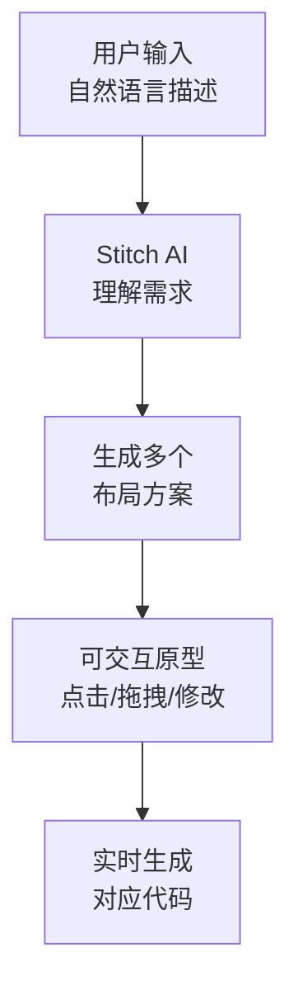

**Stitch的特点:**

1. **AI原生** - 从第一天就是为AI设计的,不是在传统工具上加AI
2. **快速原型** - 几分钟内就能得到可交互的原型
3. **多方案对比** - 同时生成多个方案,方便对比选择
4. **Google生态集成** - 与Material Design、Angular等Google技术栈深度集成

**适用场景:**

- 项目早期的UI探索
- 快速验证设计想法
- 非设计师（如产品经理、开发者）快速创建原型

**局限性:**

- 目前主要支持Google技术栈
- 精细化设计能力不如Figma
- 还处于相对早期阶段

### 3.4 WeaveFox - 国产 D2C 的代表

接下来我要介绍一个非常值得关注的国产工具：**蚂蚁集团的 WeaveFox**。

**WeaveFox 是什么？**

WeaveFox 是蚂蚁前端团队推出的 AI 前端智能研发平台。它基于蚂蚁自研的 **百灵多模态大模型（WeaveFox-VL）** 构建，核心能力是：**根据设计图直接生成高质量的前端源代码。**

官网地址：[https://www.weavefox.cn/](https://www.weavefox.cn/)

为什么我要在这门课里单独讲 WeaveFox？有三个原因：

**第一，它是目前国产 D2C 工具中技术最成熟的之一。**

WeaveFox 不是简单地套用通用大模型，而是针对前端领域做了深度优化：
- 细粒度 UI 理解能力
- 智能切分设计稿
- 页面语法结构推理
- 高可读性代码生成

这套技术栈让它在设计还原度上达到了非常高的水平。

**第二，它的技术栈覆盖非常全面。**

| 维度 | 支持范围 |
|------|---------|
| 客户端类型 | 控制台、移动端 H5、小程序 |
| 前端框架 | React、Vue |
| 样式方案 | Less、SCSS |
| 组件库 | Ant Design |

这意味着它不是一个"玩具"，而是真正可以用于生产环境的工具。

**第三，它代表了国内大厂在 D2C 领域的技术积累。**

蚂蚁在前端工程化方面的积累非常深厚（Ant Design、Umi、dumi 等），WeaveFox 是他们在 AI 时代的最新探索。

**WeaveFox 的工作流程**

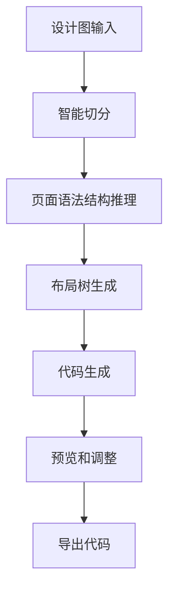

**第一步：切割图片**
- 将设计图上传到 WeaveFox
- 系统会自动识别页面结构
- 你也可以手动选择想要生成代码的部分

**第二步：选择技术栈**
- 选择目标框架（React / Vue）
- 选择组件库（如 Ant Design）
- 选择样式方案（Less / SCSS）

**第三步：生成代码**
- WeaveFox 基于百灵大模型进行推理
- 生成高可读性、可维护的业务代码
- 支持实时预览效果

**第四步：二次调整**
- 对生成的代码进行微调
- 添加业务逻辑
- 导出到本地项目

**WeaveFox 的技术特色**

WeaveFox 的核心优势在于它的 **"页面语法结构"** 概念：

```
传统 D2C 工具的问题：
设计图 → 像素识别 → CSS 堆砌 → 难以维护的代码

WeaveFox 的做法：
设计图 → UI 语义理解 → 页面语法结构 → 组件化代码
```

什么是"页面语法结构"？

- 它不是简单地识别"这里有个矩形、那里有个文字"
- 而是理解"这是一个卡片组件，包含标题、描述和操作按钮"
- 这种语义级别的理解，让生成的代码更接近人工编写的质量

**实际示例**

假设输入一个典型的后台数据表格设计稿，WeaveFox 生成的代码可能是这样的：

```tsx
// WeaveFox 生成的代码示例
import { Table, Button, Tag, Space } from 'antd';
import type { ColumnsType } from 'antd/es/table';

interface DataType {
  key: string;
  name: string;
  status: '进行中' | '已完成' | '待处理';
  updatedAt: string;
}

const columns: ColumnsType<DataType> = [
  {
    title: '任务名称',
    dataIndex: 'name',
    key: 'name',
    render: (text) => <a>{text}</a>,
  },
  {
    title: '状态',
    dataIndex: 'status',
    key: 'status',
    render: (status) => {
      const colorMap = {
        '进行中': 'blue',
        '已完成': 'green',
        '待处理': 'orange',
      };
      return <Tag color={colorMap[status]}>{status}</Tag>;
    },
  },
  {
    title: '更新时间',
    dataIndex: 'updatedAt',
    key: 'updatedAt',
  },
  {
    title: '操作',
    key: 'action',
    render: (_, record) => (
      <Space size="middle">
        <Button type="link">编辑</Button>
        <Button type="link" danger>删除</Button>
      </Space>
    ),
  },
];

export function TaskTable({ data }: { data: DataType[] }) {
  return <Table columns={columns} dataSource={data} />;
}
```

注意看这段代码的特点：
- 使用了 Ant Design 的 Table 组件
- TypeScript 类型完整
- 状态字段有语义化的颜色映射
- 组件结构清晰，可以直接用于生产

**WeaveFox vs 其他 D2C 工具**

| 维度 | WeaveFox | Figma Dev Mode | v0.dev |
|------|----------|----------------|--------|
| 输入源 | 设计图/截图 | Figma 设计稿 | 文本描述 |
| 技术栈 | React/Vue + Ant Design | React + shadcn/ui | React + shadcn/ui |
| 本地化 | 国产，服务器在国内 | 海外服务 | 海外服务 |
| 组件库 | Ant Design 深度集成 | shadcn/ui | shadcn/ui |
| 适合场景 | 企业级中后台 | 通用场景 | 快速原型 |

**WeaveFox 最适合什么场景？**

1. **企业级中后台项目**
   - 如果你的项目本身就用 Ant Design，WeaveFox 是最佳选择
   - 生成的代码和现有项目风格一致，迁移成本低

2. **需要本地化服务的团队**
   - 数据不出境，符合企业安全合规要求
   - 访问速度快，无需翻墙

3. **已有设计稿的存量项目**
   - 设计师已经在 Sketch/Figma 中完成了设计
   - 需要快速将设计稿转换为可运行的代码

**WeaveFox 的局限**

1. **组件库绑定** - 目前主要围绕 Ant Design 生态，如果你用的是其他组件库，适配度会下降
2. **开放程度** - 相比 Figma 的开放生态，WeaveFox 是一个相对封闭的平台
3. **社区规模** - 作为国产工具，社区和插件生态不如 Figma 丰富

**给团队的建议**

如果你的团队符合以下条件，强烈建议尝试 WeaveFox：

- ✅ 主要做企业级中后台项目
- ✅ 技术栈是 React + Ant Design
- ✅ 有数据安全或合规要求
- ✅ 设计资源有限，需要快速出页面

如果你的团队更偏向以下情况，可能其他工具更合适：

- ❌ 主要做 C 端产品或营销页面
- ❌ 使用 shadcn/ui 或自研组件库
- ❌ 需要高度定制化的设计系统

### 3.5 Framer - 设计即发布

最后我们来看Framer。Framer的理念非常激进:**设计即发布。**

**什么意思?**

在Framer中,你设计的页面就是最终的网站。不需要导出,不需要开发者还原,不需要部署——设计完成的那一刻,网站就上线了。

**Framer的AI能力:**

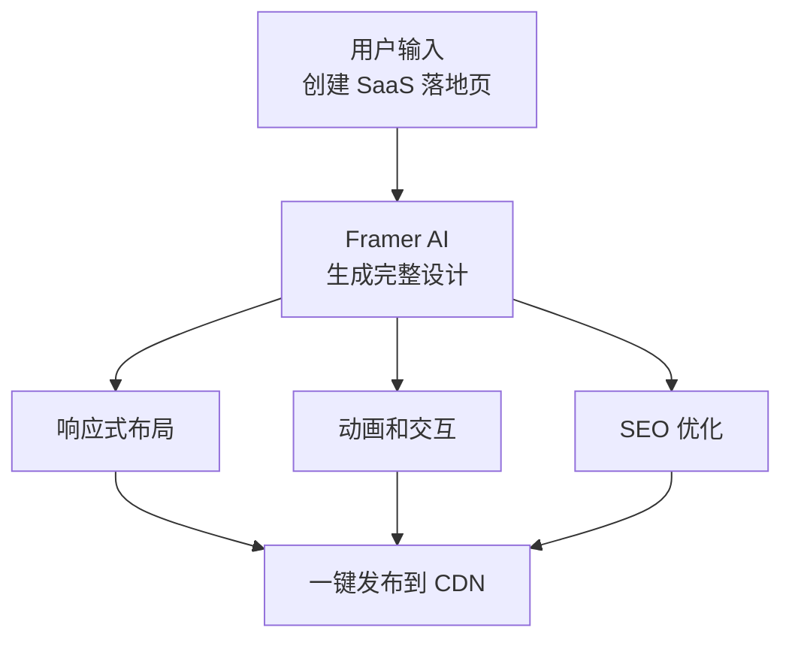

**Framer适合什么场景?**

- 营销页面、落地页
- 个人网站、作品集
- 小型企业官网
- 活动页面

**Framer不适合什么场景?**

- 复杂的Web应用（如管理后台、SaaS产品）
- 需要复杂业务逻辑的项目
- 需要与后端深度集成的项目

**Framer的AI特色:**

1. **智能布局** - AI自动处理响应式布局
2. **内容生成** - AI生成文案、图片占位
3. **动画建议** - AI推荐合适的动画效果
4. **SEO优化** - AI自动优化meta标签、结构化数据

### 3.6 对比表格

好,我们已经看了五个工具。现在让我们做一个全面的对比:

| 特性 | Figma | Penpot | Pencil.dev | WeaveFox | Google Stitch | Framer |
|------|-------|--------|------------|----------|---------------|--------|
| **定位** | 专业设计平台 | 开源设计平台 | IDE内设计工具 | 企业级D2C平台 | 可视化探索工具 | 设计即发布 |
| **开源** | ❌ | ✅ MPL 2.0 | ❌ | ❌ | ❌ | ❌ |
| **私有部署** | ❌ | ✅ | N/A | 企业版支持 | ❌ | ❌ |
| **本地化** | 海外服务 | 可自部署 | 海外服务 | ✅ 国内服务 | 海外服务 | 海外服务 |
| **AI能力** | ⭐⭐⭐⭐⭐ | ⭐⭐⭐ | ⭐⭐⭐⭐ | ⭐⭐⭐⭐ | ⭐⭐⭐⭐ | ⭐⭐⭐⭐ |
| **代码生成质量** | 高(shadcn/ui) | 中(标准CSS) | 高(实时同步) | 高(Ant Design) | 中(Material) | 低(私有格式) |
| **设计能力** | ⭐⭐⭐⭐⭐ | ⭐⭐⭐⭐ | ⭐⭐⭐ | ⭐⭐⭐ | ⭐⭐⭐ | ⭐⭐⭐⭐ |
| **开发者体验** | ⭐⭐⭐⭐ | ⭐⭐⭐⭐ | ⭐⭐⭐⭐⭐ | ⭐⭐⭐⭐ | ⭐⭐⭐ | ⭐⭐ |
| **学习曲线** | 中 | 低 | 中 | 低 | 低 | 低 |
| **MCP支持** | 通过插件 | ✅ 原生 | ❌ | ❌ | ❌ | ❌ |
| **双向同步** | ❌ | ❌ | ✅ | ❌ | ❌ | ❌ |
| **适合团队规模** | 任意 | 任意 | 小-中 | 中-大 | 小-中 | 小 |
| **价格** | 付费 | 免费 | 付费 | 付费 | 免费(Beta) | 付费 |
| **技术栈偏好** | React/shadcn | Web标准 | React/Vue | React/Vue+AntD | Angular/Material | 私有 |

**我的建议:**

根据不同的场景,我推荐:

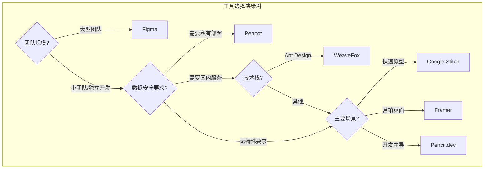

1. **大型团队、复杂项目** → Figma
   - 生态最完善,AI能力最强,团队协作最好

2. **注重数据安全、需要私有部署** → Penpot
   - 开源免费,可以自己部署,MCP集成方便

3. **企业级中后台、Ant Design 技术栈、国内服务** → WeaveFox
   - 蚂蚁自研大模型,本地化服务,Ant Design 深度集成

4. **小团队、追求极致开发效率** → Pencil.dev
   - 双向同步消除了设计到代码的鸿沟

5. **快速原型、UI探索** → Google Stitch
   - 几分钟内得到可交互原型

6. **营销页面、快速上线** → Framer
   - 设计即发布,最快的上线速度

没有"最好"的工具,只有"最适合"的工具。关键是理解每个工具的优势和局限,根据项目需求做出选择。

### 3.7 重点补充:Pencil vs Figma 直接案例对照

好,接下来我想把Pencil和Figma拉出来单独比一下。因为这一段,才是今天这节课真正最有价值的地方。

我先给一个结论:

- **Figma** 更像是"设计优先,再交付代码"
- **Pencil** 更像是"设计和代码同时发生"

这不是文字游戏,而是两种完全不同的团队协作方式。

#### 对照案例A: 定价页

假设我们要做一个新的AI产品定价页,页面包含:
- Hero标题
- 三档套餐卡片
- 常见问题FAQ
- 底部CTA

**如果用Figma来做:**
- 设计师先在Figma里做视觉探索
- 会更容易去比较不同的版式、留白、配色、层级
- 设计审完之后,开发者再通过Dev Mode或AI能力拿代码
- 这个过程特别适合品牌调性要求高、需要多人评审的场景

**如果用Pencil来做:**
- 前端在IDE里直接拼Section、Card、Button、Accordion
- 文案、间距、响应式断点可以一边看一边调
- 做完以后,代码已经在项目里了,直接可以接分析埋点、表单提交、A/B实验
- 这特别适合创业团队、增长团队、快速试投放的场景

**这个案例的结论是:**
- 品牌要求高、协作链条长 → `Figma`
- 需要今天出页面、明天上线投流 → `Pencil`

#### 对照案例B: AI SaaS 设置页

再看一个更能体现差异的案例:AI SaaS 设置页。页面包含:
- 左侧设置导航
- 右侧模型选择、API Key、通知、权限控制
- 底部保存按钮和危险操作区域

**如果用Figma来做:**
- 好处是设计师可以先把信息层级和视觉规范统一好
- 适合大团队把复杂设置页纳入统一设计系统
- 但开发者拿到代码后,仍然需要在项目里做表单组织、状态管理、校验、组件抽象

**如果用Pencil来做:**
- 前端可以直接基于现有组件库搭页面
- 一边搭布局,一边把字段抽成配置
- 一边看视觉效果,一边决定哪些区域拆成独立组件
- 设置页这种"结构化 + 表单化 + 组件复用高"的页面,是Pencil非常强的主场

**这个案例的结论是:**
- 复杂中后台、组件复用强、前端主导实现 → `Pencil` 的优势更明显

#### 一张表讲清楚

| 维度 | Figma | Pencil.dev |
|------|-------|------------|
| 核心出发点 | 先设计,再交付代码 | 设计和代码一起产出 |
| 最适合团队 | 设计师+开发者分工明确 | 前端主导或小团队混合协作 |
| 最适合页面 | 品牌页、营销页、复杂视觉稿 | 设置页、后台页、结构化落地页 |
| 优势 | 视觉表达强,评审链成熟 | 切换少,改动直接进代码库 |
| 风险 | 交付后仍有二次翻译成本 | 对高保真视觉打磨不如Figma |

如果你们团队问我"到底选谁",我的答案通常不是二选一,而是:

- **用Figma做高保真设计和多人评审**
- **用Pencil做快速原型和开发主导页面**

把它们看成竞争关系,你会纠结;把它们看成不同阶段和不同团队形态下的最优工具,你就会很清楚。

好,关于工具对比就到这里。大家可以根据自己团队的实际情况来选择。

（停顿,喝口水）

---

## Section 4：实战演示（30分钟）

好,理论讲了很多,现在让我们来看看实际操作。这个环节我会做四个演示:

### 4.1 演示一:Figma 设计稿 → AI Agent → shadcn/ui 代码

我现在打开Figma,给大家看一个完整的流程。

**场景设定:**

我们要把一个"用户管理后台"的设计稿转换成可运行的代码。这个页面包含:
- 顶部搜索栏
- 用户列表表格
- 分页组件
- 操作按钮（编辑、删除）

**第一步:在Figma中打开设计稿**

大家看屏幕,这是设计师交付的用户管理页面。我们可以看到:
- 左侧是导航栏
- 右侧主内容区有一个搜索框
- 下面是一个数据表格,显示用户的姓名、邮箱、角色、状态
- 每行右侧有操作按钮
- 底部有分页

**第二步:切换到Dev Mode**

我点击右上角的"Dev Mode"按钮,切换到开发者视角。

现在界面变了,你可以看到:
- 每个元素都有间距标注
- 右侧面板显示了CSS属性
- 底部有代码生成区域

**第三步:选择整个页面,使用AI Agent生成代码**

我选中整个页面区域,然后点击"Generate Code with Agent"。

在弹出的配置面板中,我选择:
- Framework: React
- Component Library: shadcn/ui
- Styling: Tailwind CSS
- Language: TypeScript

点击"Generate"。

（等待几秒钟）

好,代码生成完成了。让我们看看生成了什么:

```tsx
// generated: user-management-page.tsx

"use client"

import { useState } from "react"
import { Input } from "@/components/ui/input"
import { Button } from "@/components/ui/button"
import {
  Table,
  TableBody,
  TableCell,
  TableHead,
  TableHeader,
  TableRow,
} from "@/components/ui/table"
import { Badge } from "@/components/ui/badge"
import {
  DropdownMenu,
  DropdownMenuContent,
  DropdownMenuItem,
  DropdownMenuTrigger,
} from "@/components/ui/dropdown-menu"
import {
  Pagination,
  PaginationContent,
  PaginationItem,
  PaginationLink,
  PaginationNext,
  PaginationPrevious,
} from "@/components/ui/pagination"
import { Search, MoreHorizontal, Plus, Pencil, Trash2 } from "lucide-react"

interface User {
  id: string
  name: string
  email: string
  role: "管理员" | "编辑" | "查看者"
  status: "活跃" | "已禁用"
  lastLogin: string
}

const mockUsers: User[] = [
  {
    id: "1",
    name: "张三",
    email: "zhangsan@example.com",
    role: "管理员",
    status: "活跃",
    lastLogin: "2026-03-25 14:30",
  },
  {
    id: "2",
    name: "李四",
    email: "lisi@example.com",
    role: "编辑",
    status: "活跃",
    lastLogin: "2026-03-24 09:15",
  },
  {
    id: "3",
    name: "王五",
    email: "wangwu@example.com",
    role: "查看者",
    status: "已禁用",
    lastLogin: "2026-03-20 16:45",
  },
]

export function UserManagementPage() {
  const [searchQuery, setSearchQuery] = useState("")

  const roleVariantMap: Record<User["role"], "default" | "secondary" | "outline"> = {
    "管理员": "default",
    "编辑": "secondary",
    "查看者": "outline",
  }

  const filteredUsers = mockUsers.filter(
    (user) =>
      user.name.includes(searchQuery) ||
      user.email.includes(searchQuery)
  )

  return (
    <div className="space-y-6 p-6">
      {/* 页面标题和操作 */}
      <div className="flex items-center justify-between">
        <div>
          <h1 className="text-2xl font-bold tracking-tight">用户管理</h1>
          <p className="text-muted-foreground">管理系统中的所有用户账户</p>
        </div>
        <Button>
          <Plus className="mr-2 h-4 w-4" />
          添加用户
        </Button>
      </div>

      {/* 搜索栏 */}
      <div className="relative max-w-sm">
        <Search className="absolute left-3 top-1/2 h-4 w-4 -translate-y-1/2 text-muted-foreground" />
        <Input
          placeholder="搜索用户..."
          value={searchQuery}
          onChange={(e) => setSearchQuery(e.target.value)}
          className="pl-10"
        />
      </div>

      {/* 用户表格 */}
      <div className="rounded-lg border">
        <Table>
          <TableHeader>
            <TableRow>
              <TableHead>姓名</TableHead>
              <TableHead>邮箱</TableHead>
              <TableHead>角色</TableHead>
              <TableHead>状态</TableHead>
              <TableHead>最后登录</TableHead>
              <TableHead className="w-[60px]">操作</TableHead>
            </TableRow>
          </TableHeader>
          <TableBody>
            {filteredUsers.map((user) => (
              <TableRow key={user.id}>
                <TableCell className="font-medium">{user.name}</TableCell>
                <TableCell>{user.email}</TableCell>
                <TableCell>
                  <Badge variant={roleVariantMap[user.role]}>
                    {user.role}
                  </Badge>
                </TableCell>
                <TableCell>
                  <Badge
                    variant={user.status === "活跃" ? "default" : "destructive"}
                    className={
                      user.status === "活跃"
                        ? "bg-green-100 text-green-800 hover:bg-green-100"
                        : ""
                    }
                  >
                    {user.status}
                  </Badge>
                </TableCell>
                <TableCell className="text-muted-foreground">
                  {user.lastLogin}
                </TableCell>
                <TableCell>
                  <DropdownMenu>
                    <DropdownMenuTrigger asChild>
                      <Button variant="ghost" size="icon">
                        <MoreHorizontal className="h-4 w-4" />
                        <span className="sr-only">操作菜单</span>
                      </Button>
                    </DropdownMenuTrigger>
                    <DropdownMenuContent align="end">
                      <DropdownMenuItem>
                        <Pencil className="mr-2 h-4 w-4" />
                        编辑
                      </DropdownMenuItem>
                      <DropdownMenuItem className="text-destructive">
                        <Trash2 className="mr-2 h-4 w-4" />
                        删除
                      </DropdownMenuItem>
                    </DropdownMenuContent>
                  </DropdownMenu>
                </TableCell>
              </TableRow>
            ))}
          </TableBody>
        </Table>
      </div>

      {/* 分页 */}
      <Pagination>
        <PaginationContent>
          <PaginationItem>
            <PaginationPrevious href="#" />
          </PaginationItem>
          <PaginationItem>
            <PaginationLink href="#" isActive>1</PaginationLink>
          </PaginationItem>
          <PaginationItem>
            <PaginationLink href="#">2</PaginationLink>
          </PaginationItem>
          <PaginationItem>
            <PaginationLink href="#">3</PaginationLink>
          </PaginationItem>
          <PaginationItem>
            <PaginationNext href="#" />
          </PaginationItem>
        </PaginationContent>
      </Pagination>
    </div>
  )
}
```

**大家注意看这段代码的几个亮点:**

第一,**组件选择精准**。AI正确地识别了设计稿中的每个元素,并映射到了对应的shadcn/ui组件:
- 搜索框 → Input + Search图标
- 数据表格 → Table系列组件
- 角色标签 → Badge
- 操作菜单 → DropdownMenu
- 分页 → Pagination

第二,**交互逻辑完整**。AI不只是生成了静态UI,还添加了:
- 搜索过滤功能
- 下拉菜单交互
- 状态管理(useState)

第三,**无障碍性**。注意看操作按钮那里:
```tsx
<span className="sr-only">操作菜单</span>
```
AI自动添加了屏幕阅读器文本,这是很多开发者容易忽略的细节。

第四,**TypeScript类型**。User接口定义完整,角色和状态使用了联合类型,类型安全。

**第四步:开发者Review和调整**

AI生成的代码已经非常好了,但我们还需要做一些调整:

1. 替换mock数据为真实的API调用
2. 添加loading状态
3. 添加错误处理
4. 实现真正的搜索（可能需要防抖）
5. 实现分页逻辑

这些是业务逻辑层面的工作,AI帮我们完成了UI层面的工作。

**时间对比:**

| 步骤 | 传统方式 | AI辅助方式 |
|------|---------|-----------|
| 测量设计稿 | 30分钟 | 0分钟 |
| 编写HTML/JSX结构 | 45分钟 | 0分钟 |
| 编写CSS/Tailwind样式 | 60分钟 | 0分钟 |
| AI生成代码 | 0分钟 | 2分钟 |
| Review和调整 | 0分钟 | 15分钟 |
| 添加业务逻辑 | 60分钟 | 60分钟 |
| 对稿修改 | 45分钟 | 5分钟 |
| **总计** | **4小时** | **1小时22分钟** |

节省了将近3小时,效率提升了约65%。

### 4.2 演示二:Pencil.dev 在 IDE 中的工作流

现在让我们看看另一种工作方式:Pencil.dev。

**场景设定:**

我们要在VS Code中,使用Pencil.dev创建一个定价页面组件。

**第一步:安装和启动Pencil.dev**

```bash
# 安装Pencil.dev VS Code扩展
# 在VS Code扩展市场搜索 "Pencil.dev" 并安装
```

安装完成后,在VS Code的侧边栏会出现Pencil.dev的图标。

**第二步:创建新组件**

我点击Pencil.dev图标,选择"New Component"。

VS Code现在分成了两个面板:
- 左侧:代码编辑器
- 右侧:Pencil.dev可视化设计面板

**第三步:在可视化面板中设计**

我在右侧面板中:
1. 拖入一个Section容器
2. 添加标题文本:"选择适合你的方案"
3. 拖入三个Card组件,水平排列
4. 在每个Card中添加:方案名称、价格、功能列表、选择按钮

每一步操作,左侧的代码都在实时更新。

**第四步:查看自动生成的代码**

```tsx
// pricing-section.tsx - Pencil.dev实时生成

export function PricingSection() {
  return (
    <section className="py-20 px-6">
      <div className="max-w-6xl mx-auto">
        <h2 className="text-3xl font-bold text-center mb-4">
          选择适合你的方案
        </h2>
        <p className="text-center text-muted-foreground mb-12">
          所有方案均包含14天免费试用
        </p>

        <div className="grid grid-cols-1 md:grid-cols-3 gap-8">
          {/* 基础版 */}
          <div className="rounded-xl border bg-card p-8 space-y-6">
            <div>
              <h3 className="text-lg font-semibold">基础版</h3>
              <p className="text-sm text-muted-foreground mt-1">
                适合个人开发者
              </p>
            </div>
            <div className="flex items-baseline gap-1">
              <span className="text-4xl font-bold">¥0</span>
              <span className="text-muted-foreground">/月</span>
            </div>
            <ul className="space-y-3 text-sm">
              <li className="flex items-center gap-2">
                <CheckIcon className="h-4 w-4 text-green-500" />
                最多3个项目
              </li>
              <li className="flex items-center gap-2">
                <CheckIcon className="h-4 w-4 text-green-500" />
                基础组件库
              </li>
              <li className="flex items-center gap-2">
                <CheckIcon className="h-4 w-4 text-green-500" />
                社区支持
              </li>
            </ul>
            <Button variant="outline" className="w-full">
              开始使用
            </Button>
          </div>

          {/* 专业版 - 推荐 */}
          <div className="rounded-xl border-2 border-primary bg-card p-8 space-y-6 relative">
            <div className="absolute -top-3 left-1/2 -translate-x-1/2">
              <Badge>最受欢迎</Badge>
            </div>
            <div>
              <h3 className="text-lg font-semibold">专业版</h3>
              <p className="text-sm text-muted-foreground mt-1">
                适合小型团队
              </p>
            </div>
            <div className="flex items-baseline gap-1">
              <span className="text-4xl font-bold">¥99</span>
              <span className="text-muted-foreground">/月</span>
            </div>
            <ul className="space-y-3 text-sm">
              <li className="flex items-center gap-2">
                <CheckIcon className="h-4 w-4 text-green-500" />
                无限项目
              </li>
              <li className="flex items-center gap-2">
                <CheckIcon className="h-4 w-4 text-green-500" />
                完整组件库
              </li>
              <li className="flex items-center gap-2">
                <CheckIcon className="h-4 w-4 text-green-500" />
                AI代码生成
              </li>
              <li className="flex items-center gap-2">
                <CheckIcon className="h-4 w-4 text-green-500" />
                优先支持
              </li>
            </ul>
            <Button className="w-full">开始试用</Button>
          </div>

          {/* 企业版 */}
          <div className="rounded-xl border bg-card p-8 space-y-6">
            <div>
              <h3 className="text-lg font-semibold">企业版</h3>
              <p className="text-sm text-muted-foreground mt-1">
                适合大型组织
              </p>
            </div>
            <div className="flex items-baseline gap-1">
              <span className="text-4xl font-bold">¥399</span>
              <span className="text-muted-foreground">/月</span>
            </div>
            <ul className="space-y-3 text-sm">
              <li className="flex items-center gap-2">
                <CheckIcon className="h-4 w-4 text-green-500" />
                所有专业版功能
              </li>
              <li className="flex items-center gap-2">
                <CheckIcon className="h-4 w-4 text-green-500" />
                私有部署
              </li>
              <li className="flex items-center gap-2">
                <CheckIcon className="h-4 w-4 text-green-500" />
                SSO单点登录
              </li>
              <li className="flex items-center gap-2">
                <CheckIcon className="h-4 w-4 text-green-500" />
                专属客户经理
              </li>
              <li className="flex items-center gap-2">
                <CheckIcon className="h-4 w-4 text-green-500" />
                SLA保障
              </li>
            </ul>
            <Button variant="outline" className="w-full">
              联系销售
            </Button>
          </div>
        </div>
      </div>
    </section>
  )
}
```

**第五步:在代码中微调**

现在我在左侧代码编辑器中做一些修改:

```tsx
// 我把价格数据提取成配置
const plans = [
  {
    name: "基础版",
    description: "适合个人开发者",
    price: 0,
    features: ["最多3个项目", "基础组件库", "社区支持"],
    cta: "开始使用",
    variant: "outline" as const,
    popular: false,
  },
  {
    name: "专业版",
    description: "适合小型团队",
    price: 99,
    features: ["无限项目", "完整组件库", "AI代码生成", "优先支持"],
    cta: "开始试用",
    variant: "default" as const,
    popular: true,
  },
  {
    name: "企业版",
    description: "适合大型组织",
    price: 399,
    features: ["所有专业版功能", "私有部署", "SSO单点登录", "专属客户经理", "SLA保障"],
    cta: "联系销售",
    variant: "outline" as const,
    popular: false,
  },
]
```

当我保存代码,右侧的可视化面板立即更新,反映了我的修改。

这就是双向同步的魅力——**设计和代码始终保持一致。**

**Pencil.dev工作流的关键优势:**

1. **零切换成本** - 设计和编码在同一个窗口
2. **代码质量可控** - 你随时可以手动优化代码
3. **Git友好** - 所有变更都是代码变更,可以正常使用Git
4. **组件复用** - 设计好的组件可以直接在其他页面中import

**两种工作流的对比:**

| 维度 | Figma → AI → Code | Pencil.dev |
|------|-------------------|------------|
| 适合谁 | 有设计师的团队 | 全栈/前端独立开发 |
| 设计精度 | 高(专业设计工具) | 中(IDE内设计) |
| 代码质量 | 高(AI生成+人工Review) | 高(实时同步+手动调整) |
| 工作流 | 设计→生成→调整 | 设计=编码,同步进行 |
| 协作模式 | 设计师+开发者分工 | 一人完成设计+开发 |
| 学习成本 | 低(各用各的工具) | 中(需要适应新工具) |

两种方式各有优势,选择哪种取决于你的团队结构和项目需求。

### 4.3 演示三:同题双解 - Figma vs Pencil 做同一个页面

如果时间允许,我强烈建议大家加一个"同题双解"演示。这个演示特别容易让学员形成记忆点。

**题目统一为:**
- 做一个AI SaaS的"团队设置页"
- 页面包含:团队成员列表、角色切换、模型权限、通知设置、保存按钮

**先演示Figma路线:**
1. 在Figma中快速搭好页面框架
2. 展示Dev Mode如何查看结构和样式
3. 用AI代码生成能力导出基础代码
4. 强调设计评审、视觉统一、交付标准化

**再演示Pencil路线:**
1. 在Cursor/VS Code里打开Pencil
2. 直接拖拽布局和组件
3. 左边代码实时更新
4. 现场把字段抽成配置,展示"设计变代码"的过程

**这个演示的讲法重点不是谁更强,而是谁更适合什么场景。**

### 4.4 演示四:新案例池 - 课堂可替换案例

为了避免每次都只讲"用户管理"和"定价页",我建议你额外准备下面这些案例池,上课时可以根据班级偏好替换:

**后台类案例**

1. **Agent 运行看板**
   - 卡片区显示任务状态: Queued / Running / Failed / Done
   - 侧边栏显示模型、成本、耗时筛选
   - 很适合讲结构化页面和组件复用

2. **团队权限页**
   - 成员表格
   - 角色切换
   - 权限矩阵
   - 很适合讲Figma与Pencil在表格/表单类页面上的差异

**营销类案例**

3. **AI 峰会 Webinar 报名页**
   - Hero、讲师介绍、议程、FAQ、报名表单
   - 适合讲营销页中的模块复用
   - 同时也能落到真正可上线的表单页面

4. **新产品发布落地页**
   - 产品卖点、对比区、客户Logo、价格、CTA
   - 适合讲Figma在高保真视觉探索上的优势
   - 也适合讲Pencil如何快速做MVP上线版本

#### 我对课堂案例的推荐顺序

如果只有一次演示机会,我建议按这个优先级选:

1. `团队设置页` - 最能体现Pencil优势
2. `Webinar报名页` - 最能体现两者都能打,但侧重点不同
3. `产品发布落地页` - 最能体现Figma优势

这样学员会很容易形成一个完整认知:

- 不是所有页面都应该用同一种工具
- 工具选择背后,其实是团队协作方式的选择

---

## Section 5：推荐视频与资料（10分钟）

这一节我建议你直接留在讲义里。因为这类课最怕学员课后找不到入口,你把入口整理好,他们更容易真正去试。

### Figma 官方/半官方资源

1. **Figma Dev Mode 官方入门视频**
   - [Intro to Dev Mode: accelerating your design-to-dev workflow](https://www.youtube.com/watch?v=XEgGOgWCfF0)

2. **Figma 官方帮助文档: Dev Mode 更新**
   - [What's new in Dev Mode?](https://help.figma.com/hc/en-us/articles/20652568757399-What-s-new-in-Dev-Mode)

3. **Figma 官方视频: Inspect Designs in Figma**
   - [Inspect Designs in Figma](https://www.youtube.com/watch?v=aKqIN62ddw0)

4. **Figma 官方文章: Canvas is open to agents**
   - [The Figma canvas is now open to agents](https://www.figma.com/blog/the-figma-canvas-is-now-open-to-agents/)

### Pencil.dev 资源

1. **Pencil 官方文档入口**
   - [Pencil Documentation](https://docs.pencil.dev/)

2. **Pencil 官方入门文档**
   - [Getting Started with Pencil](https://docs.pencil.dev/getting-started)

3. **Pencil 安装文档**
   - [Installation](https://docs.pencil.dev/installation)

4. **Pencil 相关公开视频（适合快速感受工作流，非官方）**
   - [I Watched 6 AI Agents Design an App Together And It Blew My Mind](https://www.youtube.com/watch?v=w4RY7PnfRU8)
   - [Claude Code NEW Design Canvas With Built-In Figma That's FREE! (Pencil.dev)](https://www.youtube.com/watch?v=CBIUxXy3WmM)

### WeaveFox 资源

1. **WeaveFox 官网**
   - [https://www.weavefox.cn/](https://www.weavefox.cn/)

2. **WeaveFox 相关文章**
   - 蚂蚁集团 AI 前端智能研发平台介绍
   - 基于百灵多模态大模型的设计稿转代码实践

3. **适用场景**
   - 企业级中后台项目
   - React/Vue + Ant Design 技术栈
   - 需要国内本地化服务的团队

### 给学员的观看建议

如果课后时间有限,我建议他们按这个顺序看:

1. 先看 `Figma Dev Mode` 官方视频,建立主流工作流认知
2. 再看 `Pencil Getting Started`,理解为什么它不是普通插件
3. 最后看 `Pencil` 的演示视频,重点观察"设计和代码双向同步"这个点
4. 如果你的团队用 Ant Design,访问 `WeaveFox` 官网体验一下国产 D2C 工具

---

## Closing（20分钟）

### 总结

好,让我们来总结一下今天的内容。

今天我们用了2个多小时,从传统设计交付的痛点出发,一路探索到了2026年最前沿的设计到代码工作流。

**核心要点回顾:**

第一,**传统的设计到代码流程正在被颠覆。** 那个"设计稿→切图→手写还原→反复对稿"的时代正在过去。AI正在填平设计和代码之间的鸿沟。

第二,**Figma已经构建了完整的AI生态。** 从AI Agents到Make Designs,从Dev Mode到Agent Skills,Figma提供了一条从设计到shadcn/ui代码的完整管线。这条管线可以将设计还原的工作量减少60-70%。

第三,**Figma不是唯一的选择。** Penpot的开源+MCP集成、Pencil.dev的双向同步、WeaveFox的国产化+Ant Design深度集成、Google Stitch的快速探索、Framer的设计即发布——每个工具都有自己的独特价值。

特别值得一提的是：
- **Pencil** 代表了一种新的工作方式:让设计和代码在同一个环境里发生
- **WeaveFox** 则为国内团队提供了一个本地化、企业级的选择，特别适合 Ant Design 技术栈

第四,**AI生成的代码是起点,不是终点。** 无论使用哪个工具,AI生成的代码都需要开发者的Review、调整和增强。AI帮你跳过了"翻译"的步骤,让你可以把精力集中在业务逻辑、性能优化、无障碍性等真正有价值的工作上。

### 给大家的实践建议

1. **今天就试试Figma Dev Mode的AI代码生成。** 不需要等到新项目,拿一个现有的设计稿试试,感受一下AI生成代码的质量。

2. **关注Penpot。** 如果你的团队对数据安全有要求,或者你想要更多的控制权,Penpot是一个非常好的选择。它的MCP集成让它可以无缝接入你的AI工作流。

3. **尝试Pencil.dev。** 如果你是全栈开发者,或者你的团队没有专职设计师,Pencil.dev的双向同步工作流可能会让你的效率翻倍。建议先从设置页、表单页、数据后台这种结构化页面开始试。

4. **如果你的技术栈是 Ant Design，一定要试试 WeaveFox。** 它是目前国产 D2C 工具中最成熟的选择之一，本地化服务、企业级稳定性，特别适合国内团队。

5. **建立你的Design-to-Code管线。** 不要只是零散地使用这些工具,而是要建立一个完整的、可重复的工作流。配置好Figma Agent Skills,设置好shadcn/ui,让整个流程自动化。

6. **保持学习。** 这个领域变化非常快。今天我们讲的内容,可能半年后就会有新的突破。保持关注,保持学习。

### 预告下节课

下节课是"Design to Code（下）- AI代码生成工具"。

如果说今天我们讲的是"从设计工具出发,生成代码",那下节课我们要讲的是"从AI工具出发,直接生成完整的应用"。

我们会深入探讨:
- v0.dev - Vercel的AI UI生成器
- bolt.new - StackBlitz的AI全栈生成器
- Lovable - AI驱动的应用构建器
- Claude Artifacts - Anthropic的代码生成能力
- 这些工具与Figma工作流的结合

下节课的内容会更加实战,我们会现场用这些工具从零构建一个完整的应用。

### Q&A

好,现在是提问时间。大家有什么问题都可以提出来。

（以下是一些可能的问题和回答）

**Q: AI生成的代码质量真的能用于生产环境吗?**

A: 这是一个很好的问题。我的回答是:可以,但需要Review。AI生成的代码在UI还原度上已经非常高了,通常能达到90-95%。但在以下方面,你仍然需要人工把关:
- 业务逻辑的正确性
- 边界情况的处理
- 性能优化(比如大列表的虚拟滚动)
- 安全性(比如XSS防护)
- 无障碍性的完整性

把AI生成的代码当作一个高质量的起点,而不是最终产品。

**Q: 如果设计师不用Figma怎么办?**

A: 如果你的设计师用的是Sketch或其他工具,也不用担心。首先,很多设计工具都在添加AI能力。其次,你可以使用截图转代码的方式——把设计稿截图,然后用v0.dev或Claude等AI工具直接从截图生成代码。我们下节课会详细讲这个方法。

**Q: Penpot的MCP集成成熟吗?**

A: Penpot的MCP集成在2026年初已经相当成熟了。它支持读取设计数据、组件信息、样式Token等。但相比Figma的原生AI能力,Penpot的AI功能还在追赶中。如果你主要看重的是开源和私有部署,Penpot是最好的选择;如果你主要看重AI能力,Figma目前仍然领先。

**Q: 这些工具会取代前端开发者吗?**

A: 不会。这些工具改变的是前端开发者的工作内容,而不是取代前端开发者。以前我们花大量时间在"翻译"设计稿上,现在AI帮我们做了这部分工作。但前端开发的核心价值——业务逻辑实现、性能优化、用户体验打磨、架构设计——这些AI目前还无法替代。

换个角度想:AI让你从"设计稿翻译员"变成了"产品体验工程师"。你的工作变得更有价值了,而不是更没价值。

**Q: 如何说服团队采用这些新工具?**

A: 我的建议是:不要一上来就推翻现有流程。找一个小项目或者一个新页面,用AI辅助的方式来做,然后对比效率和质量。用数据说话。当团队看到实际的效率提升,自然就会愿意采用。

好,今天的课就到这里。感谢大家的参与!

下课前再提醒一下:
- 课后请尝试用Figma Dev Mode生成一个组件的代码
- 有兴趣的同学可以试一次Pencil,重点感受"设计改动直接进入代码库"这件事
- 也可以注册Penpot账号,体验一下开源设计工具
- 如果你的团队用 Ant Design,强烈建议访问 WeaveFox 官网试一试
- 下节课我们会做更多的实战演示,请大家提前安装好v0.dev的CLI工具

我们下节课见!

---

*（全文完,总时长约2.5小时）*
