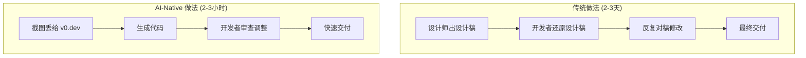
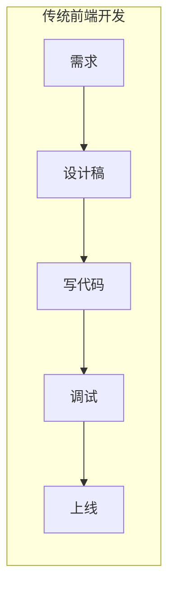
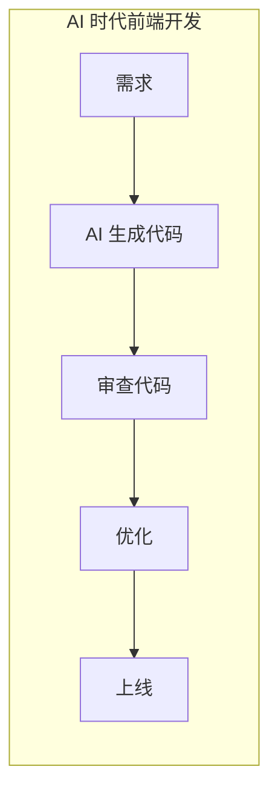
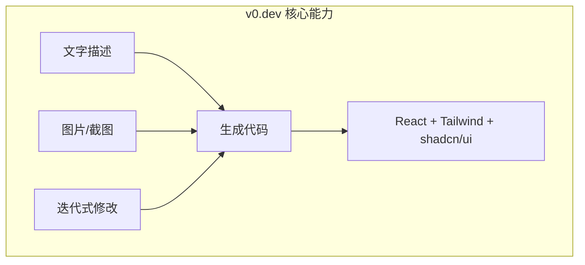
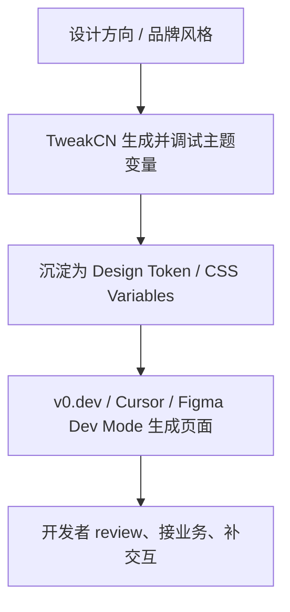
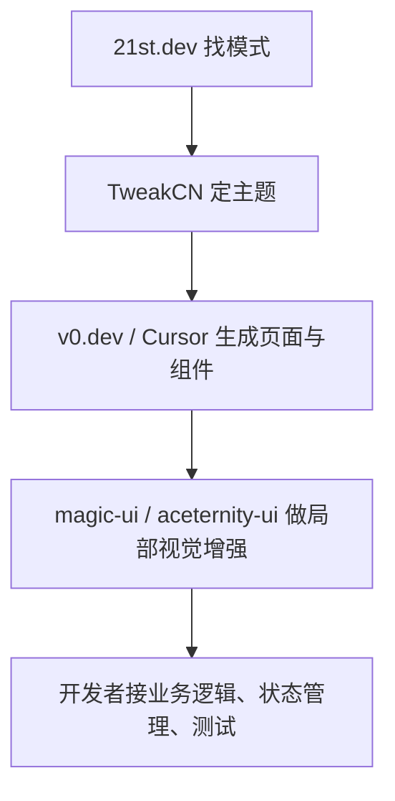
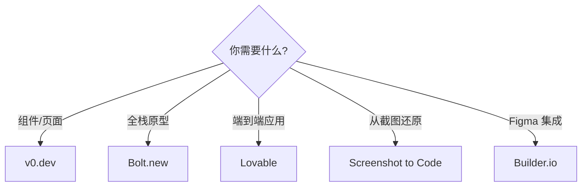
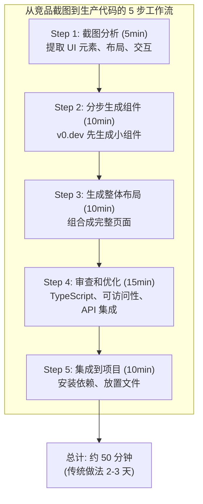
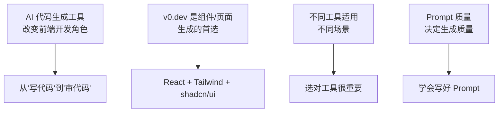

# Design to Code（下）：AI 代码生成工具实战
## 最终版演讲稿（融合版）

**演讲时长**: 2.5 小时
**风格**: 故事开场 + 技术深度 + 实践建议

---

## Opening Hook（10 min）

大家好，欢迎来到第 5 课。

上节课我们讲了设计工具的 AI 革命——Figma AI、Penpot、Pencil.dev。今天我们换个角度，不从设计工具出发，而是从**代码生成工具**出发。

我先给大家看一个场景。

产品经理发了一张竞品截图到群里，说："我们也做一个类似的页面，明天要。"



**传统做法**：
1. 设计师出设计稿（半天）
2. 开发者还原设计稿（1-2 天）
3. 反复对稿修改（半天）
4. 总计：2-3 天

**AI-Native 做法**：
1. 把截图丢给 v0.dev
2. v0.dev 生成 React + Tailwind + shadcn/ui 代码
3. 开发者审查和调整
4. 总计：2-3 小时

我现在就给大家演示。

（打开 v0.dev，上传竞品截图）

大家看，v0.dev 生成的代码：
- 使用了 shadcn/ui 的 Card、Button、Badge 组件
- 样式全部用 Tailwind
- 响应式布局
- 代码质量很高，基本不用改

**这就是今天要讲的核心：AI 代码生成工具如何改变前端开发。**

---

## Section 1：AI 代码生成工具的定位（15 min）

### 不是替代，是加速

首先要明确一点：**AI 代码生成工具不是替代开发者，而是加速从原型到生产的过程。**

你可以把它理解为一个"超级初稿生成器"：
- 它生成 80% 的代码
- 你负责审查和优化剩下的 20%

### 角色转变





传统前端开发者的工作：
```
需求 → 设计稿 → 写代码 → 调试 → 上线
         ↑ 大部分时间花在这里
```

AI 时代前端开发者的工作：
```
需求 → AI 生成代码 → 审查代码 → 优化 → 上线
                      ↑ 大部分时间花在这里
```

**从"写代码"变成"审代码"。**

### 生成代码的质量评估标准

不是所有 AI 生成的代码都能用。评估标准：

| 维度 | 好的生成 | 差的生成 |
|------|---------|---------|
| 技术栈 | 使用指定的技术栈 | 混用不同技术栈 |
| 组件 | 使用 shadcn/ui | 自己写原生 HTML |
| 样式 | Tailwind utility | 内联 style 或自定义 CSS |
| 类型 | TypeScript 完整 | any 满天飞 |
| 可访问性 | 语义化标签 | div 套 div |
| 响应式 | 移动端适配 | 只有桌面端 |

---

## Section 2：v0.dev 深度解析（40 min）

### 核心能力

v0.dev 是 Vercel 出品的 AI 代码生成工具，专门为 React + Tailwind + shadcn/ui 优化。



**能力 1：从文字描述生成代码**

```
Prompt: "创建一个现代的登录页面，包含邮箱和密码输入框，
社交登录按钮（Google、GitHub），记住我复选框，
忘记密码链接。使用 shadcn/ui 组件，支持暗色模式。"
```

v0.dev 会生成完整的组件代码，包含：
- shadcn/ui 的 Card、Input、Button、Checkbox
- Tailwind 样式
- 暗色模式支持
- 响应式布局

**能力 2：从图片生成代码（截图转代码）**

上传一张设计稿截图或竞品截图，v0.dev 会：
1. 分析图片中的 UI 元素
2. 识别布局结构
3. 生成对应的 React 代码

**能力 3：迭代式修改**

生成代码后，你可以用自然语言修改：
- "把按钮改成圆角"
- "添加一个加载状态"
- "改成暗色主题"
- "让卡片在移动端竖排"

v0.dev 会在现有代码基础上修改，而不是重新生成。

### 辅助基础设施：图标库和 Design Token 会直接影响生成质量

很多同学学 AI 生成代码时，注意力都放在 Prompt 和模型上，但真实项目里，**图标库和 Design Token 其实是非常重要的“隐性输入”**。

为什么这么说？因为 AI 生成的不是一张图片，而是一套要长期维护的代码。代码要想稳定，至少要满足三件事：

- 图标来源统一
- 样式语义统一
- 主题切换有规则可依

这三件事，分别对应：

- 图标库
- 组件库
- Design Token

#### 为什么图标库不是小事

如果团队没有统一图标体系，AI 生成代码时就很容易出现这些问题：

- 一会儿用内联 SVG，一会儿用图片图标
- 不同页面的线条粗细不一致
- 图标命名方式不统一，后续替换困难
- Figma 里一个图标，代码里换成了风格完全不同的另一个图标

所以在 D2C 场景里，图标库不是“最后补一下”的资源，而是**生成阶段就应该明确的约束条件**。

#### Lucide：最适合 React + shadcn/ui 工作流

先说 `Lucide`。它的优势非常明确：

- React 生态集成非常自然
- 与 `shadcn/ui` 社区实践高度一致
- 图标命名直观，组件式调用简单
- 线性风格统一，适合后台、SaaS、工具类产品

也就是说，如果你在 v0.dev 或 Cursor 里明确写：

```text
Use shadcn/ui and lucide-react for all icons.
```

AI 往往会给你更稳定的输出。因为它知道：

- 图标应该通过组件 import
- 大小通常是 `h-4 w-4`、`h-5 w-5`
- 可以自然地跟 Button、Input、DropdownMenu 这些组件组合

课程前面的大量示例其实已经在默认使用 `lucide-react` 了，这也是为什么它应该被显式讲出来，而不是当作“理所当然”。[Lucide Icons](https://lucide.dev/icons/)

#### Tabler Icons：适合作为扩展图标池

再看 `Tabler Icons`。它的特点是：

- 图标量非常大，覆盖面广
- 线条、网格、间距控制很统一
- 支持多种格式，设计和开发协作都方便
- 很适合做企业应用、数据平台、管理后台的补充图标来源

如果 `Lucide` 是 React 场景里的默认首选，那 `Tabler Icons` 更像是一个很强的扩展库。

尤其是在这些场景里特别有价值：

- 设计师在 Figma 里需要快速搜图标
- 某些业务图标在 `Lucide` 里不够丰富
- 需要在设计稿、文档、前端代码之间共享统一图标语义

所以我的建议不是“二选一”，而是：

- 默认主图标体系用 `Lucide`
- 特殊业务场景补充 `Tabler Icons`
- 团队要有明确规则，避免同一个页面混用三四种风格  
[Tabler Icons](https://tabler.io/icons)

#### Design Token 在代码生成阶段到底起什么作用

图标统一了，还不够。真正决定 AI 生成代码是否能持续维护的，是 `Design Token`。

我想把这个概念再讲深一点，因为很多人到了第 5 课，只把 AI 工具理解成“帮我把页面搭出来”。这还只是第一层。

更关键的是：**AI 生成出来的代码，是引用设计规则，还是复制视觉结果。**

如果它只是在复制视觉结果，代码通常会长这样：

```tsx
<div className="rounded-[14px] bg-[#ffffff] px-[18px] py-[10px] text-[#1f2937] shadow-[0_4px_12px_rgba(0,0,0,0.08)]">
  导出报表
</div>
```

这段代码“像不像设计稿”？很像。

但它有一个致命问题：**没有设计语义。**

AI 只是把视觉结果抄下来了，并没有理解：

- 这是不是主按钮
- 这是不是卡片容器
- 这个圆角属于哪一档
- 这个间距是不是系统里的 `space-md`
- 这个颜色是不是主品牌色

而有 Token 约束时，更理想的结果会变成：

```tsx
<Button className="rounded-lg bg-primary text-primary-foreground shadow-sm">
  导出报表
</Button>
```

或者至少是：

```tsx
<div className="rounded-token-lg bg-surface-primary px-token-md py-token-sm text-text-primary shadow-token-sm">
  导出报表
</div>
```

这里的关键不是类名长什么样，而是：

**代码开始引用系统，而不是复制像素。**

#### 在实战里怎么把 Token 用到 Prompt 里

大家以后写 Prompt，不要只描述页面长什么样，还要描述它应该落到哪套规则里。

比如：

```text
Create this page using shadcn/ui components, lucide-react icons,
and project design tokens for color, spacing, radius, and shadow.
Avoid hard-coded hex colors and arbitrary pixel values unless necessary.
```

这一句非常有价值。它相当于告诉 AI：

- 不要乱写颜色
- 不要乱写间距
- 不要随便发明新的圆角和阴影
- 优先复用现有设计系统

大家记住一句话：

**Prompt 决定下限，Token 决定上限。**

Prompt 再好，如果团队没有统一的 Token 体系，AI 也只能尽量模仿；
但一旦项目有清晰的 Token 和组件边界，AI 生成质量会明显上一个台阶。

### 补充生态：TweakCN 这类工具为什么值得单独讲

如果说 `v0.dev` 是“页面生成器”，那 `TweakCN` 这类工具更像“主题和风格加速器”。

很多团队一开始会忽略它们，觉得“主题后面再调也行”。但真实工作流里，主题如果不先稳定，后面的 AI 生成就会出现两个问题：

- 生成结果虽然结构对了，但视觉风格飘忽不定
- 同样一个按钮、卡片、表格，在不同页面里会出现轻微但持续累积的不一致

所以 `TweakCN` 这类生态工具的价值，不在于“能不能做出花哨配色”，而在于：

**它们把 AI UI 开发从‘先生成，再返工调风格’，变成‘先定主题基线，再批量生成页面’。**

#### 它在 D2C 工作流里的位置

把整个链路串起来看，会更清楚：



也就是说，`TweakCN` 不直接替你做页面，但它会显著影响页面生成出来之后"像不像一个系统"。

#### 这类工具怎么介绍给学员

我建议你讲的时候，把这类生态分成四类：

| 类型 | 代表 | 核心价值 |
|------|------|------|
| **主题探索工具** | TweakCN | 快速生成主题变量，试品牌风格 |
| **代码生成工具** | v0.dev | 生成页面和组件代码 |
| **组件增强生态** | magic-ui、aceternity-ui | 补充动效、视觉强化组件 |
| **设计系统分发工具** | shadcn registry、自定义 registry | 复用和分发团队组件资产 |

这样一讲，大家就不会把所有工具都混成“AI 做页面”。

#### TweakCN 的正确使用姿势

最推荐的用法不是“做完页面以后再去调”，而是：

1. 先用 `TweakCN` 试 2 到 3 套主题方向
2. 选出一套最接近品牌和业务气质的变量基线
3. 把这套变量沉淀到项目主题文件
4. 再让 `v0.dev` 或 Cursor 按这套主题去生成页面

这样生成出来的代码更容易：

- 使用 `bg-primary`、`text-muted-foreground` 这类语义类名
- 避免大量硬编码 `#hex` 颜色
- 在亮色/暗色模式之间保持一致语义

#### 一个非常实用的组合打法

你可以把它教成一个“组合拳”：

**第一步：TweakCN**
- 快速得到品牌风格的第一版变量

**第二步：项目主题文件**
- 把变量固化到 `globals.css` 或主题文件里

**第三步：v0.dev / Cursor**
- 明确要求使用 `shadcn/ui + project design tokens + lucide-react`

**第四步：人工 review**
- 检查对比度、边框层级、焦点态、暗色模式

比如 Prompt 可以这样写：

```text
Create a dashboard page using shadcn/ui components, lucide-react icons,
and the project's existing design tokens for color, spacing, radius, and shadow.
Match the current theme system. Avoid hard-coded color values.
```

这时候，`TweakCN` 的价值就体现出来了: 它不是直接出现在最终页面里，但它决定了“当前主题系统”长什么样。

#### 适合什么场景

这类工具特别适合下面几种教学和项目场景：

- **课程演示**：很适合现场展示“换一套主题，整套组件观感如何一起变化”
- **新项目冷启动**：不用一开始就手调几十个变量
- **白标产品**：同一套业务代码支持多品牌主题
- **品牌升级**：快速试多套方案，不用先改一堆业务页面

#### 一个提醒

也要明确告诉学员：`TweakCN` 这类工具不能替代设计系统治理。

它擅长的是：

- 快速探索
- 快速预览
- 快速生成变量基线

它不擅长的是：

- 替你定义长期稳定的 Token 命名规范
- 替你做完整品牌策略
- 替你保证所有业务场景都符合设计规范

所以最合理的定位是：

**它是 shadcn/ui 生态里的“主题探索层”，不是最终治理层。**

### 生态组合建议：21st.dev、magic-ui、aceternity-ui 怎么配合用

除了 `TweakCN`，`shadcn/ui` 生态里还有几类很值得在 Design to Code 课程里顺手讲清楚的工具。

我建议你把它们讲成一个组合，而不是零散介绍。

#### 21st.dev：先找模式，再让 AI 生成

`21st.dev` 这类平台最大的价值，不是“复制组件”，而是帮你快速找到成熟模式。

比如你想做：

- Pricing section
- Command menu
- Dashboard widget
- Empty state
- Auth layout

很多时候，你并不是不知道怎么写，而是不想从空白开始定义结构。

这时最好的工作流是：

1. 先在 `21st.dev` 这类生态平台找接近的模式
2. 观察结构、层级、组件组合方式
3. 再把这个模式翻译成更高质量的 Prompt
4. 用 `v0.dev` 或 Cursor 在你的项目语境里重新生成

这比“直接让 AI 瞎猜你想要什么”稳定得多。

#### magic-ui：给生成结果补动效和氛围

`v0.dev` 很擅长生成结构完整、业务可用的页面，但它生成的默认结果通常偏稳健、偏理性。

如果你做的是：

- 官网首页
- 产品宣传页
- 活动页
- 融资介绍页

那你往往还需要再往上加一层“表现力”。`magic-ui` 很适合承担这个角色。

它不一定替代页面主体，而是适合补这些局部：

- Hero 区背景
- Logo 墙动画
- 数据流连线
- 品牌氛围粒子效果

所以它在 D2C 工作流里的定位是：

**先用 AI 生成结构，再用 magic-ui 提升表现力。**

#### aceternity-ui：做营销感和视觉冲击

如果 `magic-ui` 偏动效增强，那 `aceternity-ui` 更偏“视觉风格强化”。

它比较适合：

- 首屏展示
- 产品亮点区
- 高冲击力卡片
- 作品集、概念页、品牌页

但也要提醒学员，它不适合拿来铺满后台系统。  
因为视觉冲击越强，通常也意味着：

- 可读性更容易受影响
- 一致性更难维护
- 业务信息密度越高时越容易失控

所以最合理的搭配通常是：

- 中后台：`shadcn/ui` 为主
- 展示区：局部补 `magic-ui` 或 `aceternity-ui`

#### 一张生态工作流图

你可以把这段课讲成下面这个链路：



这样大家会一下子明白：

- 哪些工具负责“找灵感”
- 哪些工具负责“定风格”
- 哪些工具负责“生成代码”
- 哪些工具负责“补表现力”

### Prompt 技巧

**技巧 1：明确指定技术栈**

```
❌ "创建一个登录页面"
✅ "创建一个登录页面，使用 React + Tailwind CSS + shadcn/ui"
```

**技巧 2：描述视觉细节**

```
❌ "创建一个卡片"
✅ "创建一个卡片，白色背景，圆角 12px，轻微阴影，
    hover 时阴影加深，包含标题、描述和操作按钮"
```

**技巧 3：指定响应式行为**

```
✅ "移动端单列布局，平板双列，桌面三列，使用 CSS Grid"
```

**技巧 4：指定交互状态**

```
✅ "按钮有 hover、active、disabled、loading 四种状态"
```

**技巧 5：分步生成**

复杂页面不要一次性生成，分步来：
1. 先生成整体布局
2. 再逐个完善每个区域
3. 最后添加交互和动画

### 生成代码示例

我让 v0.dev 生成一个定价页面：

```
Prompt: "创建一个 SaaS 定价页面，三个套餐（基础版、专业版、企业版），
专业版标记为'最受欢迎'。每个套餐包含价格、功能列表、CTA 按钮。
支持月/年切换。使用 shadcn/ui 组件。"
```

v0.dev 生成的代码：

```tsx
'use client'

import { useState } from 'react'
import { Button } from '@/components/ui/button'
import { Card, CardContent, CardFooter, CardHeader, CardTitle } from '@/components/ui/card'
import { Badge } from '@/components/ui/badge'
import { Switch } from '@/components/ui/switch'
import { Check } from 'lucide-react'

const plans = [
  {
    name: '基础版',
    monthlyPrice: 29,
    yearlyPrice: 290,
    features: ['5 个项目', '10GB 存储', '基础分析', '邮件支持'],
    popular: false,
  },
  {
    name: '专业版',
    monthlyPrice: 79,
    yearlyPrice: 790,
    features: ['无限项目', '100GB 存储', '高级分析', 'AI 助手', '优先支持'],
    popular: true,
  },
  {
    name: '企业版',
    monthlyPrice: 199,
    yearlyPrice: 1990,
    features: ['无限一切', '1TB 存储', '自定义分析', 'AI 助手', '专属客服', 'SLA 保障'],
    popular: false,
  },
]

export function PricingPage() {
  const [isYearly, setIsYearly] = useState(false)

  return (
    <div className="max-w-6xl mx-auto px-4 py-16">
      <div className="text-center mb-12">
        <h1 className="text-4xl font-bold mb-4">选择适合你的方案</h1>
        <p className="text-gray-600 mb-8">所有方案都包含 14 天免费试用</p>
        <div className="flex items-center justify-center gap-3">
          <span className={!isYearly ? 'font-semibold' : 'text-gray-500'}>月付</span>
          <Switch checked={isYearly} onCheckedChange={setIsYearly} />
          <span className={isYearly ? 'font-semibold' : 'text-gray-500'}>
            年付 <Badge variant="secondary">省 20%</Badge>
          </span>
        </div>
      </div>

      <div className="grid md:grid-cols-3 gap-8">
        {plans.map((plan) => (
          <Card
            key={plan.name}
            className={cn(
              "relative",
              plan.popular && "border-2 border-primary shadow-lg scale-105"
            )}
          >
            {plan.popular && (
              <Badge className="absolute -top-3 left-1/2 -translate-x-1/2">
                最受欢迎
              </Badge>
            )}
            <CardHeader>
              <CardTitle>{plan.name}</CardTitle>
              <div className="mt-4">
                <span className="text-4xl font-bold">
                  ¥{isYearly ? plan.yearlyPrice : plan.monthlyPrice}
                </span>
                <span className="text-gray-500">/{isYearly ? '年' : '月'}</span>
              </div>
            </CardHeader>
            <CardContent>
              <ul className="space-y-3">
                {plan.features.map((feature) => (
                  <li key={feature} className="flex items-center gap-2">
                    <Check className="w-4 h-4 text-green-500 shrink-0" />
                    <span className="text-sm">{feature}</span>
                  </li>
                ))}
              </ul>
            </CardContent>
            <CardFooter>
              <Button
                className="w-full"
                variant={plan.popular ? 'default' : 'outline'}
              >
                开始试用
              </Button>
            </CardFooter>
          </Card>
        ))}
      </div>
    </div>
  )
}
```

**一次生成，代码质量很高。** 使用了 shadcn/ui 组件、Tailwind 样式、响应式布局、月/年切换逻辑。

### 实战 Prompt 示例 1：现代登录页

好，刚才是定价页面，我们再来看几个更实际的例子。第一个，**登录页**——几乎每个项目都需要。

```
Prompt: "创建一个现代的登录页面。要求：
1. 左右分栏布局：左边是品牌展示区（渐变背景 + Logo + 宣传语），右边是登录表单
2. 表单包含：邮箱输入、密码输入（带显示/隐藏切换）、记住我复选框、忘记密码链接
3. 社交登录：Google 和 GitHub 按钮，用分割线'或'隔开
4. 底部有注册链接
5. 使用 shadcn/ui 组件 + Tailwind CSS
6. 支持暗色模式
7. 移动端左边品牌区隐藏，只显示表单"
```

大家看这个 Prompt，我用了很多具体的描述。不是简单说"做个登录页"，而是把布局、组件、交互、响应式行为都说清楚了。v0.dev 生成的代码：

```tsx
'use client'

import { useState } from 'react'
import { Button } from '@/components/ui/button'
import { Card, CardContent, CardDescription, CardHeader, CardTitle } from '@/components/ui/card'
import { Input } from '@/components/ui/input'
import { Label } from '@/components/ui/label'
import { Checkbox } from '@/components/ui/checkbox'
import { Separator } from '@/components/ui/separator'
import { Eye, EyeOff, Github } from 'lucide-react'

export function LoginPage() {
  const [showPassword, setShowPassword] = useState(false)
  const [email, setEmail] = useState('')
  const [password, setPassword] = useState('')

  return (
    <div className="flex min-h-screen">
      {/* 左侧品牌区 - 移动端隐藏 */}
      <div className="hidden lg:flex lg:w-1/2 bg-gradient-to-br from-blue-600 via-purple-600 to-indigo-700 p-12 flex-col justify-between">
        <div>
          <h1 className="text-3xl font-bold text-white">YourBrand</h1>
        </div>
        <div>
          <blockquote className="text-xl text-white/90 font-medium leading-relaxed">
            "这个平台彻底改变了我们的工作方式，效率提升了 300%。"
          </blockquote>
          <p className="mt-4 text-white/70">—— 张伟，某科技公司 CTO</p>
        </div>
        <div className="flex gap-2">
          <div className="w-2 h-2 rounded-full bg-white/80" />
          <div className="w-2 h-2 rounded-full bg-white/40" />
          <div className="w-2 h-2 rounded-full bg-white/40" />
        </div>
      </div>

      {/* 右侧登录表单 */}
      <div className="w-full lg:w-1/2 flex items-center justify-center p-8 bg-background">
        <Card className="w-full max-w-md border-0 shadow-none lg:border lg:shadow-sm">
          <CardHeader className="text-center">
            <CardTitle className="text-2xl">欢迎回来</CardTitle>
            <CardDescription>输入你的账号信息登录</CardDescription>
          </CardHeader>
          <CardContent className="space-y-6">
            {/* 社交登录 */}
            <div className="grid grid-cols-2 gap-3">
              <Button variant="outline" className="w-full">
                <svg className="mr-2 h-4 w-4" viewBox="0 0 24 24">
                  <path d="M22.56 12.25c0-.78-.07-1.53-.2-2.25H12v4.26h5.92a5.06 5.06 0 01-2.2 3.32v2.77h3.57c2.08-1.92 3.28-4.74 3.28-8.1z" fill="#4285F4"/>
                  <path d="M12 23c2.97 0 5.46-.98 7.28-2.66l-3.57-2.77c-.98.66-2.23 1.06-3.71 1.06-2.86 0-5.29-1.93-6.16-4.53H2.18v2.84C3.99 20.53 7.7 23 12 23z" fill="#34A853"/>
                  <path d="M5.84 14.09c-.22-.66-.35-1.36-.35-2.09s.13-1.43.35-2.09V7.07H2.18C1.43 8.55 1 10.22 1 12s.43 3.45 1.18 4.93l2.85-2.22.81-.62z" fill="#FBBC05"/>
                  <path d="M12 5.38c1.62 0 3.06.56 4.21 1.64l3.15-3.15C17.45 2.09 14.97 1 12 1 7.7 1 3.99 3.47 2.18 7.07l3.66 2.84c.87-2.6 3.3-4.53 6.16-4.53z" fill="#EA4335"/>
                </svg>
                Google
              </Button>
              <Button variant="outline" className="w-full">
                <Github className="mr-2 h-4 w-4" />
                GitHub
              </Button>
            </div>

            <div className="relative">
              <Separator />
              <span className="absolute left-1/2 top-1/2 -translate-x-1/2 -translate-y-1/2 bg-background px-2 text-xs text-muted-foreground">
                或使用邮箱登录
              </span>
            </div>

            {/* 邮箱密码表单 */}
            <form className="space-y-4">
              <div className="space-y-2">
                <Label htmlFor="email">邮箱</Label>
                <Input
                  id="email"
                  type="email"
                  placeholder="name@example.com"
                  value={email}
                  onChange={(e) => setEmail(e.target.value)}
                />
              </div>
              <div className="space-y-2">
                <div className="flex items-center justify-between">
                  <Label htmlFor="password">密码</Label>
                  <a href="/forgot-password" className="text-sm text-primary hover:underline">
                    忘记密码？
                  </a>
                </div>
                <div className="relative">
                  <Input
                    id="password"
                    type={showPassword ? 'text' : 'password'}
                    placeholder="输入密码"
                    value={password}
                    onChange={(e) => setPassword(e.target.value)}
                  />
                  <Button
                    type="button"
                    variant="ghost"
                    size="icon"
                    className="absolute right-0 top-0 h-full px-3 hover:bg-transparent"
                    onClick={() => setShowPassword(!showPassword)}
                  >
                    {showPassword ? <EyeOff className="h-4 w-4" /> : <Eye className="h-4 w-4" />}
                  </Button>
                </div>
              </div>
              <div className="flex items-center space-x-2">
                <Checkbox id="remember" />
                <Label htmlFor="remember" className="text-sm font-normal">
                  记住我
                </Label>
              </div>
              <Button type="submit" className="w-full">
                登录
              </Button>
            </form>

            <p className="text-center text-sm text-muted-foreground">
              还没有账号？{' '}
              <a href="/register" className="text-primary hover:underline font-medium">
                立即注册
              </a>
            </p>
          </CardContent>
        </Card>
      </div>
    </div>
  )
}
```

大家注意看这段代码的几个亮点：
- **左右分栏布局**：`hidden lg:flex` 实现了移动端自动隐藏左侧品牌区
- **密码可见性切换**：用了 `useState` 控制 `type` 属性
- **社交登录按钮**：Google 用了真实的 SVG Logo，GitHub 用了 Lucide 图标
- **分割线的"或"文字**：用绝对定位实现的，很优雅
- **语义化和可访问性**：Label 和 Input 都正确关联了

这就是一个生产级的登录页面，拿来就能用。

### 实战 Prompt 示例 2：数据仪表盘

第二个例子，**数据仪表盘**——后台管理系统最常见的页面。

```
Prompt: "创建一个数据分析仪表盘页面。要求：
1. 顶部：四个统计卡片（总收入、新用户、订单数、转化率），每个卡片显示数值、环比变化（绿色涨/红色跌）、小图标
2. 中部：左边大图表区域（收入趋势折线图占位），右边是最近订单列表（5条，含用户头像、金额、状态Badge）
3. 底部：热销商品 Top 5 表格（排名、商品名、销量、收入、同比增长）
4. 使用 shadcn/ui 的 Card、Table、Badge、Avatar 组件
5. 响应式：移动端统计卡片 2x2 网格，中部上下排列"
```

看这个 Prompt，我把页面拆成了三个区域，每个区域的内容和组件都描述清楚了。v0.dev 生成的代码：

```tsx
'use client'

import { Card, CardContent, CardHeader, CardTitle, CardDescription } from '@/components/ui/card'
import { Badge } from '@/components/ui/badge'
import { Avatar, AvatarFallback, AvatarImage } from '@/components/ui/avatar'
import {
  Table,
  TableBody,
  TableCell,
  TableHead,
  TableHeader,
  TableRow,
} from '@/components/ui/table'
import {
  DollarSign,
  Users,
  ShoppingCart,
  TrendingUp,
  TrendingDown,
  ArrowUpRight,
  ArrowDownRight,
} from 'lucide-react'

const stats = [
  {
    title: '总收入',
    value: '¥128,430',
    change: '+12.5%',
    trend: 'up',
    icon: DollarSign,
  },
  {
    title: '新用户',
    value: '2,340',
    change: '+8.2%',
    trend: 'up',
    icon: Users,
  },
  {
    title: '订单数',
    value: '1,892',
    change: '-3.1%',
    trend: 'down',
    icon: ShoppingCart,
  },
  {
    title: '转化率',
    value: '3.24%',
    change: '+0.4%',
    trend: 'up',
    icon: TrendingUp,
  },
]

const recentOrders = [
  { id: '1', user: '张三', avatar: '/avatars/01.png', email: 'zhang@example.com', amount: '¥1,299', status: '已完成' },
  { id: '2', user: '李四', avatar: '/avatars/02.png', email: 'li@example.com', amount: '¥899', status: '处理中' },
  { id: '3', user: '王五', avatar: '/avatars/03.png', email: 'wang@example.com', amount: '¥2,499', status: '已完成' },
  { id: '4', user: '赵六', avatar: '/avatars/04.png', email: 'zhao@example.com', amount: '¥599', status: '已取消' },
  { id: '5', user: '孙七', avatar: '/avatars/05.png', email: 'sun@example.com', amount: '¥3,199', status: '已完成' },
]

const topProducts = [
  { rank: 1, name: 'MacBook Pro 14"', sales: 1234, revenue: '¥18,510,000', growth: '+15.2%' },
  { rank: 2, name: 'iPhone 16 Pro', sales: 2890, revenue: '¥23,120,000', growth: '+22.8%' },
  { rank: 3, name: 'AirPods Pro 3', sales: 4521, revenue: '¥8,139,800', growth: '+8.6%' },
  { rank: 4, name: 'iPad Air M3', sales: 987, revenue: '¥5,922,000', growth: '-2.1%' },
  { rank: 5, name: 'Apple Watch Ultra', sales: 756, revenue: '¥4,536,000', growth: '+5.4%' },
]

function getStatusVariant(status: string) {
  switch (status) {
    case '已完成': return 'default'
    case '处理中': return 'secondary'
    case '已取消': return 'destructive'
    default: return 'outline'
  }
}

export function DashboardPage() {
  return (
    <div className="space-y-6 p-6">
      {/* 统计卡片 */}
      <div className="grid grid-cols-2 lg:grid-cols-4 gap-4">
        {stats.map((stat) => {
          const Icon = stat.icon
          return (
            <Card key={stat.title}>
              <CardHeader className="flex flex-row items-center justify-between pb-2">
                <CardTitle className="text-sm font-medium text-muted-foreground">
                  {stat.title}
                </CardTitle>
                <Icon className="h-4 w-4 text-muted-foreground" />
              </CardHeader>
              <CardContent>
                <div className="text-2xl font-bold">{stat.value}</div>
                <div className="flex items-center text-xs mt-1">
                  {stat.trend === 'up' ? (
                    <ArrowUpRight className="h-3 w-3 text-green-500 mr-1" />
                  ) : (
                    <ArrowDownRight className="h-3 w-3 text-red-500 mr-1" />
                  )}
                  <span className={stat.trend === 'up' ? 'text-green-500' : 'text-red-500'}>
                    {stat.change}
                  </span>
                  <span className="text-muted-foreground ml-1">较上月</span>
                </div>
              </CardContent>
            </Card>
          )
        })}
      </div>

      {/* 中部：图表 + 最近订单 */}
      <div className="grid lg:grid-cols-7 gap-4">
        {/* 收入趋势图表占位 */}
        <Card className="lg:col-span-4">
          <CardHeader>
            <CardTitle>收入趋势</CardTitle>
            <CardDescription>过去 6 个月的收入变化</CardDescription>
          </CardHeader>
          <CardContent>
            <div className="h-[300px] flex items-center justify-center border-2 border-dashed rounded-lg text-muted-foreground">
              图表区域 - 集成 Recharts 或 Chart.js
            </div>
          </CardContent>
        </Card>

        {/* 最近订单 */}
        <Card className="lg:col-span-3">
          <CardHeader>
            <CardTitle>最近订单</CardTitle>
            <CardDescription>最新的 5 笔交易</CardDescription>
          </CardHeader>
          <CardContent>
            <div className="space-y-4">
              {recentOrders.map((order) => (
                <div key={order.id} className="flex items-center gap-3">
                  <Avatar className="h-9 w-9">
                    <AvatarImage src={order.avatar} alt={order.user} />
                    <AvatarFallback>{order.user[0]}</AvatarFallback>
                  </Avatar>
                  <div className="flex-1 min-w-0">
                    <p className="text-sm font-medium truncate">{order.user}</p>
                    <p className="text-xs text-muted-foreground truncate">{order.email}</p>
                  </div>
                  <div className="text-right">
                    <p className="text-sm font-medium">{order.amount}</p>
                    <Badge variant={getStatusVariant(order.status)} className="text-xs">
                      {order.status}
                    </Badge>
                  </div>
                </div>
              ))}
            </div>
          </CardContent>
        </Card>
      </div>

      {/* 热销商品表格 */}
      <Card>
        <CardHeader>
          <CardTitle>热销商品 Top 5</CardTitle>
          <CardDescription>本月销量排行榜</CardDescription>
        </CardHeader>
        <CardContent>
          <Table>
            <TableHeader>
              <TableRow>
                <TableHead className="w-16">排名</TableHead>
                <TableHead>商品名称</TableHead>
                <TableHead className="text-right">销量</TableHead>
                <TableHead className="text-right">收入</TableHead>
                <TableHead className="text-right">同比增长</TableHead>
              </TableRow>
            </TableHeader>
            <TableBody>
              {topProducts.map((product) => (
                <TableRow key={product.rank}>
                  <TableCell className="font-medium">#{product.rank}</TableCell>
                  <TableCell>{product.name}</TableCell>
                  <TableCell className="text-right">{product.sales.toLocaleString()}</TableCell>
                  <TableCell className="text-right">{product.revenue}</TableCell>
                  <TableCell className="text-right">
                    <span className={product.growth.startsWith('+') ? 'text-green-500' : 'text-red-500'}>
                      {product.growth}
                    </span>
                  </TableCell>
                </TableRow>
              ))}
            </TableBody>
          </Table>
        </CardContent>
      </Card>
    </div>
  )
}
```

这个仪表盘的代码量不小，但 v0.dev 一次就生成了。大家看几个关键点：
- **统计卡片**：用了动态图标映射（`const Icon = stat.icon`），非常 React 的写法
- **环比变化**：绿色上升、红色下降，带箭头图标
- **响应式布局**：`grid-cols-2 lg:grid-cols-4` 实现了移动端 2x2、桌面 4 列
- **订单状态**：用函数映射不同状态到不同的 Badge variant
- **图表占位**：留了占位区域，你可以后续集成 Recharts

**这种代码，手写至少要半天。v0.dev 30 秒搞定。**

### 实战 Prompt 示例 3：应用设置页

第三个例子，**设置页面**——带侧边导航和多个设置面板的复杂页面。

```
Prompt: "创建一个应用设置页面。要求：
1. 左侧：设置导航菜单（通用设置、外观、通知、安全、团队成员）
2. 右侧：对应的设置面板
3. 通用设置面板包含：应用名称输入框、时区选择、语言选择、自动保存开关
4. 外观面板包含：主题切换（浅色/深色/系统）用 RadioGroup，强调色选择用色块按钮，字体大小用 Slider
5. 通知面板包含：多个通知渠道（邮件/推送/短信）的开关列表，每个开关带描述文字
6. 底部有保存和取消按钮
7. 使用 shadcn/ui 组件
8. 移动端导航变成顶部水平标签"
```

v0.dev 生成的代码：

```tsx
'use client'

import { useState } from 'react'
import { Button } from '@/components/ui/button'
import { Card, CardContent, CardDescription, CardHeader, CardTitle } from '@/components/ui/card'
import { Input } from '@/components/ui/input'
import { Label } from '@/components/ui/label'
import { Switch } from '@/components/ui/switch'
import { Slider } from '@/components/ui/slider'
import { RadioGroup, RadioGroupItem } from '@/components/ui/radio-group'
import {
  Select,
  SelectContent,
  SelectItem,
  SelectTrigger,
  SelectValue,
} from '@/components/ui/select'
import { Separator } from '@/components/ui/separator'
import { Settings, Palette, Bell, Shield, UsersRound, Sun, Moon, Monitor } from 'lucide-react'
import { cn } from '@/lib/utils'

const navItems = [
  { id: 'general', label: '通用设置', icon: Settings },
  { id: 'appearance', label: '外观', icon: Palette },
  { id: 'notifications', label: '通知', icon: Bell },
  { id: 'security', label: '安全', icon: Shield },
  { id: 'team', label: '团队成员', icon: UsersRound },
]

const accentColors = [
  { name: '蓝色', value: 'blue', class: 'bg-blue-500' },
  { name: '紫色', value: 'purple', class: 'bg-purple-500' },
  { name: '绿色', value: 'green', class: 'bg-green-500' },
  { name: '橙色', value: 'orange', class: 'bg-orange-500' },
  { name: '红色', value: 'red', class: 'bg-red-500' },
  { name: '粉色', value: 'pink', class: 'bg-pink-500' },
]

export function SettingsPage() {
  const [activeTab, setActiveTab] = useState('general')
  const [theme, setTheme] = useState('system')
  const [accentColor, setAccentColor] = useState('blue')
  const [fontSize, setFontSize] = useState([14])
  const [autoSave, setAutoSave] = useState(true)
  const [notifications, setNotifications] = useState({
    emailMarketing: true,
    emailSecurity: true,
    pushMessages: false,
    pushUpdates: true,
    smsAlerts: false,
  })

  return (
    <div className="max-w-6xl mx-auto p-6">
      <div className="mb-8">
        <h1 className="text-3xl font-bold">设置</h1>
        <p className="text-muted-foreground mt-1">管理你的应用设置和偏好</p>
      </div>

      <div className="flex flex-col md:flex-row gap-8">
        {/* 侧边导航 - 移动端水平显示 */}
        <nav className="md:w-56 shrink-0">
          <div className="flex md:flex-col gap-1 overflow-x-auto md:overflow-visible pb-2 md:pb-0">
            {navItems.map((item) => {
              const Icon = item.icon
              return (
                <button
                  key={item.id}
                  onClick={() => setActiveTab(item.id)}
                  className={cn(
                    'flex items-center gap-2 px-3 py-2 rounded-md text-sm font-medium whitespace-nowrap transition-colors',
                    activeTab === item.id
                      ? 'bg-primary text-primary-foreground'
                      : 'text-muted-foreground hover:bg-muted hover:text-foreground'
                  )}
                >
                  <Icon className="h-4 w-4" />
                  {item.label}
                </button>
              )
            })}
          </div>
        </nav>

        {/* 设置面板 */}
        <div className="flex-1 space-y-6">
          {/* 通用设置 */}
          {activeTab === 'general' && (
            <Card>
              <CardHeader>
                <CardTitle>通用设置</CardTitle>
                <CardDescription>配置应用的基本信息和行为</CardDescription>
              </CardHeader>
              <CardContent className="space-y-6">
                <div className="space-y-2">
                  <Label htmlFor="appName">应用名称</Label>
                  <Input id="appName" defaultValue="我的应用" />
                </div>
                <div className="space-y-2">
                  <Label>时区</Label>
                  <Select defaultValue="asia-shanghai">
                    <SelectTrigger>
                      <SelectValue />
                    </SelectTrigger>
                    <SelectContent>
                      <SelectItem value="asia-shanghai">亚洲/上海 (UTC+8)</SelectItem>
                      <SelectItem value="asia-tokyo">亚洲/东京 (UTC+9)</SelectItem>
                      <SelectItem value="america-newyork">美洲/纽约 (UTC-5)</SelectItem>
                      <SelectItem value="europe-london">欧洲/伦敦 (UTC+0)</SelectItem>
                    </SelectContent>
                  </Select>
                </div>
                <div className="space-y-2">
                  <Label>语言</Label>
                  <Select defaultValue="zh-cn">
                    <SelectTrigger>
                      <SelectValue />
                    </SelectTrigger>
                    <SelectContent>
                      <SelectItem value="zh-cn">简体中文</SelectItem>
                      <SelectItem value="en-us">English (US)</SelectItem>
                      <SelectItem value="ja-jp">日本語</SelectItem>
                    </SelectContent>
                  </Select>
                </div>
                <Separator />
                <div className="flex items-center justify-between">
                  <div>
                    <Label>自动保存</Label>
                    <p className="text-sm text-muted-foreground">每 30 秒自动保存你的更改</p>
                  </div>
                  <Switch checked={autoSave} onCheckedChange={setAutoSave} />
                </div>
              </CardContent>
            </Card>
          )}

          {/* 外观设置 */}
          {activeTab === 'appearance' && (
            <Card>
              <CardHeader>
                <CardTitle>外观</CardTitle>
                <CardDescription>自定义应用的视觉风格</CardDescription>
              </CardHeader>
              <CardContent className="space-y-8">
                <div className="space-y-3">
                  <Label>主题</Label>
                  <RadioGroup value={theme} onValueChange={setTheme} className="grid grid-cols-3 gap-4">
                    {[
                      { value: 'light', label: '浅色', icon: Sun },
                      { value: 'dark', label: '深色', icon: Moon },
                      { value: 'system', label: '跟随系统', icon: Monitor },
                    ].map(({ value, label, icon: ThemeIcon }) => (
                      <Label
                        key={value}
                        htmlFor={value}
                        className={cn(
                          'flex flex-col items-center gap-2 rounded-lg border-2 p-4 cursor-pointer transition-colors hover:bg-muted',
                          theme === value ? 'border-primary bg-muted' : 'border-transparent'
                        )}
                      >
                        <RadioGroupItem value={value} id={value} className="sr-only" />
                        <ThemeIcon className="h-6 w-6" />
                        <span className="text-sm font-medium">{label}</span>
                      </Label>
                    ))}
                  </RadioGroup>
                </div>

                <Separator />

                <div className="space-y-3">
                  <Label>强调色</Label>
                  <div className="flex gap-3">
                    {accentColors.map((color) => (
                      <button
                        key={color.value}
                        onClick={() => setAccentColor(color.value)}
                        className={cn(
                          'w-8 h-8 rounded-full transition-transform',
                          color.class,
                          accentColor === color.value && 'ring-2 ring-offset-2 ring-primary scale-110'
                        )}
                        title={color.name}
                      />
                    ))}
                  </div>
                </div>

                <Separator />

                <div className="space-y-3">
                  <div className="flex items-center justify-between">
                    <Label>字体大小</Label>
                    <span className="text-sm text-muted-foreground">{fontSize[0]}px</span>
                  </div>
                  <Slider
                    value={fontSize}
                    onValueChange={setFontSize}
                    min={12}
                    max={20}
                    step={1}
                    className="w-full"
                  />
                  <div className="flex justify-between text-xs text-muted-foreground">
                    <span>小</span>
                    <span>默认</span>
                    <span>大</span>
                  </div>
                </div>
              </CardContent>
            </Card>
          )}

          {/* 通知设置 */}
          {activeTab === 'notifications' && (
            <Card>
              <CardHeader>
                <CardTitle>通知设置</CardTitle>
                <CardDescription>选择你想要接收的通知类型</CardDescription>
              </CardHeader>
              <CardContent className="space-y-6">
                <div>
                  <h3 className="text-sm font-semibold mb-4">邮件通知</h3>
                  <div className="space-y-4">
                    <div className="flex items-center justify-between">
                      <div>
                        <Label>营销邮件</Label>
                        <p className="text-sm text-muted-foreground">接收产品更新和促销信息</p>
                      </div>
                      <Switch
                        checked={notifications.emailMarketing}
                        onCheckedChange={(v) => setNotifications(prev => ({...prev, emailMarketing: v}))}
                      />
                    </div>
                    <div className="flex items-center justify-between">
                      <div>
                        <Label>安全通知</Label>
                        <p className="text-sm text-muted-foreground">账号异常登录和安全警告</p>
                      </div>
                      <Switch
                        checked={notifications.emailSecurity}
                        onCheckedChange={(v) => setNotifications(prev => ({...prev, emailSecurity: v}))}
                      />
                    </div>
                  </div>
                </div>
                <Separator />
                <div>
                  <h3 className="text-sm font-semibold mb-4">推送通知</h3>
                  <div className="space-y-4">
                    <div className="flex items-center justify-between">
                      <div>
                        <Label>新消息</Label>
                        <p className="text-sm text-muted-foreground">收到新消息时推送通知</p>
                      </div>
                      <Switch
                        checked={notifications.pushMessages}
                        onCheckedChange={(v) => setNotifications(prev => ({...prev, pushMessages: v}))}
                      />
                    </div>
                    <div className="flex items-center justify-between">
                      <div>
                        <Label>系统更新</Label>
                        <p className="text-sm text-muted-foreground">应用有新版本时通知</p>
                      </div>
                      <Switch
                        checked={notifications.pushUpdates}
                        onCheckedChange={(v) => setNotifications(prev => ({...prev, pushUpdates: v}))}
                      />
                    </div>
                  </div>
                </div>
                <Separator />
                <div>
                  <h3 className="text-sm font-semibold mb-4">短信通知</h3>
                  <div className="flex items-center justify-between">
                    <div>
                      <Label>紧急警报</Label>
                      <p className="text-sm text-muted-foreground">服务中断等紧急情况通过短信通知</p>
                    </div>
                    <Switch
                      checked={notifications.smsAlerts}
                      onCheckedChange={(v) => setNotifications(prev => ({...prev, smsAlerts: v}))}
                    />
                  </div>
                </div>
              </CardContent>
            </Card>
          )}

          {/* 保存/取消按钮 */}
          <div className="flex justify-end gap-3">
            <Button variant="outline">取消</Button>
            <Button>保存更改</Button>
          </div>
        </div>
      </div>
    </div>
  )
}
```

这个设置页面是最复杂的一个例子。v0.dev 一次生成了三个面板的完整代码。大家注意看：
- **侧边导航响应式**：`flex md:flex-col` 让导航在移动端变成水平滚动
- **主题选择**：用 RadioGroup 配合卡片样式，视觉效果很好
- **色块按钮**：选中态用 `ring` 和 `scale` 效果，交互感强
- **Slider 字体大小**：实时显示当前值
- **通知列表**：每个开关都有标题和描述，信息架构清晰

**三个 Prompt 示例做完，我想强调一个观点**：Prompt 的质量直接决定了生成代码的质量。你越具体，AI 给你的代码越好。模糊的 Prompt 只会得到模糊的代码。

---

## Section 3：横向对比其他 AI 生成工具（35 min）

### Bolt.new

**定位**：全栈应用原型工具

**核心特色**：
- 在线 IDE 环境（StackBlitz）
- 支持全栈开发（前端 + 后端 + 数据库）
- 实时预览
- 一键部署

Bolt.new 是 StackBlitz 团队做的，它最大的亮点是**浏览器里跑完整的 Node.js 环境**。什么意思呢？你不需要本地安装任何东西，在浏览器里就能跑 Next.js、装 npm 包、甚至连数据库都能跑。这个技术叫 WebContainers，是 StackBlitz 的核心技术。

跟 v0.dev 最大的区别在于：v0.dev 只生成前端组件代码，你需要自己集成到项目里。而 Bolt.new 直接给你一个**完整的、可运行的全栈应用**。你在对话中描述需求，它帮你建项目、装依赖、写前后端代码、连数据库，全部一条龙。

但它也有局限性。因为是在浏览器里运行，**性能有瓶颈**。复杂的构建可能会很慢，而且它对一些需要原生模块的 npm 包支持不好。另外，生成的代码结构有时候比较混乱，需要手动整理。

**适用场景**：
- 快速搭建全栈原型
- 需要后端逻辑的项目
- 演示和 POC
- 黑客松或技术验证：两小时内需要一个能演示的完整应用

**代码示例**：

```
Prompt: "创建一个待办事项应用，包含：
- 添加/删除/完成任务
- 数据持久化（SQLite）
- 用户认证
使用 Next.js + Prisma + shadcn/ui"
```

Bolt.new 会生成完整的全栈应用，包含前端、后端、数据库。你在浏览器里就能看到效果，点击部署按钮就能上线。

我给大家讲个真实案例。上个月我们团队参加一个内部黑客松，四个小时做一个产品原型。传统做法是本地搭环境、写代码、部署，四个小时根本不够。我们用 Bolt.new，一个小时就有了一个可运行的全栈应用，剩下三个小时全部用来打磨产品细节和准备演示。最后拿了第一名。

### Lovable

**定位**：端到端应用生成

**核心特色**：
- 从描述生成完整应用
- 包含后端和数据库（Supabase）
- 自动部署
- 支持协作编辑

Lovable 以前叫 GPT Engineer，后来改名了。它的定位比 Bolt.new 更进一步——不只是给你生成代码，而是给你生成一个**完整的、部署好的应用**。

它的技术栈是固定的：**React + Vite + Tailwind + Supabase**。为什么选这套？因为这套技术栈足够简单，AI 生成的成功率最高。Supabase 提供了认证、数据库、存储、实时订阅，一站式后端服务，不需要你写后端代码。

Lovable 最适合的场景是**非技术人员或者初创团队快速做 MVP**。比如，你有一个产品想法，想在一天之内做出来给投资人看。传统做法可能需要一个团队干两周。用 Lovable，你一个人一天就能搞定。

但它的局限性也很明显：**技术栈不可选择**、**复杂业务逻辑支持有限**、**生成的代码不太适合长期维护**。所以我的建议是，用它做原型和验证，验证通过后再用正规方式重写。

**适用场景**：
- 非技术人员快速搭建应用
- MVP 快速验证：一天之内做出可演示的产品
- 内部工具：不需要长期维护的管理后台
- 个人项目：快速把想法变成现实

### Screenshot to Code

**定位**：截图转代码

**核心特色**：
- 上传截图，生成 HTML/React/Vue 代码
- 支持多种框架
- 开源免费

Screenshot to Code 是一个开源项目，GitHub 上有 6 万多 Star。它的原理很简单：**把截图发给 GPT-4 Vision，让 AI 分析图片中的 UI 元素，然后生成对应的代码**。

它跟 v0.dev 的截图转代码有什么区别？主要两点：第一，**它是开源的**，你可以自己部署，不受 v0.dev 的免费额度限制。第二，**它支持多种输出格式**——HTML + Tailwind、React、Vue、Bootstrap，甚至 SVG。而 v0.dev 只输出 React + shadcn/ui。

但代码质量上，说实话，**v0.dev 要好很多**。Screenshot to Code 生成的代码更像是"像素级还原"，用了大量硬编码的样式和位置。而 v0.dev 生成的是"语义化还原"，用组件和 Tailwind utility，代码可维护性更好。

**适用场景**：
- 快速还原设计稿：特别是不需要长期维护的一次性页面
- 竞品分析：快速把竞品页面变成代码，研究它的布局和交互
- 原型制作：把手绘草图拍照上传，快速生成可交互的原型
- 教学演示：向客户或领导展示"截图一秒变代码"的效果

它还支持**录屏转代码**——你录一段操作视频，它能分析视频中的 UI 变化，生成带交互的代码。这个功能还在实验阶段，但已经非常惊艳了。

### Builder.io Visual Copilot

**定位**：Figma 插件

**核心特色**：
- 直接在 Figma 中使用
- 生成多种框架的代码
- 与设计工作流无缝集成

Builder.io 的 Visual Copilot 跟前面几个工具不太一样。它不是一个独立的产品，而是一个 **Figma 插件**。你在 Figma 里选中一个 Frame 或组件，点一下插件按钮，它就帮你生成对应框架的代码。

这意味着什么？意味着**设计师不需要离开 Figma**。设计完直接导出代码，不需要打开另一个网站、上传截图、粘贴 Prompt。工作流是最丝滑的。

它支持的框架非常多：React、Vue、Angular、Svelte、Solid、Qwik，甚至 React Native 和 Flutter。而且它不只是生成静态代码，还能**映射到你项目中已有的组件库**。比如你告诉它"我的项目用 Ant Design"，它就会用 Ant Design 的组件来生成代码，而不是从零写 HTML。

**适用场景**：
- 设计师和开发者协作：设计师出稿的同时就能提供代码参考
- Figma 重度用户：如果你的设计资产全在 Figma 里，这是最自然的选择
- 需要多框架输出：同一个设计稿需要生成 React 和 Vue 两套代码
- 企业级项目：需要与已有组件库对接的大型项目

### 对比表格

| 工具 | 技术栈 | 代码质量 | 全栈 | 价格 | 适用场景 |
|------|--------|---------|------|------|---------|
| **v0.dev** | React + Tailwind + shadcn | ⭐⭐⭐⭐⭐ | ❌ | 免费/付费 | 组件/页面生成 |
| **Bolt.new** | 多框架 | ⭐⭐⭐⭐ | ✅ | 免费/付费 | 全栈原型 |
| **Lovable** | React + Supabase | ⭐⭐⭐⭐ | ✅ | 付费 | 端到端应用 |
| **Screenshot to Code** | 多框架 | ⭐⭐⭐ | ❌ | 开源 | 截图还原 |
| **Builder.io** | 多框架 | ⭐⭐⭐⭐ | ❌ | 付费 | Figma 集成 |

### 如何选择



---

## Section 4：实战演示（40 min）

### 实战 1：v0.dev 从 prompt 到生产级组件

**需求**：创建一个用户设置页面

```
Prompt: "创建一个用户设置页面，包含：
1. 个人信息表单（头像上传、姓名、邮箱、手机号）
2. 通知设置（邮件通知、推送通知、短信通知的开关）
3. 安全设置（修改密码、两步验证）
4. 危险区域（删除账号）
使用 shadcn/ui 的 Tabs 组件组织，支持暗色模式"
```

现场演示生成过程和代码质量。

### 实战 2：Bolt.new 快速搭建全栈原型

**需求**：创建一个简单的博客系统

```
Prompt: "创建一个博客系统：
- 文章列表页
- 文章详情页
- Markdown 编辑器
- 用户认证（登录/注册）
- SQLite 数据库
使用 Next.js + Prisma + shadcn/ui"
```

现场演示 Bolt.new 的在线 IDE 和实时预览。

### 实战 3：对比不同工具生成同一设计稿

拿同一张设计稿，分别用 v0.dev、Bolt.new、Screenshot to Code 生成代码，对比：
- 代码质量
- 还原度
- 生成速度
- 可维护性

### 实战 4：从竞品截图到生产代码——完整工作流

好，前面三个实战都是"单工具演示"。现在我来演示一个**真实的工作场景**：产品经理丢了一张竞品截图，我们怎么用 AI 工具从零到上线。

假设产品经理发了一张某 SaaS 产品的"项目管理看板"截图，要求我们做一个类似的。传统做法要 3 天，我们用 AI 工具来加速。

**Step 1：截图分析（5分钟）**

先别急着丢给 AI。花 5 分钟分析截图里有什么：

```
竞品截图分析：
- 布局：左侧边栏（项目列表）+ 右侧主内容区（看板视图）
- 看板列：To Do、In Progress、In Review、Done（4列）
- 卡片内容：标题、标签（Bug/Feature/Improvement）、负责人头像、优先级指示器、截止日期
- 交互暗示：卡片可拖拽（有拖拽手柄图标）
- 顶部：搜索框、筛选按钮、视图切换（看板/列表/日历）
- 颜色方案：白色背景、灰色边框、彩色标签
```

为什么要先分析？因为**好的输入决定好的输出**。你直接丢截图给 AI，它可能遗漏一些细节。先分析，再写 Prompt，效果好得多。

**Step 2：用 v0.dev 生成基础组件（10分钟）**

我先用 v0.dev 生成看板的基础组件。注意，我不是一次性生成整个页面，而是**分步生成**：

```
Prompt 1（看板卡片）: "创建一个项目管理看板的任务卡片组件。要求：
1. 显示任务标题、描述（可选，最多两行，溢出省略）
2. 标签列表：用不同颜色的 Badge 显示（Bug-红色、Feature-蓝色、Improvement-绿色）
3. 底部信息栏：负责人头像（Avatar）、优先级图标（高-红色箭头、中-黄色、低-灰色）、截止日期
4. hover 时卡片微微上浮（translateY + shadow）
5. 左边有一个拖拽手柄图标（GripVertical）
6. 使用 shadcn/ui 的 Card、Badge、Avatar 组件"
```

v0.dev 生成的卡片组件代码：

```tsx
'use client'

import { Card, CardContent } from '@/components/ui/card'
import { Badge } from '@/components/ui/badge'
import { Avatar, AvatarFallback, AvatarImage } from '@/components/ui/avatar'
import {
  GripVertical,
  ArrowUp,
  ArrowRight,
  ArrowDown,
  Calendar,
} from 'lucide-react'
import { cn } from '@/lib/utils'

interface TaskCardProps {
  title: string
  description?: string
  tags: Array<{ label: string; type: 'bug' | 'feature' | 'improvement' }>
  assignee: { name: string; avatar?: string }
  priority: 'high' | 'medium' | 'low'
  dueDate?: string
}

const tagColors = {
  bug: 'bg-red-100 text-red-700 hover:bg-red-200',
  feature: 'bg-blue-100 text-blue-700 hover:bg-blue-200',
  improvement: 'bg-green-100 text-green-700 hover:bg-green-200',
}

const priorityConfig = {
  high: { icon: ArrowUp, color: 'text-red-500', label: '高' },
  medium: { icon: ArrowRight, color: 'text-yellow-500', label: '中' },
  low: { icon: ArrowDown, color: 'text-gray-400', label: '低' },
}

export function TaskCard({ title, description, tags, assignee, priority, dueDate }: TaskCardProps) {
  const PriorityIcon = priorityConfig[priority].icon

  return (
    <Card className="group cursor-grab active:cursor-grabbing transition-all duration-200 hover:-translate-y-0.5 hover:shadow-md">
      <CardContent className="p-3">
        <div className="flex gap-2">
          {/* 拖拽手柄 */}
          <div className="opacity-0 group-hover:opacity-100 transition-opacity pt-0.5">
            <GripVertical className="h-4 w-4 text-muted-foreground" />
          </div>

          <div className="flex-1 min-w-0 space-y-2">
            {/* 标题 */}
            <h3 className="font-medium text-sm leading-tight">{title}</h3>

            {/* 描述 */}
            {description && (
              <p className="text-xs text-muted-foreground line-clamp-2">{description}</p>
            )}

            {/* 标签 */}
            <div className="flex flex-wrap gap-1">
              {tags.map((tag) => (
                <Badge
                  key={tag.label}
                  variant="secondary"
                  className={cn('text-xs px-1.5 py-0', tagColors[tag.type])}
                >
                  {tag.label}
                </Badge>
              ))}
            </div>

            {/* 底部信息 */}
            <div className="flex items-center justify-between pt-1">
              <div className="flex items-center gap-2">
                <Avatar className="h-5 w-5">
                  <AvatarImage src={assignee.avatar} alt={assignee.name} />
                  <AvatarFallback className="text-[10px]">
                    {assignee.name[0]}
                  </AvatarFallback>
                </Avatar>
                <PriorityIcon
                  className={cn('h-3.5 w-3.5', priorityConfig[priority].color)}
                  title={`优先级: ${priorityConfig[priority].label}`}
                />
              </div>
              {dueDate && (
                <div className="flex items-center gap-1 text-xs text-muted-foreground">
                  <Calendar className="h-3 w-3" />
                  <span>{dueDate}</span>
                </div>
              )}
            </div>
          </div>
        </div>
      </CardContent>
    </Card>
  )
}
```

**Step 3：生成看板列和整体布局（10分钟）**

卡片组件有了，接下来生成看板列和整体布局：

```
Prompt 2（看板布局）: "创建一个看板布局组件。要求：
1. 顶部工具栏：搜索输入框、筛选按钮（下拉菜单，按标签/优先级/负责人筛选）、三个视图切换按钮（看板/列表/日历，用 ToggleGroup）
2. 看板区域：水平排列 4 个列（To Do、In Progress、In Review、Done）
3. 每个列有标题、任务计数Badge、添加任务按钮
4. 列之间等宽，水平滚动（移动端）
5. 使用 shadcn/ui 组件"
```

```tsx
'use client'

import { useState } from 'react'
import { Button } from '@/components/ui/button'
import { Input } from '@/components/ui/input'
import { Badge } from '@/components/ui/badge'
import { ScrollArea, ScrollBar } from '@/components/ui/scroll-area'
import { ToggleGroup, ToggleGroupItem } from '@/components/ui/toggle-group'
import {
  DropdownMenu,
  DropdownMenuContent,
  DropdownMenuLabel,
  DropdownMenuSeparator,
  DropdownMenuCheckboxItem,
  DropdownMenuTrigger,
} from '@/components/ui/dropdown-menu'
import { Search, SlidersHorizontal, LayoutGrid, List, CalendarDays, Plus } from 'lucide-react'
import { TaskCard } from './task-card'

const columns = [
  {
    id: 'todo',
    title: 'To Do',
    color: 'bg-gray-400',
    tasks: [
      {
        title: '设计用户注册流程',
        description: '包含邮箱验证和手机号验证两种方式',
        tags: [{ label: 'Feature', type: 'feature' as const }],
        assignee: { name: '张三' },
        priority: 'high' as const,
        dueDate: '3/28',
      },
      {
        title: '修复登录页面样式错位',
        tags: [{ label: 'Bug', type: 'bug' as const }],
        assignee: { name: '李四' },
        priority: 'medium' as const,
        dueDate: '3/27',
      },
    ],
  },
  {
    id: 'in-progress',
    title: 'In Progress',
    color: 'bg-blue-400',
    tasks: [
      {
        title: '实现支付集成',
        description: '对接支付宝和微信支付 SDK',
        tags: [{ label: 'Feature', type: 'feature' as const }],
        assignee: { name: '王五' },
        priority: 'high' as const,
        dueDate: '3/30',
      },
    ],
  },
  {
    id: 'in-review',
    title: 'In Review',
    color: 'bg-yellow-400',
    tasks: [
      {
        title: '优化首页加载性能',
        description: '使用 React.lazy 和 Suspense 实现代码分割',
        tags: [{ label: 'Improvement', type: 'improvement' as const }],
        assignee: { name: '赵六' },
        priority: 'medium' as const,
      },
    ],
  },
  {
    id: 'done',
    title: 'Done',
    color: 'bg-green-400',
    tasks: [
      {
        title: '搭建 CI/CD 流水线',
        tags: [{ label: 'Improvement', type: 'improvement' as const }],
        assignee: { name: '孙七' },
        priority: 'low' as const,
      },
    ],
  },
]

export function KanbanBoard() {
  const [view, setView] = useState('board')
  const [searchQuery, setSearchQuery] = useState('')

  return (
    <div className="h-screen flex flex-col">
      {/* 顶部工具栏 */}
      <div className="border-b px-6 py-3 flex items-center justify-between gap-4">
        <div className="flex items-center gap-3 flex-1">
          <div className="relative max-w-sm flex-1">
            <Search className="absolute left-3 top-1/2 -translate-y-1/2 h-4 w-4 text-muted-foreground" />
            <Input
              placeholder="搜索任务..."
              value={searchQuery}
              onChange={(e) => setSearchQuery(e.target.value)}
              className="pl-9"
            />
          </div>
          <DropdownMenu>
            <DropdownMenuTrigger asChild>
              <Button variant="outline" size="sm">
                <SlidersHorizontal className="h-4 w-4 mr-2" />
                筛选
              </Button>
            </DropdownMenuTrigger>
            <DropdownMenuContent align="start" className="w-48">
              <DropdownMenuLabel>按标签</DropdownMenuLabel>
              <DropdownMenuCheckboxItem checked>Bug</DropdownMenuCheckboxItem>
              <DropdownMenuCheckboxItem checked>Feature</DropdownMenuCheckboxItem>
              <DropdownMenuCheckboxItem checked>Improvement</DropdownMenuCheckboxItem>
              <DropdownMenuSeparator />
              <DropdownMenuLabel>按优先级</DropdownMenuLabel>
              <DropdownMenuCheckboxItem checked>高</DropdownMenuCheckboxItem>
              <DropdownMenuCheckboxItem checked>中</DropdownMenuCheckboxItem>
              <DropdownMenuCheckboxItem checked>低</DropdownMenuCheckboxItem>
            </DropdownMenuContent>
          </DropdownMenu>
        </div>

        <ToggleGroup type="single" value={view} onValueChange={(v) => v && setView(v)}>
          <ToggleGroupItem value="board" aria-label="看板视图">
            <LayoutGrid className="h-4 w-4" />
          </ToggleGroupItem>
          <ToggleGroupItem value="list" aria-label="列表视图">
            <List className="h-4 w-4" />
          </ToggleGroupItem>
          <ToggleGroupItem value="calendar" aria-label="日历视图">
            <CalendarDays className="h-4 w-4" />
          </ToggleGroupItem>
        </ToggleGroup>
      </div>

      {/* 看板区域 */}
      <ScrollArea className="flex-1">
        <div className="flex gap-4 p-6 min-w-max">
          {columns.map((column) => (
            <div key={column.id} className="w-72 shrink-0 flex flex-col">
              {/* 列头 */}
              <div className="flex items-center justify-between mb-3">
                <div className="flex items-center gap-2">
                  <div className={cn('w-2 h-2 rounded-full', column.color)} />
                  <h2 className="font-semibold text-sm">{column.title}</h2>
                  <Badge variant="secondary" className="text-xs">
                    {column.tasks.length}
                  </Badge>
                </div>
                <Button variant="ghost" size="icon" className="h-6 w-6">
                  <Plus className="h-4 w-4" />
                </Button>
              </div>

              {/* 任务卡片列表 */}
              <div className="space-y-2 flex-1">
                {column.tasks.map((task, index) => (
                  <TaskCard key={index} {...task} />
                ))}
              </div>

              {/* 添加任务按钮 */}
              <Button
                variant="ghost"
                className="w-full mt-2 justify-start text-muted-foreground"
              >
                <Plus className="h-4 w-4 mr-2" />
                添加任务
              </Button>
            </div>
          ))}
        </div>
        <ScrollBar orientation="horizontal" />
      </ScrollArea>
    </div>
  )
}
```

**Step 4：审查和优化代码（15分钟）**

AI 生成的代码虽然质量高，但还需要人工审查和优化。这是最关键的一步。

```
审查清单：

1. ✅ TypeScript 类型 → 接口定义完整，属性都有类型
2. ✅ shadcn/ui 组件 → 使用了 Card、Badge、Avatar、Input、Button 等
3. ✅ Tailwind 样式 → 没有内联 style 或自定义 CSS
4. ✅ 响应式 → ScrollArea 实现了移动端水平滚动
5. ⚠️ 可访问性 → 需要补充 aria-label 和键盘导航
6. ⚠️ 拖拽功能 → 只有视觉效果，需要集成 @dnd-kit
7. ⚠️ 状态管理 → 需要把硬编码数据改为动态状态
8. ⚠️ API 集成 → 需要对接后端接口
```

需要手动优化的部分，比如集成拖拽库：

```tsx
// 集成 @dnd-kit 实现真正的拖拽
import {
  DndContext,
  closestCorners,
  KeyboardSensor,
  PointerSensor,
  useSensor,
  useSensors,
  DragOverlay,
} from '@dnd-kit/core'
import {
  SortableContext,
  sortableKeyboardCoordinates,
  verticalListSortingStrategy,
  useSortable,
} from '@dnd-kit/sortable'
import { CSS } from '@dnd-kit/utilities'

// 将 TaskCard 包装成可排序的
function SortableTaskCard({ task, id }: { task: TaskCardProps; id: string }) {
  const {
    attributes,
    listeners,
    setNodeRef,
    transform,
    transition,
    isDragging,
  } = useSortable({ id })

  const style = {
    transform: CSS.Transform.toString(transform),
    transition,
    opacity: isDragging ? 0.5 : 1,
  }

  return (
    <div ref={setNodeRef} style={style} {...attributes} {...listeners}>
      <TaskCard {...task} />
    </div>
  )
}
```

**Step 5：集成到项目并验证（10分钟）**

最后，把组件集成到现有项目：

```bash
# 1. 确保依赖已安装
pnpm add @dnd-kit/core @dnd-kit/sortable @dnd-kit/utilities

# 2. 把组件文件放到正确的目录
# components/kanban/task-card.tsx
# components/kanban/kanban-board.tsx

# 3. 在页面中使用
# app/projects/[id]/page.tsx
```

```tsx
// app/projects/[id]/page.tsx
import { KanbanBoard } from '@/components/kanban/kanban-board'

export default function ProjectPage({ params }: { params: { id: string } }) {
  return (
    <div className="h-screen">
      <KanbanBoard projectId={params.id} />
    </div>
  )
}
```

**总结一下这个实战流程**：



**这就是 AI 代码生成工具带来的效率提升。不是 10% 的提升，是 10 倍的提升。**

---

## Closing（20 min）

### 今天的核心要点



1. **AI 代码生成工具改变了前端开发的角色**：从"写代码"到"审代码"
2. **v0.dev 是组件/页面生成的首选**：React + Tailwind + shadcn/ui 的最佳搭档
3. **不同工具有不同的适用场景**：选对工具很重要
4. **Prompt 质量决定生成质量**：学会写好 Prompt

### 行动建议

1. 注册 v0.dev，试试从 prompt 生成一个页面
2. 用 Bolt.new 搭建一个全栈原型
3. 把竞品截图丢给 Screenshot to Code，看看效果

### 下节课预告

下节课我们讲 **Monorepo 与代码组织**：
- 为什么 Monorepo 更 AI 友好
- Turborepo + pnpm workspace
- AGENTS.md 和 .cursorrules

### Q&A

现在我们有 20 分钟的 Q&A 时间。

---

**演讲稿完成！**

**总时长**: 约 2.5 小时
- Opening: 10 min
- Section 1: 15 min
- Section 2: 40 min
- Section 3: 35 min
- Section 4: 40 min
- Closing: 20 min
