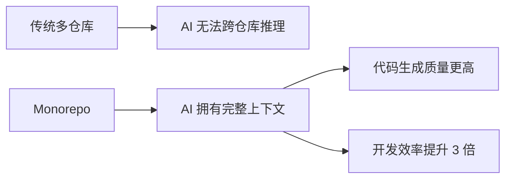
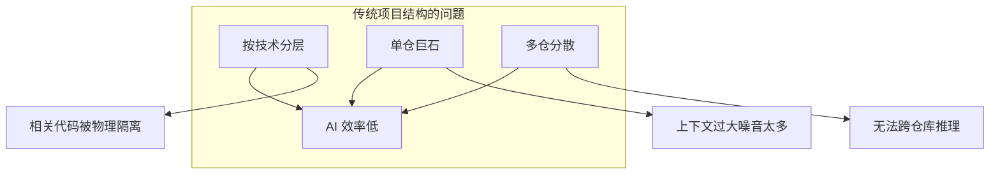
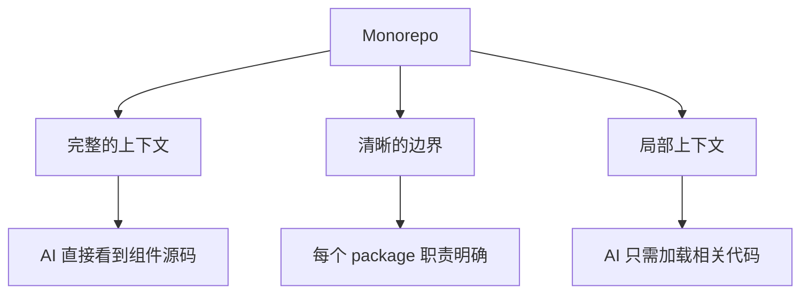
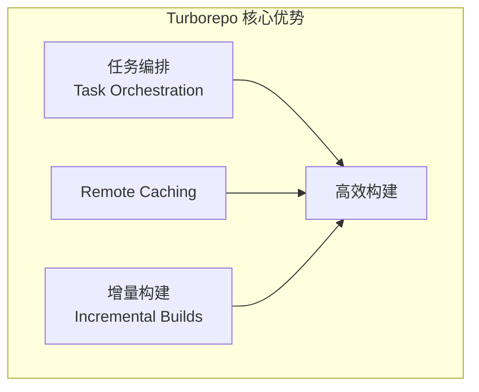
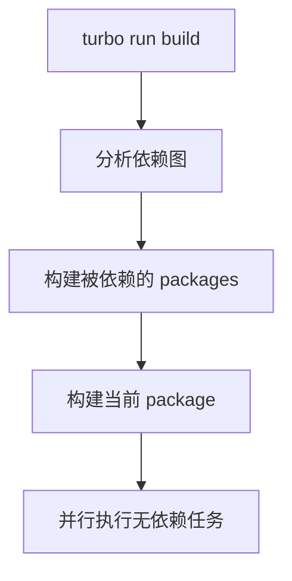
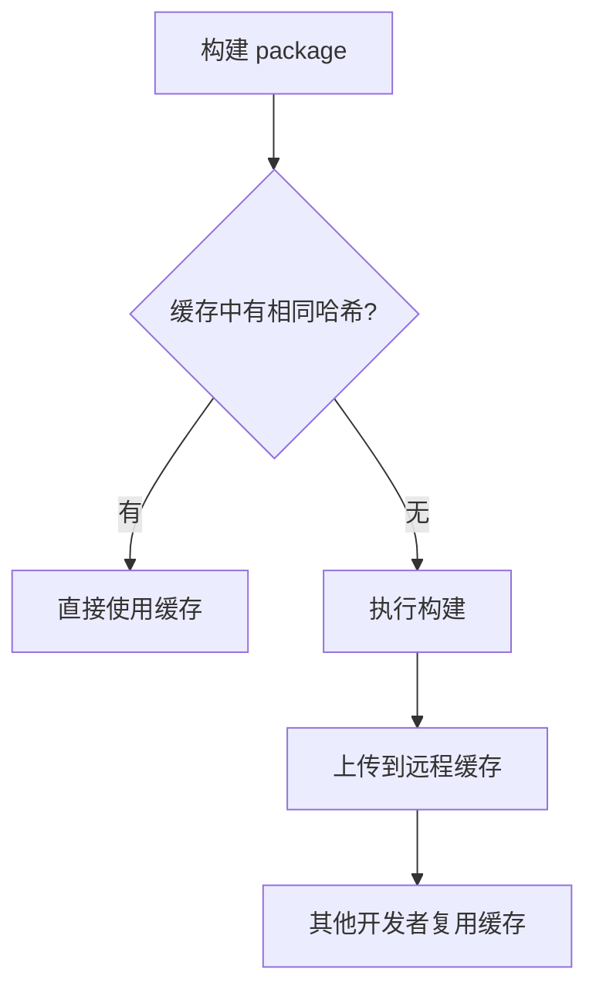
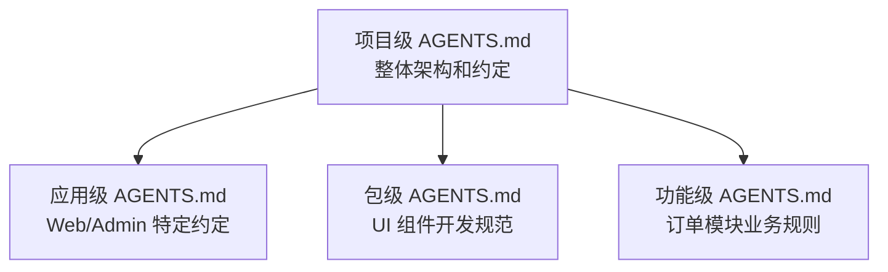
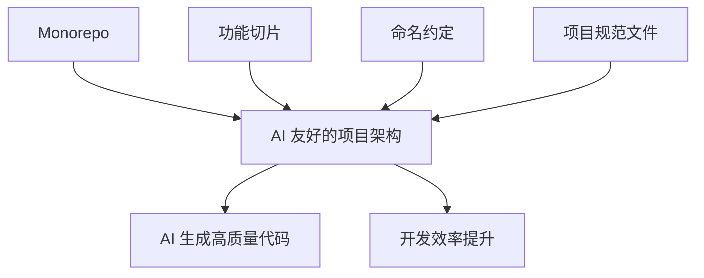

# 第 6 课：AI 友好的项目架构 - Monorepo 与代码组织

## Opening Hook（10 min）

大家好，欢迎来到第 6 课。

今天我想先给大家讲一个真实的故事。上个月，我们团队接手了一个电商项目的重构任务。这个项目有 12 个微服务，分散在 12 个 Git 仓库里。前端有 3 个独立的仓库：主站、管理后台、移动端 H5。

我们想用 Cursor 来加速开发。结果第一天就遇到了问题：当我让 AI 帮我实现一个"用户下单后发送通知"的功能时，AI 需要理解订单服务、通知服务、用户服务三个仓库的代码。但 Cursor 一次只能打开一个项目。

我不得不在三个 IDE 窗口之间来回切换，手动复制代码给 AI 看。AI 生成的代码经常出现接口不匹配的问题，因为它看不到完整的上下文。

更糟糕的是，前端的组件库代码在一个独立的 npm 包里。每次修改组件，都要发布新版本，然后在三个前端项目里分别升级依赖。整个流程下来，一个小改动要花半天时间。

那天晚上，我们团队坐下来复盘：为什么我们的项目结构对 AI 这么不友好？

答案很简单：**AI 的工作方式和人类不一样。人类可以在脑子里记住多个仓库的上下文，可以跨窗口思考。但 AI 依赖的是你给它的上下文窗口。**

后来我们做了一个决定：把所有代码迁移到一个 Monorepo 里，使用 Turborepo + pnpm workspace。结果呢？

第二周，同样的需求，我在 Cursor 里直接说："实现用户下单后发送通知的功能"。AI 自动找到了 `packages/order`、`packages/notification`、`packages/user` 三个包，理解了它们之间的依赖关系，生成的代码一次就能跑通。

开发效率提升了 3 倍。

这就是今天这节课的核心主题：**如何设计 AI 友好的项目架构。**



我们会讲 Monorepo，但不只是讲 Monorepo。我们会讲如何通过合理的代码组织、命名约定、项目规范文件，让 AI 能够快速理解你的项目，生成高质量的代码。

准备好了吗？我们开始。

---

## Section 1：传统项目结构的 AI 困境（20 min）

### 1.1 按技术分层的问题

我们先来看一个典型的前端项目结构。这是我在很多公司见到的组织方式：

```
src/
├── components/
│   ├── Button.tsx
│   ├── Modal.tsx
│   ├── UserAvatar.tsx
│   └── OrderCard.tsx
├── hooks/
│   ├── useAuth.ts
│   ├── useOrder.ts
│   └── useUser.ts
├── services/
│   ├── authService.ts
│   ├── orderService.ts
│   └── userService.ts
├── store/
│   ├── authSlice.ts
│   ├── orderSlice.ts
│   └── userSlice.ts
└── pages/
    ├── LoginPage.tsx
    ├── OrderPage.tsx
    └── UserProfilePage.tsx
```

这种结构叫做"按技术分层"（Layer by Technology）。看起来很整洁，对吧？所有组件放一起，所有 hooks 放一起，所有 services 放一起。

但问题来了。假设你让 AI 帮你实现一个"订单列表页"的功能。AI 需要理解什么？

- `components/OrderCard.tsx` - 订单卡片组件
- `hooks/useOrder.ts` - 订单相关的 hooks
- `services/orderService.ts` - 订单 API 调用
- `store/orderSlice.ts` - 订单状态管理
- `pages/OrderPage.tsx` - 订单页面

这 5 个文件分散在 5 个不同的目录里。AI 需要跨目录理解它们之间的关系。

更糟糕的是，当你的项目变大，`components` 目录里有 50 个组件，`hooks` 目录里有 30 个 hooks。AI 在搜索相关代码时，需要遍历大量不相关的文件。

**这就是按技术分层对 AI 不友好的第一个原因：相关的代码被物理隔离了。**

### 1.2 单仓巨石的问题

我们再看另一个极端：把所有代码都放在一个仓库里，但没有任何模块化。

```
src/
├── App.tsx (3000 行)
├── utils.ts (2000 行)
├── api.ts (1500 行)
├── types.ts (1000 行)
└── ... (100+ 个文件)
```

这种项目我见过太多了。一个 `utils.ts` 文件里塞了几十个工具函数，从日期格式化到加密解密，什么都有。

当你让 AI 帮你修改一个功能时，AI 需要加载整个 `utils.ts` 文件到上下文里。但其中 90% 的代码都是不相关的。

**这就是单仓巨石的问题：上下文过大，噪音太多。**

AI 的上下文窗口是有限的。Claude 3.5 Sonnet 有 200K tokens 的上下文窗口，看起来很大，对吧？但一个中型项目的代码量轻松超过这个数字。

当 AI 的上下文被无关代码占满时，它就无法深入理解你真正需要修改的部分。

### 1.3 多仓分散的问题

最后，我们来看多仓分散的问题。这是我在开头故事里提到的场景。

```
repo-1: frontend-main/
repo-2: frontend-admin/
repo-3: frontend-mobile/
repo-4: shared-components/
repo-5: shared-utils/
```

这种结构的问题更明显：**AI 无法跨仓库推理。**

当你在 `frontend-main` 里使用 `shared-components` 的组件时，AI 看不到组件的源码。它只能看到类型定义（如果你有的话）。

结果就是，AI 生成的代码经常出现：
- 传错了 props
- 调用了不存在的方法
- 使用了已经废弃的 API

你不得不手动去 `shared-components` 仓库里查看文档，然后回来修改代码。

**这完全违背了使用 AI 的初衷：提高效率。**

### 1.4 小结

我们总结一下传统项目结构的三大问题：



1. **按技术分层**：相关代码被物理隔离，AI 需要跨目录理解
2. **单仓巨石**：上下文过大，噪音太多，AI 无法聚焦
3. **多仓分散**：AI 无法跨仓库推理，缺少完整上下文

那么，什么样的项目结构对 AI 友好呢？

答案是：**Monorepo + 功能切片（Feature Slicing）**。

---

## Section 2：Turborepo + pnpm workspace（40 min）

### 2.1 为什么 Monorepo 更 AI 友好

Monorepo 的核心思想很简单：把所有相关的代码放在一个仓库里，但通过合理的模块化来组织。

看一个典型的 Monorepo 结构：

```
my-project/
├── apps/
│   ├── web/              # 主站
│   ├── admin/            # 管理后台
│   └── mobile/           # 移动端 H5
├── packages/
│   ├── ui/               # UI 组件库
│   ├── utils/            # 工具函数
│   ├── config/           # 共享配置
│   └── types/            # 类型定义
├── package.json
├── pnpm-workspace.yaml
└── turbo.json
```

为什么这种结构对 AI 友好？三个原因：



**1. 完整的上下文**

所有代码都在一个仓库里。当你在 `apps/web` 里使用 `packages/ui` 的组件时，AI 可以直接看到组件的源码。不需要跨仓库查找。

**2. 清晰的边界**

每个 package 都有明确的职责。`packages/ui` 只包含 UI 组件，`packages/utils` 只包含工具函数。AI 可以快速定位到相关代码。

**3. 局部上下文**

当你让 AI 修改 `packages/ui` 的代码时，AI 只需要加载这个 package 的代码，不需要加载整个项目。上下文更聚焦，生成的代码质量更高。

这就是 Monorepo 的魔力：**在保持代码集中的同时，提供清晰的模块边界。**

### 2.2 功能切片（Feature Slicing）

但光有 Monorepo 还不够。我们还需要一个好的代码组织方式。

传统的按技术分层，我们已经看到了它的问题。那么，什么是更好的方式呢？

答案是：**功能切片（Feature Slicing）**。

功能切片的核心思想是：**按业务功能组织代码，而不是按技术层次。**

我们来看一个例子。假设你有一个电商项目，有三个核心功能：用户管理、订单管理、商品管理。

按技术分层的结构：

```
src/
├── components/
│   ├── UserAvatar.tsx
│   ├── OrderCard.tsx
│   └── ProductCard.tsx
├── hooks/
│   ├── useUser.ts
│   ├── useOrder.ts
│   └── useProduct.ts
└── services/
    ├── userService.ts
    ├── orderService.ts
    └── productService.ts
```

功能切片的结构：

```
src/
├── features/
│   ├── user/
│   │   ├── components/
│   │   │   └── UserAvatar.tsx
│   │   ├── hooks/
│   │   │   └── useUser.ts
│   │   ├── services/
│   │   │   └── userService.ts
│   │   └── index.ts
│   ├── order/
│   │   ├── components/
│   │   │   └── OrderCard.tsx
│   │   ├── hooks/
│   │   │   └── useOrder.ts
│   │   ├── services/
│   │   │   └── orderService.ts
│   │   └── index.ts
│   └── product/
│       ├── components/
│       │   └── ProductCard.tsx
│       ├── hooks/
│       │   └── useProduct.ts
│       ├── services/
│       │   └── productService.ts
│       └── index.ts
```

看到区别了吗？

在功能切片的结构里，所有和"订单"相关的代码都在 `features/order` 目录下。组件、hooks、services，全部在一起。

当你让 AI 实现一个订单相关的功能时，AI 只需要关注 `features/order` 这一个目录。所有相关的代码都在这里，不需要跨目录查找。

**这就是功能切片对 AI 友好的核心原因：相关的代码物理上聚合在一起。**

### 2.3 Turborepo 深度解析

好，现在我们来看具体的工具。今天我们重点讲 Turborepo。

Turborepo 是 Vercel 开发的 Monorepo 构建工具。它的核心优势有三个：



1. **任务编排（Task Orchestration）**
2. **Remote Caching**
3. **增量构建（Incremental Builds）**

我们一个一个来看。

#### 2.3.1 任务编排

在 Monorepo 里，你有多个 packages。每个 package 都有自己的构建任务：`build`、`test`、`lint` 等。

问题是：这些任务之间有依赖关系。

比如，`apps/web` 依赖 `packages/ui`。所以你必须先构建 `packages/ui`，再构建 `apps/web`。

如果手动管理这些依赖，会非常麻烦。你需要写一堆脚本，确保任务按正确的顺序执行。

Turborepo 帮你自动处理这些依赖。你只需要在 `turbo.json` 里声明任务的依赖关系：

```json
{
  "$schema": "https://turbo.build/schema.json",
  "pipeline": {
    "build": {
      "dependsOn": ["^build"],
      "outputs": ["dist/**", ".next/**"]
    },
    "test": {
      "dependsOn": ["build"],
      "outputs": []
    },
    "lint": {
      "outputs": []
    }
  }
}
```

这里的 `^build` 是什么意思？`^` 表示"依赖的 packages 的 build 任务"。

也就是说，当你运行 `turbo run build` 时，Turborepo 会：



1. 分析依赖图
2. 先构建所有被依赖的 packages
3. 再构建当前 package
4. 并行执行没有依赖关系的任务

这就是任务编排。你不需要关心执行顺序，Turborepo 会自动帮你处理。

#### 2.3.2 Remote Caching

Turborepo 的第二个杀手级特性是 Remote Caching。

想象一个场景：你的团队有 10 个开发者。每个人都在本地构建项目。如果 `packages/ui` 没有变化，那么每个人都在重复构建相同的代码。

这是巨大的浪费。

Turborepo 的 Remote Caching 解决了这个问题。它的工作原理是：



1. 当你构建一个 package 时，Turborepo 会计算输入文件的哈希值
2. 如果缓存里有相同哈希值的构建结果，直接使用缓存
3. 如果没有，执行构建，并把结果上传到远程缓存

这样，团队里的第一个人构建了 `packages/ui`，其他人就可以直接使用缓存，不需要重复构建。

在 CI/CD 环境里，这个特性更有价值。你可以在不同的 CI job 之间共享缓存，大幅减少构建时间。

配置 Remote Caching 很简单：

```bash
# 登录 Vercel（Turborepo 的官方缓存服务）
npx turbo login

# 链接到你的项目
npx turbo link
```

就这么简单。Turborepo 会自动处理缓存的上传和下载。

#### 2.3.3 增量构建

Turborepo 的第三个特性是增量构建。

当你修改了一个文件，Turborepo 只会重新构建受影响的 packages。

比如，你修改了 `packages/utils` 的一个文件。Turborepo 会：
1. 重新构建 `packages/utils`
2. 重新构建所有依赖 `packages/utils` 的 packages
3. 不构建其他无关的 packages

这大幅减少了构建时间。在大型 Monorepo 里，这个特性可以把构建时间从几十分钟减少到几分钟。

### 2.4 pnpm workspace

讲完 Turborepo，我们来看 pnpm workspace。

pnpm 是一个快速、节省磁盘空间的包管理器。它的 workspace 功能是 Monorepo 的基础。

#### 2.4.1 硬链接

pnpm 的核心优势是硬链接（Hard Links）。

传统的 npm 和 yarn，每个项目都有自己的 `node_modules`。如果你有 10 个项目，每个项目都安装了 React，那么你的磁盘上就有 10 份 React 的副本。

pnpm 不一样。它把所有的包都存储在一个全局的 store 里（通常在 `~/.pnpm-store`）。然后在每个项目的 `node_modules` 里创建硬链接。

硬链接是什么？简单来说，就是同一个文件的多个入口。它们指向磁盘上的同一块数据。

这样，无论你有多少个项目，React 在磁盘上只有一份副本。

在 Monorepo 里，这个优势更明显。假设你有 10 个 packages，每个都依赖 React。用 npm，你需要 10 份 React。用 pnpm，只需要 1 份。

#### 2.4.2 workspace 协议

pnpm workspace 的另一个重要特性是 workspace 协议。

在 Monorepo 里，packages 之间会互相依赖。比如，`apps/web` 依赖 `packages/ui`。

传统的做法是在 `apps/web/package.json` 里写：

```json
{
  "dependencies": {
    "@myproject/ui": "1.0.0"
  }
}
```

但这有个问题：每次你修改 `packages/ui`，都需要发布新版本，然后在 `apps/web` 里升级依赖。

pnpm 的 workspace 协议解决了这个问题：

```json
{
  "dependencies": {
    "@myproject/ui": "workspace:*"
  }
}
```

`workspace:*` 表示"使用 workspace 里的最新版本"。

这样，你修改 `packages/ui` 后，`apps/web` 会自动使用最新的代码。不需要发布，不需要升级依赖。

#### 2.4.3 实战配置

让我们看一个完整的配置示例。

首先，创建 `pnpm-workspace.yaml`：

```yaml
packages:
  - 'apps/*'
  - 'packages/*'
```

这告诉 pnpm，`apps` 和 `packages` 目录下的所有子目录都是 workspace 的一部分。

然后，在根目录的 `package.json` 里：

```json
{
  "name": "my-monorepo",
  "private": true,
  "scripts": {
    "build": "turbo run build",
    "dev": "turbo run dev",
    "test": "turbo run test",
    "lint": "turbo run lint"
  },
  "devDependencies": {
    "turbo": "^2.0.0"
  }
}
```

在 `packages/ui/package.json` 里：

```json
{
  "name": "@myproject/ui",
  "version": "1.0.0",
  "main": "./dist/index.js",
  "types": "./dist/index.d.ts",
  "scripts": {
    "build": "tsup src/index.ts --format cjs,esm --dts",
    "dev": "tsup src/index.ts --format cjs,esm --dts --watch"
  }
}
```

在 `apps/web/package.json` 里：

```json
{
  "name": "web",
  "version": "1.0.0",
  "dependencies": {
    "@myproject/ui": "workspace:*",
    "react": "^18.3.0",
    "next": "^15.0.0"
  }
}
```

就这么简单。现在你可以在根目录运行：

```bash
pnpm install
pnpm build
pnpm dev
```

Turborepo 会自动处理任务编排，pnpm 会自动处理依赖管理。

---

## Section 3：AI 友好的文件结构约定（25 min）

### 3.1 命名约定

好，现在我们有了 Monorepo 的基础架构。但这还不够。

要让 AI 真正理解你的项目，你需要建立一套清晰的命名约定。

为什么命名约定这么重要？因为 AI 是通过文件名和目录名来理解代码结构的。

举个例子。假设你有两个文件：

```
utils.ts
userAuthenticationHelpers.ts
```

哪个文件名更 AI 友好？

显然是第二个。`userAuthenticationHelpers.ts` 这个名字告诉 AI：这个文件包含用户认证相关的辅助函数。

而 `utils.ts` 呢？AI 完全不知道里面有什么。它可能包含日期格式化，可能包含加密解密，可能包含任何东西。

**好的命名约定应该遵循这些原则：**

1. **描述性（Descriptive）**：文件名应该清楚地描述内容
2. **一致性（Consistent）**：整个项目使用相同的命名风格
3. **层次性（Hierarchical）**：通过目录结构表达层次关系

让我们看一些具体的例子。

#### 3.1.1 组件命名

```
# ❌ 不好的命名
Button.tsx
Modal.tsx
Card.tsx

# ✅ 好的命名
Button.tsx              # 基础组件可以简单命名
UserProfileCard.tsx     # 业务组件应该包含业务含义
OrderConfirmModal.tsx   # 清楚地表达用途
```

#### 3.1.2 Hook 命名

```
# ❌ 不好的命名
useData.ts
useFetch.ts

# ✅ 好的命名
useUserProfile.ts       # 清楚地表达获取什么数据
useOrderList.ts         # 业务含义明确
useAuthToken.ts         # 功能清晰
```

#### 3.1.3 工具函数命名

```
# ❌ 不好的命名
utils/
├── index.ts            # 什么都有

# ✅ 好的命名
utils/
├── date/
│   ├── formatDate.ts
│   └── parseDate.ts
├── string/
│   ├── capitalize.ts
│   └── truncate.ts
└── validation/
    ├── validateEmail.ts
    └── validatePhone.ts
```

看到区别了吗？好的命名约定让 AI 可以通过文件名快速定位到相关代码。

### 3.2 目录结构约定

除了命名，目录结构也很重要。

我推荐使用"功能切片 + 分层"的混合结构：

```
packages/
├── features/           # 业务功能
│   ├── auth/
│   │   ├── components/
│   │   ├── hooks/
│   │   ├── services/
│   │   ├── types/
│   │   └── index.ts
│   ├── order/
│   │   ├── components/
│   │   ├── hooks/
│   │   ├── services/
│   │   ├── types/
│   │   └── index.ts
│   └── user/
│       ├── components/
│       ├── hooks/
│       ├── services/
│       ├── types/
│       └── index.ts
├── ui/                 # 通用 UI 组件
│   ├── Button/
│   ├── Input/
│   └── Modal/
├── utils/              # 通用工具函数
│   ├── date/
│   ├── string/
│   └── validation/
└── config/             # 配置文件
    ├── api.ts
    └── constants.ts
```

这种结构的优势是：

1. **业务功能聚合**：所有和"订单"相关的代码都在 `features/order` 里
2. **通用代码分离**：UI 组件、工具函数等通用代码独立出来
3. **层次清晰**：每个 feature 内部按技术分层，但 feature 之间按业务分离

### 3.3 AGENTS.md / CLAUDE.md / .cursorrules

现在，我们来讲今天最重要的一个概念：**项目规范文件**。

这些文件是专门写给 AI 看的。它们告诉 AI：这个项目是怎么组织的，有哪些约定，应该怎么生成代码。

不同的 AI 工具有不同的规范文件：

- **AGENTS.md**：通用的 AI 指令文件，适用于所有 AI 工具
- **CLAUDE.md**：专门给 Claude 看的指令文件
- **.cursorrules**：Cursor 专用的规则文件

让我们看一个 `AGENTS.md` 的例子：

```markdown
# AI Agent Instructions

## Project Overview
This is an e-commerce platform built with Next.js, React, and TypeScript.

## Architecture
- Monorepo managed by Turborepo + pnpm workspace
- Feature-sliced design: code organized by business features
- Shared packages: ui, utils, config, types

## Code Organization
- `apps/web`: Main website
- `apps/admin`: Admin dashboard
- `packages/features/*`: Business features (auth, order, user, product)
- `packages/ui`: Shared UI components
- `packages/utils`: Utility functions

## Naming Conventions
- Components: PascalCase (e.g., UserProfileCard.tsx)
- Hooks: camelCase with 'use' prefix (e.g., useUserProfile.ts)
- Utils: camelCase (e.g., formatDate.ts)
- Types: PascalCase with 'Type' or 'Interface' suffix

## Code Style
- Use TypeScript strict mode
- Prefer functional components with hooks
- Use Tailwind CSS for styling
- Follow ESLint and Prettier rules

## When Adding New Features
1. Create a new directory under `packages/features/`
2. Include: components/, hooks/, services/, types/, index.ts
3. Export public APIs through index.ts
4. Add dependencies in package.json with workspace protocol

## Testing
- Unit tests: Vitest
- E2E tests: Playwright
- Test files: *.test.ts or *.spec.ts
```

这个文件放在项目根目录。当 AI 打开你的项目时，它会首先读取这个文件，了解项目的整体架构和约定。

这就像给新入职的同事写一份项目文档。只不过这份文档是写给 AI 的。

---

## Section 4：项目规范文件（30 min）

### 4.1 AGENTS.md（项目级 AI 指令）

我们刚才看了一个简单的 `AGENTS.md` 示例。现在让我们深入讲讲如何写好这个文件。

`AGENTS.md` 是一个通用的 AI 指令文件。它不绑定任何特定的 AI 工具。无论你用 Cursor、Claude Code、GitHub Copilot 还是其他工具，都可以读取这个文件。

一个好的 `AGENTS.md` 应该包含以下几个部分：

**1. 项目概述**

告诉 AI 这个项目是什么，用了什么技术栈。

```markdown
## Project Overview
E-commerce platform for B2B wholesale market.
Tech stack: Next.js 15, React 19, TypeScript 5.5, Tailwind CSS v4, Prisma ORM.
Database: PostgreSQL. Cache: Redis. Search: Elasticsearch.
```

**2. 架构说明**

告诉 AI 项目的整体架构。

```markdown
## Architecture
- Monorepo: Turborepo + pnpm workspace
- Frontend: Next.js App Router with RSC (React Server Components)
- API: Next.js Route Handlers + tRPC
- Auth: NextAuth.js v5
- State: Zustand for client state, React Query for server state
```

**3. 代码约定**

告诉 AI 你的代码风格和约定。

```markdown
## Code Conventions
- Always use TypeScript strict mode
- Prefer 'interface' over 'type' for object shapes
- Use named exports, avoid default exports
- Component files: one component per file
- Max file length: 300 lines (split if longer)
- Error handling: use Result pattern, avoid try-catch in business logic
```

**4. 禁止事项**

告诉 AI 什么不能做。这一点非常重要。

```markdown
## Do NOT
- Do NOT use `any` type
- Do NOT use `var`, always use `const` or `let`
- Do NOT use CSS modules, use Tailwind CSS
- Do NOT use class components
- Do NOT import from internal paths of packages, use public API only
- Do NOT add new dependencies without discussing first
```

**5. 常见任务指南**

告诉 AI 如何完成常见的开发任务。

```markdown
## Common Tasks

### Adding a new API endpoint
1. Create route handler in `apps/web/app/api/[resource]/route.ts`
2. Define input/output types in `packages/types/api/`
3. Add validation with Zod schema
4. Write unit test in `__tests__/` directory

### Adding a new UI component
1. Create component in `packages/ui/src/[ComponentName]/`
2. Include: ComponentName.tsx, ComponentName.test.tsx, index.ts
3. Export from `packages/ui/src/index.ts`
4. Add Storybook story if it's a visual component
```

这些信息对 AI 来说非常有价值。它让 AI 知道你的项目是怎么工作的，应该遵循什么规范。

### 4.2 .cursorrules（Cursor 专用）

如果你的团队使用 Cursor，你还可以创建 `.cursorrules` 文件。

`.cursorrules` 和 `AGENTS.md` 类似，但它是 Cursor 专用的。Cursor 会在每次对话开始时自动加载这个文件。

一个典型的 `.cursorrules` 文件：

```
You are an expert in TypeScript, React, Next.js, and Tailwind CSS.

Key Principles:
- Write concise, technical TypeScript code with accurate examples
- Use functional and declarative programming patterns; avoid classes
- Prefer iteration and modularization over code duplication
- Use descriptive variable names with auxiliary verbs (e.g., isLoading, hasError)

Project Structure:
- This is a Turborepo monorepo with pnpm workspace
- apps/web: Next.js 15 with App Router
- packages/ui: Shared React components
- packages/features: Business logic organized by feature

TypeScript:
- Use TypeScript for all code; prefer interfaces over types
- Avoid enums; use const objects with 'as const'
- Use functional components with TypeScript interfaces for props

React:
- Use functional components with hooks
- Minimize 'use client'; prefer React Server Components
- Wrap client components in Suspense with fallback
- Use dynamic loading for non-critical components

Styling:
- Use Tailwind CSS v4 for all styling
- Use cn() utility for conditional classes
- Follow mobile-first responsive design

State Management:
- URL state: nuqs for search params
- Client state: Zustand
- Server state: React Query (TanStack Query)

Error Handling:
- Use error boundaries for unexpected errors
- Model expected errors as return values
- Use useActionState for form validation
- Always provide user-friendly error messages
```

`.cursorrules` 和 `AGENTS.md` 的区别是什么？

- `AGENTS.md` 更偏向项目文档，描述项目的架构和约定
- `.cursorrules` 更偏向 AI 的行为指令，告诉 AI 应该怎么写代码

在实际项目中，我建议两个都写。`AGENTS.md` 放在项目根目录，`.cursorrules` 也放在项目根目录。它们可以有一些重叠，但侧重点不同。

### 4.3 Memory 管理

最后，我们来讲 Memory 管理。

不同的 AI 工具有不同的 Memory 机制：

- **Cursor**：有 `.cursorrules` 和 Notepad 功能
- **Claude Code**：有 `CLAUDE.md` 文件
- **Windsurf**：有 `.windsurfrules` 文件
- **Kiro**：有 Steering 文件和 Specs 功能

Memory 的核心思想是：**让 AI 记住项目的上下文，避免每次对话都要重复解释。**

以 Claude Code 的 `CLAUDE.md` 为例：

```markdown
# CLAUDE.md

## Project
B2B e-commerce platform monorepo.

## Quick Reference
- Build: `pnpm build`
- Dev: `pnpm dev`
- Test: `pnpm test`
- Lint: `pnpm lint`
- Type check: `pnpm typecheck`

## Architecture Decisions
- We use App Router, NOT Pages Router
- We use Server Components by default, 'use client' only when needed
- We use Zustand for client state, NOT Redux
- We use Prisma, NOT TypeORM or Drizzle

## Current Sprint Focus
- Implementing order management module
- Refactoring auth flow to support SSO
- Performance optimization for product listing page

## Known Issues
- Hot reload sometimes fails in packages/ui, restart dev server
- Prisma client needs regeneration after schema changes: `pnpm db:generate`
```

注意最后两个部分：**Current Sprint Focus** 和 **Known Issues**。

这些信息对 AI 非常有用。当 AI 知道你当前在做什么，它可以更好地理解你的需求。当 AI 知道已知的问题，它可以避免踩坑。

**Memory 管理的最佳实践：**

1. **定期更新**：每个 Sprint 开始时更新 Current Sprint Focus
2. **记录决策**：重要的技术决策都记录下来
3. **记录坑**：遇到的坑和解决方案都记录下来
4. **保持简洁**：不要写太长，AI 的上下文窗口是有限的

### 4.4 Monorepo 中的分层 AGENTS.md

在 Monorepo 里，你可以在不同层级放置 `AGENTS.md`：



```
my-project/
├── AGENTS.md                    # 项目级：整体架构和约定
├── apps/
│   ├── web/
│   │   └── AGENTS.md            # 应用级：Web 应用的特定约定
│   └── admin/
│       └── AGENTS.md            # 应用级：Admin 应用的特定约定
└── packages/
    ├── ui/
    │   └── AGENTS.md            # 包级：UI 组件的开发规范
    └── features/
        └── order/
            └── AGENTS.md        # 功能级：订单模块的业务规则
```

每个层级的 `AGENTS.md` 关注不同的内容：

- **项目级**：整体架构、技术栈、通用约定
- **应用级**：路由结构、页面组织、部署配置
- **包级**：API 设计、组件规范、测试要求
- **功能级**：业务规则、数据模型、接口定义

这种分层的好处是：当 AI 在某个目录下工作时，它只需要加载当前目录和上级目录的 `AGENTS.md`，不需要加载整个项目的所有规范。

**这就是 AI 友好的核心思想：给 AI 提供精确的、局部的上下文。**

---

## Section 5：横向对比（15 min）

### 5.1 Monorepo 工具对比

好，我们已经深入讲了 Turborepo + pnpm workspace。但市面上还有其他 Monorepo 工具。让我们做一个横向对比。

| 特性 | Turborepo | Nx | Lerna | Rush | Bun workspace |
|------|-----------|-----|-------|------|---------------|
| 开发者 | Vercel | Nrwl | 社区 (现 Nx 维护) | Microsoft | Oven |
| 语言 | Rust (Go→Rust) | TypeScript | TypeScript | TypeScript | Zig |
| 任务编排 | ✅ 自动 | ✅ 自动 | ⚠️ 基础 | ✅ 自动 | ❌ 无 |
| Remote Caching | ✅ 内置 | ✅ Nx Cloud | ❌ 无 | ⚠️ 需配置 | ❌ 无 |
| 增量构建 | ✅ | ✅ | ⚠️ 基础 | ✅ | ❌ |
| 依赖图可视化 | ✅ | ✅ 强大 | ❌ | ✅ | ❌ |
| 代码生成器 | ❌ | ✅ 强大 | ❌ | ❌ | ❌ |
| 学习曲线 | 低 | 中高 | 低 | 高 | 低 |
| 配置复杂度 | 低 | 中 | 低 | 高 | 低 |
| 生态系统 | Vercel 生态 | 独立生态 | npm 生态 | 微软生态 | Bun 生态 |
| AI 友好度 | ⭐⭐⭐⭐⭐ | ⭐⭐⭐⭐ | ⭐⭐ | ⭐⭐⭐ | ⭐⭐⭐ |

### 5.2 各工具详细分析

#### Turborepo

**优势：**
- 配置简单，上手快
- Rust 编写，性能优秀
- 与 Vercel 生态深度集成
- Remote Caching 开箱即用

**劣势：**
- 功能相对简单，没有代码生成器
- 不支持模块边界检查

**适合场景：** 中小型团队，Next.js 项目，追求简单高效

#### Nx

**优势：**
- 功能最全面：代码生成器、模块边界检查、依赖图可视化
- 支持多语言（不只是 JavaScript）
- 社区活跃，插件丰富

**劣势：**
- 学习曲线较陡
- 配置较复杂
- 有一定的"框架锁定"感

**适合场景：** 大型团队，企业级项目，需要严格的模块边界管理

#### Lerna

**优势：**
- 历史悠久，社区认知度高
- 配置简单

**劣势：**
- 功能有限，现在由 Nx 团队维护
- 没有 Remote Caching
- 增量构建能力弱

**适合场景：** 主要用于 npm 包发布管理，不推荐用于应用开发

#### Rush

**优势：**
- 微软出品，企业级稳定性
- 严格的依赖管理
- 支持大规模 Monorepo

**劣势：**
- 配置复杂
- 学习曲线陡峭
- 社区相对小

**适合场景：** 超大型团队，微软技术栈

#### Bun workspace

**优势：**
- 速度极快（Zig 编写）
- 内置包管理器、打包器、测试运行器
- 配置极简

**劣势：**
- 生态还不成熟
- 没有任务编排
- 没有 Remote Caching

**适合场景：** 个人项目，小型团队，追求极致速度

### 5.3 我的推荐

对于大多数前端团队，我推荐 **Turborepo + pnpm workspace**。原因很简单：

1. **上手快**：配置简单，10 分钟就能搭建好
2. **性能好**：Rust 编写，构建速度快
3. **AI 友好**：清晰的项目结构，完美配合 AI 工具
4. **生态好**：与 Vercel、Next.js 深度集成

如果你的团队规模超过 50 人，或者需要严格的模块边界管理，可以考虑 Nx。

如果你是个人开发者，想要极致的速度，可以试试 Bun workspace。

---

## Closing（20 min）

### 6.1 实战演示

好，理论讲完了。让我们来做一个实战演示。

我会从零开始，用 Turborepo + pnpm workspace 搭建一个 AI 友好的 Monorepo 项目。

**Step 1：初始化项目**

```bash
# 使用 Turborepo 官方模板创建项目
pnpm dlx create-turbo@latest my-ai-friendly-project

# 进入项目目录
cd my-ai-friendly-project
```

**Step 2：查看项目结构**

```
my-ai-friendly-project/
├── apps/
│   ├── web/              # Next.js 应用
│   └── docs/             # 文档站点
├── packages/
│   ├── ui/               # 共享 UI 组件
│   ├── eslint-config/    # ESLint 配置
│   └── typescript-config/ # TypeScript 配置
├── package.json
├── pnpm-workspace.yaml
└── turbo.json
```

**Step 3：添加功能切片结构**

```bash
# 创建 features 目录
mkdir -p packages/features/auth/{components,hooks,services,types}
mkdir -p packages/features/order/{components,hooks,services,types}
mkdir -p packages/features/user/{components,hooks,services,types}
```

**Step 4：创建 AGENTS.md**

在项目根目录创建 `AGENTS.md`：

```markdown
# AI Agent Instructions

## Project Overview
This is a demo e-commerce platform built with Turborepo + pnpm workspace.

## Tech Stack
- Framework: Next.js 15 (App Router)
- Language: TypeScript 5.5 (strict mode)
- Styling: Tailwind CSS v4
- State: Zustand + React Query
- Testing: Vitest + Playwright

## Monorepo Structure
- apps/web: Main website (Next.js)
- apps/docs: Documentation (Next.js)
- packages/ui: Shared UI components
- packages/features/auth: Authentication feature
- packages/features/order: Order management feature
- packages/features/user: User management feature

## Conventions
- Use functional components with hooks
- One component per file
- Named exports only
- Tailwind CSS for styling (no CSS modules)
- Zod for validation
- Error boundaries for error handling

## Commands
- Dev: pnpm dev
- Build: pnpm build
- Test: pnpm test
- Lint: pnpm lint
```

**Step 5：创建 .cursorrules**

```
You are an expert in TypeScript, React, Next.js, and Tailwind CSS.

This is a Turborepo monorepo. When modifying code:
1. Check which package the file belongs to
2. Respect package boundaries - import through public API (index.ts)
3. Use workspace protocol for internal dependencies
4. Follow the naming conventions in AGENTS.md

When creating new features:
1. Create under packages/features/[feature-name]/
2. Include: components/, hooks/, services/, types/, index.ts
3. Export public API through index.ts
4. Add package.json with workspace dependencies
```

**Step 6：在 Cursor 中测试**

现在，打开 Cursor，让 AI 帮你实现一个功能：

> "在 packages/features/order 里实现一个订单列表组件，包含分页和搜索功能。使用 React Query 获取数据，Zustand 管理筛选状态。"

你会发现，AI 生成的代码：
- 自动遵循了你的命名约定
- 自动使用了 Tailwind CSS
- 自动使用了 React Query 和 Zustand
- 自动放在了正确的目录结构里

**这就是 AI 友好的项目架构的威力。**

### 6.2 总结

好，让我们总结一下今天学到的内容。

**核心观点：项目架构决定了 AI 的效率。**



1. **Monorepo**：把所有代码放在一个仓库里，让 AI 拥有完整的上下文
2. **功能切片**：按业务功能组织代码，让 AI 只需要局部上下文
3. **Turborepo + pnpm**：高效的构建工具和包管理器
4. **命名约定**：清晰的命名让 AI 快速定位代码
5. **项目规范文件**：AGENTS.md、.cursorrules、CLAUDE.md 告诉 AI 如何工作

记住一句话：**你的项目结构越清晰，AI 生成的代码质量越高。**

这不只是关于 AI。好的项目结构对人类开发者同样重要。当你的新同事加入团队时，清晰的项目结构和规范文件可以帮助他们快速上手。

AI 友好的项目架构，本质上就是对人类友好的项目架构。只不过，AI 对"清晰"和"一致"的要求更高。

### 6.3 预告下节课

下节课，我们会讲 **MCP Tools**。

MCP 是 Model Context Protocol 的缩写。它是 Anthropic 提出的一个开放协议，让 AI 可以连接外部工具和数据源。

想象一下：你的 AI 不仅能读写代码，还能直接查询数据库、调用 API、操作文件系统、管理 Git 仓库。

MCP 让这一切成为可能。

下节课我们会讲：
- MCP 的架构和原理
- 如何开发自定义 MCP Server
- 实战：构建一个连接数据库的 MCP Tool
- MCP 在团队协作中的应用

非常期待和大家一起探索。

### 6.4 Q&A

好，现在是 Q&A 时间。大家有什么问题？

**常见问题预备：**

**Q1：我们团队已经有多个仓库了，迁移到 Monorepo 的成本高吗？**

A：迁移成本取决于你的项目规模。对于小型项目（3-5 个仓库），通常一周内可以完成迁移。关键步骤是：
1. 创建 Monorepo 骨架
2. 把各个仓库的代码移入对应的 packages
3. 统一依赖版本
4. 配置 Turborepo 的任务编排
5. 更新 CI/CD 流程

建议先迁移一个小项目试水，积累经验后再迁移大项目。

**Q2：Monorepo 会不会导致 Git 仓库太大？**

A：这是一个常见的担忧。实际上，代码本身的体积通常不是问题。问题在于：
- 大文件（图片、视频等）：使用 Git LFS
- 构建产物：确保 `.gitignore` 配置正确
- 历史记录：定期清理不需要的分支

Google、Meta、Microsoft 都在使用 Monorepo，管理着数十亿行代码。工具层面的问题都有解决方案。

**Q3：不同的 packages 可以使用不同的框架吗？**

A：可以。这正是 Monorepo 的优势之一。你可以在 `apps/web` 里用 Next.js，在 `apps/admin` 里用 Vite + React，在 `apps/mobile` 里用 React Native。它们共享 `packages/ui` 和 `packages/utils`，但各自有独立的构建配置。

**Q4：如何处理 Monorepo 中的权限管理？**

A：这是企业级 Monorepo 的一个重要问题。几种方案：
- **GitHub CODEOWNERS**：定义每个目录的负责人，PR 自动分配 reviewer
- **分支保护规则**：限制谁可以合并到特定分支
- **CI 检查**：在 CI 中检查修改是否超出了开发者的权限范围

对于大型团队，可以考虑使用 Nx 的模块边界检查功能，强制执行包之间的依赖规则。

**Q5：AGENTS.md 和 .cursorrules 需要提交到 Git 吗？**

A：需要。这些文件是项目的一部分，应该和代码一起版本管理。这样，团队里的每个人都使用相同的 AI 配置，保证代码风格的一致性。

唯一的例外是个人偏好的配置。比如，你个人喜欢 AI 用中文回复，但团队约定用英文。这种个人偏好可以放在 `.cursorrules.local`（加入 `.gitignore`）。

---

好，今天的课就到这里。感谢大家的参与。

记住：**好的项目架构是 AI 编程的基础。** 在你开始用 AI 写代码之前，先花时间把项目结构理清楚。这个投入会在后续的开发中获得数倍的回报。

下节课见！

