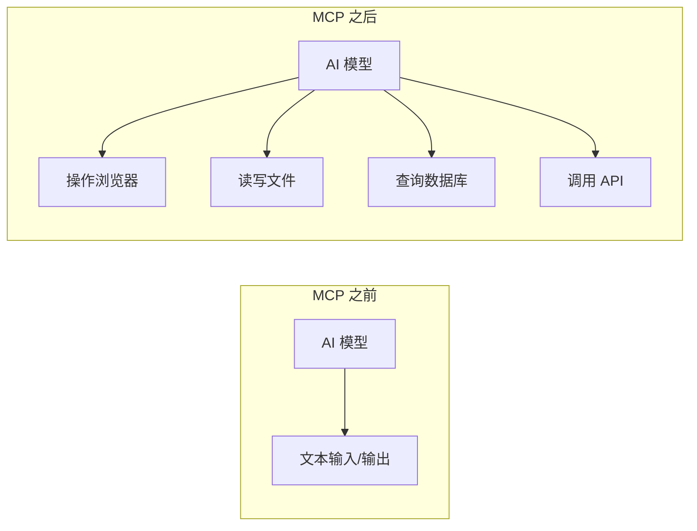
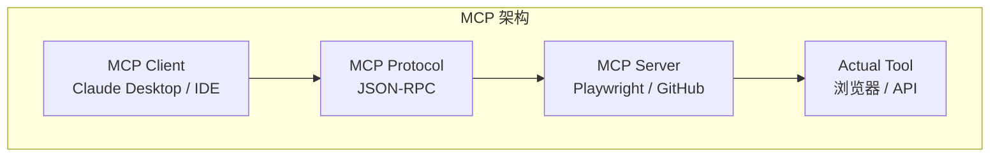
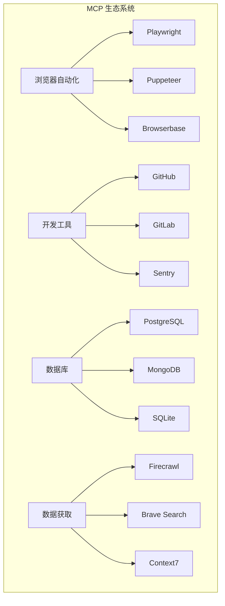
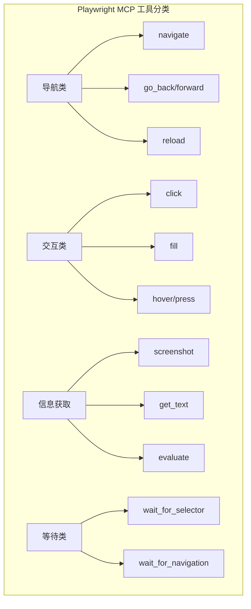
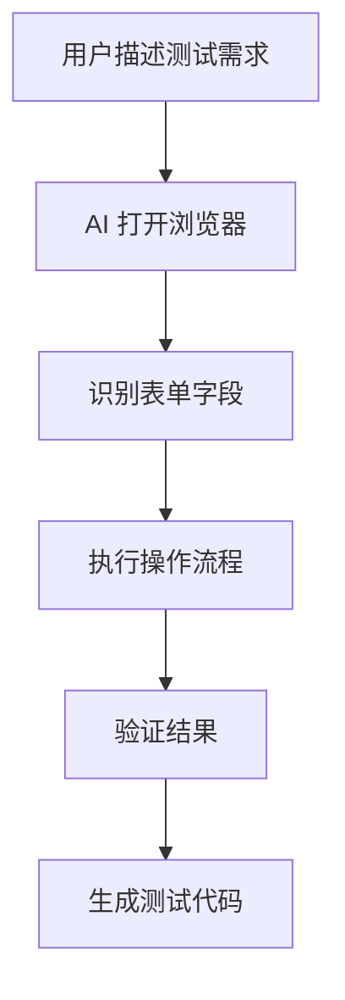
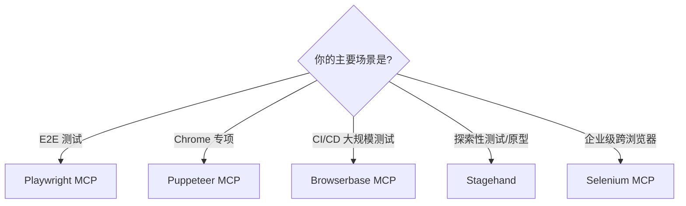
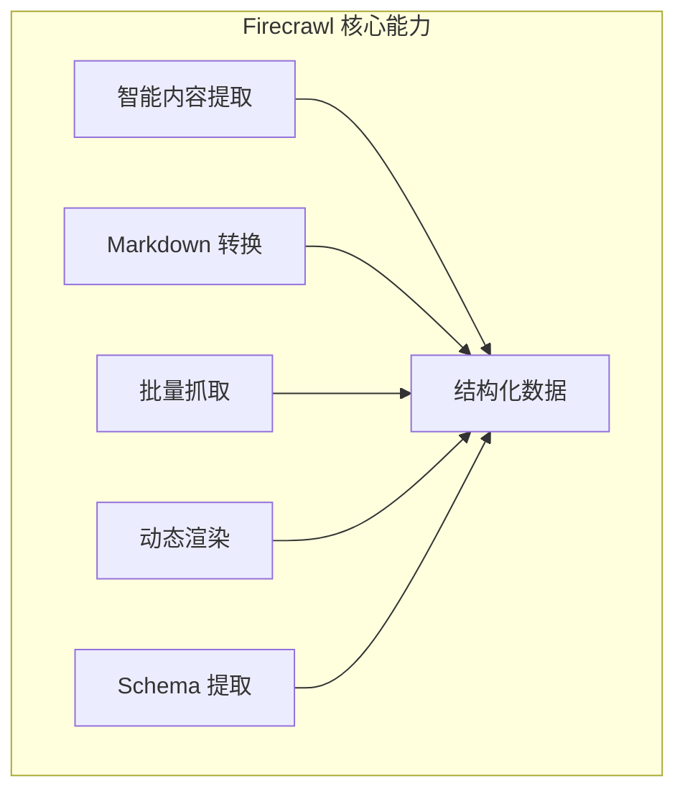
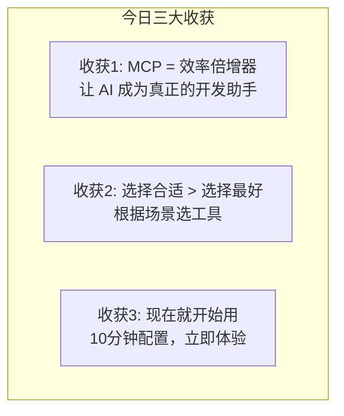

# 第7课：MCP Tools - AI 驱动的浏览器自动化与测试

**讲师演讲稿（2.5小时完整版）**

---

## Opening Hook（10分钟）

大家好！欢迎来到我们前端开发中级训练营的第7课。

今天我要和大家聊一个非常有意思的话题。在座的各位，有多少人写过自动化测试？好，看到不少手举起来了。那么，有多少人觉得写E2E测试是一件痛苦的事情？哈哈，我看到更多的手举起来了。

我先给大家讲个故事。上个月，我们团队接到一个紧急需求，要在三天内为一个复杂的电商结账流程补全E2E测试。这个流程涉及登录、选择商品、添加购物车、填写地址、选择支付方式、确认订单等十几个步骤。按照传统方式，我们需要：

1. 手动操作一遍流程，记录每个步骤
2. 打开Playwright文档，查API怎么用
3. 写选择器，定位元素
4. 处理异步等待、弹窗、页面跳转
5. 调试失败的用例
6. 重复以上步骤N次

我们的测试工程师小李估算了一下，说至少需要两天时间。但是，我让他尝试了一个新方法——使用MCP Tools。结果呢？**4个小时，所有测试用例全部完成**。

他是怎么做到的？他只是打开Claude Desktop，启用了Playwright MCP，然后对AI说："帮我为这个电商结账流程生成完整的E2E测试。"AI自动打开浏览器，操作整个流程，生成测试代码，甚至还发现了两个我们之前没注意到的UI bug。

这就是今天我要和大家分享的核心内容：**MCP让AI拥有了"手"，可以真正操作浏览器，帮我们完成自动化测试**。

在接下来的2.5小时里，我会带大家深入了解：
- MCP是什么，为什么它对前端开发者如此重要
- 如何使用Playwright MCP进行AI驱动的浏览器自动化
- 市面上还有哪些浏览器自动化MCP工具，它们各有什么特点
- 其他对前端开发有帮助的MCP工具
- 最后，我会现场演示如何配置和使用这些工具

准备好了吗？让我们开始吧！

---

## Section 1：MCP（Model Context Protocol）简介（20分钟）

### 什么是MCP

好，首先我们来理解一下，MCP到底是什么。

MCP的全称是Model Context Protocol，中文可以叫做"模型上下文协议"。这是Anthropic在2024年11月推出的一个开放标准。

我用一个类比来解释：如果说AI模型是一个大脑，那么MCP就是让这个大脑可以连接"手"、"眼睛"、"工具"的神经系统。

在MCP出现之前，AI模型只能做两件事：
1. 接收文本输入
2. 输出文本回复

它就像一个被困在房间里的人，只能通过对讲机和外界交流。你问它问题，它回答你，仅此而已。

但有了MCP之后，AI可以：
- 操作浏览器（通过Playwright MCP）
- 读写文件系统（通过Filesystem MCP）
- 查询数据库（通过PostgreSQL MCP）
- 调用API（通过各种API MCP）
- 操作Git仓库（通过GitHub MCP）

它就像获得了真正的"手"，可以帮你完成实际的工作。



### MCP的架构

让我们看看MCP的架构是怎样的。MCP采用了经典的客户端-服务器架构：



```
┌─────────────────┐
│   MCP Client    │  ← Claude Desktop、IDE、自定义应用
│  (AI应用)       │
└────────┬────────┘
         │
         │ MCP Protocol (JSON-RPC)
         │
┌────────┴────────┐
│   MCP Server    │  ← Playwright、Puppeteer、GitHub等
│  (工具提供者)   │
└────────┬────────┘
         │
         │
┌────────┴────────┐
│   Actual Tool   │  ← 浏览器、文件系统、API等
│  (真实工具)     │
└─────────────────┘
```

让我详细解释一下这三层：

**1. MCP Client（客户端）**
这是AI应用所在的层。比如：
- Claude Desktop（Anthropic官方桌面应用）
- Cursor、Windsurf等AI编程工具
- 你自己开发的AI应用

客户端负责：
- 接收用户指令
- 调用AI模型
- 通过MCP协议与服务器通信
- 展示结果给用户

**2. MCP Server（服务器）**
这是工具的包装层。每个MCP Server都是一个独立的进程，它：
- 实现了MCP协议规范
- 暴露一组工具（Tools）给客户端
- 接收客户端的调用请求
- 执行实际操作并返回结果

比如Playwright MCP Server暴露了这些工具：
- `playwright_navigate`：导航到URL
- `playwright_click`：点击元素
- `playwright_fill`：填写表单
- `playwright_screenshot`：截图
- 等等

**3. Actual Tool（实际工具）**
这是真正干活的工具，比如：
- Playwright库操作真实浏览器
- fs模块操作文件系统
- GitHub API操作代码仓库

### MCP的通信协议

MCP使用JSON-RPC 2.0作为通信协议。让我给大家看一个实际的例子：

**客户端请求（AI想要点击一个按钮）：**
```json
{
  "jsonrpc": "2.0",
  "id": 1,
  "method": "tools/call",
  "params": {
    "name": "playwright_click",
    "arguments": {
      "selector": "button[type='submit']"
    }
  }
}
```

**服务器响应：**
```json
{
  "jsonrpc": "2.0",
  "id": 1,
  "result": {
    "content": [
      {
        "type": "text",
        "text": "Successfully clicked button"
      }
    ]
  }
}
```

当然，作为使用者，我们不需要手写这些JSON。AI会自动生成调用请求，MCP Server会自动解析和响应。

### 为什么前端开发者需要了解MCP

好，现在大家可能会问：这和我有什么关系？我为什么要学MCP？

我给大家列几个实际场景：

**场景1：自动化测试**
传统方式：你需要手写Playwright测试代码，定位元素，处理异步，调试失败。
MCP方式：你告诉AI"帮我测试登录流程"，AI自动操作浏览器，生成测试代码。

**场景2：视觉回归测试**
传统方式：手动截图，人眼对比，或者配置复杂的Percy、Chromatic等服务。
MCP方式：AI自动截图，对比差异，生成报告。

**场景3：爬取竞品数据**
传统方式：写爬虫脚本，处理反爬，解析DOM。
MCP方式：告诉AI"帮我抓取这个网站的产品列表"，AI自动完成。

**场景4：生成测试数据**
传统方式：手动在UI上操作，或者写脚本调用API。
MCP方式：AI自动操作UI，生成各种测试场景的数据。

**场景5：文档查询**
传统方式：打开浏览器，搜索文档，复制粘贴。
MCP方式：直接问AI"React 18的useTransition怎么用"，AI通过Context7 MCP查询最新文档。

看到了吗？MCP不是替代你的工作，而是让AI成为你的助手，帮你完成那些重复、繁琐、但又必须做的事情。

### MCP的生态现状

截至2026年3月，MCP生态已经非常丰富了。Anthropic官方维护了一个MCP Server目录，目前有超过100个MCP Server，涵盖：



- **浏览器自动化**：Playwright、Puppeteer、Selenium、Browserbase
- **开发工具**：GitHub、GitLab、Linear、Sentry
- **数据库**：PostgreSQL、MySQL、MongoDB、SQLite
- **云服务**：AWS、Google Cloud、Cloudflare
- **文件操作**：Filesystem、Google Drive、Notion
- **数据获取**：Firecrawl、Brave Search、Exa
- **文档查询**：Context7

而且，任何人都可以开发自己的MCP Server。如果你们公司有内部工具，完全可以包装成MCP Server，让AI帮你操作。

好，MCP的基础概念就讲到这里。接下来，我们深入到今天的重点：Playwright MCP。

---

## Section 2：Playwright MCP 深度解析（40分钟）

### Playwright MCP简介

Playwright MCP是Anthropic官方维护的一个MCP Server，它让AI可以通过Playwright库操作浏览器。

为什么选择Playwright而不是Selenium或Puppeteer？因为Playwright有几个显著优势：

1. **跨浏览器支持**：Chromium、Firefox、WebKit（Safari）
2. **自动等待**：智能等待元素可见、可点击
3. **强大的选择器**：支持CSS、XPath、文本、角色等多种选择器
4. **现代化API**：async/await，Promise-based
5. **丰富的功能**：截图、录屏、网络拦截、地理位置模拟等

Playwright MCP把这些能力都暴露给了AI，让AI可以像人一样操作浏览器。

### Playwright MCP提供的工具

让我们看看Playwright MCP都提供了哪些工具：



**1. 导航类**
- `playwright_navigate`：导航到指定URL
- `playwright_go_back`：后退
- `playwright_go_forward`：前进
- `playwright_reload`：刷新页面

**2. 交互类**
- `playwright_click`：点击元素
- `playwright_fill`：填写输入框
- `playwright_select`：选择下拉选项
- `playwright_hover`：鼠标悬停
- `playwright_press`：按键
- `playwright_check`：勾选复选框
- `playwright_uncheck`：取消勾选

**3. 信息获取类**
- `playwright_screenshot`：截图
- `playwright_get_text`：获取文本内容
- `playwright_get_attribute`：获取元素属性
- `playwright_evaluate`：执行JavaScript

**4. 等待类**
- `playwright_wait_for_selector`：等待元素出现
- `playwright_wait_for_navigation`：等待页面跳转
- `playwright_wait_for_timeout`：等待指定时间

**5. 浏览器管理类**
- `playwright_new_page`：打开新标签页
- `playwright_close_page`：关闭标签页
- `playwright_switch_page`：切换标签页

### AI驱动的浏览器自动化

现在，让我给大家展示一个实际例子。假设我们要测试一个登录流程，传统方式和MCP方式的对比：

**传统方式（手写Playwright代码）：**

```javascript
import { test, expect } from '@playwright/test';

test('用户登录流程', async ({ page }) => {
  // 1. 导航到登录页
  await page.goto('https://example.com/login');

  // 2. 等待页面加载
  await page.waitForSelector('input[name="username"]');

  // 3. 填写用户名
  await page.fill('input[name="username"]', 'testuser@example.com');

  // 4. 填写密码
  await page.fill('input[name="password"]', 'Test123456');

  // 5. 点击登录按钮
  await page.click('button[type="submit"]');

  // 6. 等待跳转
  await page.waitForURL('**/dashboard');

  // 7. 验证登录成功
  await expect(page.locator('.user-name')).toContainText('testuser');

  // 8. 截图保存
  await page.screenshot({ path: 'login-success.png' });
});
```

这段代码看起来不复杂，但实际编写过程中你需要：
- 打开浏览器开发者工具，找到正确的选择器
- 处理各种异步等待
- 调试失败的步骤
- 可能需要添加重试逻辑

**MCP方式（AI自动生成）：**

你只需要在Claude Desktop中说：

```
请帮我为 https://example.com/login 的登录流程生成E2E测试。
测试账号：testuser@example.com
密码：Test123456
验证登录成功后能看到用户名。
```

AI会：
1. 自动打开浏览器
2. 导航到登录页
3. 识别表单字段
4. 填写并提交
5. 验证结果
6. 生成完整的测试代码



生成的代码可能是这样的：

```javascript
import { test, expect } from '@playwright/test';

test('用户登录流程', async ({ page }) => {
  // 导航到登录页
  await page.goto('https://example.com/login');

  // 填写登录表单
  await page.getByLabel('邮箱').fill('testuser@example.com');
  await page.getByLabel('密码').fill('Test123456');

  // 提交表单
  await page.getByRole('button', { name: '登录' }).click();

  // 验证登录成功
  await expect(page).toHaveURL(/.*dashboard/);
  await expect(page.getByText('testuser')).toBeVisible();
});
```

注意AI生成的代码使用了更语义化的选择器（`getByLabel`、`getByRole`），这比CSS选择器更稳定，不容易因为样式改动而失效。

### E2E测试生成和执行

让我们看一个更复杂的例子：电商购物流程。

**需求描述：**
```
测试完整的购物流程：
1. 访问首页
2. 搜索"iPhone 15"
3. 选择第一个商品
4. 添加到购物车
5. 进入购物车
6. 修改数量为2
7. 进入结账页
8. 填写收货地址
9. 选择支付方式
10. 确认订单
11. 验证订单创建成功
```

传统方式，你需要写至少100行代码，处理各种边界情况。

使用Playwright MCP，你可以这样做：

```
请帮我为电商网站 https://shop.example.com 生成完整的购物流程测试。

流程：
1. 搜索"iPhone 15"
2. 选择第一个商品并添加到购物车
3. 修改数量为2
4. 结账并填写地址（使用测试地址：北京市朝阳区xxx）
5. 选择货到付款
6. 确认订单
7. 验证订单号生成

请生成完整的Playwright测试代码，包含所有断言。
```

AI会自动：
1. 操作浏览器完成整个流程
2. 记录每个步骤的选择器
3. 识别需要断言的关键点
4. 生成结构化的测试代码
5. 添加适当的等待和错误处理

生成的代码示例：

```javascript
import { test, expect } from '@playwright/test';

test.describe('电商购物流程', () => {
  test('完整购物流程测试', async ({ page }) => {
    // 1. 访问首页
    await page.goto('https://shop.example.com');

    // 2. 搜索商品
    await page.getByPlaceholder('搜索商品').fill('iPhone 15');
    await page.getByRole('button', { name: '搜索' }).click();

    // 3. 等待搜索结果加载
    await page.waitForSelector('.product-list');

    // 4. 选择第一个商品
    await page.locator('.product-item').first().click();

    // 5. 等待商品详情页加载
    await expect(page.locator('h1.product-title')).toContainText('iPhone 15');

    // 6. 添加到购物车
    await page.getByRole('button', { name: '加入购物车' }).click();

    // 7. 等待添加成功提示
    await expect(page.locator('.toast-success')).toBeVisible();

    // 8. 进入购物车
    await page.getByRole('link', { name: '购物车' }).click();

    // 9. 修改数量为2
    await page.locator('input[type="number"]').fill('2');
    await page.locator('button.update-quantity').click();

    // 10. 等待价格更新
    await page.waitForTimeout(1000);

    // 11. 进入结账页
    await page.getByRole('button', { name: '去结算' }).click();

    // 12. 填写收货地址
    await page.getByLabel('收货人').fill('测试用户');
    await page.getByLabel('手机号').fill('13800138000');
    await page.getByLabel('详细地址').fill('北京市朝阳区测试大厦');

    // 13. 选择支付方式
    await page.getByLabel('货到付款').check();

    // 14. 确认订单
    await page.getByRole('button', { name: '提交订单' }).click();

    // 15. 验证订单创建成功
    await expect(page).toHaveURL(/.*order\/success/);

    // 16. 获取订单号
    const orderNumber = await page.locator('.order-number').textContent();
    expect(orderNumber).toMatch(/\d{10,}/);

    // 17. 截图保存
    await page.screenshot({ path: `order-${orderNumber}.png` });

    console.log(`订单创建成功，订单号：${orderNumber}`);
  });
});
```

### 截图对比和视觉回归测试

视觉回归测试是前端测试中非常重要但又很繁琐的一部分。Playwright MCP让这件事变得简单。

**传统视觉回归测试流程：**
1. 配置Percy或Chromatic等服务（需要付费）
2. 在CI/CD中集成
3. 手动审查每次的视觉差异
4. 批准或拒绝变更

**使用Playwright MCP的视觉回归测试：**

```javascript
import { test, expect } from '@playwright/test';

test.describe('视觉回归测试', () => {
  test('首页视觉对比', async ({ page }) => {
    await page.goto('https://example.com');

    // Playwright内置的视觉对比
    await expect(page).toHaveScreenshot('homepage.png', {
      maxDiffPixels: 100, // 允许100个像素差异
    });
  });

  test('响应式布局对比', async ({ page }) => {
    await page.goto('https://example.com');

    // 桌面端
    await page.setViewportSize({ width: 1920, height: 1080 });
    await expect(page).toHaveScreenshot('desktop.png');

    // 平板端
    await page.setViewportSize({ width: 768, height: 1024 });
    await expect(page).toHaveScreenshot('tablet.png');

    // 移动端
    await page.setViewportSize({ width: 375, height: 667 });
    await expect(page).toHaveScreenshot('mobile.png');
  });

  test('组件视觉对比', async ({ page }) => {
    await page.goto('https://example.com/components');

    // 只截取特定组件
    const button = page.locator('.primary-button');
    await expect(button).toHaveScreenshot('button.png');

    // 悬停状态
    await button.hover();
    await expect(button).toHaveScreenshot('button-hover.png');

    // 激活状态
    await button.click();
    await expect(button).toHaveScreenshot('button-active.png');
  });
});
```

使用MCP，你可以让AI帮你：

```
请为我们的设计系统组件库生成完整的视觉回归测试。
组件列表：Button、Input、Select、Modal、Tooltip
每个组件需要测试：默认状态、悬停状态、禁用状态、错误状态
```

AI会自动生成所有测试用例，并在第一次运行时生成基准截图。之后每次运行，如果有视觉差异，测试会失败并生成对比图。

### 安装和配置

好，理论讲了这么多，让我们看看如何实际安装和配置Playwright MCP。

**步骤1：安装Claude Desktop**

首先，你需要安装Claude Desktop。访问 https://claude.ai/download 下载适合你操作系统的版本。

**步骤2：安装Playwright MCP Server**

打开终端，运行：

```bash
npm install -g @modelcontextprotocol/server-playwright
```

或者使用npx（不需要全局安装）：

```bash
npx @modelcontextprotocol/server-playwright
```

**步骤3：配置Claude Desktop**

找到Claude Desktop的配置文件：
- macOS: `~/Library/Application Support/Claude/claude_desktop_config.json`
- Windows: `%APPDATA%\Claude\claude_desktop_config.json`
- Linux: `~/.config/Claude/claude_desktop_config.json`

编辑配置文件，添加Playwright MCP：

```json
{
  "mcpServers": {
    "playwright": {
      "command": "npx",
      "args": [
        "-y",
        "@modelcontextprotocol/server-playwright"
      ]
    }
  }
}
```

**步骤4：重启Claude Desktop**

保存配置文件后，重启Claude Desktop。你会在界面上看到一个小图标，表示MCP Server已连接。

**步骤5：测试连接**

在Claude Desktop中输入：

```
请帮我打开 https://example.com 并截图
```

如果一切正常，AI会自动打开浏览器，访问网站，并返回截图。

### 高级配置选项

Playwright MCP支持一些高级配置：

```json
{
  "mcpServers": {
    "playwright": {
      "command": "npx",
      "args": [
        "-y",
        "@modelcontextprotocol/server-playwright"
      ],
      "env": {
        "PLAYWRIGHT_BROWSER": "chromium",  // 或 "firefox", "webkit"
        "PLAYWRIGHT_HEADLESS": "false",    // 显示浏览器窗口
        "PLAYWRIGHT_SLOW_MO": "100"        // 每个操作延迟100ms，方便观察
      }
    }
  }
}
```

### 实战场景

让我给大家分享几个实际项目中的使用场景：

**场景1：表单验证测试**

```
请帮我测试注册表单的所有验证规则：
- 邮箱格式验证
- 密码强度验证（至少8位，包含大小写字母和数字）
- 两次密码必须一致
- 手机号格式验证
- 验证码必填

URL: https://example.com/register
```

AI会自动生成测试用例，覆盖所有边界情况。

**场景2：多语言测试**

```
请测试网站的多语言切换功能：
1. 默认是中文
2. 切换到英文，验证关键文案已翻译
3. 切换到日文，验证关键文案已翻译
4. 刷新页面，验证语言设置保持

URL: https://example.com
关键文案：导航栏、首页标题、按钮文字
```

**场景3：性能监控**

```
请帮我测试页面加载性能：
1. 记录首屏加载时间
2. 记录最大内容绘制（LCP）
3. 记录首次输入延迟（FID）
4. 记录累积布局偏移（CLS）

URL: https://example.com
```

AI可以通过Playwright的Performance API获取这些指标。

**场景4：无障碍测试**

```
请检查页面的无障碍性：
1. 所有图片是否有alt属性
2. 表单是否有label
3. 按钮是否有可访问的名称
4. 颜色对比度是否符合WCAG标准
5. 键盘导航是否正常

URL: https://example.com
```

好，Playwright MCP的核心内容就讲到这里。接下来，我们看看市面上还有哪些类似的工具。

---

## Section 3：横向对比其他浏览器自动化 MCP（30分钟）

好，我们刚才花了很多时间讲Playwright MCP，但它并不是唯一的选择。市面上还有好几个浏览器自动化相关的MCP工具。作为有经验的前端工程师，我们需要了解它们各自的特点，才能在不同场景下做出正确的选择。

### Puppeteer MCP

首先来看Puppeteer MCP。Puppeteer大家应该都不陌生，它是Google Chrome团队维护的Node.js库，专门用来控制Chrome和Chromium浏览器。

Puppeteer MCP的配置方式和Playwright MCP类似：

```json
{
  "mcpServers": {
    "puppeteer": {
      "command": "npx",
      "args": [
        "-y",
        "@modelcontextprotocol/server-puppeteer"
      ]
    }
  }
}
```

Puppeteer MCP提供的核心工具包括：

- `puppeteer_navigate`：导航到URL
- `puppeteer_screenshot`：截图
- `puppeteer_click`：点击元素
- `puppeteer_fill`：填写表单
- `puppeteer_evaluate`：执行JavaScript
- `puppeteer_select`：选择下拉选项

你会发现，这些工具和Playwright MCP非常相似。那Puppeteer MCP的优势在哪里呢？

第一，如果你的项目已经在用Puppeteer，那用Puppeteer MCP可以保持技术栈一致。第二，Puppeteer对Chrome DevTools Protocol的支持更底层，如果你需要做一些高级的Chrome调试操作，比如性能分析、网络拦截、内存分析，Puppeteer可能更合适。第三，Puppeteer的社区非常成熟，遇到问题容易找到解决方案。

但它的劣势也很明显：只支持Chromium内核的浏览器，不支持Firefox和Safari。如果你需要跨浏览器测试，Puppeteer就不够用了。

让我给大家看一个Puppeteer MCP的使用示例。假设我们要用AI抓取一个需要登录的后台页面：

```
请使用Puppeteer帮我完成以下操作：
1. 打开 https://admin.example.com/login
2. 登录（账号：admin，密码：admin123）
3. 导航到用户管理页面
4. 截图保存当前用户列表
5. 导出用户数据为JSON格式
```

AI会通过Puppeteer MCP自动完成这些操作，包括处理登录后的Cookie和Session。

### Browserbase MCP

接下来是Browserbase MCP。这个工具和前面两个有本质区别——它是一个云端浏览器服务。

什么意思呢？Playwright和Puppeteer都是在你本地启动浏览器，而Browserbase是在云端运行浏览器。你的AI通过API连接到云端的浏览器实例，所有操作都在云端执行。

配置方式：

```json
{
  "mcpServers": {
    "browserbase": {
      "command": "npx",
      "args": [
        "-y",
        "@browserbasehq/mcp-server-browserbase"
      ],
      "env": {
        "BROWSERBASE_API_KEY": "your-api-key",
        "BROWSERBASE_PROJECT_ID": "your-project-id"
      }
    }
  }
}
```

注意这里需要API Key，因为Browserbase是一个商业服务。

Browserbase MCP提供的工具：

- `browserbase_create_session`：创建浏览器会话
- `browserbase_navigate`：导航
- `browserbase_screenshot`：截图
- `browserbase_click`：点击
- `browserbase_fill`：填写
- `browserbase_get_content`：获取页面内容
- `browserbase_close_session`：关闭会话

Browserbase的核心优势是什么？

第一，**无需本地安装浏览器**。在CI/CD环境中，你不需要配置浏览器环境，直接调用云端浏览器。第二，**并发能力强**。你可以同时启动几十个甚至上百个浏览器实例，进行大规模并行测试。第三，**内置反检测**。Browserbase的浏览器实例经过特殊处理，不容易被网站检测为自动化工具，这在爬虫场景下非常有用。第四，**会话录制**。每次操作都会自动录制视频，方便回放和调试。

劣势呢？首先是成本，它是付费服务。其次是网络延迟，因为浏览器在云端，每次操作都有网络往返时间。最后是隐私问题，你的操作数据会经过第三方服务器。

### Stagehand

Stagehand是一个比较新的工具，由Browserbase团队开发。它的定位很独特——它不是一个传统的浏览器自动化工具，而是一个"AI原生"的浏览器自动化框架。

什么叫"AI原生"？传统的自动化工具需要你指定精确的CSS选择器或XPath来定位元素。但Stagehand允许你用自然语言描述你想要操作的元素。

比如，传统方式：
```javascript
await page.click('#submit-btn');
```

Stagehand方式：
```javascript
await stagehand.act('点击提交按钮');
```

Stagehand会用AI来理解页面结构，找到"提交按钮"对应的元素，然后执行点击操作。

Stagehand提供了三个核心API：

1. **act**：执行操作（点击、填写、选择等）
2. **extract**：从页面提取结构化数据
3. **observe**：观察页面状态

让我给大家看一个例子：

```javascript
import Stagehand from '@browserbasehq/stagehand';

const stagehand = new Stagehand({
  env: 'LOCAL',  // 或 'BROWSERBASE'
  modelName: 'claude-sonnet-4-20250514',
});

await stagehand.init();
await stagehand.page.goto('https://shop.example.com');

// 用自然语言操作
await stagehand.act('在搜索框中输入iPhone 15并搜索');
await stagehand.act('点击第一个搜索结果');
await stagehand.act('选择颜色为蓝色');
await stagehand.act('点击加入购物车');

// 提取结构化数据
const productInfo = await stagehand.extract({
  instruction: '提取当前商品的名称、价格和库存信息',
  schema: {
    name: 'string',
    price: 'number',
    stock: 'number',
  },
});

console.log(productInfo);
// { name: 'iPhone 15 蓝色', price: 5999, stock: 128 }
```

看到了吗？完全不需要写CSS选择器，用自然语言就能操作浏览器。这对于快速原型开发和探索性测试非常有用。

但Stagehand也有局限性。首先，它依赖AI模型来理解页面，所以每次操作都需要调用AI API，速度比传统选择器慢。其次，AI的理解不是100%准确的，在复杂页面上可能会定位错误。最后，它的成本更高，因为每次操作都消耗AI Token。

### Selenium MCP

最后来看Selenium MCP。Selenium是浏览器自动化领域的"老前辈"了，从2004年就开始了，到现在已经有超过20年的历史。

Selenium MCP的配置：

```json
{
  "mcpServers": {
    "selenium": {
      "command": "npx",
      "args": [
        "-y",
        "selenium-mcp-server"
      ]
    }
  }
}
```

Selenium MCP的优势在于：

第一，**语言无关**。Selenium支持Java、Python、C#、Ruby、JavaScript等多种语言，如果你的测试团队使用不同的语言，Selenium是最好的选择。第二，**Selenium Grid**。可以搭建分布式测试集群，在多台机器上并行运行测试。第三，**成熟稳定**。经过20年的发展，Selenium非常稳定，几乎所有的浏览器自动化场景都有解决方案。

劣势呢？API相对老旧，不如Playwright现代化。自动等待机制不够智能，经常需要手动添加等待。配置相对复杂，需要下载WebDriver。

### 对比表格

好，让我把这几个工具放在一起做个全面对比：

| 特性 | Playwright MCP | Puppeteer MCP | Browserbase MCP | Stagehand | Selenium MCP |
|------|---------------|---------------|-----------------|-----------|-------------|
| **维护方** | Microsoft | Google | Browserbase | Browserbase | Selenium社区 |
| **浏览器支持** | Chromium/Firefox/WebKit | 仅Chromium | 云端Chromium | Chromium(本地/云端) | 所有主流浏览器 |
| **运行环境** | 本地 | 本地 | 云端 | 本地/云端 | 本地/Grid |
| **选择器方式** | CSS/XPath/文本/角色 | CSS/XPath | CSS/XPath | 自然语言 | CSS/XPath |
| **自动等待** | 优秀 | 良好 | 良好 | 优秀 | 一般 |
| **API风格** | 现代async/await | 现代async/await | REST API | AI原生 | 传统回调/Promise |
| **截图能力** | 全页/元素/区域 | 全页/元素 | 全页 | 全页 | 全页/元素 |
| **视觉对比** | 内置支持 | 需第三方库 | 需第三方库 | 不支持 | 需第三方库 |
| **网络拦截** | 支持 | 支持 | 有限支持 | 不支持 | 有限支持 |
| **移动端模拟** | 支持 | 支持 | 支持 | 支持 | 需Appium |
| **并发能力** | 中等 | 中等 | 强 | 中等 | 强(Grid) |
| **学习曲线** | 低 | 低 | 中 | 极低 | 中 |
| **成本** | 免费 | 免费 | 付费 | 免费+AI费用 | 免费 |
| **适用场景** | E2E测试/爬虫 | Chrome专项测试 | CI/CD/大规模测试 | 探索性测试/原型 | 企业级测试 |
| **社区活跃度** | 非常活跃 | 活跃 | 成长中 | 成长中 | 非常活跃 |
| **MCP成熟度** | 高 | 高 | 中 | 中 | 中 |

### 选型建议



看完这个对比表，大家可能会问：那我到底该选哪个？

我给大家一个简单的决策树：

**如果你是新项目，需要全面的E2E测试** → 选Playwright MCP。它功能最全面，API最现代化，跨浏览器支持最好。

**如果你的项目已经在用Puppeteer** → 继续用Puppeteer MCP。没必要为了MCP迁移技术栈。

**如果你需要在CI/CD中大规模并行测试** → 考虑Browserbase MCP。云端浏览器省去了环境配置的麻烦。

**如果你想快速做探索性测试或原型验证** → 试试Stagehand。自然语言操作的体验非常好。

**如果你的团队是多语言技术栈，或者有现成的Selenium基础设施** → 用Selenium MCP。

在实际项目中，你甚至可以同时配置多个MCP Server，根据不同场景使用不同的工具。比如：

```json
{
  "mcpServers": {
    "playwright": {
      "command": "npx",
      "args": ["-y", "@modelcontextprotocol/server-playwright"]
    },
    "puppeteer": {
      "command": "npx",
      "args": ["-y", "@modelcontextprotocol/server-puppeteer"]
    },
    "browserbase": {
      "command": "npx",
      "args": ["-y", "@browserbasehq/mcp-server-browserbase"],
      "env": {
        "BROWSERBASE_API_KEY": "your-api-key",
        "BROWSERBASE_PROJECT_ID": "your-project-id"
      }
    }
  }
}
```

AI会根据你的需求自动选择最合适的工具。比如你说"帮我做跨浏览器测试"，它会选Playwright；你说"帮我在云端并行测试"，它会选Browserbase。

好，浏览器自动化MCP的对比就讲到这里。让我们休息5分钟，回来后看看其他对前端开发有帮助的MCP工具。

---


## Section 4：其他前端相关 MCP 工具（20分钟）

好，欢迎回来。前面我们花了大量时间讲浏览器自动化相关的MCP，但MCP的生态远不止于此。接下来我要给大家介绍三个对前端开发者特别有用的MCP工具。

### Firecrawl MCP（网页抓取）

第一个是Firecrawl MCP。Firecrawl是一个专门做网页抓取的服务，它的MCP Server让AI可以帮你抓取和解析网页内容。



你可能会问：我们刚才不是讲了Playwright可以操作浏览器吗？为什么还需要专门的抓取工具？

好问题。Playwright是"操作"浏览器——点击、填写、截图。而Firecrawl是"抓取"网页——把网页内容转换成结构化的数据。它们的侧重点不同。

Firecrawl的核心能力：

1. **智能内容提取**：自动去除导航栏、广告、侧边栏等噪音，只提取正文内容
2. **Markdown转换**：把网页内容转换成干净的Markdown格式
3. **批量抓取**：可以抓取整个网站的所有页面
4. **动态渲染**：支持JavaScript渲染的页面（SPA应用）
5. **结构化数据提取**：可以按照你定义的Schema提取数据

配置方式：

```json
{
  "mcpServers": {
    "firecrawl": {
      "command": "npx",
      "args": [
        "-y",
        "firecrawl-mcp"
      ],
      "env": {
        "FIRECRAWL_API_KEY": "your-api-key"
      }
    }
  }
}
```

Firecrawl MCP提供的工具：

- `firecrawl_scrape`：抓取单个页面
- `firecrawl_crawl`：爬取整个网站
- `firecrawl_map`：获取网站地图
- `firecrawl_search`：搜索网页内容
- `firecrawl_extract`：结构化数据提取

让我给大家看几个实际的使用场景：

**场景1：竞品分析**

```
请帮我抓取以下三个竞品网站的定价页面，提取所有套餐的名称、价格和功能列表：
1. https://competitor-a.com/pricing
2. https://competitor-b.com/pricing
3. https://competitor-c.com/pricing

请整理成对比表格。
```

AI会通过Firecrawl MCP抓取这三个页面，提取定价信息，然后整理成结构化的对比表格。这个工作如果手动做，可能需要半小时；用MCP，几分钟就搞定了。

**场景2：文档迁移**

```
请抓取 https://old-docs.example.com 的所有文档页面，
转换成Markdown格式，保持原有的目录结构。
```

这在文档迁移场景下非常有用。比如你要把旧的文档站点迁移到新的平台（比如从GitBook迁移到Docusaurus），Firecrawl可以帮你批量抓取并转换格式。

**场景3：设计灵感收集**

```
请抓取 https://dribbble.com/search/dashboard 的前20个设计作品，
提取每个作品的标题、作者、标签和图片链接。
```

作为前端开发者，我们经常需要参考优秀的设计。Firecrawl可以帮你快速收集设计灵感。

### GitHub MCP（代码仓库操作）

第二个是GitHub MCP。这个工具让AI可以直接操作你的GitHub仓库。

配置方式：

```json
{
  "mcpServers": {
    "github": {
      "command": "npx",
      "args": [
        "-y",
        "@modelcontextprotocol/server-github"
      ],
      "env": {
        "GITHUB_PERSONAL_ACCESS_TOKEN": "your-token"
      }
    }
  }
}
```

GitHub MCP提供了非常丰富的工具，我挑几个最常用的说：

**仓库操作：**
- `create_repository`：创建仓库
- `search_repositories`：搜索仓库
- `get_file_contents`：获取文件内容
- `create_or_update_file`：创建或更新文件
- `push_files`：批量推送文件

**Issue操作：**
- `create_issue`：创建Issue
- `list_issues`：列出Issue
- `update_issue`：更新Issue
- `add_issue_comment`：添加评论

**PR操作：**
- `create_pull_request`：创建PR
- `list_pull_requests`：列出PR
- `merge_pull_request`：合并PR
- `get_pull_request_diff`：获取PR差异

**分支操作：**
- `create_branch`：创建分支
- `list_branches`：列出分支

让我给大家看几个实际场景：

**场景1：代码审查辅助**

```
请帮我审查 PR #42 的代码变更：
1. 获取PR的所有文件变更
2. 检查是否有明显的bug或安全问题
3. 检查代码风格是否一致
4. 给出改进建议
5. 在PR上添加审查评论
```

AI会通过GitHub MCP获取PR的diff，分析代码，然后直接在GitHub上添加审查评论。这对于加速代码审查流程非常有帮助。

**场景2：自动创建Issue**

```
我们的E2E测试发现了以下问题：
1. 登录页面在Safari上布局错乱
2. 购物车数量更新后价格没有刷新
3. 移动端导航菜单无法关闭

请为每个问题创建一个GitHub Issue，添加"bug"标签，分配给前端团队。
```

AI会自动创建三个Issue，设置标签和分配人。

**场景3：项目初始化**

```
请帮我在GitHub上创建一个新的前端项目仓库：
- 名称：my-dashboard
- 描述：管理后台前端项目
- 使用React + TypeScript模板
- 添加.gitignore（Node.js）
- 添加MIT License
- 创建develop分支
- 创建初始的Issue模板
```

AI会通过GitHub MCP完成所有这些操作，省去了你在GitHub网页上点来点去的时间。

### Context7 MCP（文档查询）

第三个是Context7 MCP。这个工具对前端开发者来说特别实用——它让AI可以查询最新的技术文档。

为什么这很重要？因为AI模型的训练数据有截止日期。比如，如果你问AI关于React 19的新特性，它可能给你的是过时的信息。但通过Context7 MCP，AI可以实时查询最新的官方文档。

配置方式：

```json
{
  "mcpServers": {
    "context7": {
      "command": "npx",
      "args": [
        "-y",
        "@upstash/context7-mcp"
      ]
    }
  }
}
```

Context7 MCP的工作流程：

1. **resolve-library-id**：先解析库名称，获取Context7兼容的库ID
2. **query-docs**：然后用库ID查询具体的文档内容

使用示例：

```
请查询Tailwind CSS v4的最新文档，告诉我v4相比v3有哪些破坏性变更。
```

AI会通过Context7 MCP查询Tailwind CSS v4的官方文档，给你最新、最准确的信息。

再比如：

```
请查询Next.js 15的App Router文档，告诉我如何实现并行路由（Parallel Routes）。
给我一个完整的代码示例。
```

AI会查询Next.js的最新文档，给你基于最新API的代码示例，而不是基于过时信息的猜测。

**Context7 MCP支持的库非常多**，包括但不限于：

- React、Vue、Angular、Svelte
- Next.js、Nuxt、Remix、Astro
- Tailwind CSS、shadcn/ui、Radix UI
- Playwright、Vitest、Jest
- TypeScript、Node.js、Deno、Bun
- 以及数千个其他开源库

这三个MCP工具——Firecrawl、GitHub、Context7——加上前面讲的浏览器自动化MCP，基本上覆盖了前端开发者日常工作中的大部分场景。

让我做一个快速总结：

| MCP工具 | 核心能力 | 典型场景 |
|---------|---------|---------|
| Playwright MCP | 浏览器自动化 | E2E测试、视觉回归测试 |
| Puppeteer MCP | Chrome自动化 | Chrome专项测试、性能分析 |
| Browserbase MCP | 云端浏览器 | CI/CD测试、大规模并行 |
| Stagehand | AI原生自动化 | 探索性测试、快速原型 |
| Firecrawl MCP | 网页抓取 | 竞品分析、数据采集、文档迁移 |
| GitHub MCP | 代码仓库操作 | 代码审查、Issue管理、项目初始化 |
| Context7 MCP | 文档查询 | 查询最新API、学习新技术 |

好，接下来进入今天最激动人心的部分——实战演示！

---


## Section 5：实战演示（20分钟）

好，终于到了实战环节！接下来我会现场演示三个场景，让大家直观感受MCP的威力。

### 演示1：配置 Playwright MCP（5分钟）

首先，我们从零开始配置Playwright MCP。

**第一步，确认Node.js环境。**

打开终端，输入：

```bash
node --version
# 确保版本 >= 18

npm --version
```

如果你还没有安装Node.js，去 https://nodejs.org 下载LTS版本。

**第二步，创建项目目录。**

```bash
mkdir mcp-demo && cd mcp-demo
npm init -y
```

**第三步，安装Playwright。**

```bash
npm install -D @playwright/test
npx playwright install
```

这一步会下载Chromium、Firefox和WebKit三个浏览器引擎，可能需要几分钟时间。

**第四步，配置Claude Desktop的MCP。**

打开配置文件。在macOS上：

```bash
code ~/Library/Application\ Support/Claude/claude_desktop_config.json
```

如果文件不存在，创建一个。写入以下内容：

```json
{
  "mcpServers": {
    "playwright": {
      "command": "npx",
      "args": [
        "-y",
        "@modelcontextprotocol/server-playwright"
      ]
    }
  }
}
```

保存文件，然后重启Claude Desktop。

**第五步，验证连接。**

重启后，在Claude Desktop的输入框旁边，你应该能看到一个工具图标。点击它，会显示已连接的MCP Server列表。如果看到"playwright"，说明配置成功了。

现在让我们测试一下。在Claude Desktop中输入：

```
请打开百度首页，截图给我看。
```

大家看，AI正在调用Playwright MCP。它先调用了`playwright_navigate`导航到百度，然后调用`playwright_screenshot`截图。几秒钟后，截图就出来了。

这就是MCP的魅力——你只需要用自然语言描述你想做什么，AI会自动调用正确的工具来完成。

### 演示2：用 AI 生成 E2E 测试用例（10分钟）

好，接下来我们做一个更实际的演示——用AI生成完整的E2E测试。

我准备了一个简单的Todo应用，运行在本地的3000端口。让我先启动它。

```bash
# 假设我们已经有一个Todo应用
cd todo-app
npm run dev
# 应用运行在 http://localhost:3000
```

现在，我在Claude Desktop中输入：

```
请帮我为运行在 http://localhost:3000 的Todo应用生成完整的E2E测试。

这个应用的功能包括：
1. 添加新的Todo项
2. 标记Todo为已完成
3. 删除Todo项
4. 筛选（全部/未完成/已完成）
5. 清除所有已完成项

请先操作一遍应用了解界面，然后生成Playwright测试代码。
要求：
- 使用 @playwright/test 框架
- 使用语义化选择器（getByRole, getByLabel, getByText）
- 每个功能一个测试用例
- 包含充分的断言
- 添加中文注释
```

大家看AI的操作过程：

1. 首先，它调用`playwright_navigate`打开了localhost:3000
2. 然后它调用`playwright_screenshot`截图，了解页面布局
3. 接着它开始操作——在输入框中输入文字，点击添加按钮
4. 它在尝试各种功能：勾选、删除、筛选
5. 每一步都在截图记录

好，操作完成了。现在AI开始生成测试代码。让我们看看生成的结果：

```javascript
import { test, expect } from '@playwright/test';

test.describe('Todo应用E2E测试', () => {

  test.beforeEach(async ({ page }) => {
    // 每个测试前访问应用首页
    await page.goto('http://localhost:3000');
  });

  test('添加新的Todo项', async ({ page }) => {
    // 在输入框中输入Todo内容
    await page.getByPlaceholder('你需要做什么？').fill('学习MCP Tools');

    // 按回车键添加
    await page.getByPlaceholder('你需要做什么？').press('Enter');

    // 验证Todo项已添加到列表中
    await expect(page.getByText('学习MCP Tools')).toBeVisible();

    // 验证输入框已清空
    await expect(page.getByPlaceholder('你需要做什么？')).toHaveValue('');

    // 添加第二个Todo
    await page.getByPlaceholder('你需要做什么？').fill('写E2E测试');
    await page.getByPlaceholder('你需要做什么？').press('Enter');

    // 验证两个Todo都存在
    await expect(page.getByText('学习MCP Tools')).toBeVisible();
    await expect(page.getByText('写E2E测试')).toBeVisible();

    // 验证计数器显示正确
    await expect(page.getByText('2项待办')).toBeVisible();
  });

  test('标记Todo为已完成', async ({ page }) => {
    // 先添加一个Todo
    await page.getByPlaceholder('你需要做什么？').fill('待完成的任务');
    await page.getByPlaceholder('你需要做什么？').press('Enter');

    // 点击复选框标记为完成
    await page.getByRole('checkbox', { name: '待完成的任务' }).check();

    // 验证Todo显示为已完成状态（有删除线样式）
    const todoItem = page.getByText('待完成的任务');
    await expect(todoItem).toHaveCSS('text-decoration-line', 'line-through');

    // 验证计数器更新
    await expect(page.getByText('0项待办')).toBeVisible();
  });

  test('删除Todo项', async ({ page }) => {
    // 添加一个Todo
    await page.getByPlaceholder('你需要做什么？').fill('要删除的任务');
    await page.getByPlaceholder('你需要做什么？').press('Enter');

    // 悬停在Todo项上显示删除按钮
    await page.getByText('要删除的任务').hover();

    // 点击删除按钮
    await page.getByRole('button', { name: '删除' }).click();

    // 验证Todo已被删除
    await expect(page.getByText('要删除的任务')).not.toBeVisible();
  });

  test('筛选功能', async ({ page }) => {
    // 添加两个Todo
    await page.getByPlaceholder('你需要做什么？').fill('任务A');
    await page.getByPlaceholder('你需要做什么？').press('Enter');

    await page.getByPlaceholder('你需要做什么？').fill('任务B');
    await page.getByPlaceholder('你需要做什么？').press('Enter');

    // 完成任务A
    await page.getByRole('checkbox', { name: '任务A' }).check();

    // 筛选"未完成"
    await page.getByRole('link', { name: '未完成' }).click();
    await expect(page.getByText('任务A')).not.toBeVisible();
    await expect(page.getByText('任务B')).toBeVisible();

    // 筛选"已完成"
    await page.getByRole('link', { name: '已完成' }).click();
    await expect(page.getByText('任务A')).toBeVisible();
    await expect(page.getByText('任务B')).not.toBeVisible();

    // 筛选"全部"
    await page.getByRole('link', { name: '全部' }).click();
    await expect(page.getByText('任务A')).toBeVisible();
    await expect(page.getByText('任务B')).toBeVisible();
  });

  test('清除所有已完成项', async ({ page }) => {
    // 添加三个Todo
    const todos = ['任务1', '任务2', '任务3'];
    for (const todo of todos) {
      await page.getByPlaceholder('你需要做什么？').fill(todo);
      await page.getByPlaceholder('你需要做什么？').press('Enter');
    }

    // 完成任务1和任务3
    await page.getByRole('checkbox', { name: '任务1' }).check();
    await page.getByRole('checkbox', { name: '任务3' }).check();

    // 点击"清除已完成"按钮
    await page.getByRole('button', { name: '清除已完成' }).click();

    // 验证已完成的任务被删除
    await expect(page.getByText('任务1')).not.toBeVisible();
    await expect(page.getByText('任务3')).not.toBeVisible();

    // 验证未完成的任务仍然存在
    await expect(page.getByText('任务2')).toBeVisible();

    // 验证计数器正确
    await expect(page.getByText('1项待办')).toBeVisible();
  });

});
```

大家看，这段代码的质量相当高：
- 使用了语义化选择器，可维护性好
- 每个测试用例都有充分的断言
- 注释清晰，逻辑清楚
- 使用了`beforeEach`来避免重复代码

当然，生成的代码可能需要根据实际的页面结构做一些微调。但它已经帮你完成了80%的工作，你只需要做20%的调整和优化。

让我们运行一下这些测试：

```bash
npx playwright test --headed
```

加上`--headed`参数可以看到浏览器的实际操作过程。大家看，测试正在运行，浏览器自动打开，一个一个测试用例在执行。

全部通过了！5个测试用例，耗时12秒。

如果我们想生成测试报告：

```bash
npx playwright test --reporter=html
npx playwright show-report
```

这会生成一个漂亮的HTML报告，包含每个测试的执行时间、截图和错误信息。

### 演示3：视觉回归测试演示（5分钟）

最后一个演示，视觉回归测试。

我们继续用刚才的Todo应用。首先，生成基准截图：

```bash
npx playwright test --update-snapshots
```

这会运行所有测试，并把截图保存为基准图片。

现在，假设我们的设计师要求修改按钮的颜色，从蓝色改成绿色。我来修改一下CSS：

```css
/* 修改前 */
.add-button {
  background-color: #3b82f6; /* 蓝色 */
}

/* 修改后 */
.add-button {
  background-color: #22c55e; /* 绿色 */
}
```

保存后，再运行测试：

```bash
npx playwright test
```

大家看，视觉回归测试失败了！报告显示按钮颜色发生了变化，并生成了三张图片：
1. **expected.png**：期望的样子（蓝色按钮）
2. **actual.png**：实际的样子（绿色按钮）
3. **diff.png**：差异对比（高亮显示变化的区域）

如果这个颜色变更是预期的（设计师要求的），我们只需要更新基准截图：

```bash
npx playwright test --update-snapshots
```

如果不是预期的（比如是CSS冲突导致的），我们就需要修复代码。

这就是视觉回归测试的价值——它能自动发现UI的意外变化，防止视觉bug上线。

让我用MCP来做一个更完整的演示。在Claude Desktop中输入：

```
请帮我为Todo应用创建完整的视觉回归测试：
1. 空状态页面截图
2. 添加3个Todo后的列表截图
3. 标记1个为完成后的截图
4. 移动端视图（375px宽度）截图
5. 暗色模式截图（如果支持的话）

每个截图都要做视觉对比。
```

AI会自动生成包含`toHaveScreenshot`断言的测试代码，覆盖各种视觉状态。

生成的代码类似这样：

```javascript
import { test, expect } from '@playwright/test';

test.describe('Todo应用视觉回归测试', () => {

  test('空状态页面', async ({ page }) => {
    await page.goto('http://localhost:3000');
    await expect(page).toHaveScreenshot('empty-state.png');
  });

  test('包含Todo项的列表', async ({ page }) => {
    await page.goto('http://localhost:3000');

    // 添加3个Todo
    const todos = ['学习TypeScript', '写单元测试', '部署到生产环境'];
    for (const todo of todos) {
      await page.getByPlaceholder('你需要做什么？').fill(todo);
      await page.getByPlaceholder('你需要做什么？').press('Enter');
    }

    await expect(page).toHaveScreenshot('todo-list.png');
  });

  test('包含已完成项的列表', async ({ page }) => {
    await page.goto('http://localhost:3000');

    // 添加并完成一个Todo
    await page.getByPlaceholder('你需要做什么？').fill('已完成的任务');
    await page.getByPlaceholder('你需要做什么？').press('Enter');
    await page.getByRole('checkbox', { name: '已完成的任务' }).check();

    await page.getByPlaceholder('你需要做什么？').fill('未完成的任务');
    await page.getByPlaceholder('你需要做什么？').press('Enter');

    await expect(page).toHaveScreenshot('mixed-state.png');
  });

  test('移动端视图', async ({ page }) => {
    await page.setViewportSize({ width: 375, height: 667 });
    await page.goto('http://localhost:3000');

    await page.getByPlaceholder('你需要做什么？').fill('移动端测试');
    await page.getByPlaceholder('你需要做什么？').press('Enter');

    await expect(page).toHaveScreenshot('mobile-view.png');
  });

  test('暗色模式', async ({ page }) => {
    // 模拟暗色模式
    await page.emulateMedia({ colorScheme: 'dark' });
    await page.goto('http://localhost:3000');

    await page.getByPlaceholder('你需要做什么？').fill('暗色模式测试');
    await page.getByPlaceholder('你需要做什么？').press('Enter');

    await expect(page).toHaveScreenshot('dark-mode.png');
  });

});
```

注意最后一个测试用例，它使用了`page.emulateMedia({ colorScheme: 'dark' })`来模拟暗色模式。这是Playwright的一个强大功能，可以在不修改代码的情况下测试暗色模式。

好，实战演示就到这里。大家有没有感受到MCP的强大？它真的把AI从"只能聊天"变成了"能干活"。

---


## Closing（20分钟）

### 总结

好，我们来到了今天课程的最后一个环节。让我花几分钟时间，把今天讲的内容串一下。

今天这2.5个小时，我们围绕一个核心主题展开：**MCP让AI拥有了"手"，可以真正帮前端开发者干活**。

我们从MCP的基础概念讲起。MCP是Model Context Protocol，模型上下文协议，它是AI模型与外部工具之间的标准通信协议。它的架构很简单：Client → Server → Tool，三层结构。Client是AI应用（比如Claude Desktop），Server是工具的包装层（比如Playwright MCP Server），Tool是真正干活的工具（比如Playwright库）。

然后我们深入讲了Playwright MCP。这是目前最强大的浏览器自动化MCP工具。它让AI可以：
- 导航网页
- 点击、填写、选择等交互操作
- 截图和视觉对比
- 生成完整的E2E测试代码

我们看到了传统手写测试和AI生成测试的巨大效率差异。AI不仅能生成代码，还能使用更好的实践——比如语义化选择器、充分的断言、清晰的代码结构。

接着我们横向对比了五个浏览器自动化MCP工具：

- **Playwright MCP**：全能选手，跨浏览器，功能最全面
- **Puppeteer MCP**：Chrome专家，适合已有Puppeteer技术栈的团队
- **Browserbase MCP**：云端方案，适合CI/CD和大规模并行测试
- **Stagehand**：AI原生，用自然语言操作浏览器，适合探索性测试
- **Selenium MCP**：老牌稳定，适合企业级多语言技术栈

我们还介绍了三个对前端开发者特别有用的MCP工具：
- **Firecrawl MCP**：网页抓取，竞品分析、数据采集的利器
- **GitHub MCP**：代码仓库操作，代码审查、Issue管理的好帮手
- **Context7 MCP**：文档查询，随时获取最新的技术文档

最后，我们做了三个实战演示：配置Playwright MCP、用AI生成E2E测试、视觉回归测试。

### 关键收获

如果今天的课程你只记住三件事，我希望是这三件：



**第一，MCP是前端开发的效率倍增器。** 它不是替代你的工作，而是让AI成为你的助手。那些重复、繁琐、但又必须做的事情——写测试、做视觉对比、查文档——都可以交给AI通过MCP来完成。

**第二，选择合适的工具比选择最好的工具更重要。** 我们对比了五个浏览器自动化MCP，每个都有自己的优势和适用场景。不要盲目追求"最好的"，要根据你的项目需求、团队技术栈、预算来选择。

**第三，现在就开始用。** MCP的配置非常简单，几分钟就能搞定。今天回去之后，花10分钟配置一个Playwright MCP，试着让AI帮你生成一个测试用例。你会发现，一旦用上了，就再也回不去了。

### 课后实践建议

我给大家留几个课后练习：

**练习1（入门级）：配置并使用Playwright MCP**
- 安装Claude Desktop
- 配置Playwright MCP
- 让AI帮你打开你们公司的网站，截图并描述页面内容

**练习2（进阶级）：为你的项目生成E2E测试**
- 选择你项目中一个核心流程（比如登录、注册、下单）
- 用Playwright MCP让AI生成完整的E2E测试
- 运行测试，修复可能的问题
- 集成到你的CI/CD流程中

**练习3（高级）：搭建完整的MCP工具链**
- 同时配置Playwright MCP、GitHub MCP、Context7 MCP
- 用AI完成一个完整的工作流：查询文档 → 编写代码 → 生成测试 → 创建PR
- 尝试用Firecrawl MCP做一次竞品分析

**练习4（挑战级）：开发自己的MCP Server**
- 如果你们公司有内部工具（比如内部的组件库文档、设计系统、部署平台）
- 尝试把它包装成MCP Server
- 让AI可以直接操作你们的内部工具

MCP Server的开发并不复杂，官方提供了TypeScript和Python的SDK。一个简单的MCP Server，可能只需要100行代码：

```typescript
import { McpServer } from '@modelcontextprotocol/sdk/server/mcp.js';
import { StdioServerTransport } from '@modelcontextprotocol/sdk/server/stdio.js';
import { z } from 'zod';

// 创建MCP Server
const server = new McpServer({
  name: 'my-internal-tool',
  version: '1.0.0',
});

// 注册工具
server.tool(
  'deploy_to_staging',
  '部署应用到预发布环境',
  {
    branch: z.string().describe('要部署的分支名'),
    env: z.enum(['staging', 'preview']).describe('目标环境'),
  },
  async ({ branch, env }) => {
    // 调用内部部署API
    const result = await fetch('https://internal-api.example.com/deploy', {
      method: 'POST',
      headers: { 'Content-Type': 'application/json' },
      body: JSON.stringify({ branch, env }),
    });

    const data = await result.json();

    return {
      content: [
        {
          type: 'text',
          text: `部署成功！\n环境：${env}\n分支：${branch}\n访问地址：${data.url}`,
        },
      ],
    };
  }
);

// 启动服务器
const transport = new StdioServerTransport();
await server.connect(transport);
```

这段代码创建了一个简单的MCP Server，暴露了一个`deploy_to_staging`工具。配置到Claude Desktop后，你就可以对AI说"帮我把feature/login分支部署到staging环境"，AI会自动调用这个工具完成部署。

想象一下，如果你们团队的所有内部工具都包装成了MCP Server，那AI就真的变成了一个全能的开发助手——它可以帮你查文档、写代码、跑测试、做代码审查、部署上线，全程不需要你切换工具。

### 预告下节课

好，最后预告一下我们下节课的内容。

下节课是第8课：**AI编程工具**。

我们会深入探讨当前最主流的AI编程工具，包括：

- **GitHub Copilot**：最早也是最成熟的AI编程助手
- **Cursor**：基于VS Code的AI-first编辑器
- **Windsurf**：Codeium推出的AI编辑器
- **Claude Code**：Anthropic的命令行AI编程工具
- **Kiro**：AWS推出的AI IDE

我们会对比这些工具的功能、价格、适用场景，并现场演示如何用它们提升编码效率。

如果说今天的MCP是让AI拥有了"手"，那下节课的AI编程工具就是让AI拥有了"大脑"——它不仅能帮你操作工具，还能帮你思考、设计、编写代码。

两者结合起来，就是完整的AI辅助开发工作流。所以下节课的内容和今天是紧密相关的，大家不要错过。

### Q&A

好，现在进入Q&A环节。大家有什么问题都可以提出来。

我先回答几个常见问题：

**Q1：MCP的安全性怎么样？AI操作浏览器会不会有安全风险？**

这是一个很好的问题。MCP的安全模型是这样的：

首先，MCP Server运行在你的本地机器上，不会把数据发送到第三方服务器（除非你用的是Browserbase这样的云端服务）。

其次，每次AI要调用MCP工具时，Claude Desktop会弹出确认对话框，让你确认是否允许这次操作。你可以选择"允许一次"或"始终允许"。

第三，MCP Server的权限是受限的。比如Playwright MCP只能操作浏览器，不能读写你的文件系统。如果你需要文件操作，需要额外配置Filesystem MCP。

但是，我还是建议大家注意以下几点：
- 不要在MCP中使用生产环境的真实账号密码
- 不要让AI操作包含敏感数据的页面
- 定期检查MCP Server的版本，及时更新
- 在团队中制定MCP使用规范

**Q2：MCP生成的测试代码质量怎么样？能直接用于生产吗？**

根据我的经验，AI生成的测试代码质量大概在70-80分的水平。它能正确覆盖主要的测试场景，使用合理的选择器和断言。

但它可能存在以下问题：
- 选择器可能不够精确，需要根据实际DOM结构调整
- 等待策略可能不够完善，在慢网络下可能失败
- 边界情况的覆盖可能不够全面
- 测试数据可能需要根据实际环境调整

所以我的建议是：把AI生成的代码作为起点，然后人工审查和优化。这样可以节省60-70%的时间，同时保证代码质量。

**Q3：除了Claude Desktop，还有哪些工具支持MCP？**

目前支持MCP的工具越来越多了：

- **Claude Desktop**：Anthropic官方，支持最全面
- **Cursor**：AI编程编辑器，支持MCP
- **Windsurf**：Codeium的AI编辑器，支持MCP
- **Kiro**：AWS的AI IDE，支持MCP
- **Continue**：开源AI编程助手，支持MCP
- **Cline**：VS Code插件，支持MCP
- **Claude Code**：命令行工具，支持MCP

基本上，主流的AI开发工具都已经支持或正在支持MCP。这也说明MCP正在成为行业标准。

**Q4：MCP和传统的API有什么区别？为什么不直接用REST API？**

好问题。MCP和REST API的核心区别在于：

REST API是给程序员用的——你需要知道API的端点、参数、认证方式，然后写代码调用。

MCP是给AI用的——AI通过MCP协议自动发现可用的工具，理解每个工具的功能和参数，然后根据用户的自然语言指令自动选择和调用合适的工具。

换句话说，MCP在REST API之上加了一层"AI可理解"的描述层。每个MCP工具都有名称、描述、参数Schema，AI可以根据这些信息自主决策。

这就像是：REST API是给你一把螺丝刀，你需要自己找到螺丝并拧上去；MCP是给AI一把螺丝刀，并告诉它"这是螺丝刀，用来拧螺丝的"，然后AI自己就知道该怎么用了。

**Q5：学习MCP需要什么前置知识？**

对于前端开发者来说，你需要的前置知识非常少：

1. 基本的Node.js知识（安装包、运行命令）
2. 了解JSON格式（配置文件）
3. 基本的Playwright或Puppeteer知识（如果你要做浏览器自动化）

就这些。MCP的设计理念就是降低使用门槛，让开发者可以快速上手。

好，还有其他问题吗？

如果没有的话，今天的课程就到这里了。

最后再强调一下：**今天回去之后，请花10分钟配置一个Playwright MCP，亲自体验一下。** 看再多的演示，都不如自己动手试一次。当你第一次看到AI自动打开浏览器、操作页面、生成测试代码的时候，你会真正理解为什么我说"MCP让AI拥有了手"。

感谢大家今天的参与！我们下节课见。

---

> 本课程讲义版本：v1.0
> 最后更新：2026年3月
> 讲师备注：演示环节需要提前准备好Todo应用和网络环境，确保所有MCP Server可以正常连接。建议提前30分钟到场测试设备。
