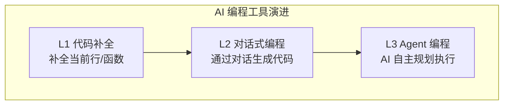
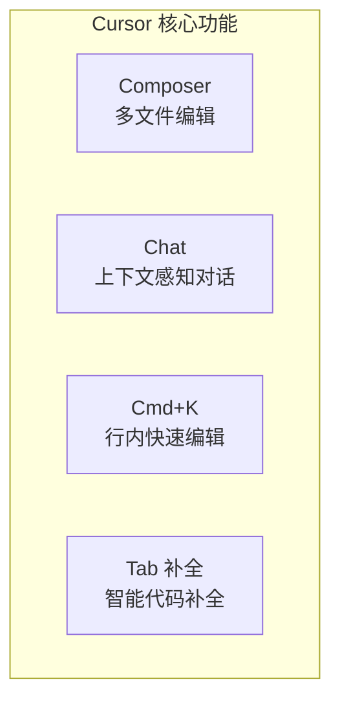
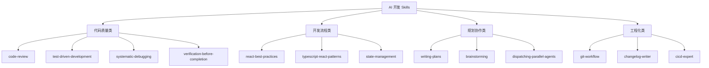
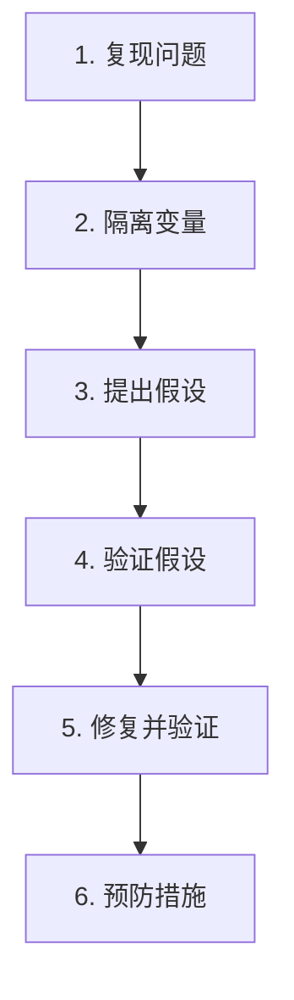
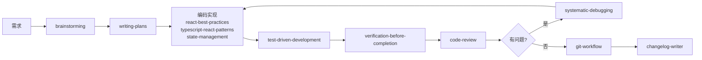
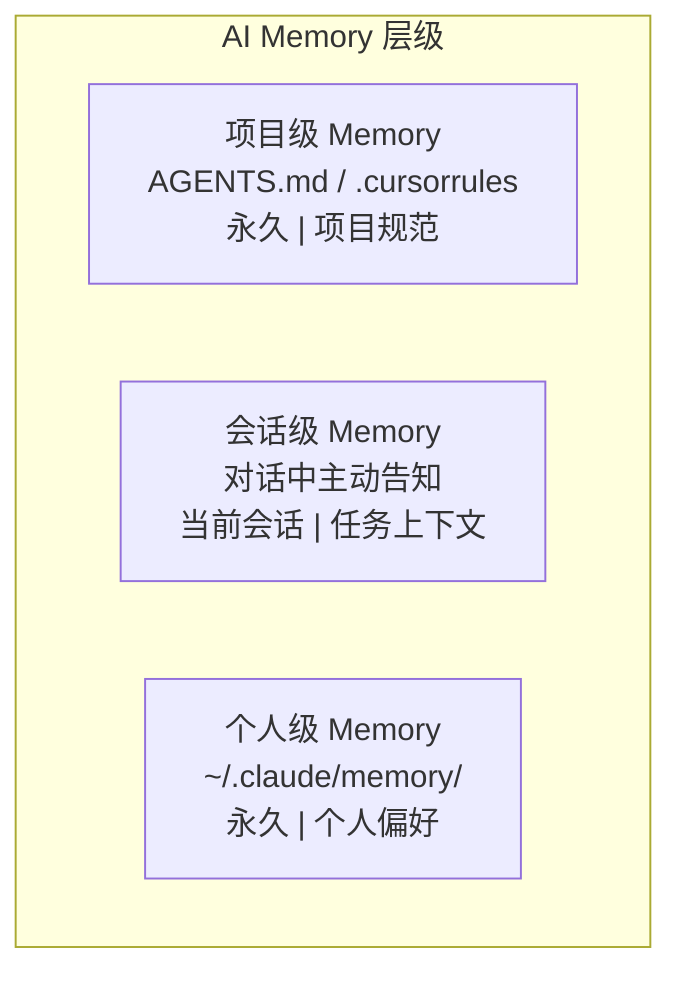
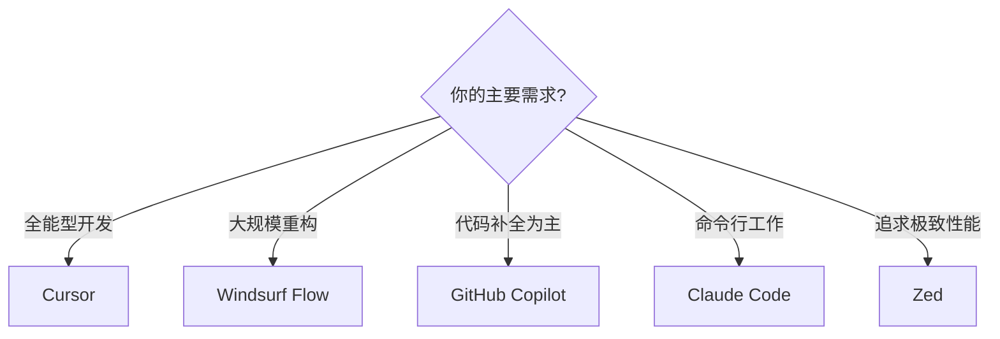

# AI 编程工具与 Memory 管理
## 最终版演讲稿（融合版）

**演讲时长**: 2.5 小时
**风格**: 故事开场 + 技术深度 + 实践建议

---

## Opening Hook（10 min）

大家好，欢迎来到第 8 课。

今天我想先讲一个我自己的经历。

去年我开始用 Cursor 写代码。刚开始的时候，体验很一般——AI 生成的代码经常不符合我们的项目规范，用的是 CSS Modules 而不是 Tailwind，组件风格也不统一。

我当时觉得："AI 也就这样吧，还是得自己写。"

后来有个同事跟我说："你配置 .cursorrules 了吗？"

我说："那是什么？"

他帮我写了一个 .cursorrules 文件，大概 30 行。然后又在项目根目录加了一个 AGENTS.md。

**从那天起，Cursor 生成的代码质量提升了一个档次。**

- 自动使用 Tailwind + shadcn/ui
- 自动遵循我们的命名规范
- 自动使用 TypeScript 严格模式
- 甚至知道我们的 API 路由结构

这就是今天要讲的两个核心主题：
1. **AI 编程工具**：不只是代码补全，而是 AI 结对编程
2. **Memory 管理**：让 AI 越用越懂你和你的项目

---

## Section 1：AI 编程工具的定位（15 min）

### 不只是代码补全

很多人把 AI 编程工具当成"高级自动补全"。这是对它最大的误解。

**代码补全**：你写了一半，AI 帮你补完
```
// 你写了
function getUserBy
// AI 补全
function getUserById(id: string) { ... }
```

**AI 结对编程**：你描述需求，AI 帮你实现
```
// 你说
"创建一个用户资料页面，包含头像上传、表单验证、
保存到数据库。使用 Server Actions + Zod + shadcn/ui"

// AI 生成完整的页面代码
```

这是两个完全不同的层次。

### AI 编程工具的三个层次



| 层次 | 能力 | 代表工具 |
|------|------|---------|
| L1 代码补全 | 补全当前行/函数 | Copilot Tab 补全 |
| L2 对话式编程 | 通过对话生成代码 | Cursor Chat、Copilot Chat |
| L3 Agent 编程 | AI 自主规划和执行多步任务 | Cursor Composer、Windsurf Flow |

今天我们重点讲 L2 和 L3。

---

## Section 2：Cursor 深度解析（40 min）

### 为什么选 Cursor

Cursor 是目前最受欢迎的 AI 编程工具之一。它基于 VS Code，所以你的所有插件和配置都能用。

但它比 VS Code + Copilot 强在哪里？

**核心差异：上下文感知**

Copilot 只能看到当前文件。Cursor 可以看到整个项目。

这意味着：
- Cursor 知道你的项目结构
- Cursor 知道你用了哪些组件
- Cursor 知道你的 API 路由
- Cursor 知道你的类型定义

### Cursor 的四大核心功能



#### 1. Composer（多文件编辑）

这是 Cursor 最强大的功能。

```
Prompt: "创建一个用户认证模块，包含：
1. 登录页面 (app/login/page.tsx)
2. 注册页面 (app/register/page.tsx)
3. Server Actions (app/actions/auth.ts)
4. Zod 验证 (lib/validations/auth.ts)
5. 用户类型定义 (types/user.ts)"
```

Composer 会**同时创建/修改多个文件**，而且文件之间的引用关系是正确的。

这是 Copilot Chat 做不到的——它一次只能处理一个文件。

**Composer 完整实战示例**

让我给你们看一个真实的例子。假设我们要做一个博客文章管理功能。

我在 Composer 里输入：

```
创建一个博客文章管理功能，要求：
1. 文章列表页面，支持分页和搜索
2. 文章详情页面，支持 Markdown 渲染
3. 文章编辑页面，使用富文本编辑器
4. Server Actions 处理 CRUD 操作
5. 使用 Prisma 操作数据库
6. 所有表单使用 React Hook Form + Zod 验证
7. 使用 shadcn/ui 组件库
```

然后 Composer 会同时生成这 5 个文件：

**文件 1：app/blog/page.tsx（列表页）**
```tsx
import { Suspense } from 'react'
import { BlogList } from '@/components/features/blog/blog-list'
import { SearchBar } from '@/components/features/blog/search-bar'
import { Skeleton } from '@/components/ui/skeleton'

export default function BlogPage({
  searchParams,
}: {
  searchParams: { page?: string; q?: string }
}) {
  return (
    <div className="container mx-auto py-8">
      <h1 className="text-3xl font-bold mb-8">博客文章</h1>
      <SearchBar />
      <Suspense fallback={<Skeleton className="h-96" />}>
        <BlogList
          page={Number(searchParams.page) || 1}
          query={searchParams.q}
        />
      </Suspense>
    </div>
  )
}
```

**文件 2：app/blog/[id]/page.tsx（详情页）**
```tsx
import { notFound } from 'next/navigation'
import { getPostById } from '@/app/actions/blog'
import { MarkdownRenderer } from '@/components/features/blog/markdown-renderer'
import { Card } from '@/components/ui/card'

export default async function BlogPostPage({
  params,
}: {
  params: { id: string }
}) {
  const post = await getPostById(params.id)
  if (!post) notFound()

  return (
    <article className="container mx-auto py-8 max-w-4xl">
      <Card className="p-8">
        <h1 className="text-4xl font-bold mb-4">{post.title}</h1>
        <div className="text-muted-foreground mb-8">
          {new Date(post.createdAt).toLocaleDateString('zh-CN')}
        </div>
        <MarkdownRenderer content={post.content} />
      </Card>
    </article>
  )
}
```

**文件 3：app/actions/blog.ts（Server Actions）**
```tsx
'use server'

import { revalidatePath } from 'next/cache'
import { prisma } from '@/lib/prisma'
import { blogPostSchema, type BlogPostInput } from '@/lib/validations/blog'

export async function createPost(data: BlogPostInput) {
  const validated = blogPostSchema.parse(data)
  const post = await prisma.post.create({ data: validated })
  revalidatePath('/blog')
  return { success: true, post }
}

export async function updatePost(id: string, data: BlogPostInput) {
  const validated = blogPostSchema.parse(data)
  const post = await prisma.post.update({
    where: { id },
    data: validated,
  })
  revalidatePath('/blog')
  revalidatePath(`/blog/${id}`)
  return { success: true, post }
}

export async function deletePost(id: string) {
  await prisma.post.delete({ where: { id } })
  revalidatePath('/blog')
  return { success: true }
}

export async function getPosts(page = 1, query?: string) {
  const pageSize = 10
  const where = query
    ? {
        OR: [
          { title: { contains: query, mode: 'insensitive' as const } },
          { content: { contains: query, mode: 'insensitive' as const } },
        ],
      }
    : {}

  const [posts, total] = await Promise.all([
    prisma.post.findMany({
      where,
      skip: (page - 1) * pageSize,
      take: pageSize,
      orderBy: { createdAt: 'desc' },
    }),
    prisma.post.count({ where }),
  ])

  return { posts, total, pages: Math.ceil(total / pageSize) }
}
```

**文件 4：lib/validations/blog.ts（Zod 验证）**
```tsx
import { z } from 'zod'

export const blogPostSchema = z.object({
  title: z.string().min(1, '标题不能为空').max(200, '标题最多 200 字'),
  content: z.string().min(1, '内容不能为空'),
  excerpt: z.string().max(500, '摘要最多 500 字').optional(),
  published: z.boolean().default(false),
})

export type BlogPostInput = z.infer<typeof blogPostSchema>
```

**文件 5：components/features/blog/blog-editor.tsx（编辑器组件）**
```tsx
'use client'

import { useForm } from 'react-hook-form'
import { zodResolver } from '@hookform/resolvers/zod'
import { blogPostSchema, type BlogPostInput } from '@/lib/validations/blog'
import { createPost, updatePost } from '@/app/actions/blog'
import { Button } from '@/components/ui/button'
import { Input } from '@/components/ui/input'
import { Textarea } from '@/components/ui/textarea'
import { Form, FormControl, FormField, FormItem, FormLabel } from '@/components/ui/form'
import { useRouter } from 'next/navigation'
import { toast } from 'sonner'

interface BlogEditorProps {
  post?: BlogPostInput & { id: string }
}

export function BlogEditor({ post }: BlogEditorProps) {
  const router = useRouter()
  const form = useForm<BlogPostInput>({
    resolver: zodResolver(blogPostSchema),
    defaultValues: post ?? { title: '', content: '', published: false },
  })

  async function onSubmit(data: BlogPostInput) {
    const result = post
      ? await updatePost(post.id, data)
      : await createPost(data)

    if (result.success) {
      toast.success(post ? '文章已更新' : '文章已创建')
      router.push('/blog')
    }
  }

  return (
    <Form {...form}>
      <form onSubmit={form.handleSubmit(onSubmit)} className="space-y-6">
        <FormField
          control={form.control}
          name="title"
          render={({ field }) => (
            <FormItem>
              <FormLabel>标题</FormLabel>
              <FormControl>
                <Input placeholder="输入文章标题" {...field} />
              </FormControl>
            </FormItem>
          )}
        />
        <FormField
          control={form.control}
          name="content"
          render={({ field }) => (
            <FormItem>
              <FormLabel>内容</FormLabel>
              <FormControl>
                <Textarea
                  placeholder="输入文章内容（支持 Markdown）"
                  className="min-h-[400px]"
                  {...field}
                />
              </FormControl>
            </FormItem>
          )}
        />
        <Button type="submit" disabled={form.formState.isSubmitting}>
          {form.formState.isSubmitting ? '保存中...' : '保存文章'}
        </Button>
      </form>
    </Form>
  )
}
```

看到了吗？5 个文件，一次性生成，而且：
- 文件之间的 import 路径都是正确的
- 类型定义在各个文件间正确引用
- Server Actions 和页面组件的调用关系正确
- 所有代码都遵循了 .cursorrules 里的规范

这就是 Composer 的威力。一个自然语言描述，AI 帮你搭好整个功能的骨架。你要做的就是 review 一下，调整细节，然后继续下一个功能。

#### 2. Chat（上下文感知对话）

```
你：这个组件的性能有什么问题？
Cursor：我看到这个组件在每次渲染时都会重新创建 handleClick 函数，
建议用 useCallback 包裹。另外，UserList 组件没有用 React.memo，
当父组件重新渲染时会导致不必要的重渲染。
```

Cursor 能看到完整的组件代码和它的依赖，所以给出的建议更准确。

**Chat 实战：性能优化对话**

来看一个更完整的 Chat 对话过程。假设你打开了一个性能有问题的组件，然后在 Chat 里问：

```
你：@ProductList.tsx 这个组件渲染很慢，帮我分析一下性能问题

Cursor：我分析了 ProductList.tsx，发现以下性能问题：

1. **重复计算**：第 23 行的 filteredProducts 在每次渲染时都会重新计算，
   但 products 和 filter 并不是每次都变化。建议用 useMemo：

   const filteredProducts = useMemo(
     () => products.filter(p => p.category === filter),
     [products, filter]
   )

2. **子组件重渲染**：ProductCard 没有用 React.memo 包裹，
   当列表重新渲染时，所有卡片都会重新渲染，即使 props 没变。

3. **大列表没有虚拟化**：你有 2000+ 条产品数据，建议使用
   @tanstack/react-virtual 做虚拟滚动，只渲染可视区域的元素。

4. **图片没有懒加载**：ProductCard 里的图片建议使用 next/image
   的 loading="lazy" 属性。

需要我帮你逐一修复吗？

你：先修复前两个问题

Cursor：好的，我来修改...
[Cursor 直接在编辑器中修改代码，你可以看到 diff]
```

**Chat 实战：Bug 排查对话**

再看一个排查 Bug 的例子：

```
你：用户反馈登录后偶尔会被踢出来，帮我排查一下认证相关的代码
    @middleware.ts @lib/auth.ts @app/api/auth/[...nextauth]/route.ts

Cursor：我检查了这三个文件，发现一个潜在问题：

在 middleware.ts 第 15 行，你检查 token 是否过期用的是：
  if (token.exp < Date.now())

这里有个 Bug：JWT 的 exp 字段是秒级时间戳，而 Date.now() 返回的是
毫秒级时间戳。正确的写法应该是：
  if (token.exp < Date.now() / 1000)

或者用 Math.floor：
  if (token.exp < Math.floor(Date.now() / 1000))

这会导致 token 看起来"总是过期的"，但因为你在 lib/auth.ts 里有
refresh 逻辑，所以大部分时候能自动续期。但在网络延迟较高时，
refresh 请求还没回来，用户就被踢出了。

你：太好了，帮我修复

Cursor：[直接修改 middleware.ts 中的代码]
```

看到了吗？这就是 Chat 的价值——它不只是回答问题，它能看到你的代码上下文，给出精准的诊断。

#### 3. Cmd+K（行内快速编辑）

选中一段代码，按 Cmd+K，输入修改指令：

```
选中一个 div，输入："改成 shadcn/ui 的 Card 组件，添加 hover 动画"
```

AI 直接在原位替换代码。

**Cmd+K 实战场景 1：快速重构 JSX 结构**

假设你有一段原始的 HTML 结构：

```tsx
// 选中这段代码
<div className="border rounded p-4">
  
  <h3>{user.name}</h3>
  <p>{user.email}</p>
  <button onClick={handleEdit}>编辑</button>
</div>
```

按 Cmd+K，输入：
```
改成 shadcn/ui 的 Card 组件，头像用 Avatar，按钮用 Button，
添加 hover 时 shadow-lg 的过渡动画
```

AI 直接替换为：
```tsx
<Card className="p-4 transition-shadow hover:shadow-lg">
  <CardHeader className="flex flex-row items-center gap-4">
    <Avatar>
      <AvatarImage src={user.avatar} alt={user.name} />
      <AvatarFallback>{user.name[0]}</AvatarFallback>
    </Avatar>
    <div>
      <CardTitle>{user.name}</CardTitle>
      <CardDescription>{user.email}</CardDescription>
    </div>
  </CardHeader>
  <CardFooter>
    <Button variant="outline" onClick={handleEdit}>编辑</Button>
  </CardFooter>
</Card>
```

**Cmd+K 实战场景 2：添加错误处理和 Loading 状态**

选中一个没有错误处理的数据请求函数：

```tsx
// 选中这段代码
async function fetchUsers() {
  const res = await fetch('/api/users')
  const data = await res.json()
  setUsers(data)
}
```

按 Cmd+K，输入：
```
添加 try-catch 错误处理、loading 状态、错误提示 toast
```

AI 替换为：
```tsx
async function fetchUsers() {
  setLoading(true)
  try {
    const res = await fetch('/api/users')
    if (!res.ok) {
      throw new Error(`请求失败: ${res.status}`)
    }
    const data = await res.json()
    setUsers(data)
  } catch (error) {
    console.error('获取用户列表失败:', error)
    toast.error('获取用户列表失败，请稍后重试')
  } finally {
    setLoading(false)
  }
}
```

**Cmd+K 实战场景 3：把 JavaScript 转成 TypeScript**

选中一段 JS 代码：

```js
// 选中这段代码
function formatPrice(price, currency, locale) {
  return new Intl.NumberFormat(locale, {
    style: 'currency',
    currency: currency,
  }).format(price)
}
```

按 Cmd+K，输入：
```
转成 TypeScript，添加完整的类型定义，currency 用联合类型限制常用货币
```

AI 替换为：
```tsx
type CurrencyCode = 'CNY' | 'USD' | 'EUR' | 'JPY' | 'GBP'

interface FormatPriceOptions {
  price: number
  currency: CurrencyCode
  locale?: string
}

function formatPrice({
  price,
  currency,
  locale = 'zh-CN',
}: FormatPriceOptions): string {
  return new Intl.NumberFormat(locale, {
    style: 'currency',
    currency,
  }).format(price)
}
```

Cmd+K 的核心价值就是"选中、描述、替换"，三步搞定。特别适合局部重构和代码升级。

#### 4. Tab 补全

这个和 Copilot 类似，但 Cursor 的补全更准确，因为它有更多的上下文。

### .cursorrules 配置

这是让 Cursor 变强的关键。

```
# .cursorrules

## 技术栈
- React 19 + Next.js 15 App Router
- TypeScript (strict mode)
- Tailwind CSS v4
- shadcn/ui + Radix UI
- Zustand + TanStack Query
- React Hook Form + Zod

## 代码规范
- 使用函数式组件 + Hooks
- Props 类型使用 interface
- 导出使用命名导出
- 样式只用 Tailwind utility classes
- 优先使用 shadcn/ui 组件

## 文件路径
- UI 组件: components/ui/
- 业务组件: components/features/
- Hooks: hooks/
- Utils: lib/
- Types: types/

## 导入顺序
1. React 相关
2. 第三方库
3. 本地组件
4. 本地 hooks
5. 本地 utils
6. 类型定义

## 禁止
- 不使用 any
- 不写内联样式
- 不使用 CSS-in-JS
- 不直接修改 shadcn/ui 组件源码
- 不使用 useEffect 做数据请求
```

有了这个文件，Cursor 生成的代码会自动遵循你的项目规范。

### .cursorrules 进阶：不同项目类型的模板

上面那个是通用模板。实际工作中，不同类型的项目需要不同的 .cursorrules。我给大家准备了几个常用模板。

**模板 1：Next.js 全栈项目**

```
# .cursorrules - Next.js 全栈项目

## 技术栈
- Next.js 15 App Router + React 19
- TypeScript strict mode
- Tailwind CSS v4 + shadcn/ui
- Prisma ORM + PostgreSQL
- NextAuth.js v5 认证
- Zustand 状态管理
- TanStack Query 数据请求

## 路由规范
- 页面路由: app/(routes)/
- API 路由: app/api/
- Server Actions: app/actions/
- 布局: app/(routes)/layout.tsx
- 错误边界: app/(routes)/error.tsx

## 数据获取规范
- 服务端数据: 直接在 Server Component 中 await
- 客户端数据: 使用 TanStack Query 的 useQuery
- 表单提交: 使用 Server Actions + useActionState
- 禁止在 useEffect 中 fetch 数据

## 认证规范
- 服务端获取 session: auth() from @/lib/auth
- 客户端获取 session: useSession() from next-auth/react
- 受保护路由: 在 middleware.ts 中统一处理
- API 路由认证: 每个路由开头检查 session
```

**模板 2：React 组件库项目**

```
# .cursorrules - React 组件库

## 技术栈
- React 19 + TypeScript
- Storybook 8 文档
- Vitest + Testing Library 测试
- Tailwind CSS v4
- Radix UI 无障碍基础

## 组件规范
- 每个组件一个文件夹: components/Button/
  - Button.tsx (组件实现)
  - Button.stories.tsx (Storybook 文档)
  - Button.test.tsx (单元测试)
  - index.ts (导出)
- 所有组件必须支持 ref 转发 (forwardRef)
- 所有组件必须支持 className 合并 (cn 工具函数)
- 所有交互组件必须支持键盘操作
- 必须提供 aria-label 或 aria-labelledby

## 样式规范
- 使用 cva (class-variance-authority) 管理变体
- 使用 tailwind-merge 合并 className
- 支持 size: sm | md | lg 和 variant: default | outline | ghost

## 测试规范
- 每个组件至少覆盖: 渲染、交互、无障碍
- 使用 @testing-library/user-event 模拟用户操作
- 使用 axe-core 检查无障碍合规
```

**模板 3：微信小程序项目（Taro）**

```
# .cursorrules - Taro 小程序项目

## 技术栈
- Taro 4 + React 19
- TypeScript strict mode
- NutUI 组件库
- Zustand 状态管理

## 文件规范
- 页面: src/pages/[name]/index.tsx
- 组件: src/components/[Name]/index.tsx
- 样式: 与组件同目录，使用 CSS Modules (.module.scss)
- API: src/services/[module].ts
- 类型: src/types/[module].ts

## 小程序特殊规范
- 使用 Taro.navigateTo 而非 window.location
- 使用 Taro.getStorageSync 而非 localStorage
- 图片必须使用 CDN 地址，不要用本地图片
- 页面配置写在 [page].config.ts 中
- 注意包体积，单个分包不超过 2MB

## 禁止
- 不使用 DOM API (document.querySelector 等)
- 不使用 window 对象
- 不使用 CSS 动画 (用 Taro.createAnimation)
- 不引入超过 50KB 的第三方库
```

这些模板大家可以直接拿去用，根据自己的项目改一改就行。关键是要把你们团队的约定写进去，这样 AI 生成的代码才能直接用。

---

## Section 3：常用开发 Skills 详解（25 min）

### 什么是 Skills

Skills 是 AI 编程工具的"技能模块"——预定义的工作流和最佳实践模板。它们让 AI 在特定场景下表现得更专业、更可靠。

你可以把 Skills 理解为"AI 的专业培训"：
- 没有 Skills 的 AI → 通才，什么都会一点，但不够专业
- 有 Skills 的 AI → 专家，在特定领域表现出色

### Skills 的四大类别



### 先记这张「前端最常用 Skills Top 10」

四大类帮你建立全貌；**日常写页面、对接口、修 Bug、提 PR，真正高频的是下面这张表**。记的时候别死记英文 id，记**能力标签**——换工具也能找到同类能力。

| 顺序 | Skill | 能力标签（好记版） | 一句话：什么时候掏出来 |
|:---:|:---|:---|:---|
| 1 | `brainstorming` | 需求澄清 / 方案探索 | 新需求、交互没想清楚、怕做偏了，先聊清再写码 |
| 2 | `writing-plans` | 任务拆解 / 实施规划 | 功能要动多个文件、多步改造，先列计划再动手 |
| 3 | `react-best-practices` | React/Next 写法 | 写组件、页面、RSC/Client 边界、性能与结构 |
| 4 | `typescript-react-patterns` | 类型与组件 API | Props/泛型/ref/事件类型报错或要设计组件契约时 |
| 5 | `state-management` | 请求缓存 + 客户端状态 | TanStack Query、Zustand、服务端状态 vs 本地状态分层 |
| 6 | `systematic-debugging` | 系统化排障 | 报错、偶现、测试红、不要「猜一刀」时 |
| 7 | `code-review` | 风险审查 / 提交前把关 | 合 PR、发版前，让 AI 按维度挑风险 |
| 8 | `verification-before-completion` | 完成前验证 | 声称「做完了」之前，逼自己跑测试/构建/关键路径 |
| 9 | `test-driven-development` | 测试驱动实现 | 新逻辑、改核心路径，用红-绿-重构锁住行为 |
| 10 | `git-workflow` | 提交与分支规范 | 写 commit、开分支、对齐团队约定 |

**记忆顺序就一句话**：**先想清楚 → 再实现 → 再验证 → 再交付**。

下面仍按**四大类**展开，方便讲课往下走：先有全貌，再抓高频。

### 一条前端需求会串起哪些 Skills？（真实主线）

举个例子：**产品要加「用户搜索弹窗」**。从接到需求到能合进 `main`，一条常见链路是这样的：

1. **`brainstorming`**：先把入口、交互、边界情况聊清楚，避免做偏。
2. **`writing-plans`**：拆清要改哪些文件、复用哪些组件、接口怎么接。
3. **`react-best-practices`**：把弹层结构、可访问性、渲染方式写对。
4. **`typescript-react-patterns`**：把结果类型、回调契约、组件 API 定稳。
5. **`state-management`**：请求和缓存交给 Query，界面开关和关键词交给轻状态。
6. **`test-driven-development`**：关键交互和核心逻辑先用测试锁住。
7. **`verification-before-completion`**：本地跑一遍关键验证，再说“可以 review”。
8. **`code-review`**：让 AI 或同事帮你查边界、性能和风险点。
9. **`git-workflow`**：最后按团队规范提交和协作。

这条链**不是每次都要 9 步拉满**，课堂上抓住顺序感就够了。第 8 课先建立高频地图；第 10 课再往工程化落地展开。

---

### 代码质量类 Skills

#### 1. code-review（代码审查）

**用途**：让 AI 以资深工程师的视角审查你的代码，从正确性、性能、可维护性、安全性、测试覆盖等维度给出反馈。

**触发方式**：`/code-review` 或 "帮我 review 一下这次改动"

**审查维度**：
- **正确性**：逻辑是否正确？边界条件？null/undefined 问题？
- **性能**：不必要的重渲染？大列表虚拟化？N+1 查询？
- **可维护性**：命名清晰？函数是否过长？重复代码？
- **安全性**：用户输入验证？XSS/CSRF 风险？
- **测试**：是否有对应测试？边界情况覆盖？

**使用场景**：提交 PR 前、合并代码前、部署前必须 review。

---

#### 2. test-driven-development（测试驱动开发）

**用途**：引导 AI 遵循 TDD 的红-绿-重构循环，先写失败的测试，再写最少的实现代码，最后重构优化。

**触发方式**：`/tdd` 或 "用 TDD 方式实现这个功能"

**TDD 循环**：


**核心原则**：
- 每个功能都有测试覆盖
- 测试先行，代码后写
- 小步迭代，频繁验证

**使用场景**：实现新功能、修复 Bug、重构代码时使用。

---

#### 3. systematic-debugging（系统化调试）

**用途**：遇到 Bug 时，引导 AI 进行系统化的问题排查，而不是瞎猜。

**触发方式**：`/systematic-debugging` 或 "帮我排查这个问题"

**调试六步法**：



**使用场景**：遇到任何 Bug、测试失败、异常行为时，在提出修复方案前先用这个 Skill 排查。收尾阶段再补一句：**先做 `verification-before-completion` 自检，再做 `code-review` 把关。**

---

### 开发流程类 Skills

#### 4. react-best-practices（React 最佳实践）

**用途**：让 AI 生成符合 React/Next.js 最佳实践的代码。

**触发方式**：写 React 组件时自动激活

**涵盖领域**：
- **组件设计**：单一职责、组合优于继承、受控组件
- **性能优化**：useMemo、useCallback、React.memo、虚拟化
- **数据获取**：Server Component 直接 await、Client 用 TanStack Query
- **shadcn/ui 模式**：组件使用规范、表单处理、动画集成

**使用场景**：编写、审查、重构 React/Next.js 代码时使用。

---

#### 5. typescript-react-patterns（TypeScript React 模式）

**用途**：专注于类型安全的 React 开发模式。

**触发方式**：处理 TypeScript 类型问题时自动激活

**涵盖领域**：
- **Props 类型设计**：基础类型、扩展 HTML 元素、多态组件（as prop）
- **泛型组件**：类型自动推断的列表、表格组件
- **事件处理类型**：FormEvent、ChangeEvent、KeyboardEvent
- **Ref 类型**：forwardRef、useImperativeHandle

**使用场景**：TypeScript 报错、定义组件类型、写泛型组件时使用。

---

#### 6. state-management（状态管理）

**用途**：专注于 Zustand + TanStack Query 的状态管理模式。

**触发方式**：涉及状态管理时自动激活

**涵盖领域**：
- **Zustand**：Store 设计、中间件（devtools/persist）、Selector 优化
- **TanStack Query**：useQuery/useMutation、缓存策略、乐观更新
- **状态分层**：全局状态用 Zustand，服务端状态用 Query

**使用场景**：实现数据请求、缓存、客户端状态管理时使用。

---

### 规划协作类 Skills

#### 7. writing-plans（编写计划）

**用途**：在开始复杂任务前，引导 AI 先制定详细的实施计划。

**触发方式**：`/writing-plans` 或 "帮我制定实现计划"

**计划结构**：
- **目标**：明确要实现什么
- **技术方案**：选择的技术栈和架构
- **任务分解**：拆分为可执行的小任务
- **依赖关系**：哪些任务可以并行，哪些有先后顺序
- **风险点**：可能遇到的问题和应对方案

**使用场景**：实现多步骤功能、大型重构前先规划。

---

#### 8. brainstorming（头脑风暴）

**用途**：在做创意性工作前，探索用户意图、需求和设计方案。

**触发方式**：`/brainstorming` 或任何创意性工作前

**探索维度**：
- **用户故事**：作为[角色]，我希望[功能]，以便[价值]
- **用户画像**：目标用户是谁？痛点是什么？
- **核心场景**：主要使用场景有哪些？
- **技术方案对比**：不同方案的优缺点

**使用场景**：创建新功能、构建组件、添加功能前必须先头脑风暴。

---

#### 9. dispatching-parallel-agents（并行 Agent 调度）

**用途**：当有多个独立任务时，让 AI 并行执行，大幅提高效率。

**触发方式**：`/dispatching-parallel-agents` 或 "并行处理这些任务"

**适用条件**：
- 2 个以上独立任务
- 任务之间没有共享状态
- 没有顺序依赖关系

**使用场景**：同时创建多个页面、同时写多个组件、同时生成多个配置文件。

---

### 工程化类 Skills

#### 10. git-workflow（Git 工作流）

**用途**：规范 Git 操作、提交信息格式、分支策略。

**触发方式**：涉及 git 操作时自动激活

**规范内容**：
- **提交类型**：feat / fix / docs / style / refactor / perf / test / chore / ci
- **提交格式**：`<type>(<scope>): <subject>`
- **分支策略**：main → develop → feature/fix 分支

**使用场景**：写提交信息、设置分支策略、审查 git 历史时使用。

---

#### 11. changelog-writer（变更日志）

**用途**：从 git 提交记录自动生成规范的 CHANGELOG。

**触发方式**：`/changelog` 或 "生成变更日志"

**输出格式**：
- **Added**：新功能
- **Changed**：变更
- **Fixed**：修复
- **Security**：安全更新
- 遵循 Keep a Changelog 标准

**使用场景**：发版前、准备 Release Notes 时使用。

---

#### 12. cicd-expert（CI/CD 专家）

**用途**：设计和优化 CI/CD 流水线，包括 GitHub Actions、GitLab CI、Jenkins 等。

**触发方式**：涉及 CI/CD 配置时自动激活

**能力范围**：
- **流水线设计**：构建、测试、部署流程
- **安全门禁**：代码扫描、依赖检查、镜像签名
- **部署策略**：蓝绿部署、金丝雀发布、ArgoCD/GitOps

**使用场景**：设置 CI/CD、优化构建速度、排查流水线问题时使用。

---

### 其他补充 Skills（知道有这些就够了）

前面那 10 个是你日常最常碰到的。下面这些更像**补充装备**，课堂里点到为止，不展开成第二套主线：

| 类型 | 代表 Skill | 什么时候再用 |
|------|-------------|--------------|
| 测试补充 | `testing-best-practices`、`tdd-strict` | 需要把测试写得更系统时 |
| Review 协作 | `requesting-code-review`、`receiving-code-review` | 进入团队协作、处理 review 来回时 |
| 工程化补充 | `using-git-worktrees`、`finishing-a-development-branch`、`executing-plans` | 任务更大、流程更正式时 |
| 架构与文档 | `adr-writer`、`monorepo-management`、`wiki-generator` | 进入中大型项目时 |
| 扩展型能力 | `find-skills`、`create-skill`、`self-improving-agent` | 你真的想扩技能边界时 |

---

### 行业/领域专用 Skills

除了通用开发 Skills，还会有一些**领域插件型**能力，比如 Next.js 全栈、复杂表单、动画、无障碍、国际化、性能优化、安全、数据库、API 设计、微前端。这里不用一口气全记，**遇到场景再去找同类 Skill 就行**。

---

### 如何发现和安装新 Skills（了解即可）

这一节只记一句：**先把高频 Top 10 用熟，再去扩展新的 Skill**。真要扩展时，无非三种路子：用 `find-skills` 找、去社区搜、自己写。

---

### Skills 最佳实践

#### 场景-Skill 对照表

| 场景 | 推荐 Skill |
|------|-----------|
| 写新功能前 | `brainstorming` → `writing-plans` |
| 核心逻辑实现 | `test-driven-development`（按需） |
| 收尾前 | `verification-before-completion` |
| 提交代码前 | `code-review` |
| 遇到 Bug | `systematic-debugging` |
| 写 React 组件 | `react-best-practices` + `typescript-react-patterns` |
| 状态管理 | `state-management` |
| 多个独立任务 | `dispatching-parallel-agents` |
| 发版前 | `changelog-writer` |

#### 组合使用工作流（看顺序，不用背细节）



#### 在团队中推广 Skills

1. **统一配置**：在 .cursorrules 中指定团队常用的 Skills
2. **培训新人**：让新成员先学习使用 Skills
3. **Code Review 检查**：确保 PR 经过了 code-review Skill
4. **CI 集成**：在 CI 中运行 testing Skills 生成的测试

---

## Section 4：AI Memory 管理（40 min）

### 为什么需要 Memory

AI 工具有一个致命问题：**每次对话都是"失忆"的**。

你昨天告诉 Cursor "我们用 Zustand 做状态管理"，今天它可能又给你生成 Redux 代码。

**Memory 就是解决这个问题的。**

### Memory 的三个层级



| 层级 | 存储位置 | 生命周期 | 用途 |
|------|----------|----------|------|
| 项目级 | AGENTS.md / .cursorrules | 永久 | 项目规范、技术栈 |
| 会话级 | 对话中主动告知 | 当前会话 | 当前任务上下文 |
| 个人级 | ~/.claude/memory/ | 永久 | 个人偏好 |

### 项目级 Memory：AGENTS.md

这是最重要的 Memory。放在项目根目录，所有 AI 工具都会读取。

```markdown
# 项目 AI 开发指南

## 项目概述
- 项目名称：AI Todo App
- 技术栈：Next.js 15 + TypeScript + Tailwind v4 + shadcn/ui

## 技术决策历史
- 2026-03-15: 选择 Tailwind v4 而非 UnoCSS（生态更成熟）
- 2026-03-10: 使用 Zustand 而非 Redux（更轻量）

## 已知问题
- UserProfile 组件的性能问题已在 PR #123 修复
- Safari 浏览器的 Flexbox 问题需要 -webkit- 前缀

## 团队约定
- 所有 API 请求必须有错误处理
- 表单必须使用 React Hook Form + Zod
- 新功能必须有单元测试

## 禁止事项
- ❌ 不要使用 any 类型
- ❌ 不要直接修改 components/ui/ 下的组件
- ❌ 不要使用 useEffect 做数据请求
```

上面这个是简化版。实际企业项目中，AGENTS.md 需要更完整。我给大家准备了一个企业级模板：

**企业级 AGENTS.md 完整模板**

```markdown
# AGENTS.md - [项目名称] AI 开发指南
# 最后更新: 2026-03-26
# 维护人: [团队负责人]

## 一、项目概述

### 基本信息
- 项目名称: 智能客服管理平台
- 项目类型: B 端 SaaS 应用
- 目标用户: 企业客服团队管理者
- 当前版本: v2.3.0
- 仓库地址: https://github.com/company/cs-platform

### 技术栈
- 框架: Next.js 15 (App Router)
- 语言: TypeScript 5.x (strict mode)
- 样式: Tailwind CSS v4 + shadcn/ui
- 状态管理: Zustand (全局) + TanStack Query (服务端)
- 表单: React Hook Form + Zod
- ORM: Prisma + PostgreSQL
- 认证: NextAuth.js v5
- 测试: Vitest + Testing Library + Playwright
- 部署: Vercel + Neon Database

### 项目结构
app/
├── (auth)/          # 认证相关页面 (登录/注册)
├── (dashboard)/     # 主面板 (需要登录)
│   ├── tickets/     # 工单管理
│   ├── customers/   # 客户管理
│   ├── analytics/   # 数据分析
│   └── settings/    # 系统设置
├── api/             # API 路由
└── actions/         # Server Actions

components/
├── ui/              # shadcn/ui 组件 (不要修改)
├── features/        # 业务组件 (按功能模块分)
├── layouts/         # 布局组件
└── shared/          # 通用业务组件

lib/
├── prisma.ts        # Prisma 客户端
├── auth.ts          # NextAuth 配置
├── utils.ts         # 工具函数
└── validations/     # Zod schemas

## 二、技术决策记录 (ADR)

### ADR-001: 状态管理选型 (2026-01-15)
- 决策: Zustand + TanStack Query
- 原因: Redux 对于本项目过重，Zustand API 更简洁
- TanStack Query 专门处理服务端状态，避免手动管理缓存
- 影响: 所有服务端数据请求必须通过 useQuery/useMutation

### ADR-002: 表单方案 (2026-01-20)
- 决策: React Hook Form + Zod
- 原因: 性能好（非受控组件），Zod 提供运行时类型验证
- 影响: 所有表单必须定义 Zod schema，禁止手动 validate

### ADR-003: 样式方案 (2026-02-01)
- 决策: Tailwind CSS v4 + shadcn/ui
- 原因: 原子化 CSS 减少样式冲突，shadcn/ui 可定制性强
- 影响: 禁止使用 CSS Modules、styled-components 等方案

### ADR-004: 测试策略 (2026-02-10)
- 决策: 单元测试 Vitest + 集成测试 Testing Library + E2E Playwright
- 覆盖率要求: 核心业务逻辑 > 80%
- 影响: 每个 PR 必须包含对应测试

## 三、编码规范

### 组件规范
- 使用函数式组件 + Hooks
- Props 类型使用 interface，命名为 [组件名]Props
- 导出使用命名导出 (export function)，不用 default export
- 组件文件名使用 kebab-case (user-profile.tsx)
- 组件名使用 PascalCase (UserProfile)

### 命名规范
- 变量/函数: camelCase (getUserById)
- 类型/接口: PascalCase (UserProfile)
- 常量: UPPER_SNAKE_CASE (MAX_RETRY_COUNT)
- 文件名: kebab-case (user-profile.tsx)
- CSS 类名: Tailwind utility classes

### 导入顺序 (已配置 ESLint 自动排序)
1. React / Next.js
2. 第三方库
3. @/components/ui
4. @/components/features
5. @/hooks
6. @/lib
7. @/types
8. 相对路径导入

### 错误处理规范
- Server Actions: 返回 { success, data?, error? } 格式
- API 路由: 使用统一的 ApiResponse 类型
- 客户端: 使用 toast 提示用户，console.error 记录详情
- 异步操作: 必须有 try-catch，必须有 loading 状态

## 四、已知问题和注意事项

### 已知 Bug
- [OPEN] #234: Safari 下日期选择器偶尔闪烁
- [FIXED] #198: 工单列表分页在筛选后重置 (v2.2.1 修复)

### 性能注意事项
- tickets 列表超过 1000 条时需要虚拟滚动
- analytics 页面的图表数据需要在服务端聚合，不要在客户端处理
- 图片上传必须先压缩到 500KB 以下

### 安全注意事项
- 所有 Server Actions 必须检查用户权限
- 用户输入必须经过 Zod 验证后才能入库
- 敏感数据 (密码、token) 不要出现在日志中

## 五、常用命令

- 开发: pnpm dev
- 构建: pnpm build
- 测试: pnpm test
- Lint: pnpm lint
- 数据库迁移: pnpm prisma migrate dev
- 生成 Prisma 客户端: pnpm prisma generate

## 六、团队成员和职责

- 前端负责人: @zhangsan - 架构决策、代码审查
- 后端对接: @lisi - API 设计、数据库 schema
- UI 设计: @wangwu - 设计稿在 Figma，链接见 README
```

这个模板有几个关键点：
1. **技术决策记录（ADR）**——不只是告诉 AI "用什么"，还告诉它"为什么用"。这样 AI 在做技术选型建议时不会推荐你已经否决过的方案。
2. **已知问题**——避免 AI 重复踩坑。比如你已经知道 Safari 有 Bug，AI 就不会给你生成可能触发这个 Bug 的代码。
3. **安全注意事项**——这是很多团队忽略的。把安全规范写进去，AI 生成的代码会自动加上权限检查。

### 会话级 Memory：主动告知

在开始新任务时，主动告诉 AI 上下文：

```
好的示例：
"我正在重构用户认证模块。已完成登录页面（使用 React Hook Form + Zod），
现在要做注册页面。要求保持与登录页面一致的风格和验证逻辑。
登录页面的 Zod schema 在 lib/validations/auth.ts"

不好的示例：
"帮我做注册页面"  ← 缺少上下文
```

### 个人级 Memory

在 `~/.claude/memory/` 创建个人偏好文件：

```markdown
# preferences.md

## 代码风格
- 我喜欢函数式组件
- 我喜欢用 const 而非 let
- 我喜欢用解构赋值

## 工具偏好
- 包管理器：pnpm
- 测试框架：Vitest
- 状态管理：Zustand
```

### Memory 最佳实践

**✅ 应该记录的**：
1. 技术决策和原因
2. 已知问题和解决方案
3. 团队约定和规范
4. 重要的业务逻辑

**❌ 不应该记录的**：
1. 代码细节（AI 可以直接读代码）
2. 临时信息
3. 显而易见的事情

### Memory 维护

每月清理一次：
- 删除已过期的技术决策
- 更新已解决的问题
- 补充新的团队约定

**Memory 月度检查清单**

我建议每个月的第一个周一，花 30 分钟做一次 Memory 维护。这是我用的检查清单：

```markdown
# Memory 月度检查清单

## 1. AGENTS.md 检查
- [ ] 技术栈版本是否需要更新？（比如 Next.js 升级了）
- [ ] 有没有新的技术决策需要记录？
- [ ] 已知问题列表：哪些已经修复了？标记为 [FIXED]
- [ ] 有没有新发现的 Bug 需要加进去？
- [ ] 团队约定有没有变化？（比如新的代码规范）
- [ ] 项目结构有没有变化？（比如新增了模块）
- [ ] 安全注意事项有没有更新？

## 2. .cursorrules 检查
- [ ] 技术栈版本号是否最新？
- [ ] 有没有新引入的库需要加到规范里？
- [ ] 禁止事项有没有需要更新的？
- [ ] 文件路径规范是否还准确？

## 3. 个人 Memory 检查
- [ ] 工具偏好有没有变化？
- [ ] 代码风格偏好有没有调整？
- [ ] 有没有新的快捷方式或工作流值得记录？

## 4. 清理
- [ ] 删除超过 3 个月的已修复 Bug 记录
- [ ] 删除已废弃的技术决策
- [ ] 合并重复的规范条目
```

这个清单看起来很多，但实际做起来很快。大部分时候就是扫一眼，改几行。但这 30 分钟的投入，能让你接下来一个月的 AI 编程体验好很多。

### Memory 使用场景

光讲理论不够，我给大家看两个真实场景。

**场景 1：新成员加入项目**

小王刚加入团队，要开始在项目上写代码。传统方式是什么？看文档、问同事、踩坑、再问同事。

有了 Memory 之后，流程变成这样：

```
第一步：小王 clone 项目，打开 Cursor

第二步：Cursor 自动读取 AGENTS.md 和 .cursorrules

第三步：小王在 Chat 里问：
"我是新加入的成员，帮我梳理一下这个项目的整体架构和开发规范"

Cursor 回答（基于 AGENTS.md）：
"这是一个智能客服管理平台，使用 Next.js 15 App Router...
主要模块有工单管理、客户管理、数据分析...
代码规范要求使用函数式组件、命名导出...
表单统一使用 React Hook Form + Zod...
状态管理用 Zustand（全局）和 TanStack Query（服务端）..."

第四步：小王开始写第一个功能
"我要在工单管理模块添加一个批量操作功能"

Cursor 生成的代码自动遵循项目规范：
- 使用了正确的文件路径 (app/(dashboard)/tickets/)
- 使用了 shadcn/ui 组件
- 使用了 Server Actions
- 添加了权限检查（因为 AGENTS.md 里写了安全规范）
- 使用了 Zod 验证
```

你看，小王不需要花一周时间熟悉项目。有了 Memory，AI 就像一个随时在线的"老员工"，帮他快速上手。

**场景 2：修复重复出现的 Bug**

这个场景更常见。假设你们项目有一个 Bug：日期组件在 Safari 下显示异常。

第一次遇到这个 Bug，你花了 2 小时排查，发现是 Safari 不支持 `new Date('2026-03-26')` 这种格式，需要用 `new Date('2026/03/26')` 或者 `new Date(2026, 2, 26)`。

你修复了，但没有记录。

三个月后，另一个同事在另一个页面又遇到了同样的问题。又花了 2 小时。

**如果你在第一次修复时更新了 AGENTS.md：**

```markdown
## 已知问题
- [OPEN] Safari 不支持 YYYY-MM-DD 格式的日期字符串。
  解决方案：使用 dayjs 或 date-fns 解析日期，不要直接 new Date(string)。
  相关 PR: #156
```

那么三个月后，当同事让 AI 帮他处理日期相关的代码时，AI 会自动使用 dayjs 来解析，根本不会产生这个 Bug。

**这就是 Memory 的价值——把团队的经验沉淀下来，让 AI 帮你避免重复踩坑。**

---

## Section 5：Prompt Engineering（20 min）

### 高质量 Prompt 的结构


```
[角色] + [上下文] + [任务] + [约束] + [输出格式]
```

**示例**：

```
你是一个 React 前端工程师。
我们的项目使用 Next.js 15 + Tailwind v4 + shadcn/ui。
请创建一个用户设置页面，包含个人信息表单和通知设置。
要求：使用 React Hook Form + Zod 验证，支持暗色模式。
输出完整的 TypeScript 代码。
```

### 针对 Tailwind + shadcn/ui 的技巧

**技巧 1：指定组件**
```
"使用 shadcn/ui 的 Card、Form、Input、Button 组件"
```

**技巧 2：指定样式细节**
```
"使用 Tailwind 的 grid 布局，移动端单列，桌面端双列"
```

**技巧 3：指定交互**
```
"表单提交时显示 loading 状态，成功后显示 toast 提示"
```

### 10 个前端开发高质量 Prompt 模板

好，接下来我给大家 10 个可以直接拿去用的 Prompt 模板。这些都是我在实际工作中反复打磨过的。

**模板 1：创建新页面**
```
创建 [页面名称] 页面。

技术要求：
- 路由路径: app/(dashboard)/[path]/page.tsx
- 使用 shadcn/ui 的 [具体组件列表]
- 数据通过 Server Component 直接获取
- 支持响应式布局（移动端单列，桌面端 [N] 列）

功能要求：
- [功能点 1]
- [功能点 2]
- [功能点 3]

参考现有页面: @[已有的类似页面路径]
```

**模板 2：创建表单组件**
```
创建一个 [表单名称] 表单组件。

字段：
- [字段名] ([类型]): [验证规则]
- [字段名] ([类型]): [验证规则]

要求：
- 使用 React Hook Form + Zod 验证
- 使用 shadcn/ui 的 Form 组件
- 提交时调用 Server Action: [action 名称]
- 提交中显示 loading，成功显示 toast
- 支持编辑模式（传入初始值）
```

**模板 3：创建数据表格**
```
创建一个 [数据名称] 的数据表格。

列定义：
- [列名]: [数据类型], [是否可排序], [特殊渲染]
- [列名]: [数据类型], [是否可排序], [特殊渲染]

功能要求：
- 使用 @tanstack/react-table
- 支持分页（每页 [N] 条）
- 支持按 [字段] 搜索
- 支持按 [字段] 筛选
- 每行有操作按钮：[查看/编辑/删除]
- 使用 shadcn/ui 的 Table + DropdownMenu
```

**模板 4：性能优化**
```
分析 @[文件路径] 的性能问题。

关注点：
- 不必要的重渲染
- 缺少 memoization 的计算
- 大列表是否需要虚拟化
- 图片和资源加载优化
- Bundle size 影响

请给出具体的优化建议和修改后的代码。
```

**模板 5：添加单元测试**
```
为 @[文件路径] 编写单元测试。

测试框架: Vitest + Testing Library
覆盖场景：
- 正常渲染
- 用户交互（点击、输入、提交）
- 边界情况（空数据、错误状态、loading 状态）
- Props 变化

Mock 说明：
- [需要 mock 的依赖]
- API 请求使用 msw
```

**模板 6：重构代码**
```
重构 @[文件路径]。

当前问题：
- [问题 1]
- [问题 2]

重构目标：
- [目标 1]
- [目标 2]

约束：
- 不改变外部 API（Props 和导出保持不变）
- 保持现有测试通过
- 拆分后的文件放在同一目录下
```

**模板 7：API 集成**
```
创建与 [API 名称] 的集成代码。

API 信息：
- 基础 URL: [URL]
- 认证方式: [Bearer Token / API Key]
- 需要对接的接口：
  - GET [endpoint]: [描述]
  - POST [endpoint]: [描述]

要求：
- 创建类型安全的 API 客户端 (lib/api/[name].ts)
- 创建对应的 TanStack Query hooks (hooks/use-[name].ts)
- 统一错误处理
- 请求/响应类型定义 (types/[name].ts)
```

**模板 8：响应式布局**
```
将 @[文件路径] 改为响应式布局。

断点要求：
- 移动端 (< 768px): [布局描述]
- 平板 (768px - 1024px): [布局描述]
- 桌面 (> 1024px): [布局描述]

使用 Tailwind 的响应式前缀 (sm/md/lg/xl)。
导航栏在移动端改为汉堡菜单。
表格在移动端改为卡片列表。
```

**模板 9：状态管理**
```
创建 [模块名] 的状态管理。

状态结构：
- [状态字段]: [类型] - [描述]
- [状态字段]: [类型] - [描述]

Actions：
- [action 名]: [描述]
- [action 名]: [描述]

要求：
- 使用 Zustand
- 支持 devtools 中间件
- 支持 persist 中间件（存储到 localStorage）
- 创建对应的 selector hooks
```

**模板 10：错误边界和异常处理**
```
为 @[目录路径] 添加完整的错误处理。

要求：
- 创建 error.tsx 错误边界组件
- 创建 loading.tsx 加载状态组件
- 创建 not-found.tsx 404 页面
- 错误边界支持重试功能
- loading 使用 shadcn/ui 的 Skeleton
- 所有异步操作添加 try-catch
- 用户友好的错误提示（不暴露技术细节）
```

### 常见错误 Prompt vs 改进版本

光有模板还不够，我们来看看常见的错误 Prompt 和改进版本的对比。

**错误 1：太模糊**
```
❌ 错误: "帮我做一个登录页面"

✅ 改进: "创建登录页面 app/(auth)/login/page.tsx。
使用 shadcn/ui 的 Card + Form + Input + Button。
表单字段：邮箱（email 格式验证）和密码（最少 8 位）。
使用 React Hook Form + Zod。
提交调用 Server Action signIn()。
支持 GitHub OAuth 登录按钮。
页面居中显示，最大宽度 400px。"
```

**错误 2：一次要求太多**
```
❌ 错误: "帮我做一个完整的电商网站，包含商品列表、购物车、
订单管理、用户中心、支付集成、物流追踪..."

✅ 改进: "先创建商品列表页面。
路由: app/(shop)/products/page.tsx
功能: 商品卡片网格展示，支持按分类筛选和价格排序。
每个商品卡片显示：图片、名称、价格、加入购物车按钮。
使用 shadcn/ui 的 Card + Select + Button。
数据通过 Server Component 从 Prisma 获取。"
```

**错误 3：没有指定技术约束**
```
❌ 错误: "帮我做一个状态管理"

✅ 改进: "使用 Zustand 创建购物车状态管理 (stores/cart-store.ts)。
状态: items (CartItem[])、total (number)
Actions: addItem、removeItem、updateQuantity、clearCart
CartItem 类型: { id, name, price, quantity, image }
添加 devtools 中间件用于调试。
创建 useCartStore hook 和 selector: useCartItems、useCartTotal。"
```

**错误 4：忽略了上下文引用**
```
❌ 错误: "帮我写一个和登录页面风格一样的注册页面"
（AI 不知道登录页面长什么样）

✅ 改进: "参考 @app/(auth)/login/page.tsx 的风格和布局，
创建注册页面 @app/(auth)/register/page.tsx。
额外字段：用户名（3-20 字符）、确认密码。
Zod schema 放在 @lib/validations/auth.ts（和登录共用文件）。
复用登录页面的 AuthCard 布局组件。"
```

看到区别了吗？好的 Prompt 有三个特点：**具体、有约束、有上下文引用**。

### Prompt 调试技巧

最后讲一个很实用的技巧——Prompt 调试。

有时候 AI 生成的代码不符合预期，不要急着重写 Prompt。先试试这几个调试方法：

**技巧 1：追问"为什么"**
```
你：为什么你用了 useEffect 来请求数据？我们的规范是用 TanStack Query。

Cursor：抱歉，我来修改。使用 useQuery 替代...
```

有时候 AI 只是"忘了"你的规范，提醒一下就好。

**技巧 2：给反例**
```
你：不要这样写：
const data = await fetch('/api/users').then(r => r.json())

要这样写：
const { data } = useQuery({
  queryKey: ['users'],
  queryFn: () => apiClient.getUsers()
})

请按这个模式重新生成。
```

给 AI 看"错误示例"和"正确示例"，比纯文字描述更有效。

**技巧 3：分步生成**
```
第一步：先只生成 Zod schema 和类型定义，我确认后再继续。
```

如果一次性生成的代码问题太多，就拆成小步骤。每一步确认后再继续，最终结果会好很多。

**技巧 4：让 AI 先解释再写代码**
```
你：在写代码之前，先告诉我你打算怎么实现这个功能。
列出你会创建哪些文件，每个文件的职责是什么。
```

这个技巧特别适合复杂功能。让 AI 先"想清楚"再动手，避免生成一堆需要大改的代码。

---

## Section 6：横向对比（15 min）

| 工具 | 核心特色 | AI 模型 | 多文件编辑 | 价格 | 适用场景 |
|------|---------|---------|-----------|------|---------|
| **Cursor** | Composer 多文件 | Claude/GPT | ✅ | $20/月 | 全能型首选 |
| **Windsurf** | Flow 模式 | 多模型 | ✅ | $15/月 | 复杂重构 |
| **GitHub Copilot** | 代码补全 | GPT-4 | ❌ | $10/月 | 补全为主 |
| **Claude Code** | 终端集成 | Claude | ✅ | 按量付费 | 命令行用户 |
| **Zed** | 性能极致 | 多模型 | ❌ | 免费 | 追求速度 |
| **Replit Agent** | 全栈生成 | 多模型 | ✅ | 免费/付费 | 快速原型 |

光看表格可能感受不深，我来逐个展开讲讲每个工具的特点和适用场景。

### Cursor 详细介绍

Cursor 我们前面已经讲了很多了，这里做个总结。

Cursor 的核心优势是"全能"。它基于 VS Code，所以你的所有插件、主题、快捷键都能无缝迁移。但它在 VS Code 的基础上加了三个杀手级功能：Composer 多文件编辑、上下文感知的 Chat、以及 Cmd+K 行内编辑。

Cursor 的定价是 $20/月（Pro 版），免费版有每月 2000 次补全和 50 次慢速 Chat 的额度。对于专业开发者来说，Pro 版是值得的——一个月省下来的时间远超这个价格。

Cursor 的不足之处：对于超大型项目（几十万行代码），上下文窗口有时候不够用，AI 可能会"忘记"一些远处的文件。这时候就需要用 @ 符号手动引用关键文件。

### Windsurf 详细介绍

Windsurf 是 Codeium 团队做的 AI IDE。它最大的特色是 **Flow 模式**。

什么是 Flow 模式？简单说，就是 AI 不只是被动回答你的问题，而是主动帮你规划和执行任务。

举个例子，你告诉 Windsurf：

```
"我要给这个项目添加国际化支持"
```

在 Cursor 里，你可能需要分几步来做：
1. 先让 AI 创建 i18n 配置
2. 再让 AI 创建语言文件
3. 再让 AI 修改各个组件

但在 Windsurf 的 Flow 模式下，AI 会自动规划整个流程：

```
Windsurf Flow 执行过程：

Step 1/6: 分析项目结构，识别需要国际化的组件
→ 扫描到 23 个包含硬编码中文的组件

Step 2/6: 安装 next-intl 依赖
→ 执行 pnpm add next-intl

Step 3/6: 创建 i18n 配置文件
→ 创建 i18n.ts、middleware.ts 配置

Step 4/6: 创建中文和英文语言文件
→ 创建 messages/zh.json、messages/en.json
→ 从 23 个组件中提取所有中文文本

Step 5/6: 修改组件，替换硬编码文本为 t() 调用
→ 修改 23 个组件文件

Step 6/6: 创建语言切换组件
→ 创建 LanguageSwitcher 组件并添加到导航栏

完成！共修改 28 个文件。
```

看到了吗？你只说了一句话，Windsurf 自动规划了 6 个步骤，修改了 28 个文件。这就是 Flow 模式的威力——它更像一个"AI 同事"，而不只是一个"AI 助手"。

Flow 模式特别适合这些场景：
- 大规模重构（比如从 Pages Router 迁移到 App Router）
- 添加横切关注点（比如国际化、无障碍、错误处理）
- 技术栈升级（比如从 JavaScript 迁移到 TypeScript）

Windsurf 的不足：Flow 模式有时候会"过度热心"，修改了你不想改的文件。所以每次 Flow 执行完，一定要仔细 review diff。

### GitHub Copilot 详细介绍

Copilot 是最早的 AI 编程工具，也是目前用户量最大的。它的核心优势是代码补全——在你写代码的时候，实时给出补全建议。

Copilot 的补全质量很高，特别是对于常见的代码模式。比如你写了一个函数签名，它能准确地补全函数体。你写了一个注释，它能根据注释生成代码。

但 Copilot 的局限也很明显：
- 它主要是"补全"，不是"生成"。它不能像 Cursor Composer 那样一次创建多个文件。
- 它的上下文窗口较小，主要看当前文件和少量相关文件。
- Copilot Chat 虽然也能对话，但上下文感知能力不如 Cursor。

Copilot 适合谁？如果你主要需要代码补全，不太需要多文件编辑和复杂对话，Copilot 是性价比最高的选择——$10/月，而且和 VS Code、JetBrains 等主流 IDE 都有集成。

### Claude Code 详细介绍

Claude Code 是 Anthropic 官方出的命令行 AI 工具。它不是 IDE 插件，而是一个终端程序。

这意味着什么？你在终端里直接和 AI 对话，AI 可以读取你的文件、执行命令、修改代码。

**Claude Code 终端工作流示例**

```bash
# 启动 Claude Code
$ claude

# 直接描述需求
> 帮我看看 src/components/UserProfile.tsx 有什么性能问题

Claude: 我来读取这个文件...
[读取文件内容]
我发现了 3 个性能问题：
1. useEffect 中的依赖数组缺少 userId
2. 每次渲染都创建新的 style 对象
3. 子组件 AvatarUploader 没有 memo
我来修复这些问题...
[自动修改文件]
修复完成。要我运行测试确认吗？

> 是的，运行测试

Claude: [执行 pnpm test src/components/UserProfile.test.tsx]
所有 12 个测试用例通过。

> 顺便帮我把这个组件的测试覆盖率提高到 90% 以上

Claude: 当前覆盖率是 67%。我来分析缺少覆盖的分支...
[读取测试文件和源文件]
需要添加以下测试用例：
- 头像上传失败的错误处理
- 网络断开时的重试逻辑
- 表单验证的边界情况
[自动创建新的测试用例]
[执行测试]
覆盖率已提升到 93%。
```

Claude Code 的优势：
- 可以直接执行终端命令（运行测试、安装依赖、git 操作）
- 可以读取整个项目的文件结构
- 适合自动化工作流和 CI/CD 集成
- 按量付费，不用按月订阅

Claude Code 的不足：
- 没有图形界面，纯文本交互
- 不适合需要频繁查看 UI 效果的前端开发
- 学习曲线比 IDE 插件稍高

Claude Code 适合谁？命令行重度用户、后端开发者、DevOps 工程师，以及喜欢在终端里完成所有工作的人。

### 如何选择



- **日常开发**：Cursor（最全能）
- **复杂重构**：Windsurf（Flow 模式更智能）
- **只需要补全**：GitHub Copilot（最便宜）
- **命令行重度用户**：Claude Code
- **追求速度**：Zed

我的建议是：先用 Cursor 或 Windsurf 作为主力工具，同时保留 Copilot 的补全能力。如果你经常在终端工作，可以额外装一个 Claude Code。

工具不是互斥的，很多人是组合使用的。比如我自己就是 Cursor + Claude Code 的组合——在 IDE 里用 Cursor 写代码，在终端里用 Claude Code 做自动化任务。

---

## Closing（20 min）

### 今天的核心要点

1. **AI 编程工具不只是代码补全**：Composer 多文件编辑是杀手级功能
2. **.cursorrules 是必须配置的**：30 行配置，代码质量提升一个档次
3. **Memory 管理让 AI 越用越懂你**：项目级、会话级、个人级三层管理
4. **Prompt 质量决定输出质量**：学会写结构化的 Prompt

### 行动建议

1. **今天就做**：在项目中创建 .cursorrules 和 AGENTS.md
2. **这周做**：配置个人级 Memory（~/.claude/memory/）
3. **持续做**：每月维护和更新 Memory

### 下节课预告

下节课我们讲 **Vercel AI SDK**：
- 在前端应用中集成 AI 能力
- useChat Hook 和流式响应
- AI Agents 和工具调用

### Q&A

现在我们有 20 分钟的 Q&A 时间。

---

**演讲稿完成！**

**总时长**: 约 3 小时
- Opening: 10 min
- Section 1: 15 min
- Section 2: 40 min
- Section 3: 25 min (常用开发 Skills 详解)
- Section 4: 35 min
- Section 5: 20 min
- Section 6: 15 min
- Closing: 15 min
