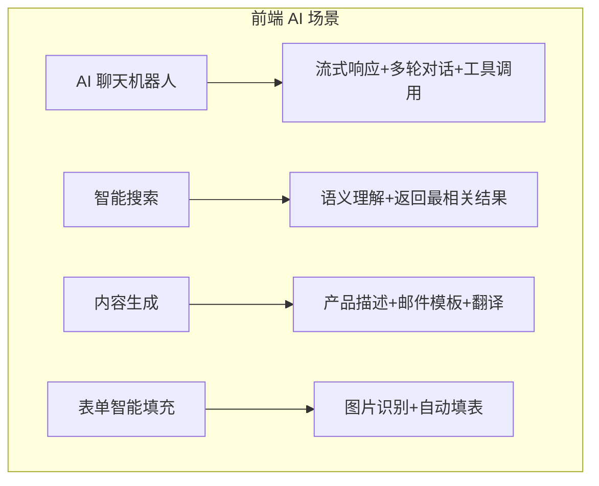
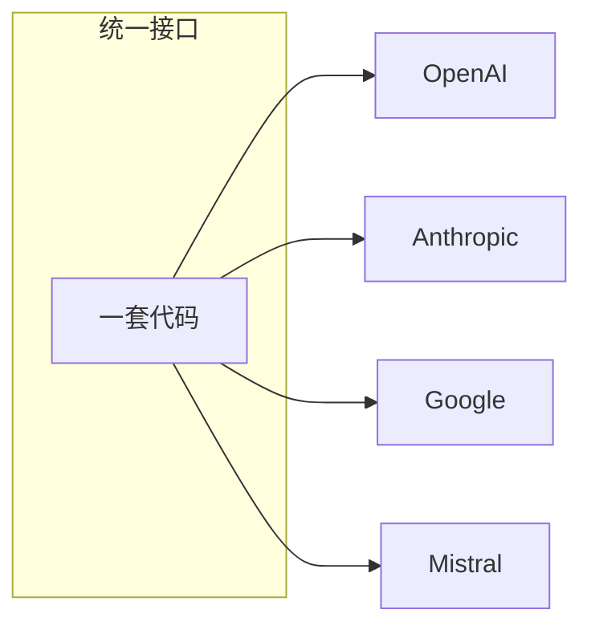
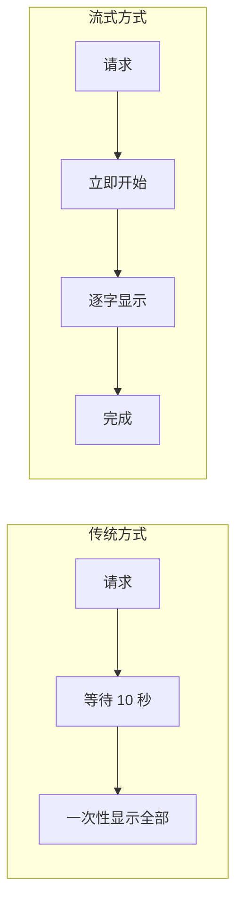
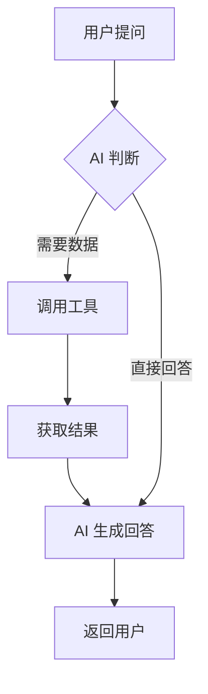
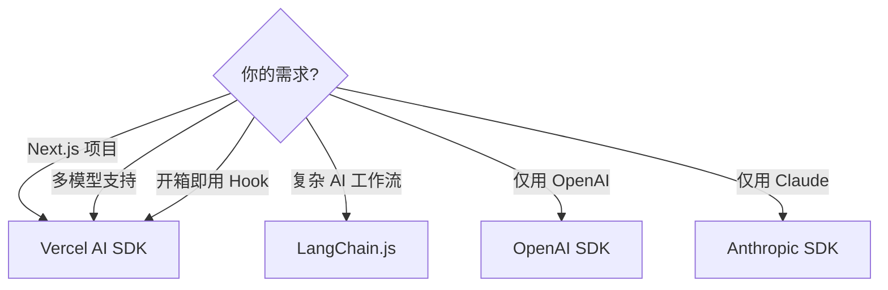
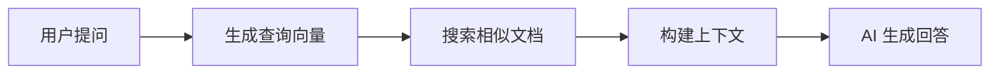

# 前端 AI 功能集成：Vercel AI SDK
## 最终版演讲稿（融合版）

**演讲时长**: 2.5 小时
**风格**: 故事开场 + 技术深度 + 实践建议

---

## Opening Hook（10 min）

大家好，欢迎来到第 9 课。

前面几节课我们一直在讲"如何用 AI 帮我们写代码"。今天换个方向——**如何在我们的前端应用里集成 AI 能力**。

我先给大家看一个场景。

你们有没有用过那种客服聊天窗口？传统的客服系统，用户输入问题，后台匹配关键词，返回预设答案。体验很差对吧？

现在，越来越多的产品开始用 AI 驱动的客服。用户用自然语言提问，AI 实时理解并回答，还能调用后端 API 查询订单、修改信息。

**这种能力，前端工程师就能实现。**

不需要机器学习背景，不需要训练模型。你只需要一个 SDK——**Vercel AI SDK**。

今天我会带大家：
1. 理解前端 AI 功能的常见场景
2. 深入 Vercel AI SDK 的核心能力
3. 现场构建一个 AI 聊天界面
4. 对比其他 AI SDK 的优劣

---

## Section 1：前端 AI 功能的常见场景（15 min）



### 场景 1：AI 聊天机器人

最常见的场景。用户和 AI 对话，AI 实时回答。

关键技术点：
- 流式响应（打字机效果）
- 多轮对话（上下文记忆）
- 工具调用（查询数据库、调用 API）

### 场景 2：智能搜索

传统搜索：关键词匹配。
AI 搜索：语义理解，返回最相关的结果。

```tsx
// 传统搜索
const results = products.filter(p => p.name.includes(query))

// AI 搜索
const results = await ai.search({
  query: "适合送女朋友的礼物，预算 500 以内",
  context: products
})
```

### 场景 3：内容生成

- 自动生成产品描述
- 自动生成邮件模板
- 自动翻译

### 场景 4：表单智能填充

用户上传一张名片照片，AI 自动识别并填充表单字段。

**这些场景有一个共同点：前端需要和 AI 模型交互。**

而 Vercel AI SDK 就是为这个场景设计的。

---

## Section 2：Vercel AI SDK 深度解析（50 min）

### 核心设计理念



Vercel AI SDK 的核心理念是：**统一接口，多模型支持**。

你不需要为每个 AI 模型写不同的代码。一套代码，支持 OpenAI、Anthropic、Google、Mistral 等所有主流模型。

```typescript
import { generateText } from 'ai'
import { openai } from '@ai-sdk/openai'
import { anthropic } from '@ai-sdk/anthropic'

// 用 OpenAI
const result1 = await generateText({
  model: openai('gpt-4o'),
  prompt: '你好'
})

// 切换到 Anthropic，只改一行
const result2 = await generateText({
  model: anthropic('claude-sonnet-4-20250514'),
  prompt: '你好'
})
```

**一行代码切换模型。** 这对于 A/B 测试、成本优化、模型降级都非常有用。

### useChat Hook：最核心的 API

```tsx
'use client'

import { useChat } from 'ai/react'
import { Button } from '@/components/ui/button'
import { Input } from '@/components/ui/input'
import { ScrollArea } from '@/components/ui/scroll-area'

export function ChatInterface() {
  const { messages, input, handleInputChange, handleSubmit, isLoading } = useChat()

  return (
    <div className="flex flex-col h-[600px] max-w-2xl mx-auto">
      <ScrollArea className="flex-1 p-4">
        {messages.map((message) => (
          <div
            key={message.id}
            className={cn(
              "mb-4 p-3 rounded-lg",
              message.role === 'user'
                ? "bg-blue-100 ml-auto max-w-[80%]"
                : "bg-gray-100 mr-auto max-w-[80%]"
            )}
          >
            {message.content}
          </div>
        ))}
      </ScrollArea>

      <form onSubmit={handleSubmit} className="flex gap-2 p-4 border-t">
        <Input
          value={input}
          onChange={handleInputChange}
          placeholder="输入消息..."
          className="flex-1"
        />
        <Button type="submit" disabled={isLoading}>
          发送
        </Button>
      </form>
    </div>
  )
}
```

就这么简单。`useChat` 帮你处理了：
- 消息状态管理
- 流式响应
- 加载状态
- 错误处理

### 后端 API Route

```typescript
// app/api/chat/route.ts
import { streamText } from 'ai'
import { openai } from '@ai-sdk/openai'

export async function POST(req: Request) {
  const { messages } = await req.json()

  const result = streamText({
    model: openai('gpt-4o'),
    messages,
    system: '你是一个友好的助手，用中文回答问题。',
  })

  return result.toDataStreamResponse()
}
```

前端 `useChat` 会自动调用 `/api/chat`，后端用 `streamText` 生成流式响应。

### 流式响应的原理



为什么需要流式响应？

如果不用流式，用户需要等 AI 生成完所有内容才能看到结果。对于长回答，可能要等 10-20 秒。

用流式响应，AI 每生成一个 Token，就立即发送给前端。用户看到的是"打字机效果"，体验好很多。

```
传统方式：[等待 10 秒] → [一次性显示全部内容]
流式方式：[立即开始] → [逐字显示] → [完成]
```

### AI Agents 和工具调用



这是 Vercel AI SDK 最强大的功能之一。

你可以定义"工具"，让 AI 在对话中调用这些工具：

```typescript
// app/api/chat/route.ts
import { streamText, tool } from 'ai'
import { openai } from '@ai-sdk/openai'
import { z } from 'zod'

export async function POST(req: Request) {
  const { messages } = await req.json()

  const result = streamText({
    model: openai('gpt-4o'),
    messages,
    tools: {
      getWeather: tool({
        description: '获取指定城市的天气',
        parameters: z.object({
          city: z.string().describe('城市名称'),
        }),
        execute: async ({ city }) => {
          // 调用天气 API
          const weather = await fetchWeather(city)
          return weather
        },
      }),
      searchProducts: tool({
        description: '搜索产品',
        parameters: z.object({
          query: z.string().describe('搜索关键词'),
          maxPrice: z.number().optional().describe('最高价格'),
        }),
        execute: async ({ query, maxPrice }) => {
          // 调用产品搜索 API
          return await searchProducts(query, maxPrice)
        },
      }),
    },
  })

  return result.toDataStreamResponse()
}
```

用户说"合肥今天天气怎么样"，AI 会自动调用 `getWeather` 工具，获取天气数据，然后用自然语言回答。

**这就是 AI Agent 的核心：AI 不只是聊天，还能执行操作。**

### 与 React Server Components 集成

```tsx
// app/page.tsx (Server Component)
import { generateText } from 'ai'
import { openai } from '@ai-sdk/openai'

export default async function Page() {
  const { text } = await generateText({
    model: openai('gpt-4o'),
    prompt: '用一句话介绍 React Server Components',
  })

  return (
    <div className="p-8">
      <h1 className="text-2xl font-bold mb-4">AI 生成的介绍</h1>
      <p className="text-gray-700">{text}</p>
    </div>
  )
}
```

在 Server Component 中直接调用 AI，不需要 API Route。

### 完整的 AI 聊天界面（含 Markdown 渲染和样式）

前面的 `useChat` 示例比较简单。现在我给大家看一个**生产级的 AI 聊天界面**，包含 Markdown 渲染、代码高亮、消息气泡、加载动画。

```tsx
'use client'

import { useChat } from 'ai/react'
import { Button } from '@/components/ui/button'
import { Input } from '@/components/ui/input'
import { ScrollArea } from '@/components/ui/scroll-area'
import { Avatar, AvatarFallback, AvatarImage } from '@/components/ui/avatar'
import { Card } from '@/components/ui/card'
import ReactMarkdown from 'react-markdown'
import { Prism as SyntaxHighlighter } from 'react-syntax-highlighter'
import { oneDark } from 'react-syntax-highlighter/dist/esm/styles/prism'
import { Send, Loader2, User, Bot } from 'lucide-react'
import { cn } from '@/lib/utils'

export function ChatInterface() {
  const { messages, input, handleInputChange, handleSubmit, isLoading } = useChat()

  return (
    <div className="flex flex-col h-screen max-w-4xl mx-auto">
      {/* 聊天消息区域 */}
      <ScrollArea className="flex-1 p-4">
        <div className="space-y-4">
          {messages.map((message) => (
            <div
              key={message.id}
              className={cn(
                'flex gap-3',
                message.role === 'user' ? 'justify-end' : 'justify-start'
              )}
            >
              {message.role === 'assistant' && (
                <Avatar className="h-8 w-8 shrink-0">
                  <AvatarFallback className="bg-primary">
                    <Bot className="h-4 w-4 text-primary-foreground" />
                  </AvatarFallback>
                </Avatar>
              )}

              <Card
                className={cn(
                  'px-4 py-3 max-w-[80%]',
                  message.role === 'user'
                    ? 'bg-primary text-primary-foreground'
                    : 'bg-muted'
                )}
              >
                <ReactMarkdown
                  className="prose prose-sm dark:prose-invert max-w-none"
                  components={{
                    code({ node, inline, className, children, ...props }) {
                      const match = /language-(\w+)/.exec(className || '')
                      return !inline && match ? (
                        <SyntaxHighlighter
                          style={oneDark}
                          language={match[1]}
                          PreTag="div"
                          className="rounded-md my-2"
                          {...props}
                        >
                          {String(children).replace(/\n$/, '')}
                        </SyntaxHighlighter>
                      ) : (
                        <code className="bg-muted px-1 py-0.5 rounded text-sm" {...props}>
                          {children}
                        </code>
                      )
                    },
                  }}
                >
                  {message.content}
                </ReactMarkdown>
              </Card>

              {message.role === 'user' && (
                <Avatar className="h-8 w-8 shrink-0">
                  <AvatarFallback>
                    <User className="h-4 w-4" />
                  </AvatarFallback>
                </Avatar>
              )}
            </div>
          ))}

          {/* 加载动画 */}
          {isLoading && (
            <div className="flex gap-3 justify-start">
              <Avatar className="h-8 w-8 shrink-0">
                <AvatarFallback className="bg-primary">
                  <Bot className="h-4 w-4 text-primary-foreground" />
                </AvatarFallback>
              </Avatar>
              <Card className="px-4 py-3 bg-muted">
                <div className="flex gap-1">
                  <div className="w-2 h-2 bg-muted-foreground rounded-full animate-bounce" />
                  <div className="w-2 h-2 bg-muted-foreground rounded-full animate-bounce [animation-delay:0.2s]" />
                  <div className="w-2 h-2 bg-muted-foreground rounded-full animate-bounce [animation-delay:0.4s]" />
                </div>
              </Card>
            </div>
          )}
        </div>
      </ScrollArea>

      {/* 输入框 */}
      <div className="border-t p-4">
        <form onSubmit={handleSubmit} className="flex gap-2">
          <Input
            value={input}
            onChange={handleInputChange}
            placeholder="输入消息... (支持 Markdown)"
            className="flex-1"
            disabled={isLoading}
          />
          <Button type="submit" disabled={isLoading || !input.trim()}>
            {isLoading ? (
              <Loader2 className="h-4 w-4 animate-spin" />
            ) : (
              <Send className="h-4 w-4" />
            )}
          </Button>
        </form>
      </div>
    </div>
  )
}
```

这个聊天界面的亮点：
- **Markdown 渲染**：用 `react-markdown` 渲染 AI 的回答
- **代码高亮**：用 `react-syntax-highlighter` 高亮代码块
- **消息气泡**：用户消息右对齐蓝色，AI 消息左对齐灰色
- **加载动画**：三个点的跳动动画
- **头像**：用户和 AI 都有头像，视觉上更友好

### streamUI：AI 返回 React 组件

Vercel AI SDK 有一个非常强大的功能：**AI 不只是返回文本，还能返回 React 组件**。

比如，用户问"合肥今天天气怎么样"，传统做法是 AI 返回一段文字："合肥今天晴天，温度 18-25°C"。用 `streamUI`，AI 可以返回一个**天气卡片组件**，带图标、温度、湿度、风速。

```typescript
// app/api/chat/route.ts
import { streamUI } from 'ai'
import { openai } from '@ai-sdk/openai'
import { z } from 'zod'
import { WeatherCard } from '@/components/weather-card'
import { StockChart } from '@/components/stock-chart'

export async function POST(req: Request) {
  const { messages } = await req.json()

  const result = streamUI({
    model: openai('gpt-4o'),
    messages,
    text: ({ content }) => <p>{content}</p>,
    tools: {
      showWeather: {
        description: '显示城市的天气信息',
        parameters: z.object({
          city: z.string().describe('城市名称'),
        }),
        generate: async function* ({ city }) {
          // 先显示骨架屏
          yield <WeatherCardSkeleton city={city} />

          // 获取天气数据
          const weather = await fetchWeather(city)

          // 返回完整的天气卡片
          return <WeatherCard data={weather} />
        },
      },
      showStock: {
        description: '显示股票走势图',
        parameters: z.object({
          symbol: z.string().describe('股票代码'),
          days: z.number().optional().describe('显示天数，默认 30'),
        }),
        generate: async function* ({ symbol, days = 30 }) {
          yield <StockChartSkeleton symbol={symbol} />

          const data = await fetchStockData(symbol, days)

          return <StockChart symbol={symbol} data={data} days={days} />
        },
      },
    },
  })

  return result.toDataStreamResponse()
}
```

前端使用 `useChat` 的 `ui` 字段：

```tsx
'use client'

import { useChat } from 'ai/react'

export function ChatWithUI() {
  const { messages, input, handleInputChange, handleSubmit } = useChat({
    api: '/api/chat',
  })

  return (
    <div>
      {messages.map((message) => (
        <div key={message.id}>
          {message.role === 'user' ? (
            <p>{message.content}</p>
          ) : (
            // AI 的回答可能是文本，也可能是 React 组件
            <div>{message.ui || message.content}</div>
          )}
        </div>
      ))}
      {/* 输入框 */}
    </div>
  )
}
```

用户问"合肥天气"，AI 会调用 `showWeather` 工具，返回一个 `<WeatherCard />` 组件。用户问"查看茅台股票"，AI 会调用 `showStock` 工具，返回一个 `<StockChart />` 组件。

**这就是 streamUI 的威力：AI 的回答不再局限于文本，可以是任何 React 组件。**

### 多模型切换

Vercel AI SDK 的一个核心优势是**统一接口，多模型支持**。你可以让用户在界面上选择模型，一行代码切换。

```tsx
'use client'

import { useChat } from 'ai/react'
import { Select, SelectContent, SelectItem, SelectTrigger, SelectValue } from '@/components/ui/select'
import { useState } from 'react'

export function ChatWithModelSelector() {
  const [selectedModel, setSelectedModel] = useState('gpt-4o')

  const { messages, input, handleInputChange, handleSubmit, isLoading } = useChat({
    api: '/api/chat',
    body: {
      model: selectedModel, // 把选中的模型传给后端
    },
  })

  return (
    <div className="flex flex-col h-screen">
      {/* 模型选择器 */}
      <div className="border-b p-4 flex items-center gap-3">
        <span className="text-sm font-medium">选择模型：</span>
        <Select value={selectedModel} onValueChange={setSelectedModel}>
          <SelectTrigger className="w-48">
            <SelectValue />
          </SelectTrigger>
          <SelectContent>
            <SelectItem value="gpt-4o">GPT-4o (OpenAI)</SelectItem>
            <SelectItem value="gpt-4o-mini">GPT-4o Mini (更快)</SelectItem>
            <SelectItem value="claude-sonnet-4">Claude Sonnet 4 (Anthropic)</SelectItem>
            <SelectItem value="gemini-2.0-flash">Gemini 2.0 Flash (Google)</SelectItem>
          </SelectContent>
        </Select>
      </div>

      {/* 聊天界面 */}
      {/* ... */}
    </div>
  )
}
```

后端根据 `model` 参数动态选择模型：

```typescript
// app/api/chat/route.ts
import { streamText } from 'ai'
import { openai } from '@ai-sdk/openai'
import { anthropic } from '@ai-sdk/anthropic'
import { google } from '@ai-sdk/google'

const modelMap = {
  'gpt-4o': openai('gpt-4o'),
  'gpt-4o-mini': openai('gpt-4o-mini'),
  'claude-sonnet-4': anthropic('claude-sonnet-4-20250514'),
  'gemini-2.0-flash': google('gemini-2.0-flash-exp'),
}

export async function POST(req: Request) {
  const { messages, model = 'gpt-4o' } = await req.json()

  const result = streamText({
    model: modelMap[model] || modelMap['gpt-4o'],
    messages,
  })

  return result.toDataStreamResponse()
}
```

**一个下拉菜单，用户就能在 OpenAI、Anthropic、Google 之间切换。** 这对于 A/B 测试、成本优化、模型降级都非常有用。

---

## Section 3：横向对比（20 min）

| SDK | 易用性 | 框架支持 | 流式支持 | 多模型 | 工具调用 | 适用场景 |
|-----|--------|----------|----------|--------|---------|---------|
| **Vercel AI SDK** | ⭐⭐⭐⭐⭐ | React/Next.js | 优秀 | ✅ 统一接口 | ✅ | Next.js 项目首选 |
| **LangChain.js** | ⭐⭐⭐ | 框架无关 | 良好 | ✅ | ✅ | 复杂 AI 工作流 |
| **OpenAI SDK** | ⭐⭐⭐⭐ | 框架无关 | 优秀 | ❌ 仅 OpenAI | ✅ | OpenAI 专属 |
| **Anthropic SDK** | ⭐⭐⭐⭐ | 框架无关 | 优秀 | ❌ 仅 Claude | ✅ | Claude 专属 |

### 什么时候用 Vercel AI SDK



- 你用 Next.js → **首选 Vercel AI SDK**
- 你需要多模型支持 → **首选 Vercel AI SDK**
- 你需要 useChat 这种开箱即用的 Hook → **首选 Vercel AI SDK**

### 什么时候用其他 SDK

- 你需要复杂的 AI 工作流（RAG、Chain）→ **LangChain.js**
- 你只用 OpenAI，需要最底层的控制 → **OpenAI SDK**
- 你只用 Claude，需要最新的 API 特性 → **Anthropic SDK**

### LangChain.js 详解

**定位**：复杂 AI 工作流编排框架

LangChain.js 是从 Python 版本移植过来的，它的核心理念是**把 AI 能力组合成链（Chain）**。什么意思呢？

比如你要做一个"智能文档问答"功能：
1. 用户上传 PDF
2. 把 PDF 切分成小块（Chunking）
3. 把每块转成向量（Embedding）
4. 存到向量数据库（Vector Store）
5. 用户提问时，先搜索相关文档块（Retrieval）
6. 把文档块和问题一起发给 AI（Augmented Generation）

这就是 RAG（Retrieval-Augmented Generation）。用 LangChain.js 实现：

```typescript
import { ChatOpenAI } from '@langchain/openai'
import { PDFLoader } from 'langchain/document_loaders/fs/pdf'
import { RecursiveCharacterTextSplitter } from 'langchain/text_splitter'
import { OpenAIEmbeddings } from '@langchain/openai'
import { MemoryVectorStore } from 'langchain/vectorstores/memory'
import { RetrievalQAChain } from 'langchain/chains'

// 1. 加载 PDF
const loader = new PDFLoader('document.pdf')
const docs = await loader.load()

// 2. 切分文档
const splitter = new RecursiveCharacterTextSplitter({
  chunkSize: 1000,
  chunkOverlap: 200,
})
const splitDocs = await splitter.splitDocuments(docs)

// 3. 创建向量存储
const embeddings = new OpenAIEmbeddings()
const vectorStore = await MemoryVectorStore.fromDocuments(splitDocs, embeddings)

// 4. 创建 RAG Chain
const model = new ChatOpenAI({ modelName: 'gpt-4o' })
const chain = RetrievalQAChain.fromLLM(model, vectorStore.asRetriever())

// 5. 提问
const response = await chain.call({
  query: '这份文档的主要内容是什么？',
})
```

LangChain.js 提供了大量的预制组件：文档加载器、文本切分器、向量数据库、Chain 模板。如果你要做 RAG、Agent、多步推理，LangChain.js 是最好的选择。

但它也有缺点：**学习曲线陡峭**、**抽象层次高**、**调试困难**。对于简单的聊天功能，用 LangChain.js 是杀鸡用牛刀。

**适用场景**：
- RAG（文档问答、知识库搜索）
- Multi-Agent 系统（多个 AI 协作）
- 复杂的多步推理工作流
- 需要集成多种数据源（数据库、API、文件）

### OpenAI SDK 详解

**定位**：OpenAI 官方 SDK

如果你只用 OpenAI 的模型，而且需要最底层的控制，那就直接用 OpenAI SDK。

```typescript
import OpenAI from 'openai'

const openai = new OpenAI({
  apiKey: process.env.OPENAI_API_KEY,
})

// 流式聊天
const stream = await openai.chat.completions.create({
  model: 'gpt-4o',
  messages: [{ role: 'user', content: '你好' }],
  stream: true,
})

for await (const chunk of stream) {
  const content = chunk.choices[0]?.delta?.content || ''
  process.stdout.write(content)
}
```

OpenAI SDK 的优势是**功能最全**、**更新最快**。OpenAI 的新功能（比如 Structured Outputs、Realtime API）都会第一时间在官方 SDK 中支持。

但缺点是**只支持 OpenAI**。如果你想切换到 Claude 或 Gemini，需要重写代码。

**适用场景**：
- 只用 OpenAI 模型
- 需要 OpenAI 的最新特性（Structured Outputs、Function Calling、Vision）
- 需要精细控制（temperature、top_p、frequency_penalty 等参数）

### Anthropic SDK 详解

**定位**：Claude 官方 SDK

跟 OpenAI SDK 类似，Anthropic SDK 是 Claude 的官方 SDK。

```typescript
import Anthropic from '@anthropic-ai/sdk'

const anthropic = new Anthropic({
  apiKey: process.env.ANTHROPIC_API_KEY,
})

// 流式聊天
const stream = await anthropic.messages.stream({
  model: 'claude-sonnet-4-20250514',
  max_tokens: 1024,
  messages: [{ role: 'user', content: '你好' }],
})

for await (const chunk of stream) {
  if (chunk.type === 'content_block_delta') {
    process.stdout.write(chunk.delta.text)
  }
}
```

Anthropic SDK 的特色是**支持 Claude 的独特功能**，比如：
- **Prompt Caching**：缓存长 Prompt，节省成本
- **Extended Thinking**：让 Claude 在回答前"思考"更久，提高复杂问题的准确率
- **Computer Use**：让 Claude 控制电脑（实验性功能）

**适用场景**：
- 只用 Claude 模型
- 需要 Claude 的独特功能（Prompt Caching、Extended Thinking）
- 需要最大的上下文窗口（Claude 支持 200K tokens）

---

## Section 4：实战演示（40 min）

### 实战 1：构建 AI 聊天界面

我现在现场演示，用 Vercel AI SDK + shadcn/ui 构建一个完整的 AI 聊天界面。

**Step 1：安装依赖**

```bash
pnpm add ai @ai-sdk/openai
```

**Step 2：创建 API Route**

```typescript
// app/api/chat/route.ts
import { streamText } from 'ai'
import { openai } from '@ai-sdk/openai'

export async function POST(req: Request) {
  const { messages } = await req.json()

  const result = streamText({
    model: openai('gpt-4o'),
    messages,
    system: '你是一个专业的前端开发助手。',
  })

  return result.toDataStreamResponse()
}
```

**Step 3：创建聊天组件**

用 shadcn/ui 的 Card、Input、Button、ScrollArea 组件构建界面。

**Step 4：添加 Markdown 渲染**

AI 的回答通常包含 Markdown 格式，我们需要渲染它：

```bash
pnpm add react-markdown
```

```tsx
import ReactMarkdown from 'react-markdown'

// 在消息渲染中
<ReactMarkdown className="prose prose-sm">
  {message.content}
</ReactMarkdown>
```

### 实战 2：AI Agent 调用工具

演示一个"智能客服"场景：
- 用户问"我的订单状态是什么"
- AI 自动调用 `getOrderStatus` 工具
- 返回订单信息

### 实战 2：智能客服系统（完整实战）

好，前面演示了基础的聊天界面。现在我们做一个**真实的业务场景**：电商智能客服。

用户可以问：
- "我的订单在哪里？"
- "我要退货"
- "你们的退货政策是什么？"

AI 需要调用后端 API 查询订单、处理退货、回答常见问题。

**Step 1：定义工具（Tools）**

```typescript
// app/api/chat/route.ts
import { streamText, tool } from 'ai'
import { openai } from '@ai-sdk/openai'
import { z } from 'zod'

export async function POST(req: Request) {
  const { messages } = await req.json()

  const result = streamText({
    model: openai('gpt-4o'),
    messages,
    system: `你是一个专业的电商客服助手。你可以：
1. 查询订单状态
2. 处理退货申请
3. 回答常见问题

请用友好、专业的语气回答用户问题。`,
    tools: {
      // 工具 1：查询订单
      getOrderStatus: tool({
        description: '查询用户的订单状态',
        parameters: z.object({
          orderId: z.string().describe('订单号'),
        }),
        execute: async ({ orderId }) => {
          // 调用后端 API
          const response = await fetch(`https://api.example.com/orders/${orderId}`)
          const order = await response.json()

          return {
            orderId: order.id,
            status: order.status, // 'pending' | 'shipped' | 'delivered' | 'cancelled'
            items: order.items,
            trackingNumber: order.trackingNumber,
            estimatedDelivery: order.estimatedDelivery,
          }
        },
      }),

      // 工具 2：申请退货
      requestRefund: tool({
        description: '为用户申请退货',
        parameters: z.object({
          orderId: z.string().describe('订单号'),
          reason: z.string().describe('退货原因'),
          items: z.array(z.string()).describe('要退货的商品 ID 列表'),
        }),
        execute: async ({ orderId, reason, items }) => {
          // 调用后端 API
          const response = await fetch('https://api.example.com/refunds', {
            method: 'POST',
            headers: { 'Content-Type': 'application/json' },
            body: JSON.stringify({ orderId, reason, items }),
          })
          const refund = await response.json()

          return {
            refundId: refund.id,
            status: 'pending',
            estimatedRefundDate: refund.estimatedRefundDate,
            message: '退货申请已提交，我们会在 1-2 个工作日内处理',
          }
        },
      }),

      // 工具 3：搜索 FAQ
      searchFAQ: tool({
        description: '搜索常见问题的答案',
        parameters: z.object({
          query: z.string().describe('用户的问题'),
        }),
        execute: async ({ query }) => {
          // 这里可以用向量搜索，简化起见用关键词匹配
          const faqs = [
            {
              question: '退货政策是什么？',
              answer: '我们支持 7 天无理由退货。商品需保持原包装完好，未使用。退货运费由买家承担，质量问题除外。',
            },
            {
              question: '多久能发货？',
              answer: '工作日下单当天发货，周末和节假日顺延。偏远地区可能需要 3-5 个工作日。',
            },
            {
              question: '支持哪些支付方式？',
              answer: '我们支持支付宝、微信支付、银行卡支付。暂不支持货到付款。',
            },
          ]

          // 简单的关键词匹配
          const matched = faqs.find(faq =>
            faq.question.includes(query) || query.includes(faq.question.slice(0, 3))
          )

          return matched || { question: '', answer: '抱歉，我没有找到相关信息。请联系人工客服。' }
        },
      }),
    },
  })

  return result.toDataStreamResponse()
}
```

**Step 2：前端聊天界面**

前端不需要改动，继续用 `useChat`。AI 会自动判断什么时候调用工具。

```tsx
'use client'

import { useChat } from 'ai/react'
import { Button } from '@/components/ui/button'
import { Input } from '@/components/ui/input'
import { ScrollArea } from '@/components/ui/scroll-area'
import { Card } from '@/components/ui/card'
import { Badge } from '@/components/ui/badge'

export function CustomerServiceChat() {
  const { messages, input, handleInputChange, handleSubmit, isLoading } = useChat()

  return (
    <div className="flex flex-col h-screen max-w-2xl mx-auto">
      <div className="border-b p-4">
        <h1 className="text-xl font-bold">智能客服</h1>
        <p className="text-sm text-muted-foreground">我可以帮你查询订单、处理退货、回答问题</p>
      </div>

      <ScrollArea className="flex-1 p-4">
        <div className="space-y-4">
          {messages.map((message) => (
            <div
              key={message.id}
              className={message.role === 'user' ? 'flex justify-end' : 'flex justify-start'}
            >
              <Card className={message.role === 'user' ? 'bg-primary text-primary-foreground px-4 py-2' : 'bg-muted px-4 py-2'}>
                {message.content}
              </Card>
            </div>
          ))}
        </div>
      </ScrollArea>

      <div className="border-t p-4">
        <form onSubmit={handleSubmit} className="flex gap-2">
          <Input
            value={input}
            onChange={handleInputChange}
            placeholder="输入你的问题..."
            disabled={isLoading}
          />
          <Button type="submit" disabled={isLoading}>发送</Button>
        </form>
      </div>
    </div>
  )
}
```

**Step 3：测试对话流程**

用户："我的订单 ORD-12345 在哪里？"

AI 的处理流程：
1. 识别用户想查询订单
2. 调用 `getOrderStatus` 工具，参数 `{ orderId: "ORD-12345" }`
3. 获取订单数据
4. 用自然语言回答："您的订单 ORD-12345 已发货，物流单号是 SF1234567890，预计 3 月 28 日送达。"

用户："我要退货，质量有问题"

AI 的处理流程：
1. 识别用户想退货
2. 询问订单号（如果用户没提供）
3. 调用 `requestRefund` 工具
4. 回答："退货申请已提交（退货单号 REF-67890），我们会在 1-2 个工作日内处理，预计 4 月 5 日退款到账。"

**这就是 AI Agent 的威力：不只是聊天，还能执行操作。**

### 实战 3：AI 语义搜索（完整实战）

最后一个实战，我们做一个 **AI 驱动的语义搜索**。

传统搜索是关键词匹配：用户搜"iPhone"，只能匹配到标题或描述里有"iPhone"的商品。

AI 搜索是语义理解：用户搜"适合送女朋友的礼物，预算 500 以内"，AI 能理解意图，推荐合适的商品。

**Step 1：准备商品数据和向量化**

```typescript
// lib/products.ts
export const products = [
  {
    id: '1',
    name: 'AirPods Pro 3',
    price: 1899,
    category: '数码',
    description: '主动降噪无线耳机，支持空间音频，续航 6 小时',
    tags: ['耳机', '苹果', '降噪', '无线'],
  },
  {
    id: '2',
    name: '施华洛世奇项链',
    price: 499,
    category: '珠宝',
    description: '经典天鹅造型，镀铑工艺，适合送礼',
    tags: ['项链', '女士', '礼物', '轻奢'],
  },
  {
    id: '3',
    name: 'Kindle Paperwhite',
    price: 998,
    category: '数码',
    description: '电子书阅读器，6.8 英寸屏幕，防水设计',
    tags: ['阅读', '电子书', '护眼'],
  },
  {
    id: '4',
    name: '香薰蜡烛礼盒',
    price: 299,
    category: '家居',
    description: '天然大豆蜡，薰衣草香味，精美礼盒包装',
    tags: ['香薰', '蜡烛', '礼物', '家居'],
  },
  {
    id: '5',
    name: '机械键盘',
    price: 599,
    category: '数码',
    description: '青轴机械键盘，RGB 背光，适合办公和游戏',
    tags: ['键盘', '机械', '办公', '游戏'],
  },
]
```

**Step 2：创建 AI 搜索 API**

```typescript
// app/api/search/route.ts
import { generateObject } from 'ai'
import { openai } from '@ai-sdk/openai'
import { z } from 'zod'
import { products } from '@/lib/products'

export async function POST(req: Request) {
  const { query } = await req.json()

  // 第一步：让 AI 理解用户意图，提取搜索条件
  const { object: searchIntent } = await generateObject({
    model: openai('gpt-4o'),
    schema: z.object({
      keywords: z.array(z.string()).describe('提取的关键词'),
      priceRange: z.object({
        min: z.number().optional(),
        max: z.number().optional(),
      }).optional().describe('价格区间'),
      category: z.string().optional().describe('商品类别'),
      purpose: z.string().optional().describe('购买目的，如"送礼"、"自用"'),
    }),
    prompt: `分析用户的搜索意图：${query}`,
  })

  // 第二步：根据意图筛选商品
  let filteredProducts = products

  // 价格筛选
  if (searchIntent.priceRange) {
    filteredProducts = filteredProducts.filter(p => {
      if (searchIntent.priceRange!.min && p.price < searchIntent.priceRange!.min) return false
      if (searchIntent.priceRange!.max && p.price > searchIntent.priceRange!.max) return false
      return true
    })
  }

  // 类别筛选
  if (searchIntent.category) {
    filteredProducts = filteredProducts.filter(p =>
      p.category.includes(searchIntent.category!)
    )
  }

  // 关键词匹配（简化版，实际应该用向量搜索）
  if (searchIntent.keywords.length > 0) {
    filteredProducts = filteredProducts.filter(p => {
      const text = `${p.name} ${p.description} ${p.tags.join(' ')}`.toLowerCase()
      return searchIntent.keywords.some(kw => text.includes(kw.toLowerCase()))
    })
  }

  // 第三步：让 AI 生成搜索结果的自然语言描述
  const { text: summary } = await generateText({
    model: openai('gpt-4o'),
    prompt: `用户搜索：${query}

找到了 ${filteredProducts.length} 个商品：
${filteredProducts.map(p => `- ${p.name}（¥${p.price}）：${p.description}`).join('\n')}

请用 1-2 句话总结搜索结果，并推荐最合适的商品。`,
  })

  return Response.json({
    query,
    intent: searchIntent,
    results: filteredProducts,
    summary,
  })
}
```

**Step 3：前端搜索界面**

```tsx
'use client'

import { useState } from 'react'
import { Button } from '@/components/ui/button'
import { Input } from '@/components/ui/input'
import { Card, CardContent, CardDescription, CardHeader, CardTitle } from '@/components/ui/card'
import { Badge } from '@/components/ui/badge'
import { Search, Loader2, Sparkles } from 'lucide-react'

interface SearchResult {
  query: string
  intent: {
    keywords: string[]
    priceRange?: { min?: number; max?: number }
    category?: string
    purpose?: string
  }
  results: Array<{
    id: string
    name: string
    price: number
    category: string
    description: string
    tags: string[]
  }>
  summary: string
}

export function AISearchInterface() {
  const [query, setQuery] = useState('')
  const [result, setResult] = useState<SearchResult | null>(null)
  const [isLoading, setIsLoading] = useState(false)

  const handleSearch = async (e: React.FormEvent) => {
    e.preventDefault()
    if (!query.trim()) return

    setIsLoading(true)
    try {
      const response = await fetch('/api/search', {
        method: 'POST',
        headers: { 'Content-Type': 'application/json' },
        body: JSON.stringify({ query }),
      })
      const data = await response.json()
      setResult(data)
    } catch (error) {
      console.error('搜索失败:', error)
    } finally {
      setIsLoading(false)
    }
  }

  return (
    <div className="max-w-4xl mx-auto p-6 space-y-6">
      <div className="text-center space-y-2">
        <h1 className="text-3xl font-bold flex items-center justify-center gap-2">
          <Sparkles className="h-8 w-8 text-primary" />
          AI 智能搜索
        </h1>
        <p className="text-muted-foreground">用自然语言描述你想要的商品</p>
      </div>

      {/* 搜索框 */}
      <form onSubmit={handleSearch} className="flex gap-2">
        <Input
          value={query}
          onChange={(e) => setQuery(e.target.value)}
          placeholder="例如：适合送女朋友的礼物，预算 500 以内"
          className="flex-1"
          disabled={isLoading}
        />
        <Button type="submit" disabled={isLoading || !query.trim()}>
          {isLoading ? <Loader2 className="h-4 w-4 animate-spin" /> : <Search className="h-4 w-4" />}
        </Button>
      </form>

      {/* 搜索结果 */}
      {result && (
        <div className="space-y-4">
          {/* AI 理解的意图 */}
          <Card>
            <CardHeader>
              <CardTitle className="text-sm">AI 理解</CardTitle>
            </CardHeader>
            <CardContent className="space-y-2">
              <div className="flex flex-wrap gap-2">
                {result.intent.keywords.map((kw) => (
                  <Badge key={kw} variant="secondary">{kw}</Badge>
                ))}
                {result.intent.priceRange && (
                  <Badge variant="outline">
                    ¥{result.intent.priceRange.min || 0} - ¥{result.intent.priceRange.max || '∞'}
                  </Badge>
                )}
                {result.intent.category && (
                  <Badge variant="outline">{result.intent.category}</Badge>
                )}
                {result.intent.purpose && (
                  <Badge variant="outline">{result.intent.purpose}</Badge>
                )}
              </div>
              <p className="text-sm text-muted-foreground">{result.summary}</p>
            </CardContent>
          </Card>

          {/* 商品列表 */}
          <div className="grid md:grid-cols-2 gap-4">
            {result.results.map((product) => (
              <Card key={product.id}>
                <CardHeader>
                  <CardTitle>{product.name}</CardTitle>
                  <CardDescription className="flex items-center justify-between">
                    <span>{product.category}</span>
                    <span className="text-lg font-bold text-primary">¥{product.price}</span>
                  </CardDescription>
                </CardHeader>
                <CardContent>
                  <p className="text-sm text-muted-foreground mb-3">{product.description}</p>
                  <div className="flex flex-wrap gap-1">
                    {product.tags.map((tag) => (
                      <Badge key={tag} variant="secondary" className="text-xs">{tag}</Badge>
                    ))}
                  </div>
                </CardContent>
              </Card>
            ))}
          </div>

          {result.results.length === 0 && (
            <Card>
              <CardContent className="py-8 text-center text-muted-foreground">
                没有找到符合条件的商品
              </CardContent>
            </Card>
          )}
        </div>
      )}
    </div>
  )
}
```

**这个 AI 搜索的亮点**：

1. **意图理解**：AI 从自然语言中提取关键词、价格区间、类别、目的
2. **智能筛选**：根据提取的条件筛选商品
3. **自然语言总结**：AI 用一句话总结搜索结果并推荐
4. **可视化意图**：用 Badge 展示 AI 理解的搜索条件

用户搜"适合送女朋友的礼物，预算 500 以内"，AI 会：
- 提取关键词：["礼物", "女朋友", "送礼"]
- 价格区间：{ max: 500 }
- 目的："送礼"
- 筛选出：施华洛世奇项链（¥499）、香薰蜡烛礼盒（¥299）
- 总结："找到 2 个适合送女朋友的礼物。推荐施华洛世奇项链，经典天鹅造型，价格在预算内。"

**这就是 AI 搜索的威力：理解用户意图，而不是简单的关键词匹配。**

### 实战 4：Supabase + Vercel AI SDK 构建 RAG 应用

好，最后一个实战，我们来做一个很多人都想做、但不知道怎么下手的东西——**RAG 应用**。

#### 什么是 RAG？

RAG，全称 Retrieval-Augmented Generation，翻译过来就是「检索增强生成」。听起来很学术，但其实概念很简单。

你们有没有这样的体验：你问 ChatGPT 一个关于你们公司内部文档的问题，它回答不了，因为它没见过你们的数据。

RAG 解决的就是这个问题——**让 AI 基于你的私有数据来回答问题**。

核心思路是：
- **不需要训练模型**。训练模型成本高、周期长，而且你的数据可能天天在变。
- **只需要 Vector 检索**。用户提问的时候，先在你的知识库里搜索相关文档，然后把这些文档作为上下文传给 AI，让 AI 基于这些文档来回答。

打个比方：这就像开卷考试。AI 不需要把所有知识都背下来，只需要在回答前快速翻阅相关资料，然后组织语言回答。

#### 技术方案

我们今天用的技术栈是：

1. **Supabase** —— 存储文档和 Vector Embeddings。Supabase 是一个开源的 Firebase 替代品，它底层是 PostgreSQL，天然支持 pgvector 扩展。
2. **Vercel AI SDK** —— 处理对话和流式响应，这个我们前面已经很熟悉了。
3. **pgvector** —— PostgreSQL 的向量搜索扩展，用来做语义搜索。

整个流程是这样的：



```
用户提问 → 生成查询向量 → 在 Supabase 中搜索相似文档 → 将文档作为上下文 → AI 生成回答
```

为什么不用专门的向量数据库，比如 Pinecone、Weaviate？因为 Supabase 的 pgvector 已经够用了，而且你的业务数据本来就在 Supabase 里，不需要再维护一个额外的服务。少一个服务，少一份运维成本。

#### Step 1：数据库 Schema

首先，我们在 Supabase 里创建文档表和搜索函数。打开 Supabase 的 SQL Editor，执行下面的 SQL：

```sql
-- 启用 pgvector 扩展
create extension if not exists vector;

-- 创建文档表
create table documents (
  id bigserial primary key,
  content text,
  embedding vector(1536),
  metadata jsonb
);

-- 创建语义搜索函数
create or replace function match_documents(
  query_embedding vector(1536),
  match_threshold float,
  match_count int
) returns table (
  id bigint,
  content text,
  similarity float
) language sql as $$
  select id, content, 1 - (embedding <=> query_embedding) as similarity
  from documents
  where 1 - (embedding <=> query_embedding) > match_threshold
  order by embedding <=> query_embedding
  limit match_count;
$$;
```

这里解释一下几个关键点：

- `vector(1536)` —— 这是 OpenAI `text-embedding-3-small` 模型生成的向量维度。每段文本会被转换成一个 1536 维的向量。
- `<=>` —— 这是 pgvector 的余弦距离运算符。两个向量越相似，距离越小。
- `match_threshold` —— 相似度阈值。设成 0.7 意味着只返回相似度大于 70% 的结果。
- `metadata` —— 用 JSONB 存储文档的元信息，比如来源、分类、创建时间等。

#### Step 2：创建 RAG API Route

接下来是核心部分——API Route。这段代码把 Supabase 检索和 Vercel AI SDK 的流式响应串联起来：

```typescript
// app/api/chat/route.ts
import { streamText } from 'ai'
import { openai } from '@ai-sdk/openai'
import { createClient } from '@supabase/supabase-js'

const supabase = createClient(
  process.env.SUPABASE_URL!,
  process.env.SUPABASE_SERVICE_KEY!
)

export async function POST(req: Request) {
  const { messages } = await req.json()
  const lastMessage = messages[messages.length - 1].content

  // 1. 生成查询向量
  const embeddingResponse = await openai.embeddings.create({
    model: 'text-embedding-3-small',
    input: lastMessage,
  })
  const queryEmbedding = embeddingResponse.data[0].embedding

  // 2. 在 Supabase 中搜索相关文档
  const { data: docs } = await supabase.rpc('match_documents', {
    query_embedding: queryEmbedding,
    match_threshold: 0.7,
    match_count: 5,
  })

  // 3. 将相关文档作为上下文
  const context = docs?.map(d => d.content).join('\n\n') || ''

  // 4. 用 AI 生成回答
  const result = streamText({
    model: openai('gpt-4o'),
    messages,
    system: `基于以下知识库回答用户问题：\n\n${context}`,
  })

  return result.toDataStreamResponse()
}
```

我来逐步拆解这段代码：

**第一步：生成查询向量。** 用户输入一段文字，我们先用 OpenAI 的 Embedding 模型把它转成向量。这个向量代表了这段话的「语义」。

**第二步：语义搜索。** 用 `supabase.rpc` 调用我们刚才创建的 `match_documents` 函数，在文档表里搜索和用户问题语义最相似的 5 篇文档。

**第三步：构建上下文。** 把搜索到的文档内容拼接在一起，作为 AI 的上下文。

**第四步：流式生成回答。** 用 Vercel AI SDK 的 `streamText`，把上下文通过 `system` 参数传给 AI，让它基于这些文档来回答用户的问题。

前端部分完全不需要改，继续用 `useChat` 就行。前端并不关心后端是怎么拼装上下文的，它只负责展示流式回答。

#### 为什么 Supabase 特别适合做 RAG？

最后说一下为什么我推荐用 Supabase 来做 RAG，而不是用专门的向量数据库：

1. **pgvector 原生支持**。Supabase 底层是 PostgreSQL，pgvector 是 Postgres 的扩展，一行 SQL 就能启用。不需要额外部署和维护一个向量数据库服务。

2. **SQL 查询语义搜索**。你已经会写 SQL 了，向量搜索也是 SQL，学习成本几乎为零。不需要学一套新的查询语法。

3. **与 Next.js + Vercel AI SDK 无缝集成**。Supabase 有官方的 JavaScript SDK，在 Next.js 的 API Route 里直接调用，代码量很少。整个 RAG 的核心逻辑就这几十行代码。

4. **免费额度足够个人项目使用**。Supabase 的免费套餐包含 500MB 数据库、50,000 次 Embedding 存储，对于个人项目和 MVP 来说完全够用。

所以如果你想做一个基于自己数据的 AI 问答系统——比如公司内部知识库、产品文档助手、客户 FAQ 机器人——Supabase + Vercel AI SDK 是目前最简单、最经济的方案。

**这就是 RAG 的威力：让 AI 从「只会聊天」变成「真正懂你的业务」。**

---

## Closing（25 min）

### 今天的核心要点

1. **前端可以直接集成 AI 能力**：不需要 ML 背景
2. **Vercel AI SDK 是 Next.js 项目的首选**：统一接口、流式响应、工具调用
3. **useChat 是最核心的 API**：开箱即用的聊天功能
4. **AI Agent 是未来**：AI 不只是聊天，还能执行操作

### 行动建议

1. 在你的项目中试试 `useChat`，体验流式响应
2. 尝试定义一个工具，让 AI 调用你的 API
3. 思考你的产品中哪些场景可以用 AI 增强

### 下节课预告

下节课我们讲**工程化与全栈化**：
- Biome vs ESLint
- Next.js Server Actions
- tRPC 和 Prisma
- 技术选型决策框架

### Q&A

现在我们有 25 分钟的 Q&A 时间。

---

**演讲稿完成！**

**总时长**: 约 2.5 小时
- Opening: 10 min
- Section 1: 15 min
- Section 2: 50 min
- Section 3: 20 min
- Section 4: 40 min
- Closing: 25 min
